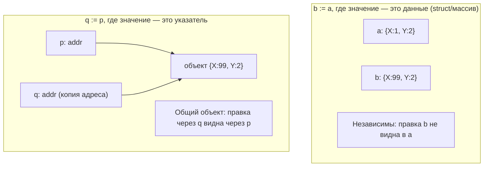
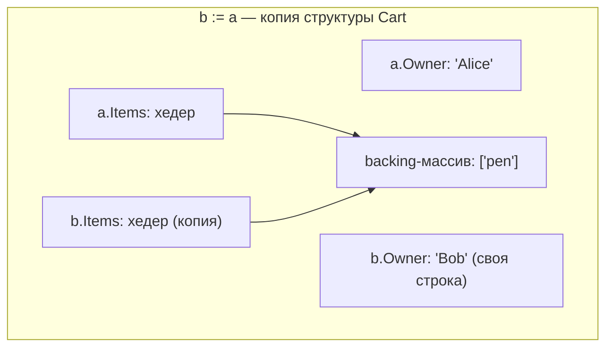

# Семантика значений: в Go нет «ссылочных» и «значимых» типов

Одно из первых, что узнаёт .NET-разработчик, — деление типов на **значимые** (value types: `struct`, `enum`, примитивы) и **ссылочные** (reference types: `class`, `interface`, `delegate`, массив, `string`). Это деление определяет, что произойдёт при присваивании и передаче в метод, и является свойством самого типа: автор решает один раз через `class` или `struct`.

Первая крупная перенастройка мышления в Go: **такого деления как категории языка не существует.** В Go есть ровно одно правило — при присваивании и передаче аргумента **значение всегда копируется**. «Ссылочное» поведение здесь — не категория типа, а следствие того, что внутри скопированного значения лежит указатель. Эта глава ставит правильную ментальную модель до того, как мы перейдём к коллекциям (которые её наглядно демонстрируют).

## Как это устроено в .NET — точка отсчёта

Чтобы было от чего отталкиваться, вспомним модель C#:

- **Значимые типы** (`int`, `bool`, `double`, `struct`, `enum`): переменная хранит сами данные; присваивание и передача копируют данные целиком.
- **Ссылочные типы** (`class`, `interface`, `delegate`, массив `T[]`, `string`, record-class): переменная хранит **ссылку** на объект в куче; присваивание и передача копируют ссылку, а не объект, — поэтому несколько переменных видят один объект.

Ключевое: **семантику задаёт автор типа** (написал `class` — ссылочный, `struct` — значимый), и в месте использования она невидима. По строке `Foo b = a;` нельзя сказать, скопировались данные или ссылка, — это зависит от того, чем объявлен `Foo`. Плюс к этому в .NET прочно сидит фольклор «значимый тип → стек, ссылочный → куча» и боксинг при превращении value-типа в `object`.

В Go всё это устроено иначе — и проще, и непривычнее.

## Единственное правило Go: всё копируется по значению

В Go присваивание `b := a` и вызов `f(a)` **всегда** копируют значение `a`. Без исключений. Нет скрытого правила «этот тип ссылочный, поэтому копируем ссылку». Разница лишь в том, **что является «значением»** для конкретного типа:

- для числа, `bool`, `struct`, массива «значение» — это **сами данные**; копия дублирует их целиком и получается независимой;
- для **указателя** `*T` «значение» — это **адрес** (одно машинное слово); копия дублирует адрес, и обе копии указывают на один и тот же объект.

```go
// Значение-данные: независимая копия
type Point struct{ X, Y int }

p := Point{1, 2}
q := p            // копируются все поля
q.X = 99
fmt.Println(p.X, q.X) // 1 99 — p и q независимы

// Значение-указатель: копируется адрес, объект общий
pp := &Point{1, 2}
qp := pp          // копируется адрес (не объект)
qp.X = 99
fmt.Println(pp.X, qp.X) // 99 99 — обе переменные смотрят на один объект
```



Обратите внимание: **передача указателя — это тоже передача по значению.** Вы копируете адрес. В Go нет «передачи по ссылке» в смысле C#-ного `ref`; чтобы расшарить данные, вы явно передаёте указатель, и сам этот указатель копируется как обычное значение.

## «Ссылочные» типы — это просто значения с указателем внутри

То, что в Go по привычке называют «ссылочными типами» — слайс, мапа, канал, — **не отдельная категория**. Каждый из них — это маленькое **значение-хедер, внутри которого лежит указатель**. Когда вы копируете такой хедер (по значению!), вы дублируете и указатель внутри — поэтому обе копии делят указуемые данные.

Вот что физически представляет собой «значение» для каждого вида типов и что происходит при копировании:

| Тип | Что есть «значение» | При копировании (`b := a`) |
| --- | --- | --- |
| `int`, `float64`, `bool` | сами данные | независимая копия |
| `struct`, `[N]T` (массив) | все поля/элементы инлайн | независимая копия (на один уровень вглубь) |
| `*T` (указатель) | адрес (1 слово) | копия адреса → общий объект |
| `[]T` (слайс) | хедер `{ptr, len, cap}` | копия хедера; `ptr` общий → общий backing-массив |
| `map[K]V` | указатель на хеш-таблицу рантайма | копия указателя → одна и та же мапа |
| `chan T` | указатель на структуру канала | копия указателя → один и тот же канал |
| `string` | хедер `{ptr, len}`, байты неизменяемы | копия хедера; байты общие, но иммутабельны |
| `interface` (`any`) | пара `{тип, указатель на данные}` | копия пары |
| `func` | указатель на функцию/замыкание | копия указателя |

Называть слайс/мапу/канал «ссылочными» как сокращение — допустимо, и вы будете встречать этот термин в статьях. Но важно держать в голове механизм: это **копирование по значению хедера, внутри которого указатель**, а не категория типа, как `class` в C#. В Go нет правила «тип X — ссылочный»; есть лишь вопрос «содержит ли значение указатель».

> **Параллель с .NET:** в C# `string` и массив — ссылочные типы по решению авторов. В Go `string` — это значение-хедер (две машинных слова), а массив `[N]T` — вовсе значение-данные (копируется целиком!). То есть прямой перенос интуиции «массив — ссылочный» из C# в Go даёт неверный результат — массивы Go копируются полностью. Подробно это разобрано в главе [Коллекции](./03-collections.md).

## Кто решает семантику: тип (C#) или место использования (Go)

Это и есть инверсия модели. В C# семантику решает **автор типа** — один раз, для всех применений. В Go решаете **вы, в каждом месте использования**, выбирая значение или указатель:

```go
type Counter struct{ n int }

func incCopy(c Counter)   { c.n++ } // мутирует КОПИЮ — снаружи не видно
func incShare(c *Counter) { c.n++ } // мутирует оригинал ЧЕРЕЗ указатель

x := Counter{}
incCopy(x)
fmt.Println(x.n) // 0 — передали копию
incShare(&x)
fmt.Println(x.n) // 1 — передали указатель
```

Один и тот же тип `Counter` участвует и в копирующей, и в разделяющей передаче — разница в сигнатуре функции и в месте вызова, а не в объявлении типа.

| | C# / .NET | Go |
| --- | --- | --- |
| Кто решает семантику | автор типа (`class` vs `struct`) | место использования (значение `T` vs указатель `*T`) |
| Категория типа | value type / reference type (фиксирована) | такой категории нет |
| Что копируется при `b := a` | для `class` — ссылка, для `struct` — данные | всегда «значение»: для `T` — данные, для `*T` — адрес |
| Явность общего доступа | неявна (зависит от типа) | явна (виден `*` / `&`) |

> **Параллель с .NET:** ближайший аналог Go-подхода — модификаторы `ref`/`out`/`in`, которыми в C# можно для значимого типа осознанно выбрать передачу по ссылке прямо в месте вызова. По сути Go всегда работает в этом режиме «решаю на месте», только инструмент один — указатель `*T`, а само ключевое слово `ref` отсутствует. Механика указателей (когда брать `*T`, value- vs pointer-ресиверы, отсутствие арифметики) детально разобрана в Разделе 2.

## Подводный камень: копия структуры со слайсом/мапой внутри — мелкая

Здесь .NET-интуиция «`struct` — значение, значит копия полностью независима» подводит. Копия структуры копирует её поля **по значению** — но если поле является слайсом или мапой (то есть хедером с указателем), копия разделит с оригиналом указуемые данные. Копия получается **поверхностной (shallow)**.

```go
type Cart struct {
    Owner string   // строка-значение
    Items []string // слайс = хедер с указателем
}

a := Cart{Owner: "Alice", Items: []string{"book"}}
b := a              // копия структуры по значению

b.Owner = "Bob"     // независимо: поле-строка перепривязано в b
b.Items[0] = "pen"  // НЕ независимо: слайсы делят backing-массив

fmt.Println(a.Owner) // Alice — поле-значение скопировано независимо ✅
fmt.Println(a.Items) // [pen] — слайс общий, оригинал изменился ❌ (если не ждали)
```



Поле `Owner` после копии независимо, а `Items` у обеих структур указывает на один backing-массив. Чтобы получить действительно независимую копию, разделяемые поля нужно клонировать явно:

```go
b := a
b.Items = slices.Clone(a.Items) // теперь Items независим ✅ (Go 1.21+)
```

Это прямое следствие правила «копируется значение, а значение слайса — это хедер с указателем». Тот же эффект ждёт вас при копировании структуры с полем-мапой или каналом.

## Это НЕ про стек и кучу

Важная развилка, на которой спотыкаются почти все выходцы из .NET. В мире C# крепко сидит «значимый тип → стек, ссылочный → куча». В Go это две **независимые** оси:

- **значение или указатель** — это про *семантику копирования* (о чём вся эта глава);
- **стек или куча** — это про то, *где физически живёт память*, и решает это **escape analysis** на этапе компиляции, отдельно от выбора значение/указатель.

Структура (значение!) может оказаться в куче, если она «убегает» из функции. Указатель может спокойно указывать на переменную, оставшуюся на стеке, — компилятор гарантирует, что она проживёт достаточно долго, поэтому в Go (в отличие от C/C++) нельзя получить «висячий указатель» на освобождённый кадр стека. То есть наличие `*` ничего не говорит о куче, а наличие `struct` — о стеке.

> **Параллель с .NET:** в C# корреляция «struct ≈ стек/инлайн, class ≈ куча» в целом работает и формирует интуицию. В Go её нужно сознательно отключить: где живёт память — решает escape analysis ([Раздел 2](../02-memory-gc-and-types/01-stack-vs-heap-escape-analysis.md)), а не категория «значение/указатель». Это ортогональные вещи.

## Мелкие следствия, которые почувствуете сразу

- **Переменная цикла `range` — копия.** `for _, v := range s` кладёт в `v` копию элемента; запись в `v` слайс не меняет.

  ```go
  nums := []int{1, 2, 3}
  for _, v := range nums {
      v *= 10 // меняем копию
  }
  fmt.Println(nums) // [1 2 3] — без изменений
  for i := range nums {
      nums[i] *= 10 // изменяем по индексу
  }
  fmt.Println(nums) // [10 20 30] ✅
  ```

- **Value-ресивер метода получает копию.** Метод с ресивером-значением (`func (c Counter) ...`) не может изменить оригинал — нужен pointer-ресивер. Детали — в Разделе 2.
- **Сравнимость `==`.** Числа, строки, `bool`, указатели, **массивы и структуры из сравнимых полей** — сравнимы оператором `==`. А вот слайсы, мапы и функции `==` **не поддерживают** (их можно сравнивать только с `nil`) — как раз потому, что это «хедеры с указателем», и что значило бы их равенство, неоднозначно.

## Итог

- В Go **нет категорий «значимый тип / ссылочный тип»**. Есть одно правило: присваивание и передача аргумента **всегда копируют значение**.
- «Значение» — это либо сами данные (числа, `struct`, массив), либо маленький хедер, внутри которого может лежать указатель (слайс, мапа, канал, строка, интерфейс, функция). Отсюда «ссылочное» поведение — **не свойство типа, а следствие указателя внутри** значения.
- Делиться данными вы решаете **явно и в месте использования** — через указатель (`*T` / `&`), а не через выбор `class`/`struct` автором типа. Передача указателя — это тоже копирование (адреса).
- Копия структуры со слайсом/мапой внутри — **мелкая**: вложенные разделяемые данные остаются общими; для независимости их клонируют (`slices.Clone` и т.п.).
- **value/pointer ≠ stack/heap.** Где живёт память, решает escape analysis (Раздел 2), и это ортогонально семантике копирования.

Дальше — три встроенных типа-коллекции Go, на которых это правило видно в действии: массив копируется целиком (значение-данные), а слайс и мапа делят память (хедер с указателем).

---

[⌂ Главная](../../README.md) · [↑ Раздел](./README.md) · [← Предыдущий: Спартанский подход](./01-spartan-philosophy.md) · [→ Следующий: Коллекции](./03-collections.md)
