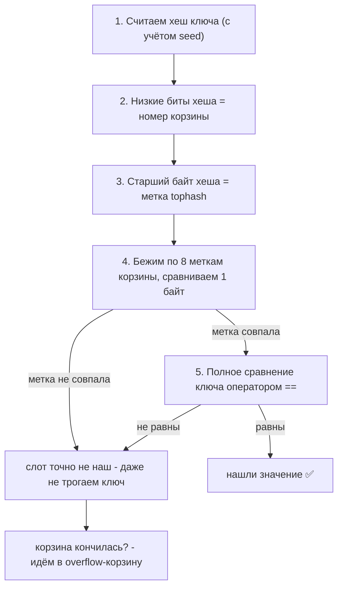
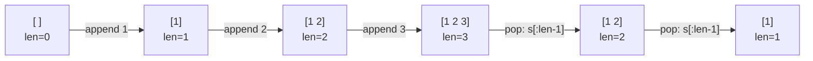

# Коллекции: массивы, слайсы, мапы и структуры данных

В .NET вы привыкли к богатому пространству `System.Collections.Generic`: `List<T>`, `Dictionary<K,V>`, `HashSet<T>`, `Stack<T>`, `Queue<T>`, `LinkedList<T>`, `SortedDictionary<K,V>` и десятки других. В Go встроенных типов-коллекций всего **три**: массив, слайс и мапа. Всё остальное — стеки, очереди, множества, кэши — вы либо собираете из этих трёх примитивов в пару строк, либо подключаете из стандартной библиотеки (`container/list`, `container/heap`).

Этот файл — обзорный. Мы разберём три встроенных типа и покажем, как на них реализуются привычные структуры данных. Внутреннее устройство слайса (самое важное и коварное) вынесено в отдельный файл [Слайсы под капотом](./04-slices-internals.md) — здесь мы коснёмся слайсов лишь поверхностно, чтобы не дублировать материал.

## Массивы: фиксированный размер как часть типа

Массив в Go — это последовательность фиксированной длины из элементов одного типа. И вот первый сюрприз: **размер массива входит в его тип**.

```go
var a [3]int // массив из трёх int
var b [4]int // это ДРУГОЙ тип
// a = b // ошибка компиляции ❌: [3]int и [4]int несовместимы
```

`[3]int` и `[4]int` — это два разных, несовместимых типа, ровно как `int` и `string`. Нельзя присвоить один другому, нельзя передать `[4]int` в функцию, ожидающую `[3]int`.

Второй и более важный сюрприз: **массивы имеют value-семантику**. Они копируются целиком при присваивании, при передаче в функцию и при возврате из неё.

```go
func modify(arr [3]int) {
    arr[0] = 999 // меняем КОПИЮ
}

func main() {
    original := [3]int{1, 2, 3}
    modify(original)
    fmt.Println(original) // [1 2 3] — оригинал не тронут!

    copy := original     // полная копия всех трёх элементов
    copy[0] = 100
    fmt.Println(original) // [1 2 3] — снова не тронут
}
```

```csharp
// C#: массив — reference type, передаётся по ссылке
void Modify(int[] arr) {
    arr[0] = 999; // меняет ОРИГИНАЛ
}
var original = new[] {1, 2, 3};
Modify(original);
Console.WriteLine(original[0]); // 999 — оригинал изменён!
```

Это фундаментальное концептуальное расхождение с .NET, где массив всегда reference type. В Go массив ведёт себя как `struct` — это значение, а не ссылка.

**Когда массивы реально нужны.** На практике в прикладном Go-коде массивы используются редко — почти везде применяют слайсы. Массивы оправданы, когда:

- размер действительно фиксирован и известен на этапе компиляции (например, `[16]byte` под UUID, `[32]byte` под SHA-256, `[256]int` под таблицу частот байтов);
- важна value-семантика (массив можно положить в структуру и копировать вместе с ней, без отдельных аллокаций);
- критична производительность и нужно избежать косвенности слайса (массив лежит «инлайн», без указателя на отдельный backing-массив).

Литералы массивов:

```go
primes := [5]int{2, 3, 5, 7, 11}
sparse := [10]int{0: 1, 9: 99}      // индексные инициализаторы: только [0] и [9] заданы
auto := [...]int{1, 2, 3}           // [...] — компилятор сам посчитает размер (здесь [3]int)
```

## Слайсы: рабочая лошадка

Слайс (`[]T`) — это динамический «вид» (view) поверх массива. Именно слайсы, а не массивы, вы будете использовать в 95% случаев — это аналог `List<T>` по роли, хотя устроен принципиально иначе (детали в следующем файле). Ключевое отличие от массива: у слайса **нет фиксированного размера в типе**, в записи `[]int` число отсутствует.

Создание:

```go
// Через литерал:
nums := []int{1, 2, 3}

// Через make (длина и опционально ёмкость):
buf := make([]int, 5)      // len=5, все элементы — нули: [0 0 0 0 0]
buf2 := make([]int, 0, 10) // len=0, cap=10 (преаллокация под 10 элементов)

// Nil-слайс (нулевое значение типа []T):
var empty []int            // nil, но с ним можно работать: len==0, append работает
```

Индексация и срезы (slicing):

```go
s := []int{10, 20, 30, 40, 50}
fmt.Println(s[0])    // 10
fmt.Println(s[1:3])  // [20 30] — полуоткрытый интервал [1, 3)
fmt.Println(s[:2])   // [10 20]
fmt.Println(s[3:])   // [40 50]
fmt.Println(s[:])    // вся последовательность
```

Срез `s[low:high]` создаёт новый слайс, охватывающий элементы с `low` до `high-1` (верхняя граница не включается, как в `Span<T>.Slice` или Python). Важнейший нюанс: новый слайс **разделяет память** с исходным — это и мощь, и главный источник багов, который мы детально разберём в следующем файле.

Добавление элементов через `append`:

```go
s := []int{1, 2}
s = append(s, 3)        // [1 2 3] — результат ОБЯЗАТЕЛЬНО присвоить обратно
s = append(s, 4, 5, 6)  // несколько сразу
s = append(s, other...) // распаковка другого слайса (как spread)
```

> **Параллель с .NET:** Слайс ближе всего к `List<T>` по применению (динамическая последовательность), но по семантике передачи — к `Span<T>`/`ArraySegment<T>`: это лёгкое «окно над памятью». В отличие от `List<T>`, у слайса нет методов `.Add()`/`.Remove()` — операции выполняются свободными функциями `append`/`copy` и срезами.

## Мапы: встроенная хеш-таблица

Мапа (`map[K]V`) — встроенная хеш-таблица, прямой аналог `Dictionary<K,V>`. Ключ должен быть **сравнимым** типом (comparable): подойдут числа, строки, булевы, указатели, структуры из сравнимых полей; не подойдут слайсы, мапы и функции.

Создание:

```go
// Через make:
ages := make(map[string]int)
ages["Alice"] = 30

// Через литерал:
ages := map[string]int{
    "Alice": 30,
    "Bob":   25,
}
```

### Nil-мапа: чтение безопасно, запись паникует

Нулевое значение мапы — `nil`. И вот критичная асимметрия: **из nil-мапы можно читать (вернётся нулевое значение), но запись в неё вызывает панику**.

```go
var m map[string]int // nil-мапа
fmt.Println(m["x"])  // 0 — чтение безопасно, возвращает нулевое значение типа
fmt.Println(len(m))  // 0 — тоже ок
m["x"] = 1           // panic: assignment to entry in nil map ❌
```

Поэтому мапу всегда нужно инициализировать через `make` или литерал перед записью. Это частая ловушка: забыли проинициализировать поле-мапу в структуре — получили панику при первой записи.

> **Параллель с .NET:** `nil`-мапа отличается от `null`-словаря в C#. Обращение к `null`-словарю в C# (`dict["x"]`) сразу бросит `NullReferenceException` даже на чтение. В Go чтение из `nil`-мапы легально и безопасно — это иногда удобно (можно не проверять мапу перед чтением), но запись всё равно паникует.

### Проверка наличия ключа: идиома «comma ok»

При обычном чтении `v := m[k]` нельзя отличить «ключа нет» от «ключ есть, но значение нулевое». Для этого есть форма с двумя возвращаемыми значениями:

```go
v, ok := m["Alice"]
if ok {
    fmt.Println("есть:", v)
} else {
    fmt.Println("ключа нет")
}
```

```csharp
// C#: аналог — TryGetValue
if (dict.TryGetValue("Alice", out var v)) {
    Console.WriteLine($"есть: {v}");
}
```

Удаление — встроенной функцией `delete` (а не методом):

```go
delete(ages, "Bob") // если ключа нет — это no-op, не паникует
```

### Порядок итерации намеренно случаен

Это решение удивляет всех. Порядок обхода мапы через `range` **не определён и намеренно рандомизирован** — он разный от запуска к запуску:

```go
for k, v := range ages {
    fmt.Println(k, v) // порядок будет МЕНЯТЬСЯ между запусками программы
}
```

Это не недоработка, а защитная мера: рантайм сознательно вносит случайность, чтобы разработчики не закладывались на порядок (как многие ошибочно делали с `Dictionary<K,V>` в старых версиях .NET, где порядок был стабилен де-факто, но не гарантирован). Если нужен стабильный порядок — отсортируйте ключи явно:

```go
keys := make([]string, 0, len(ages))
for k := range ages {
    keys = append(keys, k)
}
slices.Sort(keys) // пакет slices, Go 1.21+
for _, k := range keys {
    fmt.Println(k, ages[k])
}
```

> **Параллель с .NET:** `Dictionary<K,V>` в .NET не гарантирует порядок, но на практике он был предсказуем. Go убирает этот соблазн на корню. Если нужна упорядоченность по вставке — в .NET вы бы взяли что-то вроде упорядоченной структуры; в Go вы вручную держите слайс ключей рядом с мапой.

## Как мапа устроена внутри: хеш, бакеты и равенство

Пользоваться мапой мы научились. Теперь заглянем под капот — и это не праздное любопытство. Устройство мапы объясняет и странности, которые мы уже видели (почему порядок случаен, почему слайс нельзя сделать ключом), и одно крупное отличие от .NET (почему в Go нет `GetHashCode` и `Equals`).

Если совсем коротко: мапа — это **массив корзин**. Чтобы быстро класть и искать в нём, мапе нужно по ключу мгновенно понимать, в какую корзину смотреть. За это отвечает **хеш**.

### Шаг 1. Хеш: ключ превращается в число

Чтобы решить, куда положить пару «ключ-значение», мапа сначала превращает ключ в число — это и есть хеш. По нему вычисляется адрес корзины.

В Go хеш-функция **встроена в язык**: компилятор сам генерирует её под тип ключа (своя для строк, своя для чисел, и т.д.). Вы её не пишете и — запомните этот факт, он ниже выстрелит — **не можете подменить**.

Две детали, которые стоит знать:

- **У каждой мапы свой случайный «солевой» seed.** При создании мапа получает случайное число, которое подмешивается в хеш. Поэтому один и тот же ключ в разных мапах (и в разных запусках программы) даёт разный хеш. Зачем так:
  - это и есть причина **случайного порядка обхода**, который мы видели выше, — порядок зависит от seed;
  - это **защита от атаки**: без случайности злоумышленник мог бы подобрать ключи, которые все попадают в одну корзину, и превратить мапу в медленный список (атака класса «hash flooding»).
- **Аппаратное ускорение.** На современных процессорах (amd64/arm64) хеш считается через быстрые аппаратные инструкции (AES). Просто работает быстро, настраивать ничего не нужно.

### Шаг 2. Где лежат данные: корзины (бакеты)

Внутри мапа держит **массив корзин** (по-английски buckets). Сама переменная-мапа — это лишь **указатель** на внутреннюю структуру с этим массивом. Поэтому, как мы говорили в главе [Семантика значений](./02-value-semantics.md), копирование мапы копирует указатель: обе копии работают с одной и той же мапой.

Каждая корзина вмещает до **8 пар** ключ/значение и устроена так:

```
одна корзина (bucket):
  tophash[8]   - короткие "метки": по одному байту от хеша каждого ключа
  keys[8]      - сначала все 8 ключей...
  values[8]    - ...потом все 8 значений
  overflow     - ссылка на доп. корзину, если 8 пар не хватило
```

Метки `tophash` — это маленькая хитрость для скорости (см. шаг 3). А ключи и значения лежат «пачками» (сначала все ключи, потом все значения), а не вперемешку, — так в памяти меньше «дыр» на выравнивание.

### Шаг 3. Как мапа находит ключ

Самое интересное — поиск. Аналогия: библиотека. Хеш говорит, **на какой полке** искать, а короткая метка на корешке позволяет **не доставать каждую книгу**.



По шагам:

1. Считаем хеш ключа.
2. По **низким битам** хеша выбираем корзину. Корзин всегда степень двойки, поэтому это просто битовая маска — очень дёшево.
3. Берём **старший байт** того же хеша — это и есть метка `tophash`.
4. Пробегаем 8 меток в корзине, сравнивая **по одному байту**. Метка не совпала — слот точно не наш, и сам ключ мы даже не трогаем. Вот оно, ускорение: сравнить один байт куда дешевле, чем сравнивать целую строку-ключ.
5. Метка совпала — делаем **полное сравнение ключа** оператором `==`. Совпал — нашли значение; нет — идём дальше.
6. Кончились 8 слотов — переходим по `overflow` к дополнительной корзине.

### Когда мапа растёт

Корзины не резиновые. Когда заполненность становится высокой (исторически — больше ~6.5 элемента на корзину в среднем) или разводится слишком много overflow-корзин, мапа **увеличивается вдвое** и переселяет пары в новый массив. Важное слово — «постепенно»: переселение размазано по последующим записям, чтобы не возникало одной долгой паузы на ровном месте.

### Go 1.24: новая, более быстрая реализация (Swiss Tables)

Важно для актуальности. В **Go 1.24** (2025) внутреннюю реализацию мапы переписали на схему **Swiss Tables** (идея пришла из C++/Abseil). Упрощённо: вместо корзин с overflow-цепочками — «группы» по 8 слотов, и у каждой группы есть компактное **управляющее слово** (по байту-метке на слот). Процессор умеет проверять такие байты-метки сразу пачкой (SIMD), поэтому поиск стал ещё быстрее и бережнее к кэшу — особенно на больших мапах.

Идея осталась прежней, что и с `tophash`: храним маленький кусочек хеша для быстрого отсева. Снаружи **ничего не изменилось**: тот же случайный порядок, те же правила для ключей, тот же API. Поэтому всё, что ниже про равенство ключей, верно для любой версии.

### Сравнение с `Dictionary<K,V>`

Внутри `Dictionary` устроен иначе, но идея общая. Он держит два массива: `entries[]` (сами записи) и `buckets[]` (индексы-«входы» в цепочки). Каждая запись хранит `{ кешированный хеш, индекс следующего в цепочке, ключ, значение }`. Коллизии разрешаются цепочкой, но не через объекты-узлы, а через **индексы внутри массива** — это дружелюбно к кэшу.

| | Go `map` | .NET `Dictionary<K,V>` |
| --- | --- | --- |
| Переменная | указатель на внутреннюю структуру | ссылка на объект-класс |
| Хранение | корзины по 8 (или группы Swiss Tables) | массив записей + массив индексов |
| Быстрый отсев | байт-метка `tophash` / control-байт | кешированный `int`-хеш в записи |
| Коллизии | 8 в корзине + overflow / открытая адресация | цепочка по индексам в массиве записей |
| Размер таблицы | степень двойки (битовая маска) | простое число (остаток от деления) |
| Сид хеша | случайный на **каждую мапу** | рандомизация строк на **процесс** (.NET Core) |
| Рост | вдвое, переселение по частям | resize, разовый rehash |

На уровне «как пользоваться» они почти одинаковы. Вся разница — в одном принципиальном месте, к которому мы и подошли.

### Самое важное отличие: в Go нет `GetHashCode` и `Equals`

Вот тот самый факт из шага 1, ради которого всё затевалось.

**В .NET вы можете научить словарь сравнивать и хешировать ключи по-своему.** Переопределяете `Equals`/`GetHashCode` у типа ключа или передаёте словарю отдельный `IEqualityComparer<TKey>`:

```csharp
// Словарь со строковыми ключами без учёта регистра
var d = new Dictionary<string, int>(StringComparer.OrdinalIgnoreCase);
d["Hello"] = 1;
Console.WriteLine(d["HELLO"]); // 1 — сработало кастомное равенство
```

**В Go так нельзя — в принципе.** Равенство ключей — это оператор `==`, который компилятор задаёт **структурно** (для структур — поле за полем). И:

- перегрузки операторов в Go нет, поэтому **переопределить `==` для своего типа невозможно**;
- хеш-функцию, как мы выяснили, тоже **не подменить**.

Встроенная `map` всегда использует ровно это языковое равенство. Отсюда два следствия.

**Следствие 1. Не любой тип годится в ключи.** Ключом может быть только **сравнимый** (comparable) тип: числа, строки, `bool`, указатели, каналы, интерфейсы и структуры/массивы из сравнимых полей. А слайсы, мапы и функции оператором `==` сравнивать нельзя — поэтому:

```go
m := map[[]int]string{} // ❌ ошибка компиляции: слайс нельзя использовать ключом
```

(Особый случай: если ключ объявлен как интерфейс, а внутрь положили несравнимый тип, ошибка всплывёт уже в рантайме — паникой.)

В .NET такого ограничения нет: у любого объекта есть `GetHashCode`/`Equals` (по умолчанию ссылочные), так что ключом формально может стать что угодно.

**Следствие 2. Кастомное равенство выражают через сам ключ.** Раз подключить свой компаратор некуда, идентичность кодируют прямо в ключе:

```go
// Регистронезависимый ключ — нормализуем и при записи, и при чтении ✅
m := map[string]int{}
m[strings.ToLower("Hello")] = 1
fmt.Println(m[strings.ToLower("HELLO")]) // 1

// Составной ключ — структура из нужных полей (сравнивается по полям сама) ✅
type CacheKey struct {
    UserID int
    Region string
}
cache := map[CacheKey][]byte{}
cache[CacheKey{UserID: 42, Region: "eu"}] = []byte("payload")
```

Если нужно что-то совсем нестандартное (свой хеш, частичное равенство), пишут собственную хеш-структуру или берут стороннюю дженерик-реализацию, принимающую функции хеша и сравнения.

> **Параллель с .NET (и заодно гоча):** в .NET `struct` в роли ключа по умолчанию сравнивается и хешируется **через рефлексию** (`ValueType.Equals`/`GetHashCode`), если их не переопределить вручную, — это известная ловушка производительности. В Go равенство и хеш структуры-ключа генерирует компилятор без всякой рефлексии: структура-ключ быстра «из коробки», но кастомизировать её нельзя.

Итог по философии: .NET даёт **гибкость** — своё равенство и хеш на тип или на конкретный словарь. Go даёт **предсказуемость и скорость без настройки** — равенство всегда структурное, хеш встроенный и быстрый, — ценой того, что кастомную идентичность вы выражаете через сам ключ (нормализация или составной ключ).

## Реализация структур данных на встроенных типах

Раз готовых `Stack<T>`/`Queue<T>`/`HashSet<T>` нет, посмотрим, как идиоматично собрать их из примитивов.

### Стек (Stack) — слайс + append/срез

Стек тривиально реализуется на слайсе: `append` для push, срез последнего элемента для pop.

```go
stack := []int{}

// Push:
stack = append(stack, 1)
stack = append(stack, 2)
stack = append(stack, 3) // [1 2 3]

// Peek (верхушка без удаления):
top := stack[len(stack)-1] // 3

// Pop:
top = stack[len(stack)-1]  // читаем верхушку
stack = stack[:len(stack)-1] // отрезаем последний элемент -> [1 2]
```

```csharp
// C#: готовый тип
var stack = new Stack<int>();
stack.Push(1);
var top = stack.Pop();
```

Вот как меняется слайс-стек при операциях:



Обратите внимание: при `pop` мы лишь уменьшаем `len`, а backing-массив не сжимается (`cap` остаётся прежним). Это значит, что отрезанный элемент физически остаётся в памяти. Если в стеке лежат указатели или большие объекты, это может удерживать их от сборки мусора — при необходимости перед укорачиванием обнуляют «выпавшую» ячейку (`stack[len(stack)-1] = nil`).

**Дженерик-обёртка со своими методами.** Сырой слайс хорош для разовых случаев, но если стек используется в нескольких местах, удобнее завернуть его в дженерик-тип с методами (Go 1.18+) — получится типобезопасный аналог `Stack<T>` без всяких зависимостей:

```go
type Stack[T any] []T

func (s *Stack[T]) Push(v T) {
    *s = append(*s, v) // указатель-ресивер: меняем хедер слайса
}

func (s *Stack[T]) Pop() (T, bool) {
    var zero T
    if len(*s) == 0 {
        return zero, false
    }
    last := len(*s) - 1
    v := (*s)[last]
    (*s)[last] = zero // обнуляем ячейку — помогаем GC (см. выше)
    *s = (*s)[:last]
    return v, true
}

func (s Stack[T]) Peek() (T, bool) {
    if len(s) == 0 {
        var zero T
        return zero, false
    }
    return s[len(s)-1], true
}

func (s Stack[T]) Len() int { return len(s) }
```

```go
var s Stack[int]
s.Push(1)
s.Push(2)
v, ok := s.Pop() // 2, true
```

`Push`/`Pop` — на указателе-ресивере (они меняют длину), `Peek`/`Len` — на значении. Для стека этого достаточно: **отдельный пакет не нужен**, тащить зависимость ради десятка строк — антипаттерн в Go.

### Очередь (Queue) — слайс или container/list

С очередью сложнее. Наивная реализация на слайсе:

```go
queue := []int{}
queue = append(queue, 1)  // enqueue
queue = append(queue, 2)

front := queue[0]         // peek
queue = queue[1:]         // dequeue — отрезаем спереди
```

Здесь кроется **проблема сдвига**. Срез `queue[1:]` не освобождает память от удалённого элемента: указатель слайса просто сдвигается вперёд по тому же backing-массиву. При интенсивном использовании (много enqueue/dequeue) backing-массив растёт только в одну сторону, а «голова» уползает вперёд — память от обработанных элементов не переиспользуется и накапливается.

Варианты решения:

1. **`container/list`** — стандартный двусвязный список. Корректная FIFO/LIFO-семантика, но каждый элемент — отдельная аллокация и `any`-значение (с боксингом и потерей типобезопасности до дженериков):

```go
import "container/list"

q := list.New()
q.PushBack(1)            // enqueue
front := q.Front()       // peek
q.Remove(q.Front())      // dequeue
```

2. **Кольцевой буфер (ring buffer)** — слайс фиксированной ёмкости с индексами `head`/`tail`, которые ходят по кругу через `% cap`. Это самый производительный вариант для очереди с ограниченным размером: нет аллокаций на каждый элемент и нет утечки «головы». Именно так устроены высокопроизводительные очереди.

3. **Своя очередь на слайсе с head-индексом** — практичная золотая середина: не течёт памятью, как наивный вариант, и проще полноценного кольцевого буфера. Идея — хранить индекс «головы» и периодически сдвигать остаток в начало:

```go
type Queue[T any] struct {
    items []T
    head  int
}

func (q *Queue[T]) Enqueue(v T) {
    q.items = append(q.items, v)
}

func (q *Queue[T]) Dequeue() (T, bool) {
    var zero T
    if q.head >= len(q.items) {
        return zero, false
    }
    v := q.items[q.head]
    q.items[q.head] = zero // помогаем GC
    q.head++
    // голова «съела» больше половины слайса — сдвигаем хвост в начало
    if q.head > len(q.items)/2 {
        n := copy(q.items, q.items[q.head:])
        q.items = q.items[:n]
        q.head = 0
    }
    return v, true
}

func (q *Queue[T]) Len() int { return len(q.items) - q.head }
```

Амортизированный O(1) на операцию и ограниченная память — для большинства задач этого хватает с лихвой.

4. **Готовый пакет `github.com/gammazero/deque`** — когда очередь горячая и важна производительность. Это дженерик-дек на кольцевом буфере (амортизированный O(1)); работает и как FIFO-очередь, и как стек, и как двусторонняя очередь:

```go
import "github.com/gammazero/deque"

var q deque.Deque[int]
q.PushBack(1) // enqueue
q.PushBack(2)

if q.Len() > 0 {
    front := q.Front() // peek (без удаления)
    v := q.PopFront()  // dequeue -> 1
    _, _ = front, v
}
// как стек: PushBack + PopBack; как дек: PushFront / PopFront / PushBack / PopBack
```

`PopFront`/`PopBack` **паникуют на пустой** очереди — проверяйте `q.Len() > 0`. Zero value (`var q deque.Deque[int]`) готов к работе сразу, без `New`.

**Что брать на практике:** обычная нагрузка — своя очередь с head-индексом (вариант 3); горячий путь — `gammazero/deque` (вариант 4); `container/list` — только если действительно нужен связный список с удалением из середины.

> **Параллель с .NET:** `Queue<T>` в .NET внутри реализован как раз кольцевым буфером поверх массива — поэтому он эффективен и не страдает от сдвига. В Go такой готовой структуры в стандартной библиотеке нет, и наивный слайс-вариант ведёт себя хуже, чем `Queue<T>`. Это тот случай, когда отсутствие богатой библиотеки реально ощущается.

### HashSet — map[T]struct{}

Множества в Go нет как отдельного типа. Идиома — мапа, где значение не несёт информации, а важен только факт наличия ключа. В качестве значения берут **пустую структуру `struct{}`**:

```go
set := make(map[string]struct{})

// Добавление:
set["apple"] = struct{}{} // struct{}{} — литерал значения пустой структуры
set["banana"] = struct{}{}

// Проверка наличия (идиома "comma ok", само значение игнорируем через _):
if _, ok := set["apple"]; ok {
    fmt.Println("есть apple")
}

// Удаление:
delete(set, "apple")

// Размер:
fmt.Println(len(set))
```

**Почему именно `struct{}`, а не `bool`?** Пустая структура `struct{}` занимает **ноль байт** памяти. Все её экземпляры — это один и тот же адрес во вселенной рантайма (`runtime.zerobase`). Мапа `map[T]struct{}` хранит только ключи и нулевые по размеру значения — то есть мы платим памятью лишь за множество ключей, ничего лишнего. Вариант `map[T]bool` тоже работает и иногда читается проще, но тратит по байту на каждое значение и допускает «полуудаление» (`set[x] = false`), что концептуально мутно для множества.

```csharp
// C#: готовый тип
var set = new HashSet<string>();
set.Add("apple");
bool has = set.Contains("apple");
set.Remove("apple");
```

Часто такой «сет» оборачивают в собственный тип с методами `Add`/`Contains`/`Remove` ради читаемости, особенно с дженериками (Go 1.18+):

```go
type Set[T comparable] map[T]struct{}

func (s Set[T]) Add(v T)           { s[v] = struct{}{} }
func (s Set[T]) Contains(v T) bool { _, ok := s[v]; return ok }
func (s Set[T]) Remove(v T)        { delete(s, v) }
```

> **Параллель с .NET:** `HashSet<T>` в .NET сам реализован поверх хеш-таблицы (как и `Dictionary`), так что `map[T]struct{}` — это ровно та же идея, только вручную и с явным выбором «нулевого» значения. `struct{}` здесь играет роль маркера «значение нам не нужно, важен только ключ».

## Сводка: что брать в Go

| Нужна структура (.NET)               | Решение в Go                                   |
| ------------------------------------ | ---------------------------------------------- |
| `List<T>`                            | Слайс `[]T` + `append`                         |
| `T[]` фиксированной длины            | Массив `[N]T` (помните про value-семантику)    |
| `Dictionary<K,V>`                    | `map[K]V`                                      |
| `HashSet<T>`                         | `map[T]struct{}`                               |
| `Stack<T>`                           | Слайс + `append` / `s[:len-1]`, либо свой дженерик `Stack[T]` |
| `Queue<T>`                           | Своя очередь на слайсе (head-индекс) или пакет `gammazero/deque` |
| `SortedDictionary` / `PriorityQueue` | `container/heap` или слайс + `slices.Sort`     |

---

[⌂ Главная](../../README.md) · [↑ Раздел](./README.md) · [← Предыдущий: Семантика значений](./02-value-semantics.md) · [→ Следующий: Слайсы под капотом](./04-slices-internals.md)
