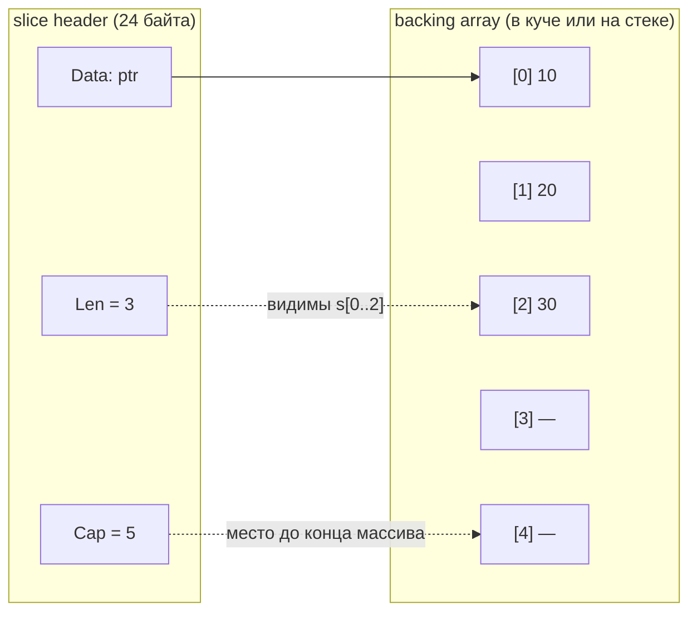
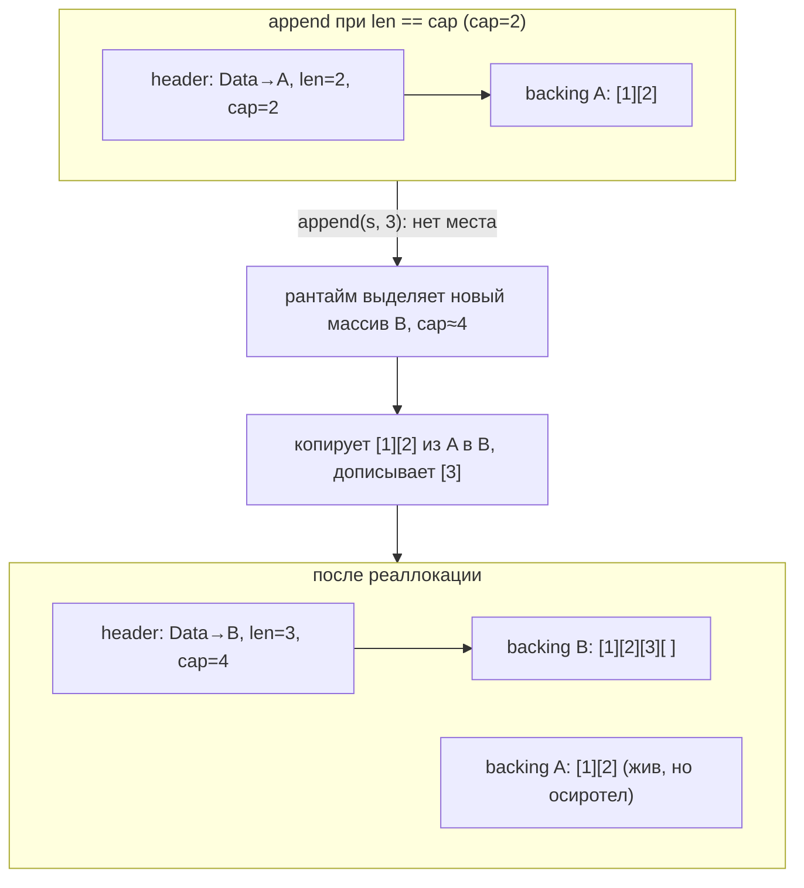
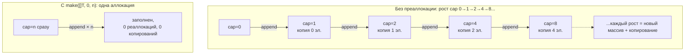

# Слайсы под капотом: len, cap, аллокации

Слайс — самая используемая и самая недопонятая структура в Go. На поверхности он выглядит как `List<T>`, и это сходство обманчиво: за ним стоит совершенно иная модель памяти. Непонимание этой модели приводит к категории багов, которых в C# просто не бывает — когда `append` в один слайс молча портит данные в другом, или когда срез неожиданно «течёт» памятью, удерживая гигантский массив.

Это ключевой файл раздела. Мы разберём слайс по косточкам: его внутреннюю структуру из трёх полей, разницу между `len` и `cap`, точный механизм роста при `append`, классические ловушки с общим backing-массивом, трёхиндексные срезы, различие nil и пустого слайса и стратегии преаллокации. После него вы будете «видеть» слайс насквозь.

## Слайс-хедер: три поля

Слайс — это **не** массив и не контейнер с данными. Слайс — это маленькая структура из трёх машинных слов (так называемый slice header), которая *описывает* окно над отдельно лежащим массивом данных (backing array, опорный массив):

```go
// Концептуальное представление (из рантайма Go, runtime/slice.go):
type sliceHeader struct {
    Data uintptr // указатель на начало окна в backing-массиве
    Len  int     // длина: сколько элементов доступно (s[0]..s[Len-1])
    Cap  int     // ёмкость: сколько элементов помещается от Data до конца backing-массива
}
```

Когда вы пишете `var s []int`, переменная `s` физически занимает три слова (на 64-битной платформе — 24 байта), независимо от того, сколько элементов в слайсе. Сами данные живут отдельно, в backing-массиве, на который указывает `Data`.



В этом примере слайс `s` с `len=3, cap=5` показывает три элемента, но за ними в backing-массиве есть ещё две «зарезервированные» ячейки, в которые `append` сможет дописать без реаллокации.

> **Параллель с .NET:** Ближайшая аналогия — `Span<T>` или `ArraySegment<T>`: это тоже «дескриптор» (указатель + длина) поверх чужого массива, а не сам массив. Но `Span<T>` — это `ref struct`, который нельзя положить в кучу или в поле обычного класса; слайс таких ограничений не имеет и свободно живёт где угодно. По динамичности слайс ближе к `List<T>` (есть рост через `append`), а `List<T>` внутри тоже держит `T[] _items` + `int _size` + неявную ёмкость `_items.Length` — фактически те же три сущности, только спрятанные в объект-обёртку.

## Мутабельность: слайс — мутабельное окно, строка — иммутабельное

Раз слайс — это окно над backing-массивом, естественный вопрос: можно ли через это окно **менять** данные? Да. Слайс **мутабелен**, и это надо отделять от двух разных операций.

**1. Запись по индексу — мутация на месте.** `s[i] = v` пишет прямо в backing-массив. А поскольку слайс — лишь окно, эта запись видна через **все** слайсы, смотрящие на тот же массив (механика и ловушки этого — ниже, в разделе про aliasing):

```go
s := []int{1, 2, 3}
s[0] = 99      // запись в backing-массив — мутация на месте ✅
fmt.Println(s) // [99 2 3]
```

**2. Рост/срез — это НЕ мутация общего объекта, а новый хедер.** `append`/reslice не меняют какой-то разделяемый «объект-слайс» — они возвращают **новый хедер** (`{ptr,len,cap}`), который вы присваиваете обратно (`s = append(s, x)`). Поэтому изменение длины — это переприсваивание вашей копии хедера, а не мутация, видимая другим копиям хедера (например, переданным в функцию по значению — см. файл [Сравнение с .NET](./05-comparison-with-dotnet.md)).

### Контраст: строка иммутабельна

Самое поучительное — сравнить слайс со **строкой**. Структурно `string` — это такой же «хедер с указателем» (`{ptr, len}` поверх байтов), но, в отличие от слайса, строка **иммутабельна**: записать в неё по индексу нельзя.

```go
str := "go"
// str[0] = 'G'   // ❌ ошибка компиляции: cannot assign to str[0]
b := []byte(str)  // конверсия КОПИРУЕТ байты
b[0] = 'G'        // мутируем копию, а не строку
fmt.Println(str, string(b)) // go Go — исходная строка цела
```

Именно из-за гарантии неизменности конверсии `[]byte(str)` и `string(b)` **копируют** данные: иначе через изменяемый `[]byte` можно было бы мутировать байты, на которые смотрит иммутабельная строка, и сломать инвариант (строки в Go могут разделять память, кэшироваться, использоваться как ключи мап — всё это держится на их неизменности). Это копирование имеет цену; компилятор устраняет её в некоторых частных случаях (например, поиск по `map` с ключом `string(b)` или `for range` по строке не аллоцируют), но ментальная модель — «конверсия копирует».

| | Слайс `[]T` | Строка `string` |
| --- | --- | --- |
| Запись по индексу `x[i] = v` | да ✅ | нет ❌ (ошибка компиляции) |
| Структура | хедер `{ptr, len, cap}` | хедер `{ptr, len}` |
| Изменение содержимого | in-place, видно через все слайсы общего массива | невозможно; «изменение» — это всегда новая строка |
| Рост / склейка | `append` (новый хедер) | `+` или `strings.Builder` (новая строка) |

> **Параллель с .NET:** в C# `string` тоже иммутабелен, и для построения строк вы берёте `StringBuilder` — в Go его роль играет `strings.Builder` (или прямая работа с `[]byte`). Мутабельное «окно над символами» в .NET — это `Span<char>`/`Memory<char>`; в Go мутабельный аналог строки — `[]byte`/`[]rune`, а `string` — её иммутабельная версия. То есть привычная пара «`string` (только чтение) ↔ `StringBuilder`/`Span<char>` (запись)» в Go выглядит как «`string` ↔ `[]byte`».

## len против cap

Два числа в хедере легко путать:

- **`len(s)`** — сколько элементов в слайсе *прямо сейчас*. Индексация `s[i]` легальна только при `0 <= i < len`.
- **`cap(s)`** — сколько элементов умещается в backing-массиве, считая от текущего начала окна (`Data`) до физического конца массива. Это «запас», в который `append` может дописывать без выделения новой памяти.

```go
s := make([]int, 3, 5)
fmt.Println(len(s), cap(s)) // 3 5
s = s[:4]                   // расширяем окно в пределах cap — это легально
fmt.Println(len(s), cap(s)) // 4 5
// s = s[:6]                // panic: out of range — за пределы cap нельзя
```

Можно «расширять» и «сужать» окно срезом в пределах `cap`, не трогая данные. А вот выйти за `cap` срезом нельзя — для роста сверх ёмкости нужен `append`, который выделит новую память.

## append: переиспользование против реаллокации

`append` — центральная операция, и понимать её поведение критически важно. Алгоритм такой:

1. Если после добавления элементов **новая длина ≤ cap** — данные дописываются прямо в существующий backing-массив (на свободные ячейки за `len`), возвращается слайс с тем же `Data`, но бо́льшим `Len`. Реаллокации нет — это дёшево.
2. Если **новая длина > cap** (`len == cap` и надо добавить ещё) — рантайм **выделяет новый, больший backing-массив**, копирует туда все существующие элементы, дописывает новые и возвращает слайс, указывающий уже на новый массив. Старый массив остаётся прежним (на него по-прежнему смотрят другие слайсы, если они были).

Именно поэтому результат `append` **обязательно** нужно присваивать обратно: `s = append(s, x)`. Если этого не сделать, при реаллокации вы потеряете новый слайс, а при отсутствии реаллокации получите рассогласование `len`.

```go
s := make([]int, 0, 2) // len=0, cap=2
fmt.Println(len(s), cap(s)) // 0 2

s = append(s, 1) // помещается: len=1, cap=2, тот же массив
s = append(s, 2) // помещается: len=2, cap=2, тот же массив
s = append(s, 3) // НЕ помещается (len==cap): реаллокация! новый массив, cap вырастет
fmt.Println(len(s), cap(s)) // 3 4 (типичный результат, см. ниже про коэффициент)
```

### Про рост ёмкости — аккуратно

Часто говорят «слайс удваивается». Это упрощение. Точная стратегия роста — **деталь реализации рантайма** и не гарантируется спецификацией языка; она менялась между версиями Go. В общих чертах на современных версиях:

- для **маленьких** слайсов ёмкость при реаллокации растёт примерно **вдвое** (удвоение);
- для **больших** слайсов (после некоторого порога, исторически около 256 элементов, но это деталь) коэффициент роста **снижается** (примерно к 1.25×), чтобы не тратить память слишком расточительно на больших объёмах;
- финальная ёмкость дополнительно выравнивается под размерные классы аллокатора памяти, поэтому конкретное число `cap` после `append` может быть не «ровным».

Вывод для практики: **не закладывайтесь на конкретные числа `cap`** после `append`. Закладывайтесь на принцип — рост амортизированно константный (как у `List<T>`), а если знаете итоговый размер заранее, делайте преаллокацию (см. ниже) и не полагайтесь на авторост вовсе.

> **Параллель с .NET:** `List<T>` при переполнении удваивает внутренний массив (`_items`) и копирует элементы — ровно тот же амортизированный `O(1)` на добавление. Разница в том, что `List<T>` инкапсулирует этот массив и ёмкость внутри объекта, а в Go backing-массив и хедер разделены, из-за чего реаллокация имеет видимый побочный эффект: после неё слайс перестаёт делить память с теми, кто смотрел на старый массив. Это и порождает ловушки ниже.



## Aliasing: общий backing-массив и его ловушки

Раз слайс — это окно над массивом, **несколько слайсов могут смотреть на один и тот же backing-массив**. Срез (`s[a:b]`) не копирует данные — он создаёт новый хедер, указывающий внутрь того же массива. Это источник самых коварных багов в Go.

### Ловушка 1: срез делит память с оригиналом

```go
original := []int{1, 2, 3, 4, 5}
view := original[1:3]      // [2 3], но это окно В ТОМ ЖЕ массиве
view[0] = 999             // меняем view[0]...
fmt.Println(original)     // [1 999 3 4 5] — оригинал ИЗМЕНИЛСЯ! ❌ (если не ожидали)
```

Запись в `view[0]` меняет ту же ячейку памяти, что и `original[1]`, потому что это физически одна и та же ячейка. В C# `list.GetRange(1, 2)` вернул бы независимую копию — здесь же копии нет.

### Ловушка 2: append, перезаписывающий «чужие» данные

Самая опасная версия. Если у слайса есть запас ёмкости (`cap > len`), `append` пишет в этот запас — а запас может физически совпадать с элементами, видимыми через другой слайс:

```go
base := []int{1, 2, 3, 4, 5} // len=5, cap=5
a := base[0:2]               // [1 2], len=2, cap=5 (!) — cap тянется до конца base
b := base[2:4]               // [3 4], len=2, cap=3

a = append(a, 99)            // len(a)=2 < cap(a)=5 -> пишем В ТОТ ЖЕ массив, в ячейку [2]!
fmt.Println(a)               // [1 2 99]
fmt.Println(b)               // [99 4] — b[0] ИСПОРЧЕН! ❌
fmt.Println(base)            // [1 2 99 4 5] — base[2] перезаписан
```

Что произошло: `a` имела `cap=5`, потому что её окно начинается в начале `base` и тянется до его конца. У `a` был запас, и `append(a, 99)` записал `99` не в новый массив, а в ячейку `base[2]` — которая одновременно является `b[0]`. Один безобидный `append` молча разрушил данные в трёх слайсах сразу. Таких багов в C# с `List<T>` не существует в принципе.

### Как делать правильно

Если нужна **независимая копия**, явно скопируйте данные. Идиомы:

```go
// Способ 1: make + copy
view := make([]int, len(original[1:3]))
copy(view, original[1:3]) // view теперь независим ✅

// Способ 2: slices.Clone (Go 1.21+) — самый чистый
view := slices.Clone(original[1:3]) // независимая копия ✅

// Способ 3: append к nil — тоже создаёт новый массив
view := append([]int(nil), original[1:3]...) // ✅
```

Либо, если вы режете слайс и собираетесь делать `append`, ограничьте ёмкость трёхиндексным срезом (следующий раздел), чтобы `append` был вынужден реаллоцировать и не трогал чужую память.

## Полное выражение среза: a[low:high:max]

У среза есть третья, менее известная форма — **трёхиндексный срез** `a[low:high:max]`, который позволяет ограничить не только длину, но и **ёмкость** результата:

```go
s := []int{1, 2, 3, 4, 5}
t := s[1:3:4] // len = 3-1 = 2, cap = 4-1 = 3
fmt.Println(len(t), cap(t)) // 2 3
```

- `low` — начало окна (как обычно);
- `high` — конец окна, задаёт `len = high - low`;
- `max` — задаёт `cap = max - low` (должно быть `high <= max <= cap(s)`).

**Зачем это нужно.** Главное применение — защита от ловушки 2. Ограничив `cap` точно по длине (`a[low:high:high]`), вы гарантируете, что следующий же `append` к этому слайсу будет вынужден выделить новый массив, а не залезть в память исходного:

```go
base := []int{1, 2, 3, 4, 5}
// Безопасный «отрезок»: cap == len, запаса нет
a := base[0:2:2]   // len=2, cap=2
a = append(a, 99)  // cap исчерпан -> реаллокация, base НЕ тронут ✅
fmt.Println(base)  // [1 2 3 4 5] — цел
```

Это типичный приём, когда вы возвращаете «срез» внутренних данных наружу из функции и не хотите, чтобы вызывающий код своими `append`'ами повредил ваше состояние.

## copy() и количество скопированного

Встроенная `copy(dst, src)` копирует элементы из `src` в `dst` и возвращает число фактически скопированных — а это **минимум из `len(dst)` и `len(src)`**. Она не растит `dst`; копируется лишь столько, сколько влезает в уже существующую длину приёмника:

```go
src := []int{1, 2, 3, 4, 5}
dst := make([]int, 3)
n := copy(dst, src) // копируется min(3, 5) = 3 элемента
fmt.Println(n, dst) // 3 [1 2 3]
```

Частая ошибка — сделать `dst := make([]T, 0, n)` (длина 0!) и удивляться, что `copy` ничего не скопировал: длина приёмника нулевая, копировать некуда. Для копирования нужна именно **длина**, а не только ёмкость: `make([]T, len(src))`.

## nil-слайс против пустого слайса

Это тонкое, но иногда важное различие. Есть два способа получить слайс «без элементов»:

```go
var a []int      // nil-слайс: Data=nil, len=0, cap=0
b := []int{}     // пустой слайс: Data указывает на пустой массив, len=0, cap=0
```

Оба имеют `len == 0`, оба безопасны для `range` (ноль итераций) и для `append` (оба корректно вырастут). В большинстве кода разница незаметна, и **идиоматично предпочитать nil-слайс** (`var a []T`) как «пустое» значение — он не требует аллокации.

Но есть случаи, где различие выходит наружу:

```go
var a []int
b := []int{}
fmt.Println(a == nil) // true
fmt.Println(b == nil) // false
```

Самый практичный пример — **JSON-маршалинг**. `nil`-слайс сериализуется в `null`, а пустой непустой слайс — в `[]`:

```go
type Resp struct {
    Items []string `json:"items"`
}

a, _ := json.Marshal(Resp{Items: nil})       // {"items":null}
b, _ := json.Marshal(Resp{Items: []string{}}) // {"items":[]}
```

Если фронтенд или другой сервис ожидает массив `[]` и ломается на `null`, это различие внезапно становится критичным. Тогда осознанно инициализируют поле пустым непустым слайсом (`[]string{}`), а не оставляют `nil`.

> **Параллель с .NET:** В C# различают `null`-ссылку на коллекцию и пустую коллекцию (`new List<T>()`), и при сериализации `System.Text.Json` тоже выдаст `null` против `[]`. Так что концепция знакома; новизна в том, что в Go «нулевой» слайс полностью рабочий — по нему можно итерироваться и в него можно делать `append`, в отличие от `null`-списка в C#, который сначала надо создать.

## Аллокации: преаллокация через make([]T, 0, n)

Поскольку `append` при исчерпании ёмкости выделяет новый массив и копирует туда всё содержимое, наполнение слайса в цикле без преаллокации приводит к **серии реаллокаций и копирований**. Если вы знаете (или можете оценить) итоговый размер, выделите ёмкость заранее одним вызовом:

```go
// ❌ Плохо: множественные реаллокации по мере роста
func bad(items []Item) []string {
    var result []string // nil, cap=0
    for _, it := range items {
        result = append(result, it.Name) // периодически реаллоцирует и копирует
    }
    return result
}

// ✅ Хорошо: одна аллокация под нужную ёмкость
func good(items []Item) []string {
    result := make([]string, 0, len(items)) // len=0, cap=len(items)
    for _, it := range items {
        result = append(result, it.Name) // ни одной реаллокации
    }
    return result
}
```

В `good` мы создаём слайс **нулевой длины, но нужной ёмкости** (`make([]string, 0, len(items))`) и наполняем через `append`. Ёмкости хватает на все элементы, поэтому реаллокаций не происходит вовсе.

Почему это важно:

- **Меньше работы для GC.** Каждая промежуточная реаллокация порождает мусорный массив, который потом собирает сборщик. Преаллокация даёт ровно один долгоживущий массив.
- **Меньше копирований.** Без преаллокации общий объём скопированных данных при наполнении до `n` элементов составляет около `2n` (сумма геометрической прогрессии). С преаллокацией — ноль.
- **Лучшая локальность.** Один непрерывный массив дружелюбнее к кешу процессора, чем цепочка переселений.

Важный нюанс: используйте `make([]T, 0, n)` (длина 0, ёмкость n) и `append`, а **не** `make([]T, n)` (длина n) — иначе вы получите слайс из `n` нулевых элементов, к которым `append` начнёт *дописывать* сверху, и в результате будет `2n` элементов. Если же план — заполнять по индексу `result[i] = ...`, тогда наоборот нужна форма `make([]T, n)` с ненулевой длиной.



> **Параллель с .NET:** Это прямой аналог `new List<T>(capacity)` или `EnsureCapacity(n)`. Опытный .NET-разработчик уже знает, что задавать начальную ёмкость списка перед массовым наполнением — хорошая практика. В Go это ровно та же оптимизация и та же мотивация, только синтаксис другой: `make([]T, 0, n)`.

## Итог: модель, которую нужно держать в голове

- Слайс — это **хедер из трёх полей** (указатель, len, cap), а не контейнер с данными. Данные живут в отдельном backing-массиве.
- Хедер копируется по значению (дёшево), но **указатель внутри него общий** — поэтому копии слайса смотрят на одну память.
- `append` пишет в существующий массив, **пока хватает cap**; при исчерпании — реаллоцирует и копирует, после чего связь с прежним массивом рвётся.
- Срезы и `append` **делят память** — отсюда ловушки aliasing'а. Нужна независимость — копируйте (`slices.Clone`, `copy`) или ограничивайте `cap` трёхиндексным срезом.
- **Преаллоцируйте** (`make([]T, 0, n)`), когда знаете размер — это убирает реаллокации и снижает нагрузку на GC.

---

[⌂ Главная](../../README.md) · [↑ Раздел](./README.md) · [← Предыдущий: Коллекции](./03-collections.md) · [→ Следующий: Сравнение с .NET](./05-comparison-with-dotnet.md)
