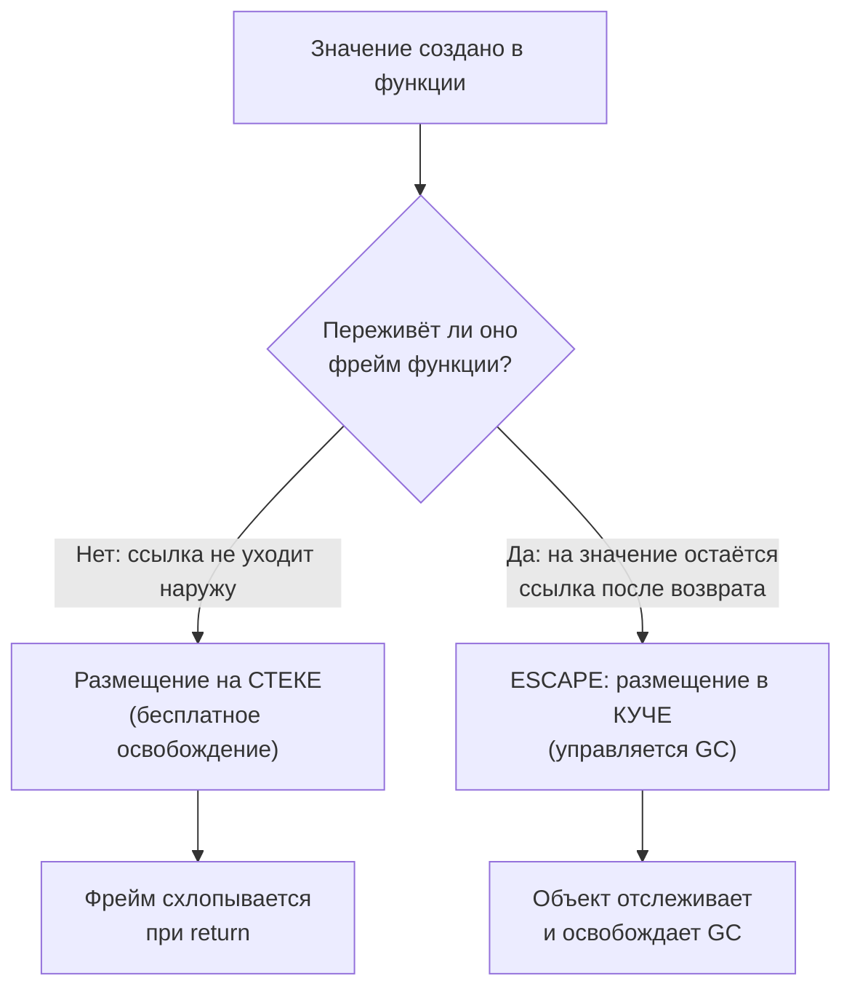

# Стек vs Куча и Escape Analysis

В .NET вы привыкли к простому правилу: `struct` живёт на стеке (или инлайном внутри другого объекта), `class` — всегда в управляемой куче. Где разместить данные, вы решаете сами, выбирая тип при объявлении. В Go этого выбора у вас нет — есть только `struct`, а решение «стек или куча» компилятор принимает за вас на этапе компиляции. Механизм, который это делает, называется **escape analysis** (анализ убегания), и понимать его обязательно: от него напрямую зависит, сколько работы достанется сборщику мусора.

В этом файле мы разберём, как устроены стек и куча в Go, что заставляет значение «убежать» в кучу, как посмотреть решения компилятора своими глазами и почему это критично для производительности.

## Стек и куча в Go

Память в Go, как и в .NET, делится на две принципиально разные области.

**Стек** — это область с дисциплиной LIFO, привязанная к выполнению функции (точнее, к горутине). Когда функция вызывается, под её локальные переменные выделяется фрейм; когда функция возвращается, фрейм просто «схлопывается» — указатель стека сдвигается обратно. Освобождение памяти на стеке стоит ровно ноль: никакого учёта, никакого сборщика мусора. Это самый дешёвый способ хранить данные.

Важная особенность Go: **у каждой горутины свой собственный стек, и он растёт по мере необходимости**. Горутина стартует с маленьким стеком (исторически 8 КБ, сейчас порядка 8 КБ начального размера), и если этого не хватает, рантайм выделяет новый, больший сегмент, копирует туда содержимое старого и корректирует указатели. Это называется *contiguous stacks* (непрерывные растущие стеки). Поэтому в Go нет привычного по .NET фиксированного лимита стека потока в 1 МБ и практически нет `StackOverflowException` от обычной рекурсии разумной глубины — стек просто вырастет (предел всё же есть, по умолчанию около 1 ГБ, и при его превышении программа аварийно завершается).

**Параллель с .NET:** в CLR поток получает стек фиксированного размера (по умолчанию ~1 МБ), и переполнение даёт фатальный `StackOverflowException`, который невозможно поймать. В Go стеки горутин динамические, что позволяет дёшево держать сотни тысяч горутин одновременно — об этом подробно в разделе про конкурентность.

**Куча** — это общая область памяти, которой управляет сборщик мусора. Всё, что не помещается в дисциплину стека (живёт дольше своего фрейма, имеет неизвестный на этапе компиляции размер и т. д.), размещается здесь. За каждый объект в куче потом «платит» GC: его нужно отследить при маркировке и освободить при очистке. Поэтому общее инженерное правило одинаково для .NET и Go: **чем меньше аллокаций в куче, тем меньше нагрузка на GC и тем стабильнее latency**.

## Escape Analysis: кто решает, где жить значению

Escape analysis — это статический анализ, который компилятор Go выполняет во время компиляции. Он отвечает на один вопрос для каждого значения: **переживёт ли это значение фрейм функции, в которой оно создано?**

- Если **нет** — значение можно безопасно разместить на стеке: когда функция вернётся, оно больше никому не нужно, и фрейм схлопнется вместе с ним.
- Если **да** (на значение остаётся ссылка после возврата функции) — значение «убегает» (escapes) в кучу, потому что стековый фрейм исчезнет, а данные должны продолжить жить.

Вот ключевая мысль, которая ломает интуицию C-программиста и удивляет C#-разработчика:

> В Go операторы `&` (взятие адреса) и встроенная функция `new()` **НЕ означают автоматически размещение в куче.** Компилятор сам решит, где разместить значение, исходя из того, убегает оно или нет.

Это прямо противоположно C#, где `new SomeClass()` гарантированно идёт в кучу, а `new SomeStruct()` — нет, и вы это знаете заранее по типу. В Go идентичный по синтаксису код может разместиться по-разному в зависимости от того, что с указателем происходит дальше.

```go
// Несмотря на &Point{}, это значение НЕ обязательно попадёт в кучу.
func makeLocal() int {
    p := &Point{X: 1, Y: 2} // взяли адрес локальной переменной
    return p.X + p.Y         // указатель не покидает функцию -> остаётся на стеке
}

// А вот здесь то же &Point{} убежит в кучу:
func makeEscaping() *Point {
    p := &Point{X: 1, Y: 2}
    return p // указатель возвращается наружу -> переживает фрейм -> куча
}
```

В первой функции компилятор видит, что адрес `p` никуда не уходит, и спокойно кладёт `Point` на стек, хотя в коде стоит `&`. Во второй адрес возвращается вызывающему — значит, после возврата `makeEscaping` на `Point` всё ещё будет ссылка, и компилятор обязан разместить его в куче.

**Параллель с .NET:** в C# вы получаете «безопасное взятие адреса локалки» только в очень ограниченных сценариях (`ref`-возвраты, `ref struct`, `Span<T>` со строгими compile-time правилами, запрещающими утечку ссылки наружу). В Go можно вернуть `*T` на локальную переменную совершенно свободно и безопасно — компилятор просто «продлит жизнь» этому значению, переместив его в кучу. Висячих указателей (dangling pointers), как в C++, в Go не бывает в принципе.



## Что вызывает escape в кучу

Escape analysis консервативен: если компилятор не может **доказать**, что значение не убегает, он размещает его в куче (это безопасный выбор по умолчанию). Вот основные причины, по которым значение убегает.

### 1. Возврат указателя на локальную переменную

Самый очевидный случай — мы его уже видели выше. Адрес локалки возвращается наружу, значит, фрейм её пережить не может.

```go
func newCounter() *int {
    n := 0
    return &n // n убегает: на неё будет ссылка после возврата
}
```

### 2. Сохранение значения в интерфейс

Когда вы кладёте конкретное значение в интерфейс (включая `any`), оно очень часто убегает в кучу — интерфейс хранит указатель на данные, и компилятору, как правило, не удаётся доказать, что эти данные не переживут фрейм. Классический пример — передача в `fmt.Println`, чья сигнатура принимает `...any`:

```go
func logValue() {
    x := 42
    fmt.Println(x) // x упаковывается в any -> обычно escape в кучу (боксинг)
}
```

Подробно механику упаковки в интерфейс и боксинг мы разберём в [файле 05](./05-any-boxing-and-generics.md). Сейчас важно запомнить: интерфейс — частая причина незаметных аллокаций.

### 3. Захват переменной замыканием, которое уходит наружу

Если замыкание переживает фрейм (возвращается, сохраняется, запускается в горутине), то захваченные им переменные тоже обязаны пережить фрейм и убегают в кучу.

```go
func makeAccumulator() func(int) int {
    sum := 0
    return func(x int) int { // замыкание уходит наружу...
        sum += x // ...значит, sum убегает в кучу
        return sum
    }
}
```

### 4. Значение слишком большое для стека или его размер неизвестен на этапе компиляции

Очень большие значения компилятор может разместить в куче, чтобы не раздувать стековый фрейм. Аналогично, если размер не фиксирован на этапе компиляции — например, слайс создаётся через `make([]T, n)` с переменной длиной `n`, — backing-массив идёт в кучу.

```go
func bigBuffer(n int) []byte {
    return make([]byte, n) // размер зависит от n -> backing-массив в куче
}
```

### 5. Отправка значения в канал

Значение, отправленное в канал, может быть прочитано другой горутиной в любой момент позже, поэтому оно должно жить независимо от фрейма отправителя и убегает в кучу.

```go
func send(ch chan *Point) {
    p := &Point{X: 1} // p уходит в канал, читается другой горутиной -> escape
    ch <- p
}
```

### 6. Сохранение в slice, map или поле, которые сами убегают

Если вы кладёте указатель (или значение, на которое потом берётся адрес) в структуру данных, которая сама размещена в куче или возвращается наружу, то и вложенное значение убегает. Escape «заразен» вверх по графу ссылок.

```go
func collect() []*int {
    var out []*int
    for i := 0; i < 3; i++ {
        n := i
        out = append(out, &n) // адреса локалок попадают в возвращаемый слайс -> escape
    }
    return out
}
```

> **Важно про обобщение:** не существует простого синтаксического правила «вот это всегда стек, а вот это всегда куча». Решение зависит от потока данных в конкретной функции. Один и тот же `&T{}` может оказаться и на стеке, и в куче. Единственный надёжный способ узнать — спросить компилятор.

## Как посмотреть решения компилятора: `-gcflags='-m'`

Компилятор Go умеет печатать свои решения по escape analysis. Флаг `-m` (от *optimization decisions*) включает диагностику; чем больше `-m`, тем подробнее (`-m -m` или `-m=2` даёт причины).

```bash
go build -gcflags='-m' ./...
```

Для одного файла удобно:

```bash
go build -gcflags='-m' main.go
```

Рассмотрим программу:

```go
package main

import "fmt"

type Point struct{ X, Y int }

func makeLocal() int {
    p := &Point{X: 1, Y: 2}
    return p.X + p.Y
}

func makeEscaping() *Point {
    p := &Point{X: 1, Y: 2}
    return p
}

func main() {
    fmt.Println(makeLocal())
    fmt.Println(makeEscaping())
}
```

Вывод `go build -gcflags='-m'` будет содержать строки такого вида (формат может немного отличаться между версиями Go):

```text
./main.go:8:7: &Point{...} does not escape
./main.go:13:7: &Point{...} escapes to heap
./main.go:19:14: ... argument does not escape
./main.go:19:14: makeLocal() escapes to heap
```

Как это читать:

- `does not escape` — значение осталось на стеке. Это то, чего мы хотим в горячем коде.
- `escapes to heap` — значение убежало в кючу, будет аллокация. В `makeEscaping` это ожидаемо (мы возвращаем указатель).
- `... escapes to heap` рядом с `fmt.Println` — это упаковка аргумента в `any` (тот самый боксинг из причины №2): `int`-результат `makeLocal()` оборачивается в интерфейс и убегает. Так выглядит «скрытая аллокация», которую легко не заметить в коде.

> **Практический приём:** когда профайлер (`pprof`) показывает много аллокаций в горячей функции, добавьте `-gcflags='-m'` и найдите строки `escapes to heap` в этой функции. Часто виновата именно неожиданная упаковка в интерфейс или возврат указателя там, где можно было обойтись значением.

Связанный полезный флаг — отключить инлайнинг и оптимизации для отладки (`-gcflags='-m -l'` отключает инлайн, что иногда меняет картину escape, так как инлайнинг может позволить компилятору доказать, что значение не убегает).

## Почему это важно для производительности

Разница между стеком и кучей — это не академическая тонкость, а прямой рычаг latency и throughput.

- **Стек дешёвый.** Аллокация — это сдвиг указателя; освобождение — обратный сдвиг при возврате функции. Ни байта работы для GC.
- **Куча дорогая в сумме.** Сама аллокация в Go довольно быстра (есть пер-P кэши, об этом в [файле 06](./06-gc-and-comparison-with-dotnet.md)), но каждый объект в куче потом нужно маркировать и выметать сборщику мусора. Чем больше «мусора» вы создаёте, тем чаще и дольше работает GC, тем выше нагрузка на CPU и тем заметнее паузы.

Отсюда вытекает идиома производительного Go: **держите короткоживущие значения на стеке**. Это не значит «избегайте указателей любой ценой» (см. [файл 02](./02-pointers.md) — у указателей своя роль), но значит «не заставляйте значения убегать в кучу без нужды». Типичные приёмы: переиспользовать буферы (`sync.Pool`), преаллоцировать слайсы нужной ёмкости, избегать лишней упаковки в `any`, не возвращать указатель там, где достаточно копии небольшой структуры.

**Параллель с .NET:** в C# у вас ручной рычаг — выбор `struct` против `class`, плюс `Span<T>`/`stackalloc`/`ref struct` для тонкого контроля над стеком и избегания аллокаций. Вы оптимизируете аллокации, меняя *тип*. В Go тип один (`struct`), и вы влияете на размещение косвенно — через то, как пишете код (берёте ли адрес, кладёте ли в интерфейс, возвращаете ли указатель). Escape analysis — это «автоматический» аналог решения «struct или class», но принимаемый компилятором по факту использования, а не вами заранее по типу. Поэтому в Go так важно уметь читать `-gcflags='-m'`: это ваше окно в то, что компилятор решил за вас.

## Краткие выводы

- В Go есть стек (дешёвый, пофреймовый, у каждой горутины свой растущий) и куча (под управлением GC).
- Размещение значения определяет **escape analysis** на этапе компиляции, а не тип (как `struct`/`class` в .NET).
- `&` и `new()` **не** означают кучу: компилятор кладёт значение на стек, если может доказать, что оно не переживёт фрейм.
- Убегают в кучу: возврат указателя на локалку, упаковка в интерфейс, захват «уходящим» замыканием, неизвестный/большой размер, отправка в канал, сохранение в убегающую структуру данных.
- Решения компилятора видны через `go build -gcflags='-m'`; строки `escapes to heap` — ваши кандидаты на оптимизацию.
- Меньше аллокаций в куче = меньше работы GC = стабильнее latency.

---

[⌂ Главная](../../README.md) · [↑ Раздел](./README.md) · [← Предыдущий: Обзор раздела](./README.md) · [→ Следующий: Указатели](./02-pointers.md)
