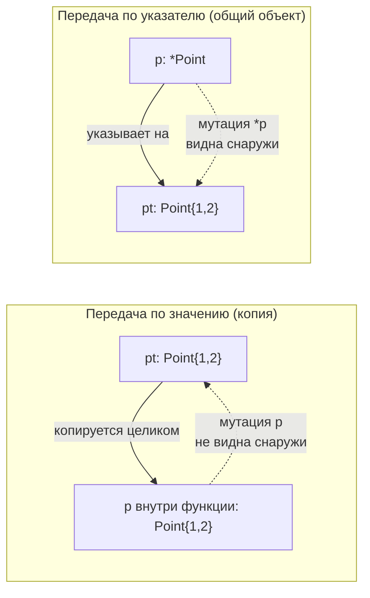

# Указатели: `*` и `&`

В C# семантика передачи зависит от того, что вы объявили: `class` передаётся «по ссылке» (копируется ссылка на общий объект), `struct` — по значению (копируется всё содержимое). В Go правило одно и одинаковое для всего: **всё передаётся по значению, всегда копируется**. Если вам нужно разделить один и тот же объект между вызывающим и вызываемым или мутировать его — вы делаете это явно, через указатели.

В этом файле разберём указатели `*T` и оператор `&`, почему в Go нет арифметики указателей, когда осмысленно передавать по указателю, а когда по значению, и важнейшую тему методов: value receiver против pointer receiver.

## Всё передаётся по значению

Когда вы передаёте аргумент в функцию, присваиваете переменную или кладёте значение в слайс — Go копирует это значение. Для `int` копируется число, для структуры копируются все её поля, для указателя копируется сам указатель (адрес).

```go
type Point struct{ X, Y int }

func mutateCopy(p Point) {
    p.X = 100 // меняем КОПИЮ; вызывающий не увидит изменений
}

func main() {
    pt := Point{X: 1, Y: 2}
    mutateCopy(pt)
    fmt.Println(pt.X) // 1 — оригинал не тронут
}
```

Это работает ровно как `struct` в C#: функция получила копию, изменения локальны. Чтобы изменения были видны снаружи, нужно передать **указатель** на оригинал.

```go
func mutateOriginal(p *Point) {
    p.X = 100 // меняем то, на что указывает p, — оригинал
}

func main() {
    pt := Point{X: 1, Y: 2}
    mutateOriginal(&pt) // передаём адрес
    fmt.Println(pt.X)   // 100 — оригинал изменён
}
```

## Указатели `*T` и оператор `&`

- `&x` — взять адрес переменной `x`. Результат имеет тип `*T`, где `T` — тип `x`.
- `*p` — разыменовать указатель `p`, то есть обратиться к значению, на которое он указывает.
- `var p *T` — объявить указатель; его нулевое значение — `nil`.

```go
x := 42
p := &x      // p имеет тип *int, указывает на x
fmt.Println(*p) // 42 — разыменование
*p = 100        // меняем x через указатель
fmt.Println(x)  // 100
```

Создать указатель можно тремя способами:

```go
// 1. Взять адрес существующей переменной
x := 42
p1 := &x

// 2. Композитный литерал с & (самый частый идиоматичный способ)
p2 := &Point{X: 1, Y: 2}

// 3. Встроенная функция new() — выделяет нулевое значение и возвращает указатель
p3 := new(Point) // *Point, поля обнулены: {0, 0}
```

`new(T)` редко используется напрямую для структур (идиоматичнее `&T{...}`), но удобен для примитивов, когда нужен `*int` с нулевым значением. Помните из [файла 01](./01-stack-vs-heap-escape-analysis.md): ни `&`, ни `new()` не означают автоматически кучу — где разместить значение, решает escape analysis.

**Удобство Go против C#:** в Go доступ к полю через указатель не требует особого синтаксиса. Вместо `(*p).X` пишут просто `p.X` — компилятор автоматически разыменовывает указатель при обращении к полю или вызове метода. В C# для этого есть разделение `.` (для ссылок) и `->` существует только в `unsafe`-контексте; в обычном C# указателей в этом смысле нет вовсе.

```go
p := &Point{X: 1, Y: 2}
fmt.Println(p.X)    // эквивалент (*p).X, Go разыменует сам
p.Y = 20            // тоже работает напрямую
```



## Нет арифметики указателей

В отличие от C и C++, в Go **нет арифметики указателей**. Нельзя сделать `p++`, чтобы перейти к следующему элементу, нельзя складывать указатель с целым, нельзя сравнивать указатели на «больше/меньше» (только на равенство `==`/`!=` и с `nil`). Это сознательное решение ради безопасности памяти и корректной работы сборщика мусора: GC должен в любой момент точно знать, на какие объекты есть ссылки, а «гуляющие» по памяти арифметические указатели это ломают.

Обойти ограничение можно через пакет `unsafe` (`unsafe.Pointer` + `uintptr`), но это территория низкоуровневых трюков, аналогичная `unsafe`/`fixed` в C#. В обычном прикладном коде она не нужна и считается антипаттерном без веской причины.

**Параллель с .NET:** в C# арифметика указателей возможна только в `unsafe`-блоках с `fixed` для закрепления (pinning) объектов в куче, чтобы GC их не сдвинул. В Go GC неперемещающий (см. [файл 06](./06-gc-and-comparison-with-dotnet.md)), поэтому объект не «уезжает» из-под указателя, и pinning в привычном смысле не нужен — указатель остаётся валидным сам по себе.

## Когда передавать по указателю, а когда по значению

Это один из самых частых вопросов новичков в Go, и здесь легко впасть в карго-культ «передавай всё по указателю, так эффективнее». Это неверно. Передача указателя — тоже копия (копируется адрес, обычно 8 байт), плюс возможный escape в кучу и косвенность при доступе. Для маленьких значений копия по значению часто **быстрее** и дружелюбнее к кэшу процессора.

Передавайте **по указателю**, когда:

- **Нужно мутировать** оригинал так, чтобы вызывающий увидел изменения.
- **Структура большая**, и копирование её целиком при каждом вызове ощутимо дорого (много полей, большие встроенные массивы).
- Тип **по своей природе должен иметь единственный экземпляр с идентичностью** или содержит поля, которые нельзя копировать (например, встроенный `sync.Mutex` — копировать структуру с мьютексом нельзя, это ломает синхронизацию; `go vet` это ловит).

Передавайте **по значению**, когда:

- Значение **маленькое** (примитивы, небольшие структуры из нескольких полей).
- Вам нужна **иммутабельность по факту** — копия гарантирует, что функция не изменит оригинал.
- Тип сам по себе уже является «дескриптором» — слайсы, мапы, каналы, строки, функции внутри содержат указатели на общие данные, поэтому передавать `*[]T` или `*map[K]V` почти никогда не нужно: передача слайса по значению уже даёт доступ к общему backing-массиву.

> **Нет жёсткого порога в байтах.** Ориентир из практики: структуры размером примерно до нескольких машинных слов (условно до ~4 полей / десятков байт) обычно дешевле и чище передавать по значению. Но единственный честный ответ для горячего кода — измерить бенчмарком (`testing.B`) и посмотреть escape analysis (`-gcflags='-m'`). Не оптимизируйте на глаз.

```go
// Хорошо: маленькое значение по значению
func distance(a, b Point) float64 { /* ... */ }

// Хорошо: мутация -> указатель
func (a *Account) Deposit(amount int) { a.Balance += amount }

// Хорошо: слайс уже дескриптор, указатель не нужен
func sum(xs []int) int { /* ... */ }

// ❌ Антипаттерн: указатель на слайс без причины
func badSum(xs *[]int) int { /* почти всегда лишняя косвенность */ }
```

## Методы: value receiver vs pointer receiver

Методы в Go объявляются с **получателем** (receiver) — это аналог `this` в C#, но записанный явно перед именем метода. И вот ключевое отличие от C#: получатель может быть либо значением (`value receiver`), либо указателем (`pointer receiver`), и это меняет семантику.

```go
type Counter struct{ n int }

// Value receiver: метод работает с КОПИЕЙ Counter
func (c Counter) GetValueCopy() int {
    c.n++         // меняем копию — наружу не видно
    return c.n
}

// Pointer receiver: метод работает с оригиналом
func (c *Counter) Increment() {
    c.n++         // меняем оригинал
}
```

- **Value receiver** (`func (c Counter)`) — метод получает копию. Мутации внутри метода не влияют на оригинал. Подходит для методов, которые только читают, и для маленьких типов.
- **Pointer receiver** (`func (c *Counter)`) — метод получает указатель на оригинал. Может его мутировать. Обязателен, если метод должен изменять состояние, и желателен для больших структур (чтобы не копировать на каждый вызов).

**Параллель с .NET:** в C# `this` для `class` всегда ссылка (метод видит реальный объект и мутирует его), а для `struct` `this` — это сама структура, и обычные методы могут её мутировать на месте (хотя мутабельные структуры — известный источник багов, отсюда рекомендация делать структуры иммутабельными или использовать `readonly struct`). В Go вы выбираете семантику явно на каждом методе через тип получателя. Это многословнее, но прозрачнее: глядя на сигнатуру `func (c *Counter) Increment()`, сразу видно, что метод мутирует.

### Адресуемость и автоматическое взятие адреса

Go умеет автоматически брать адрес или разыменовывать при вызове метода, если значение **адресуемо** (имеет адрес в памяти, например, обычная переменная):

```go
c := Counter{}      // обычная переменная — адресуема
c.Increment()       // Go автоматически берёт &c -> (&c).Increment()

p := &Counter{}
p.GetValueCopy()    // Go автоматически разыменует -> (*p).GetValueCopy()
```

Но если значение **не адресуемо** (например, результат функции или элемент мапы), вызвать на нём pointer-receiver метод напрямую нельзя:

```go
type M map[string]Counter

func get() Counter { return Counter{} }

func main() {
    get().Increment() // ❌ ошибка компиляции: результат функции не адресуем
    // m["k"].Increment() // ❌ ошибка: элемент мапы не адресуем
}
```

Это важная деталь, которая тесно связана с интерфейсами и **method set** типа.

### Method set: краткое введение

**Method set** (набор методов) типа определяет, какие методы можно вызвать и, главное, какому интерфейсу тип удовлетворяет. Правило таково:

- Method set типа `T` (значения) включает только методы с **value receiver**.
- Method set типа `*T` (указателя) включает методы с **обоими** видами получателей — и value, и pointer.

Из этого следует практическое последствие: если интерфейс требует метод, объявленный с pointer receiver, то интерфейсу удовлетворяет только `*T`, но **не** `T`. Полностью эту механику (почему так, как это связано с адресуемостью и какие ошибки возникают) мы разберём в [файле 04 про интерфейсы](./04-interfaces-and-duck-typing.md). Здесь достаточно запомнить связь: *pointer receiver → в интерфейс кладите указатель*.

## Правило согласованности получателей

Важнейшее стилистическое правило Go: **не смешивайте value- и pointer-получатели у одного типа.** Если хотя бы один метод типа использует pointer receiver, делайте pointer receiver у **всех** методов этого типа (даже у читающих, которым копия была бы достаточна).

Причины:

1. **Консистентность method set.** Если часть методов на `T`, а часть на `*T`, то ни `T`, ни `*T` могут не иметь полного набора, и тип будет неожиданно не удовлетворять интерфейсу либо вести себя по-разному в зависимости от того, значение у вас или указатель.
2. **Защита от случайного копирования.** Если тип предназначен для мутации (или содержит `sync.Mutex`), value-метод сделает копию и либо потеряет мутацию, либо скопирует мьютекс. Единый pointer receiver убирает этот класс ошибок.

```go
// ✅ Согласованно: все методы на *Counter
func (c *Counter) Increment() { c.n++ }
func (c *Counter) Value() int { return c.n }

// ❌ Несогласованно: смесь сбивает с толку и ломает method set
func (c *Counter) Increment() { c.n++ }
func (c Counter)  Value() int { return c.n } // value receiver вперемешку
```

Эмпирическое правило выбора: **если сомневаетесь — берите pointer receiver**, особенно для типов с изменяемым состоянием. Value receiver оставляйте для маленьких иммутабельных value-типов (например, своя обёртка над числом, координата, идентификатор), где копия дёшева и семантически уместна.

## Краткие выводы

- В Go **всё передаётся по значению**: примитивы, структуры, указатели — всё копируется. Указатель копирует адрес.
- `&x` берёт адрес, `*p` разыменовывает; доступ к полям через указатель пишется как `p.X` (Go разыменует сам).
- **Арифметики указателей нет** (вне `unsafe`); сравнивать указатели можно только на равенство и с `nil`.
- Указатель — для мутации и больших структур; маленькие значения и встроенные дескрипторы (слайсы, мапы, каналы) передавайте по значению. Без культа «всё по указателю».
- У методов выбирайте value или pointer receiver осознанно; pointer — для мутации и больших типов.
- **Не смешивайте** value- и pointer-получатели у одного типа; сомневаетесь — берите pointer.

---

[⌂ Главная](../../README.md) · [↑ Раздел](./README.md) · [← Предыдущий: Стек vs Куча и Escape Analysis](./01-stack-vs-heap-escape-analysis.md) · [→ Следующий: Нулевые значения и методы на nil](./03-nil-and-methods.md)
