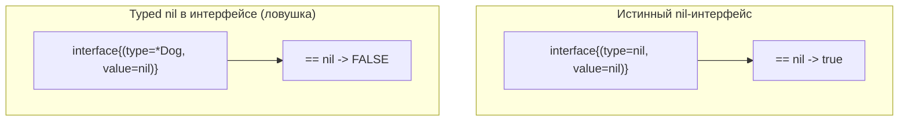

# Нулевые значения и методы на `nil`

В .NET неинициализированная ссылочная переменная равна `null`, и обращение к ней даёт `NullReferenceException` — одну из самых частых ошибок в проде. Go подходит к проблеме иначе: вместо «неинициализированной пустоты» каждый тип имеет **нулевое значение** (zero value), которое гарантированно осмысленно и часто сразу готово к использованию. Но `nil` в Go никуда не делся — он есть у указателей, слайсов, мап, каналов, интерфейсов и функций, и у него масса неочевидных тонкостей.

В этом файле разберём таблицу нулевых значений, идиому «полезного нулевого значения», панику при разыменовании nil, неожиданную возможность вызывать методы на nil-указателе, поведение nil-мап/слайсов/каналов и классическую ловушку «typed nil в интерфейсе».

## Нулевые значения (zero values)

В Go нет «неинициализированных» переменных. Если вы объявили переменную без явного значения, она получает нулевое значение своего типа. Это детерминированно и проверяется на этапе компиляции (нельзя «забыть» инициализировать).

| Тип | Нулевое значение |
|---|---|
| Числовые (`int`, `float64`, ...) | `0` |
| `bool` | `false` |
| `string` | `""` (пустая строка, не `nil`) |
| Указатель `*T` | `nil` |
| Слайс `[]T` | `nil` |
| Мапа `map[K]V` | `nil` |
| Канал `chan T` | `nil` |
| Интерфейс (включая `any`) | `nil` |
| Функция `func(...)` | `nil` |
| Структура `struct{...}` | структура, где каждое поле — своё нулевое значение |
| Массив `[N]T` | массив из `N` нулевых значений типа `T` |

Обратите внимание: `string` обнуляется в `""`, а **не** в `nil` — в Go строка не может быть `nil` (это не указатель). Структура обнуляется покомпонентно, рекурсивно.

```go
var i int           // 0
var s string        // "" (НЕ nil)
var p *Point        // nil
var sl []int        // nil
var m map[string]int // nil
var pt Point        // Point{X: 0, Y: 0}
```

**Параллель с .NET:** в C# `default(T)` — близкий аналог: `default(int)` == 0, `default(bool)` == false, `default` для ссылочного типа == `null`, для `struct` — структура с обнулёнными полями. Разница в акцентах: в .NET `null` для ссылочных типов — это «ничего, обращение к которому опасно», а Go проектирует так, чтобы нулевое значение было *рабочим*.

## Идиома «полезного нулевого значения» (zero value useful)

Одна из центральных идиом Go: **тип следует проектировать так, чтобы его нулевое значение было сразу пригодно к использованию без явной инициализации.** Это избавляет от конструкторов и от лишних проверок.

Каноничные примеры из стандартной библиотеки:

```go
// sync.Mutex: нулевое значение — готовый к работе незалоченный мьютекс
var mu sync.Mutex
mu.Lock()   // работает сразу, без инициализации
mu.Unlock()

// bytes.Buffer: нулевое значение — пустой готовый буфер
var buf bytes.Buffer
buf.WriteString("hello") // работает сразу

// nil-слайс полностью готов к append (см. ниже)
var xs []int
xs = append(xs, 1, 2, 3) // ок
```

Когда вы проектируете свой тип, стремитесь к тому же: чтобы `var x MyType` уже был валиден. Это противоположно типичному .NET-стилю, где объект обычно требует конструктора и инициализации зависимостей.

## `nil pointer dereference` → паника рантайма

Если вы разыменовываете nil-указатель (обращаетесь к полю или значению, которого нет), Go выдаёт **панику** во время выполнения — прямой аналог `NullReferenceException`, но с другим механизмом обработки (паника/`recover`, а не исключения; подробно об ошибках — в разделе 14).

```go
type Point struct{ X, Y int }

func main() {
    var p *Point // nil
    fmt.Println(p.X) // паника: runtime error: invalid memory address or nil pointer dereference
}
```

Сообщение в рантайме:

```text
panic: runtime error: invalid memory address or nil pointer dereference
[signal SIGSEGV: segmentation violation code=0x1 ...]
```

Здесь нет защиты на уровне типов (в отличие от C# 8 Nullable reference types — см. конец файла). Дисциплина, нулевые значения и линтеры — вот что спасает от паник.

## Неочевидно: методы с pointer receiver МОЖНО вызывать на nil

Вот тонкость, которая удивляет почти всех. В Go вызов метода — это просто передача получателя как первого (скрытого) аргумента. Если у метода **pointer receiver**, то на nil-указателе его вызвать **можно** — паники не будет до тех пор, пока метод **не разыменует** этот nil (не обратится к полям через него).

```go
type Node struct {
    Value int
    Next  *Node
}

// Метод корректно работает на nil-получателе:
// nil-указатель на Node — это валидный "пустой список".
func (n *Node) Length() int {
    if n == nil { // получатель сам может быть nil — это нормально
        return 0
    }
    return 1 + n.Next.Length() // рекурсия дойдёт до nil и остановится
}

func main() {
    var list *Node // nil
    fmt.Println(list.Length()) // 0 — НЕ паника!

    list = &Node{Value: 1, Next: &Node{Value: 2}}
    fmt.Println(list.Length()) // 2
}
```

Почему это работает: `list.Length()` транслируется в `Length(list)`, где `list == nil`. Внутри метода `n == nil`, и мы аккуратно это обрабатываем, не разыменовывая `n`. Паника возникла бы только при попытке прочитать `n.Value` или `n.Next` на nil-получателе.

Эта идиома используется в рекурсивных структурах (деревья, связные списки): nil естественно представляет «пустое поддерево / конец списка», и методы могут обрабатывать его без отдельного класса-обёртки.

> **Контраст с C#:** в C# вызов любого инстанс-метода на `null`-ссылке немедленно даёт `NullReferenceException` — ещё до входа в тело метода, потому что `this` не может быть `null`. В Go получатель — обычный параметр, и `nil` для него допустим. Это даёт паттерн «nil-safe методы», которого в C# попросту нет (там его эмулируют статическими методами или extension-методами с проверкой).

Важно: это работает **только** для pointer receiver. Метод с value receiver на nil-указателе вызвать нельзя — Go попытается разыменовать указатель, чтобы сделать копию получателя, и упадёт с паникой:

```go
func (n Node) ValueMethod() int { return n.Value } // value receiver

var list *Node
list.ValueMethod() // паника: разыменование nil для получения копии
```

## Поведение nil для встроенных ссылочных типов

`nil` ведёт себя по-разному для разных типов. Это нужно знать наизусть, потому что часть операций безопасна, а часть паникует.

### nil-слайс: читается, `len` == 0, `append` работает

nil-слайс — полностью рабочий «пустой слайс». Можно вызывать `len`/`cap` (оба дадут 0), итерировать (ноль итераций) и делать `append` (он сам выделит backing-массив).

```go
var xs []int       // nil
fmt.Println(len(xs)) // 0
fmt.Println(xs == nil) // true
for range xs { /* ноль итераций */ }
xs = append(xs, 1) // ок: append выделит массив, теперь len==1
```

Поэтому в Go не нужно инициализировать слайс пустым `[]int{}` перед циклом с `append` — `var xs []int` достаточно. (Нюанс: nil-слайс и пустой непустой `[]int{}` ведут себя почти одинаково, но при JSON-сериализации nil-слайс даёт `null`, а `[]int{}` — `[]`; об этом в разделе про сериализацию.)

### nil-мапа: читается, но запись паникует

nil-мапа доступна **только для чтения**. Чтение несуществующего ключа возвращает нулевое значение (как и у обычной пустой мапы), `len` == 0. А вот **запись в nil-мапу паникует**.

```go
var m map[string]int // nil
fmt.Println(m["key"]) // 0 — чтение безопасно
fmt.Println(len(m))   // 0
v, ok := m["key"]     // 0, false — тоже ок

m["key"] = 1 // ❌ паника: assignment to entry in nil map
```

Это частая ошибка новичков: мапу, в отличие от слайса, **обязательно** нужно создать через `make` (или литерал) перед записью.

```go
m := make(map[string]int) // теперь запись безопасна
m["key"] = 1              // ок
```

### nil-канал: блокирует навсегда

Операции отправки и приёма на nil-канале **блокируются навсегда** (вечно). Это не паника, а вечная блокировка — что на практике почти всегда означает дедлок или утечку горутины.

```go
var ch chan int // nil
<-ch     // блокируется навсегда
ch <- 1  // тоже блокируется навсегда
```

На первый взгляд это кажется бесполезным, но у поведения есть важное практическое применение: в `select` ветка с nil-каналом фактически «отключается» (никогда не срабатывает), что позволяет динамически включать/выключать ветки `select`, присваивая каналу `nil`. Подробно — в разделе про конкурентность. Закрытие nil-канала (`close(ch)`), напротив, паникует.

Сводно:

| Операция | nil-слайс | nil-мапа | nil-канал |
|---|---|---|---|
| Чтение / приём | ок (пусто) | ок (нулевое значение) | блокировка навсегда |
| Запись / отправка | `append` ок (создаёт массив) | ❌ паника | блокировка навсегда |
| `len` | 0 | 0 | 0 |
| `close` | — | — | ❌ паника |

## Классическая ловушка: typed nil в интерфейсе

Это одна из самых известных и коварных ошибок в Go, на которой спотыкаются даже опытные разработчики. Суть: **nil-указатель, помещённый в интерфейс, делает интерфейс НЕ равным `nil`.**

Чтобы понять почему, нужно вспомнить (подробнее в [файле 04](./04-interfaces-and-duck-typing.md)) внутреннее устройство интерфейса: **интерфейсное значение — это пара `(тип, значение)`**, то есть дескриптор типа плюс указатель на данные. Интерфейс равен `nil` тогда и только тогда, когда **обе** компоненты пусты — и тип, и значение равны нулю.

Когда вы кладёте в интерфейс nil-указатель конкретного типа `*T`, компонента «значение» равна nil, но компонента «тип» — это `*T`, она **не пустая**. Значит, интерфейс в целом **не nil**.

```go
type Animal interface {
    Speak() string
}

type Dog struct{}

func (d *Dog) Speak() string { return "Woof" }

// ❌ Антипаттерн: возвращаем интерфейс, но кладём в него typed nil
func getAnimal(found bool) Animal {
    var d *Dog // nil указатель типа *Dog
    if found {
        d = &Dog{}
    }
    return d // ВНИМАНИЕ: даже когда d == nil, мы кладём (*Dog, nil) в Animal
}

func main() {
    a := getAnimal(false)
    fmt.Println(a == nil) // false (!!) — интерфейс хранит тип *Dog, значит не nil
    // a.Speak() здесь даже сработает и вернёт "Woof",
    // потому что метод на *Dog не разыменовывает d (см. nil-receiver выше).
}
```

Разработчик ожидает `true` (ведь «собаки нет»), а получает `false`. Дальше код вида `if a != nil { ... }` ошибочно считает, что объект есть, и логика ломается. Визуально:



### Как избежать

1. **Не объявляйте функцию как возвращающую интерфейс, если внутри работаете с конкретным указателем и можете вернуть nil.** Возвращайте конкретный тип `*Dog`, тогда `nil` будет настоящим nil:

```go
// ✅ Возвращаем конкретный тип — nil остаётся честным nil
func getDog(found bool) *Dog {
    if !found {
        return nil // это настоящий nil-указатель
    }
    return &Dog{}
}

func main() {
    d := getDog(false)
    fmt.Println(d == nil) // true — как и ожидалось
}
```

2. Если интерфейс в сигнатуре необходим, **возвращайте литеральный `nil` явно** на пути «нет значения», а не nil-указатель:

```go
func getAnimal(found bool) Animal {
    if !found {
        return nil // явный nil-интерфейс (type=nil, value=nil)
    }
    return &Dog{}
}
```

Это правило особенно важно при работе с ошибками: возврат `*MyError`-указателя как `error` — самый частый реальный источник этого бага («функция вроде вернула ошибку, а `err != nil` всегда true»). Об этом подробно в разделе 14.

## Параллель с .NET: NRE, Nullable reference types и защита от null

| Аспект | .NET / C# | Go |
|---|---|---|
| Ошибка обращения к «ничему» | `NullReferenceException` (исключение, ловится `try/catch`) | `nil pointer dereference` → паника (ловится `recover`) |
| Неинициализированная переменная | `null` (для ссылок) — опасна при обращении | Полезное нулевое значение; часто сразу рабочее |
| Защита на этапе компиляции | Nullable reference types (C# 8): `string?` vs `string`, предупреждения компилятора | Отсутствует на уровне типов |
| Чем спасаемся | NRT-аннотации, анализаторы, `?.`, `??` | Дисциплина, идиома zero value useful, линтеры (`staticcheck`, `nilness`) |

Главный вывод для .NET-разработчика: **в Go нет встроенного аналога Nullable reference types.** Компилятор не предупредит вас «здесь может быть nil». Нет операторов `?.` (null-conditional) и `??` (null-coalescing). Защита строится на трёх китах:

- **Нулевые значения** — проектируйте типы так, чтобы zero value был валиден, тогда «забытая инициализация» не приводит к панике.
- **Дисциплина** — явно проверяйте `if p == nil` там, где указатель может прийти пустым; не возвращайте typed nil как интерфейс.
- **Статический анализ** — подключайте линтеры (`staticcheck`, `go vet`, `nilness` из `golang.org/x/tools`), которые ловят часть nil-разыменований и ошибок с nil-мапами.

## Краткие выводы

- Каждый тип имеет детерминированное **нулевое значение**; `string` обнуляется в `""`, не в `nil`.
- Идиома **zero value useful**: проектируйте типы так, чтобы `var x T` был сразу пригоден (как `sync.Mutex`, `bytes.Buffer`).
- Разыменование nil-указателя → **паника** (аналог NRE).
- Методы с **pointer receiver можно вызывать на nil**, если они не разыменовывают получателя — основа nil-safe паттернов для деревьев/списков.
- nil-слайс: `append`/`len` работают; nil-мапа: чтение ок, **запись паникует**; nil-канал: операции **блокируют навсегда**.
- **Typed nil в интерфейсе ≠ nil**: интерфейс хранит пару (тип, значение) и не равен nil, если тип задан. Возвращайте конкретный тип или явный `nil`.
- В Go нет Nullable reference types; защита — нулевые значения, дисциплина, линтеры.

---

[⌂ Главная](../../README.md) · [↑ Раздел](./README.md) · [← Предыдущий: Указатели](./02-pointers.md) · [→ Следующий: Интерфейсы и Duck Typing](./04-interfaces-and-duck-typing.md)
