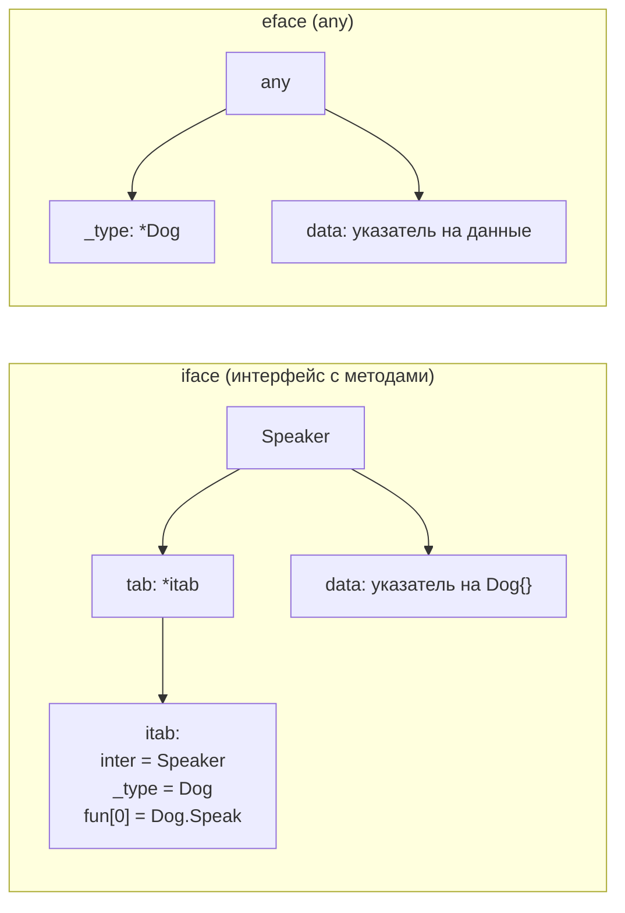

# Интерфейсы и Duck Typing

В C# интерфейсы реализуются **явно**: вы пишете `class FileLogger : ILogger`, и компилятор требует, чтобы класс предоставил все методы интерфейса. Связь «тип реализует интерфейс» объявляется заранее, в момент описания типа, и обычно её определяет автор типа (производитель). В Go всё наоборот: реализация интерфейсов **неявная** и **структурная** — тип удовлетворяет интерфейсу автоматически, просто имея нужный набор методов, без какого-либо `: IInterface`. Это duck typing, проверяемый на этапе компиляции.

В этом файле разберём неявную реализацию, внутреннее устройство интерфейса (пара тип-значение, eface/iface, itab), идиому compile-time проверки, ключевые принципы проектирования интерфейсов в Go и введение в type assertion / type switch.

## Неявная (структурная) реализация

В Go нет ключевого слова, которым тип «заявляет» о реализации интерфейса. Если у типа есть все методы, перечисленные в интерфейсе, — он этому интерфейсу удовлетворяет. Точка.

```go
// Интерфейс: что-то, что умеет Speak() string
type Speaker interface {
    Speak() string
}

type Dog struct{}

// Просто объявляем метод с нужной сигнатурой.
// Нигде не пишем "Dog реализует Speaker".
func (d Dog) Speak() string { return "Woof" }

func main() {
    var s Speaker = Dog{} // компилируется: Dog имеет метод Speak() string
    fmt.Println(s.Speak()) // Woof
}
```

`Dog` нигде не упоминает `Speaker`, и `Speaker` нигде не упоминает `Dog`. Связь устанавливается компилятором по факту совпадения метода. Это и есть «duck typing»: «если оно крякает как утка...» — но, в отличие от динамических языков (Python), проверка статическая, на этапе компиляции. Если метода не хватает или сигнатура не совпадает, код просто не скомпилируется.

**Параллель с .NET:** в C# тип обязан явно объявить `: IFoo`, и интерфейс должен существовать *до* типа — производитель решает, какие контракты он поддерживает. В Go вы можете определить интерфейс, которому удовлетворяют уже существующие типы из чужих пакетов, не трогая их код. Это снимает целый класс проблем: не нужно владеть типом, чтобы заставить его «подойти» под ваш контракт. Самый яркий пример — стандартные `io.Reader`/`io.Writer`: тысячи типов им удовлетворяют, никогда об этом «не зная».

## Внутреннее устройство: интерфейс — это пара (тип, значение)

Чтобы понимать поведение интерфейсов (и ловушку typed nil из [файла 03](./03-nil-and-methods.md), и боксинг из [файла 05](./05-any-boxing-and-generics.md)), нужно знать, как интерфейс устроен в рантайме. **Интерфейсное значение — это пара из двух машинных слов: дескриптор типа и указатель на данные.**

В рантайме Go есть две внутренние формы интерфейсов:

- **`eface`** (empty interface) — представление пустого интерфейса `any` (он же `interface{}`). У него нет методов, поэтому достаточно хранить просто тип и данные. Структурно (упрощённо, из рантайма Go):

```text
eface {
    _type *_type        // дескриптор конкретного типа значения
    data  unsafe.Pointer // указатель на данные значения
}
```

- **`iface`** (non-empty interface) — представление интерфейса с методами (`Speaker`, `io.Reader` и т. д.). Вместо «голого» типа он хранит указатель на **`itab`** (interface table) — таблицу, которая связывает конкретный тип с интерфейсом и содержит указатели на реализации методов:

```text
iface {
    tab  *itab           // таблица: (интерфейс, конкретный тип, методы)
    data unsafe.Pointer  // указатель на данные значения
}

itab {
    inter *interfacetype // описание интерфейса
    _type *_type         // описание конкретного типа
    fun   [...]uintptr   // указатели на методы конкретного типа (vtable)
}
```

`fun` — это, по сути, таблица виртуальных методов (vtable): когда вы вызываете `s.Speak()`, рантайм через `itab` находит адрес конкретной реализации `Dog.Speak` и прыгает туда. `itab` для каждой пары (интерфейс, конкретный тип) вычисляется один раз и кэшируется.



Из этой модели сразу следуют важные факты:

- **Почему typed nil ≠ nil** (см. [файл 03](./03-nil-and-methods.md)): даже если `data == nil`, у интерфейса задан `_type`/`tab` — значит, пара не пуста, и `iface == nil` ложно. Истинный nil-интерфейс — это когда **оба** поля нулевые.
- **Почему упаковка в интерфейс часто аллоцирует** (см. [файл 05](./05-any-boxing-and-generics.md)): `data` — это указатель, поэтому значение должно где-то лежать, чтобы на него можно было указать; компилятору нередко приходится положить его в кучу.
- **Вызов метода через интерфейс — это косвенный вызов** через `itab.fun` (динамическая диспетчеризация), аналог виртуального вызова в C#.

### Связь с method set: pointer vs value receiver

Вспомним из [файла 02](./02-pointers.md) правило method set:

- Method set типа `T` содержит только методы с **value receiver**.
- Method set типа `*T` содержит методы с **обоими** видами получателей.

Отсюда практическое следствие, на котором часто спотыкаются: если метод объявлен с **pointer receiver**, то интерфейсу удовлетворяет только `*T`, но **не** `T`.

```go
type Speaker interface{ Speak() string }

type Cat struct{}

func (c *Cat) Speak() string { return "Meow" } // pointer receiver

func main() {
    var s Speaker
    s = &Cat{} // ✅ *Cat удовлетворяет Speaker
    s = Cat{}  // ❌ ошибка компиляции: Cat НЕ удовлетворяет Speaker
               //    (метод Speak в method set у *Cat, а не у Cat)
    _ = s
}
```

Причина связана с адресуемостью: чтобы вызвать pointer-receiver метод, нужен адрес значения, а значение `Cat{}`, лежащее внутри интерфейса, не адресуемо (оно скрыто за `data`-указателем и копией). Поэтому компилятор не разрешает класть `Cat` (значение) в интерфейс, требующий pointer-receiver метод. Кладите `&Cat{}`.

Ошибка компилятора выглядит примерно так и прямо подсказывает причину:

```text
cannot use Cat{} (value of type Cat) as Speaker value: Cat does not implement Speaker
    (method Speak has pointer receiver)
```

## Идиома compile-time проверки реализации

Поскольку реализация неявная, легко не заметить, что вы случайно сломали соответствие интерфейсу (например, опечатались в сигнатуре метода). Тогда ошибка всплывёт далеко от места объявления — там, где значение пытаются использовать как интерфейс. Чтобы поймать это **сразу** и **в нужном файле**, есть идиома: присваивание nil-указателя нужного типа переменной-пустышке `_` интерфейсного типа.

```go
type Stringer interface{ String() string }

type MyType struct{}

func (m *MyType) String() string { return "MyType" }

// Compile-time проверка: *MyType обязан удовлетворять Stringer.
// Если перестанет — ошибка компиляции ровно здесь, а не где-то у клиента.
var _ Stringer = (*MyType)(nil)
```

`(*MyType)(nil)` — это typed nil типа `*MyType` (никаких аллокаций, значение не используется). Присваивание `var _ Stringer = ...` заставляет компилятор проверить, что `*MyType` реализует `Stringer`. Это документирует намерение («этот тип задуман как реализация Stringer») и защищает от регрессий. Аналог в C# — само объявление `class MyType : IStringer`, которое и так проверяется компилятором; в Go эту явность нужно добавить вручную, когда она важна.

## Принципы проектирования интерфейсов в Go

Идиоматика интерфейсов в Go заметно отличается от .NET, и это требует перенастройки привычек.

### Маленькие интерфейсы

В Go ценятся **маленькие интерфейсы** — в идеале один-два метода. Канонические примеры из стандартной библиотеки:

```go
type Reader interface {
    Read(p []byte) (n int, err error)
}

type Writer interface {
    Write(p []byte) (n int, err error)
}

type Stringer interface {
    String() string
}
```

Чем меньше интерфейс, тем больше типов ему удовлетворяют и тем легче его реализовать и компоновать (`io.ReadWriter` — это просто композиция `Reader` + `Writer`). Поговорка сообщества: **«The bigger the interface, the weaker the abstraction»** (чем больше интерфейс, тем слабее абстракция). Это противоположно частой .NET-практике с «толстыми» сервисными интерфейсами на десяток методов.

### Интерфейс объявляет потребитель, а не реализатор

Ключевой сдвиг мышления. В .NET интерфейс обычно живёт рядом с реализацией или в общей библиотеке контрактов, и его проектирует производитель. В Go идиоматично, чтобы **интерфейс определял тот, кто его потребляет**, в своём пакете, под свои нужды.

```go
// Пакет, который ОБРАБАТЫВАЕТ заказы, объявляет интерфейс под СВОЮ потребность.
package order

// Нам нужно лишь сохранять заказ — объявляем минимальный интерфейс здесь.
type Repository interface {
    Save(o Order) error
}

func Process(repo Repository, o Order) error {
    // ... бизнес-логика ...
    return repo.Save(o)
}
```

Реализация (например, `PostgresRepository` в пакете `storage`) ничего не знает про `order.Repository` — она просто имеет метод `Save(Order) error` и автоматически подходит. Это даёт слабую связанность без общего «слоя контрактов» и без зависимости реализации от абстракции.

### Accept interfaces, return structs

Широко известная рекомендация: **принимайте интерфейсы, возвращайте конкретные типы (структуры).**

```go
// ✅ Принимаем интерфейс (гибкость для вызывающего),
//    возвращаем конкретный тип (полный API, без потери информации).
func NewServer(log Logger) *Server { /* ... */ }
```

- **Принимать интерфейс** на входе — даёт вызывающему свободу подставить любую реализацию (в т. ч. мок в тестах) и не навязывает зависимость от конкретного типа.
- **Возвращать структуру** — отдаёт потребителю полный набор методов и полей конкретного типа; он сам решит, к какому минимальному интерфейсу его при необходимости свести. Если возвращать интерфейс, вы преждевременно урезаете API и провоцируете ловушку typed nil ([файл 03](./03-nil-and-methods.md)).

Есть исключения (например, фабрики, осознанно возвращающие интерфейс ради полиморфизма, или `error`), но как умолчание это правило очень здравое.

**Параллель с .NET:** в типичном ASP.NET-приложении вы регистрируете `services.AddScoped<IRepository, SqlRepository>()` и повсюду принимаете `IRepository`, объявленный заранее производителем. В Go DI ручной (раздел 5), интерфейсы мелкие и объявляются потребителем по месту, а конкретные типы свободно возвращаются из конструкторов-функций. Меньше церемоний, меньше «интерфейсов ради интерфейсов».

## Type assertion и type switch (введение)

Иногда нужно из интерфейса достать конкретный тип обратно или проверить, удовлетворяет ли значение другому интерфейсу. Для этого есть **type assertion** и **type switch**. Здесь — введение; детальнее, в контексте `any` и боксинга, — в [файле 05](./05-any-boxing-and-generics.md).

**Type assertion** извлекает конкретный тип из интерфейса. Безопасная форма «запятая-ok» не паникует:

```go
var s Speaker = Dog{}

// Безопасная форма: ok == false, если тип не совпал (паники нет)
d, ok := s.(Dog)
if ok {
    fmt.Println("это Dog:", d.Speak())
}

// Опасная форма: паникует, если тип не совпал
d2 := s.(Dog) // паника, если s на самом деле не Dog
_ = d2
```

Assertion можно делать и на интерфейс — проверить, реализует ли значение *ещё один* контракт:

```go
// Реализует ли значение io.Closer? (частый приём в стандартной библиотеке)
if c, ok := s.(io.Closer); ok {
    defer c.Close()
}
```

**Type switch** — переключатель по динамическому типу, удобен, когда вариантов несколько:

```go
func describe(v any) string {
    switch x := v.(type) {
    case nil:
        return "nil"
    case int:
        return fmt.Sprintf("int: %d", x)
    case string:
        return fmt.Sprintf("string: %q", x)
    case Speaker:
        return "speaker: " + x.Speak()
    default:
        return fmt.Sprintf("unknown type %T", x)
    }
}
```

Внутри каждого `case` переменная `x` уже имеет соответствующий статический тип. Это аналог pattern matching по типу из C# (`switch (v) { case int i: ... }`), но с поправкой на структурную систему типов Go.

## Краткие выводы

- Реализация интерфейсов в Go **неявная и структурная**: тип удовлетворяет интерфейсу, просто имея нужные методы; никакого `: IInterface`.
- Интерфейс в рантайме — **пара (тип, данные)**: `eface` для `any`, `iface` (+ `itab`/vtable) для интерфейсов с методами. Отсюда typed nil ≠ nil, боксинг и динамическая диспетчеризация.
- Pointer-receiver методы попадают в method set только у `*T`; такой тип кладите в интерфейс как `&T{}`, а не `T{}`.
- Идиома compile-time проверки: `var _ Iface = (*MyType)(nil)`.
- Проектируйте **маленькие интерфейсы**; интерфейс объявляет **потребитель**, а не реализатор; «accept interfaces, return structs».
- Доставайте конкретный тип через **type assertion** (`v, ok := x.(T)`) и **type switch**; детали — в файле 05.

---

[⌂ Главная](../../README.md) · [↑ Раздел](./README.md) · [← Предыдущий: Нулевые значения и методы на nil](./03-nil-and-methods.md) · [→ Следующий: any, Боксинг и Дженерики](./05-any-boxing-and-generics.md)
