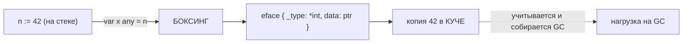

# `any`, Боксинг и Дженерики

В .NET до появления дженериков (`.NET 2.0`) универсальные коллекции хранили `object`, и каждый положенный туда value-тип (`int`, `struct`) подвергался **боксингу** — оборачивался в объект на куче. Дженерики решили это, дав типобезопасность без упаковки. В Go ровно та же история, но случилась она позже: пустой интерфейс `any` (он же `interface{}`) — это «`object` Go» со своим боксингом, а дженерики появились лишь в **Go 1.18** (2022) и убрали значительную часть нужды в `any` + рефлексии.

В этом файле разберём, что значит положить значение в `any`, почему это часто аллокация, как безопасно доставать значения, и детально — дженерики Go: type parameters, constraints, `comparable`, оператор `~`, что они дают и где их честные пределы.

## `any` = псевдоним `interface{}`

Начиная с Go 1.18, `any` — это встроенный **псевдоним** (alias) для `interface{}`. Не новый тип, а буквально другое имя: они полностью взаимозаменяемы. Идиоматично писать `any`.

```go
var x any        // эквивалент var x interface{}
x = 42           // положили int
x = "hello"      // теперь string
x = []int{1, 2}  // теперь слайс
```

`any` — это пустой интерфейс: у него нет методов, поэтому ему удовлетворяет **любой** тип. Это «универсальный контейнер», аналог `object` в C#. И, как `object`, он стирает статическую типизацию: чтобы что-то сделать со значением внутри `any`, нужно достать конкретный тип обратно (type assertion / type switch) или использовать рефлексию.

«Положить значение в `any`» означает создать интерфейсное значение `eface` (см. [файл 04](./04-interfaces-and-duck-typing.md)) — пару `(тип, указатель на данные)`. И вот здесь начинается боксинг.

## Боксинг: упаковка в интерфейс обычно аллоцирует

Вспомним устройство интерфейса из [файла 04](./04-interfaces-and-duck-typing.md): компонента `data` — это **указатель**. Значит, чтобы положить значение в интерфейс, на это значение нужно иметь указатель, то есть оно должно где-то лежать в памяти по стабильному адресу. Для value-типов (`int`, структуры) это обычно означает аллокацию на куче — тот самый **боксинг** (через механизм escape analysis из [файла 01](./01-stack-vs-heap-escape-analysis.md)).

```go
func main() {
    n := 42
    var x any = n // боксинг: int упаковывается в eface, обычно с аллокацией в куче
    _ = x
}
```

Проверим через escape analysis:

```bash
go build -gcflags='-m' main.go
# ./main.go:4:14: n escapes to heap
```

`n escapes to heap` — это и есть упаковка `int` в интерфейс. То же происходит при передаче в `fmt.Println(n)` (сигнатура `...any`) — каждый аргумент боксируется.



> **Нюансы (для точности).** Боксинг не всегда означает новую аллокацию. Рантайм Go держит предвыделенные объекты для маленьких целых (примерно диапазон 0–255), поэтому упаковка маленького `int` может не аллоцировать. Указательные типы (`*T`, слайсы, мапы, каналы, функции) кладутся в интерфейс без дополнительной упаковки данных, потому что они и так представлены указателем/дескриптором. Но как общее правило для value-типов: **упаковка в интерфейс — это аллокация и работа для GC.** В горячем коде массовый боксинг через `any` — классическая причина деградации latency.

**Параллель с .NET:** это в точности боксинг value-типов в `object` из C#: `object o = 42;` создаёт объект в управляемой куче. И решение проблемы в обоих языках одинаковое — дженерики, которые позволяют писать обобщённый код **без** превращения значения в «универсальный контейнер».

## Безопасное извлечение: type assertion и type switch

Чтобы достать конкретный тип из `any`, используют те же механизмы, что и для любых интерфейсов (введение было в [файле 04](./04-interfaces-and-duck-typing.md)).

**Type assertion** в безопасной форме «запятая-ok»:

```go
var x any = "hello"

s, ok := x.(string)
if ok {
    fmt.Println(len(s)) // 5
}

n, ok := x.(int) // ok == false, n == 0 (нулевое значение int), паники нет
fmt.Println(n, ok) // 0 false
```

Без `ok` assertion паникует при несовпадении типа — используйте эту форму только когда уверены в типе:

```go
s := x.(string) // паника, если x не string
```

**Type switch** — когда вариантов несколько:

```go
func stringify(v any) string {
    switch t := v.(type) {
    case nil:
        return "<nil>"
    case string:
        return t
    case int:
        return strconv.Itoa(t)
    case fmt.Stringer:
        return t.String()
    default:
        return fmt.Sprintf("%v", t)
    }
}
```

Извлечение из `any` через assertion — относительно дешёвая операция (сравнение дескрипторов типов), но если вы поймали себя на том, что повсюду гоняете `any` и распаковываете его — это сигнал, что задачу лучше решить **дженериками**.

## Дженерики (Go 1.18+)

Дженерики добавляют **параметры типа** (type parameters) к функциям и типам, позволяя писать обобщённый, типобезопасный код без `any` и без рефлексии.

### Базовый синтаксис

Параметры типа объявляются в **квадратных скобках** `[...]` после имени функции/типа, до обычных параметров. Каждый параметр имеет **ограничение** (constraint) — интерфейс, описывающий, что с этим типом разрешено делать.

```go
// T — параметр типа с ограничением any (подходит любой тип).
func First[T any](xs []T) (T, bool) {
    if len(xs) == 0 {
        var zero T // нулевое значение параметра типа
        return zero, false
    }
    return xs[0], true
}

func main() {
    n, ok := First([]int{1, 2, 3}) // T выведен как int, n == 1
    s, _ := First([]string{"a"})   // T выведен как string
    fmt.Println(n, ok, s)
}
```

Обратите внимание: при вызове тип `T` обычно **выводится** компилятором из аргументов (type inference), указывать `First[int](...)` явно нужно редко. Внутри функции `var zero T` даёт нулевое значение параметра типа — единственный способ получить «дефолт» для неизвестного заранее `T`.

### Constraints: ограничения как интерфейсы

Ограничение — это интерфейс, но в дженериках интерфейсы расширены: они могут содержать не только методы, но и **множества типов** (type sets). Ограничение определяет, какие операции допустимы над значениями параметра типа.

`any` как ограничение разрешает только то, что можно делать с любым значением (присваивание, передача). Чтобы, например, складывать или сравнивать `<`, нужно ограничение, допускающее эти операции.

Стандартное ограничение **`comparable`** описывает типы, которые можно сравнивать через `==` и `!=` (а значит, использовать как ключи мапы):

```go
// Работает для любых сравнимых типов: int, string, указатели, структуры из сравнимых полей...
func Contains[T comparable](xs []T, target T) bool {
    for _, x := range xs {
        if x == target { // == разрешён, т.к. T: comparable
            return true
        }
    }
    return false
}
```

Для упорядочивания (`<`, `>`) есть готовые ограничения в стандартном пакете **`cmp`** (`cmp.Ordered`, добавлен в Go 1.21) и в `golang.org/x/exp/constraints`:

```go
import "cmp"

// cmp.Ordered — любой тип, поддерживающий операторы сравнения < <= > >=.
func Min[T cmp.Ordered](a, b T) T {
    if a < b {
        return a
    }
    return b
}

func main() {
    fmt.Println(Min(3, 7))         // 3
    fmt.Println(Min("foo", "bar")) // "bar"
    fmt.Println(Min(2.5, 1.5))     // 1.5
}
```

### Собственные ограничения и оператор `~` (underlying type)

Можно объявлять свои интерфейсы-ограничения, перечисляя допустимые типы через `|` (объединение, union):

```go
// Ограничение: только эти конкретные числовые типы.
type Number interface {
    int | int64 | float64
}

func Sum[T Number](xs []T) T {
    var total T
    for _, x := range xs {
        total += x // + разрешён, т.к. все типы в Number его поддерживают
    }
    return total
}
```

Но что, если у пользователя есть **именованный тип** на основе `int`, например `type Celsius int`? Он по умолчанию **не** входит в `int | int64 | float64`, потому что это другой тип, хоть и с тем же underlying-типом. Чтобы охватить и такие типы, есть оператор **`~`** (tilde): `~int` означает «любой тип, чей **underlying type** — `int`».

```go
type Number interface {
    ~int | ~int64 | ~float64 // ~ охватывает производные типы
}

type Celsius float64

func main() {
    temps := []Celsius{36.6, 37.0, 38.5}
    fmt.Println(Sum(temps)) // работает: underlying type Celsius — float64
}
```

Без `~` вызов `Sum([]Celsius{...})` не скомпилировался бы. Это типичная и важная деталь: библиотечные ограничения (как в `cmp.Ordered` и `constraints.*`) используют `~`, чтобы работать и с производными типами.

**Type set** — это формальная модель того, как читается ограничение: интерфейс-ограничение задаёт *множество типов*, удовлетворяющих ему (объединение перечисленных типов и/или типов с нужными методами), и операции, разрешённые над параметром, — это операции, допустимые для **всех** типов из этого множества.

### Дженерик-типы и практические примеры (Map/Filter)

Параметры типа есть и у типов (структур):

```go
// Дженерик-стек.
type Stack[T any] struct {
    items []T
}

func (s *Stack[T]) Push(x T) { s.items = append(s.items, x) }

func (s *Stack[T]) Pop() (T, bool) {
    var zero T
    if len(s.items) == 0 {
        return zero, false
    }
    last := s.items[len(s.items)-1]
    s.items = s.items[:len(s.items)-1]
    return last, true
}
```

Классические `Map`/`Filter` (которых так не хватает после LINQ) пишутся как дженерик-функции с двумя параметрами типа:

```go
// Map: преобразует []T в []U.
func Map[T, U any](xs []T, f func(T) U) []U {
    out := make([]U, len(xs))
    for i, x := range xs {
        out[i] = f(x)
    }
    return out
}

// Filter: оставляет элементы, удовлетворяющие предикату.
func Filter[T any](xs []T, keep func(T) bool) []T {
    out := make([]T, 0, len(xs))
    for _, x := range xs {
        if keep(x) {
            out = append(out, x)
        }
    }
    return out
}

func main() {
    nums := []int{1, 2, 3, 4}
    doubled := Map(nums, func(n int) int { return n * 2 }) // [2 4 6 8]
    evens := Filter(nums, func(n int) bool { return n%2 == 0 }) // [2 4]
    fmt.Println(doubled, evens)
}
```

Стандартная библиотека уже включает дженерик-утилиты: пакеты **`slices`** и **`maps`** (Go 1.21+) дают `slices.Sort`, `slices.Contains`, `slices.Index`, `maps.Keys` и др. — используйте их вместо самописных, где можно.

### Что дженерики дают

Главная выгода — **типобезопасность без боксинга и без рефлексии**:

```go
// Было: any + распаковка, боксинг каждого элемента, проверки в рантайме
func ContainsAny(xs []any, target any) bool { /* ... распаковка, == через рефлексию-подобную логику ... */ }

// Стало: дженерик — статическая типизация, без аллокаций на упаковку,
// проверка типов на этапе компиляции
func Contains[T comparable](xs []T, target T) bool { /* ... */ }
```

С `any` вы платили дважды: боксингом при укладке значений и потерей статической проверки (ошибки типа всплывали в рантайме при assertion). Дженерики убирают и то, и другое.

## Ограничения дженериков в Go (честно)

Дженерики Go намеренно проще, чем в C#, и часть привычных приёмов **не переносится 1:1**. Это важно знать, чтобы не биться о стену.

- **Нет дженерик-методов** (методов с собственными параметрами типа). Метод может использовать параметры типа *своего* типа-получателя, но **не может вводить новые**. То есть `func (s *Stack[T]) MapTo[U any](f func(T) U) []U` — **запрещено**. Обобщённые преобразования приходится писать как свободные функции (`Map[T, U]`), а не методы. Причина — сложности реализации и взаимодействия с интерфейсами.

```go
// ❌ так нельзя: метод не может иметь свой параметр типа U
// func (s *Stack[T]) MapTo[U any](f func(T) U) *Stack[U] { ... }

// ✅ только как функция
func MapStack[T, U any](s *Stack[T], f func(T) U) *Stack[U] { /* ... */ }
```

- **Нельзя специализировать по конкретному типу.** В отличие от C++/шаблонов, нет способа написать «особую» версию дженерик-функции для, скажем, `string`. Поведение задаётся только через ограничения; если нужна разная логика для разных типов — это делается обычным type switch внутри, а не специализацией.

- **Ограничения определяют допустимые операции — и только их.** Над параметром типа `T` разрешены ровно те операции, которые гарантированы *всеми* типами из его type set. Нельзя вызвать метод, которого нет в ограничении; нельзя применить `+`, если ограничение не гарантирует, что все типы его поддерживают. Это строже, чем «утиная» подстановка шаблонов C++.

- **Нет ковариантности/контравариантности параметров типа** (как `out T`/`in T` в C#). `Stack[Dog]` не является `Stack[Animal]`, даже если `Dog` удовлетворяет `Animal`.

- **Не всё, что было на дженериках C#, переносится.** Нет ограничений вида `where T : new()` (конструктор), `where T : class`/`struct` в точном смысле C#, нет рефлексивных трюков над параметрами типа на уровне языка. Многое из этого в Go решается иначе — через интерфейсы-ограничения с методами или через передачу фабричных функций.

> Практический совет: дженерики в Go хороши для **контейнеров и алгоритмов над ними** (коллекции, `Map`/`Filter`/`Reduce`, утилиты сравнения). Для полиморфизма поведения по-прежнему чаще уместны **интерфейсы**. Не пытайтесь воспроизвести всю мощь дженериков C#/шаблонов C++ — идиоматичный Go комбинирует скромные дженерики с интерфейсами.

## Параллель с .NET: механизм реализации

Различается не только синтаксис, но и то, **как** дженерики реализованы под капотом, — и это влияет на производительность.

**Дженерики в C# (CLR).** Реализованы с *reification* (овеществлением) в рантайме: информация о параметрах типа сохраняется и доступна через рефлексию (`typeof(T)`, `T` как полноценный тип в рантайме). Для value-типов CLR генерирует **специализированный** машинный код под каждый конкретный аргумент (`List<int>` и `List<double>` получают отдельный код — без боксинга), а для всех ссылочных типов переиспользует **один** разделяемый код (они все представлены указателем). Итог: дженерики C# и типобезопасны, и не боксируют value-типы, и при этом интроспектируемы в рантайме.

**Дженерики в Go.** Реализованы гибридно — между полной мономорфизацией (как шаблоны C++, отдельный код под каждый тип) и словарём (как стирание типов). Механизм называется **GC shape stenciling**: компилятор генерирует одну копию кода на каждую **GC-форму** (*GC shape*) типа-аргумента, а не на каждый конкретный тип. GC-форма — это группировка типов по тому, как они выглядят для сборщика мусора и по расположению указателей: например, все указательные типы (`*T`, и вообще всё, что представлено одним указателем) разделяют одну форму и один экземпляр кода; типы разных размеров/раскладки получают разные экземпляры. Чтобы один экземпляр кода работал для разных конкретных типов одной формы, в него неявно передаётся **словарь** (dictionary) с метаинформацией о типе (нужные дескрипторы типов, itab и т. п.).

Практические следствия этого механизма:

- Дженерики Go **не дают** полной интроспекции параметра типа «бесплатно»: нет аналога `typeof(T)` как языковой возможности (узнать тип в рантайме можно только обычной рефлексией над значением, не над самим параметром).
- В отличие от наивных ожиданий, дженерик-код Go **не всегда** так же быстр, как рукописный мономорфный код: разделение кода по GC-форме плюс обращения к словарю иногда добавляют косвенность. Это компромисс между размером бинарника (полная мономорфизация раздувала бы код) и скоростью.
- Тем не менее главную проблему дженерики решают: они **убирают боксинг** value-типов, неизбежный при `any`, и дают статическую типобезопасность.

| Аспект | C# / .NET | Go |
|---|---|---|
| Универсальный контейнер | `object` | `any` (= `interface{}`) |
| Боксинг value-типов в контейнер | да (`object o = 42`) | да (`var x any = 42`) |
| Год появления дженериков | .NET 2.0 (2005) | Go 1.18 (2022) |
| Реализация | reification + специализация value-типов / общий код для ссылочных | GC shape stenciling (форма + словарь) |
| Интроспекция параметра типа в рантайме | да (`typeof(T)`, рефлексия над `T`) | нет как языковой возможности |
| Дженерик-методы (свои type-параметры у метода) | да | ❌ нет |
| Специализация по конкретному типу | ограниченно (перегрузки/`if typeof`) | ❌ нет |
| Ковариантность/контравариантность (`out`/`in`) | да | ❌ нет |
| Боксинг при использовании дженериков | нет (для value-типов — спец. код) | нет (главная выгода над `any`) |

## Краткие выводы

- `any` — псевдоним `interface{}`, «`object` Go»; ему удовлетворяет любой тип, но статическая типизация при этом стирается.
- **Упаковка value-типа в интерфейс (боксинг) обычно аллоцирует** в куче и нагружает GC; видно через `-gcflags='-m'`. Нюансы: маленькие int и указательные типы могут не аллоцировать.
- Доставайте конкретный тип через **type assertion** (`v, ok := x.(T)`) и **type switch**.
- **Дженерики (Go 1.18+):** параметры типа в `[...]`, ограничения-интерфейсы, `comparable`, `cmp.Ordered`, оператор `~` для underlying-типов, type sets. Используйте `slices`/`maps` из стандартной библиотеки.
- Дженерики дают **типобезопасность без боксинга и без рефлексии**.
- Честные пределы: **нет** дженерик-методов, специализации по типу, ковариантности; ограничения задают ровно допустимые операции. Полиморфизм поведения — чаще через интерфейсы.
- Реализация: C# — reification со спец. кодом для value-типов; Go — **GC shape stenciling** (код на GC-форму + словарь), без интроспекции параметра типа.

---

[⌂ Главная](../../README.md) · [↑ Раздел](./README.md) · [← Предыдущий: Интерфейсы и Duck Typing](./04-interfaces-and-duck-typing.md) · [→ Следующий: GC в Go и сравнение с .NET](./06-gc-and-comparison-with-dotnet.md)
