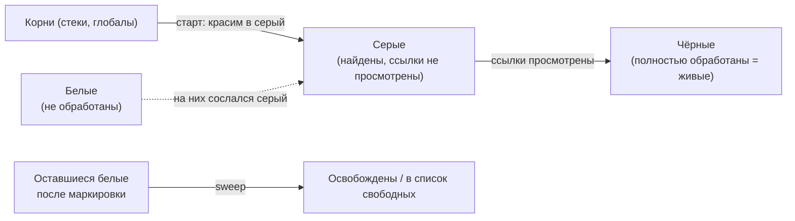
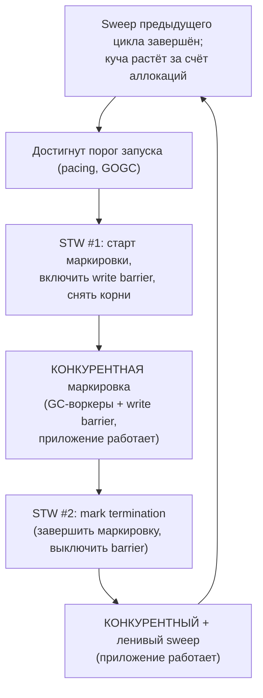

# GC в Go и сравнение с .NET

И .NET, и Go — языки с автоматическим управлением памятью: вы не освобождаете объекты вручную, это делает сборщик мусора. Но устройство этих сборщиков принципиально разное, и для .NET-инженера это один из самых важных пунктов для перенастройки интуиции. GC в .NET — **поколенческий** и **уплотняющий** (compacting), исторически оптимизированный под пропускную способность (throughput). GC в Go — **непоколенческий**, **неперемещающий** и **конкурентный**, исторически спроектированный вокруг одной главной цели: **короткие паузы** (low latency).

Этот файл — сердце раздела. Разберём детально алгоритм GC в Go, его настройку (`GOGC`, `GOMEMLIMIT`), затем устройство GC в .NET, сведём всё в таблицу сравнения и свяжем с предыдущими темами раздела (escape analysis, боксинг, защита от null).

## GC в Go: трёхцветный конкурентный mark-and-sweep

Сборщик мусора Go — это **конкурентный трёхцветный mark-and-sweep** (пометка-и-очистка). Разберём каждое слово.

### Mark-and-sweep (пометка и очистка)

Алгоритм работает в две основные фазы:

- **Mark (пометка)** — начиная от *корней* (roots: стеки горутин, глобальные переменные, регистры), GC обходит граф достижимых объектов и помечает все, до которых можно дойти. Достижимые объекты — живые.
- **Sweep (очистка)** — память, занятая непомеченными (недостижимыми) объектами, возвращается в списки свободных блоков для переиспользования.

В отличие от .NET, после очистки **живые объекты остаются на своих местах** — Go их не перемещает (см. ниже про non-moving).

### Tri-color (трёхцветная абстракция)

Маркировка реализована как трёхцветный алгоритм — формальная модель, позволяющая помечать объекты **конкурентно** с работающим приложением. Каждый объект концептуально окрашен в один из трёх цветов:

- **Белый** — ещё не обработан. В конце маркировки все оставшиеся белыми объекты считаются мусором.
- **Серый** — обнаружен (достижим), но его поля-ссылки ещё не просмотрены. Серые объекты образуют «фронт» обхода (рабочую очередь).
- **Чёрный** — обработан полностью: и сам достижим, и все его исходящие ссылки уже просмотрены (указывают на серые или чёрные объекты).

Процесс: вначале все объекты белые, корни красятся в серый. GC берёт серый объект, перекрашивает его в чёрный, а все белые объекты, на которые он ссылается, — в серые. Так фронт продвигается, пока серых не останется. Тогда всё чёрное — живое, всё белое — мусор.

### Concurrent (конкурентность) и write barrier

Ключевая особенность: маркировка идёт **конкурентно** — то есть параллельно с выполнением вашего кода (mutator), на отдельных воркерах. Приложение почти не останавливается на время сборки.

Но конкурентная маркировка создаёт проблему корректности. Пока GC помечает, приложение продолжает менять указатели. Опасный сценарий: уже почёрневший объект получает ссылку на ещё белый объект, и при этом теряются все серые пути к этому белому. Тогда GC ошибочно сочтёт белый объект мусором и освободит **живую** память — катастрофа.

Чтобы этого не произошло, Go использует **write barrier** (барьер записи) — небольшой фрагмент кода, который компилятор вставляет вокруг операций записи указателей **на время фазы маркировки**. Барьер поддерживает инвариант корректности трёхцветного алгоритма (не давая «спрятать» белый объект за чёрным), помечая затрагиваемые объекты как серые. Write barrier активен только во время маркировки; вне сборки записи указателей идут без него.

### STW-паузы: очень короткие, только на переходах фаз

«Конкурентный» не значит «совсем без остановок». В цикле GC есть короткие фазы **stop-the-world** (STW), когда **все** горутины приостанавливаются. Но они нужны лишь для **переходов между фазами** — в первую очередь чтобы включить/выключить write barrier и снять консистентный снимок корней. Современный сборщик Go имеет два коротких STW на цикл (на старте маркировки и на её завершении — *mark termination*), а сама тяжёлая работа (обход графа, очистка) делается конкурентно.

> **Точность по числам.** Цель команды Go и типичная картина на практике — STW-паузы порядка **долей миллисекунды** (часто десятки-сотни микросекунд). Я намеренно не называю «гарантированное» число: фактические паузы зависят от версии Go, размера кучи, числа горутин, нагрузки и железа. Правильная формулировка такая: Go оптимизирован так, чтобы паузы STW были малы и **слабо росли** с размером кучи, потому что тяжёлая работа вынесена за пределы STW. Если нужно знать паузы вашего сервиса — измеряйте (`runtime/metrics`, трассировка `go tool trace`, `GODEBUG=gctrace=1`).

### Sweep тоже конкурентный и ленивый

Очистка (sweep) выполняется конкурентно и **лениво**: память освобождается порциями, в том числе по мере того, как приложение запрашивает новые аллокации. Это размазывает стоимость очистки во времени, а не делает её одним большим всплеском.

### Non-moving / non-compacting (неперемещающий, неуплотняющий)

Это фундаментальное отличие от .NET. GC Go **не перемещает** живые объекты и **не уплотняет** кучу. После освобождения мусора в куче остаются «дыры», которые переиспользуются под новые аллокации.

Чтобы фрагментация не стала проблемой, аллокатор Go организован как **size-classed** (по классам размеров) — это дизайн в духе TCMalloc. Память нарезается на спаны (`mspan`), каждый обслуживает объекты определённого класса размера; есть пер-P кэши (`mcache`), центральные списки (`mcentral`) и куча (`mheap`). Такая организация делает аллокацию быстрой (часто без блокировок, из локального кэша) и держит внутреннюю фрагментацию под контролем без перемещения объектов.

Последствия non-moving дизайна, важные для вас:

- **Адрес объекта стабилен на протяжении его жизни.** Указатель не «протухает» из-за сборки. Поэтому в Go не нужен pinning (`fixed` из C#) при передаче указателей, например, в C-код через cgo, в обычном случае.
- **Нет фазы уплотнения** — это убирает дорогую работу по переписыванию объектов и обновлению всех ссылок на них (которую делает компактящий GC .NET), что помогает держать паузы короткими.
- **Платой** может быть несколько больший footprint памяти и потенциальная фрагментация по сравнению с уплотняющим сборщиком.

### Поколений нет (non-generational)

В Go **нет поколений**. Каждый цикл GC рассматривает всю кучу, а не «молодое» подмножество. Это сознательное решение: ключевую выгоду поколенческого подхода — дешевизну работы с короткоживущими объектами — Go во многом получает иначе, через **escape analysis** ([файл 01](./01-stack-vs-heap-escape-analysis.md)). Множество короткоживущих значений вообще не попадают в кучу: компилятор оставляет их на стеке, и они «освобождаются» бесплатно при возврате функции, минуя GC целиком. То, что в .NET было бы массой объектов gen0, в Go нередко просто живёт на стеке.

> **Историческая ремарка (честно).** Поколенческий GC обычно очень эффективен по throughput для типичной «гипотезы о поколениях» (большинство объектов умирают молодыми). Команда Go рассматривала поколенческий сборщик, но выбрала непоколенческий конкурентный дизайн ради простоты и предсказуемо коротких пауз; экспериментальные поколенческие подходы (например, на базе ROC) не дали достаточного выигрыша, чтобы оправдать сложность. Это инженерный компромисс, а не утверждение, что один подход «лучше» в вакууме.

## Настройка GC в Go: `GOGC`, `GOMEMLIMIT`, pacing

Go сознательно даёт **мало ручек** — в духе минимализма языка. Основных параметра два.

### `GOGC` — цель роста кучи

`GOGC` (переменная окружения или `runtime/debug.SetGCPercent`) задаёт, **насколько куча может вырасти между сборками**, в процентах к объёму живых данных после прошлой сборки. Значение по умолчанию — **100**.

`GOGC=100` означает: следующий цикл GC нацелен на запуск, когда объём кучи вырастет примерно на 100% относительно живого набора, то есть удвоится. Если после сборки живо 200 МБ, следующая сборка нацелена примерно на 400 МБ.

- **Больше `GOGC`** (например, 200, 400) — реже сборки, меньше CPU на GC, но больше потребление памяти.
- **Меньше `GOGC`** (например, 50) — чаще сборки, меньше пиковая память, но больше CPU на GC.
- `GOGC=off` — полностью отключить GC (только для специальных случаев).

Это прямой рычаг компромисса **CPU ↔ память**, концептуально близкий к настройке агрессивности GC.

### `GOMEMLIMIT` — мягкий лимит памяти (с Go 1.19)

`GOMEMLIMIT` (переменная окружения или `debug.SetMemoryLimit`) задаёт **мягкий (soft) лимит** на общий объём памяти, используемой рантаймом Go. Появился в Go 1.19 и закрыл давнюю боль: при `GOGC`, настроенном только на процент, всплеск живых данных мог раздуть кучу сверх доступной памяти (особенно в контейнерах с лимитами) и привести к OOM-kill.

Работает так: GC старается не дать суммарной памяти превысить лимит, **учащая сборки по мере приближения** к нему. Лимит «мягкий» — рантайм будет очень стараться его соблюсти (вплоть до почти непрерывной работы GC у границы), но не вызовет аварию, если соблюсти физически невозможно (это лучше, чем гарантированный OOM).

Идиоматичная связка для контейнеров: задать `GOMEMLIMIT` чуть ниже cgroup-лимита памяти пода как страховку от OOM, оставив `GOGC` управлять обычным режимом. Можно использовать `GOMEMLIMIT` и с `GOGC=off`, чтобы GC запускался **только** по достижении лимита памяти.

### Pacing — как GC решает, когда запускаться

За тем, *когда именно* стартует цикл, стоит **GC pacer** (регулятор темпа). Его задача — запустить маркировку достаточно рано, чтобы конкурентная сборка успела завершиться **до** того, как куча достигнет цели (заданной `GOGC` и/или `GOMEMLIMIT`), но не настолько рано, чтобы зря жечь CPU. Pacer непрерывно оценивает скорость аллокаций приложения и скорость маркировки и подбирает момент старта. Если приложение аллоцирует быстрее, чем GC помечает, включается **mark assist**: горутина, которая аллоцирует, временно сама помогает маркировке (платит «налог» пропорционально аллокациям) — это не даёт куче «убежать» от сборщика. Тонко настраивать pacer вручную не нужно и нельзя; вы влияете на него через `GOGC`/`GOMEMLIMIT`.

## GC в .NET: поколенческий, уплотняющий

Теперь — другой полюс. Для контраста кратко, но точно опишем устройство сборщика .NET.

### Поколения: gen0 / gen1 / gen2 и LOH

GC в .NET **поколенческий**, основан на гипотезе о поколениях («большинство объектов умирают молодыми»):

- **Gen0** — самые молодые объекты. Сборка gen0 самая частая и самая дешёвая: обходится только небольшое молодое поколение, а не вся куча. Большинство объектов умирает здесь.
- **Gen1** — буфер между молодыми и старыми; объекты, пережившие сборку gen0, продвигаются (promotion) сюда.
- **Gen2** — долгоживущие объекты. Сборка gen2 — это, по сути, полная сборка кучи (full GC), самая дорогая.
- **LOH (Large Object Heap)** — отдельная куча для больших объектов (порог — 85 000 байт). Большие объекты дорого копировать, поэтому LOH исторически **не уплотняется** по умолчанию (хотя уплотнение LOH можно запросить). LOH собирается вместе с gen2.

Дешевизна частых сборок только молодого поколения — главная причина высокого throughput поколенческого GC. Именно эту выгоду Go получает иначе — через escape analysis, оставляя «молодёжь» на стеке.

### Уплотнение (compacting)

GC .NET — **уплотняющий**: после сборки он **перемещает** живые объекты, сдвигая их вместе, чтобы устранить фрагментацию, и обновляет все ссылки на перемещённые объекты. Это даёт плотную кучу и очень дешёвую аллокацию (часто простым сдвигом указателя в непрерывной свободной области), но требует фазы перемещения и поэтому — pinning (`fixed`) для объектов, чьи адреса должны оставаться стабильными (например, при interop с нативным кодом). Это прямая противоположность non-moving подходу Go.

### Workstation vs Server GC и Background GC

.NET предлагает режимы (это и есть основные «ручки», в отличие от минимализма Go):

- **Workstation GC** — для клиентских/десктопных приложений; ориентирован на отзывчивость одного приложения, меньше потоков GC.
- **Server GC** — для серверных нагрузок; создаёт по отдельной куче и потоку GC на (логический) процессор, распараллеливая сборку ради максимального throughput на многоядерных машинах. Стандартный выбор для ASP.NET под нагрузкой.
- **Background GC** — позволяет собирать gen2 (полную кучу) **конкурентно**, в фоновом потоке, пока приложение работает, сильно сокращая длительные STW-паузы полной сборки. Включён в современных .NET по умолчанию для обоих режимов. Сборки gen0/gen1 при этом всё равно содержат короткие STW.

> **Честно про .NET.** Тезис «.NET = большие Stop-The-World паузы» — устаревшее упрощение. Современный .NET с Background Server GC проводит дорогую сборку gen2 преимущественно конкурентно, и его паузы на типичных нагрузках невелики. Различие с Go не в «есть паузы / нет пауз», а в **архитектурном приоритете и компромиссах**: .NET ставит во главу throughput (поколения + уплотнение) и догоняет latency фоновыми режимами; Go изначально строился вокруг низкой latency (конкурентность + отказ от перемещения) и платит за это потенциально большим footprint и CPU на GC.

## Таблица сравнения GC: .NET ↔ Go

| Характеристика | .NET (CLR) | Go |
|---|---|---|
| Поколения | Да: gen0 / gen1 / gen2 (+ LOH) | Нет (непоколенческий) |
| Перемещение / уплотнение | Уплотняющий (перемещает живые объекты); LOH по умолчанию не уплотняется | Неперемещающий, неуплотняющий (size-classed аллокатор) |
| Алгоритм маркировки | Mark-compact (по поколениям) | Трёхцветный конкурентный mark-and-sweep с write barrier |
| Стабильность адреса объекта | Адрес может меняться; нужен pinning (`fixed`) | Адрес стабилен; pinning в обычном случае не нужен |
| Основной приоритет | Throughput (через поколения и уплотнение) | Низкая latency (короткие, слабо растущие паузы) |
| STW-паузы | Короткие для gen0/1; gen2 конкурентно (Background GC); современные паузы невелики | Очень короткие, только на переходах фаз (доли мс); тяжёлая работа конкурентна |
| Дешевизна короткоживущих объектов | Дешёвая сборка gen0 | Многие короткоживущие значения вообще не в куче (escape analysis → стек) |
| Режимы / ручки | Workstation/Server, Background GC, конфиг LOH и др. | Минимум: `GOGC` (по умолч. 100), `GOMEMLIMIT` (1.19+), pacing автоматически |
| Лимит памяти | Через конфигурацию хоста/рантайма | `GOMEMLIMIT` — мягкий лимит |
| Компромисс по памяти | Плотная куча (уплотнение) | Возможен больший footprint / фрагментация |

## Концептуально: разные приоритеты, без маркетинга

Сведём суть честно и без преувеличений:

- **.NET** ставит во главу угла **throughput**. Поколенческий подход делает массовую сборку короткоживущего мусора дешёвой, уплотнение даёт плотную кучу и быструю аллокацию. Исторически это означало более заметные паузы на полной сборке, но современные фоновые конкурентные режимы (Background Server GC) сильно сократили их.
- **Go** изначально оптимизировал **низкую latency** — короткие и предсказуемые паузы, которые слабо растут с размером кучи, потому что почти вся работа вынесена в конкурентные фазы, а перемещения объектов нет вовсе. Платой может быть больший расход CPU на GC при высоком темпе аллокаций и больший footprint памяти (нет уплотнения).

Ни один подход не «лучше» абсолютно — это разные точки в пространстве компромиссов latency / throughput / память / сложность. Для сервисов, где критичны хвостовые задержки (p99 latency), модель Go очень удобна «из коробки». Для нагрузок, где важна максимальная пропускная способность, сильны оба, и решают детали и тюнинг.

## Связь с остальным разделом

GC не существует в вакууме — он тесно сцеплен с темами, которые мы прошли:

- **escape analysis ([файл 01](./01-stack-vs-heap-escape-analysis.md)) — лучший способ разгрузить GC.** Значение, оставленное на стеке, не порождает работы для сборщика вообще. Поскольку у Go нет поколений, именно стек (а не «дешёвый gen0») берёт на себя роль «утилизатора молодёжи». Минимизация escape = минимизация давления на GC. Где в .NET вы выбирали `struct` вместо `class`, в Go вы пишете код так, чтобы значение не убегало.
- **боксинг ([файл 05](./05-any-boxing-and-generics.md)) — частый скрытый источник мусора.** Каждая упаковка value-типа в `any`/интерфейс обычно аллоцирует объект в куче, который потом собирает GC. Дженерики убирают этот мусор, давая обобщённый код без боксинга — это не только про типобезопасность, но и про нагрузку на сборщик.
- **защита от null ([файл 03](./03-nil-and-methods.md)) и нулевые значения** — ортогональны GC по механике, но из той же философии «предсказуемость вместо магии»: детерминированные нулевые значения и явные `nil` вместо скрытого поведения, как детерминированный, тюнингуемый минимальными ручками сборщик вместо «чёрного ящика».

## Краткие выводы

- GC в Go — **конкурентный трёхцветный mark-and-sweep**, **непоколенческий** и **неперемещающий/неуплотняющий**; на время маркировки активен **write barrier**.
- **STW-паузы очень короткие** (доли миллисекунды) и только на переходах фаз; тяжёлая маркировка и очистка идут конкурентно с приложением. Точные числа — измеряйте, не предполагайте.
- Адреса объектов стабильны (нет перемещения) → pinning обычно не нужен; платой может быть фрагментация/footprint.
- Поколений нет осознанно: роль «дешёвой утилизации молодёжи» берёт на себя **escape analysis** (стек).
- Настройка минималистична: **`GOGC`** (по умолч. 100 — цель роста кучи, рычаг CPU↔память) и **`GOMEMLIMIT`** (мягкий лимит памяти, с 1.19); момент старта подбирает **pacer**.
- GC в .NET — **поколенческий** (gen0/1/2 + LOH) и **уплотняющий**, с режимами Workstation/Server и **Background GC**; приоритет — throughput, современные паузы невелики.
- Различие — в **приоритетах и компромиссах** (Go: latency; .NET: throughput), а не в «паузы есть / пауз нет». Без маркетинга: обе модели зрелые.

---

[⌂ Главная](../../README.md) · [↑ Раздел](./README.md) · [← Предыдущий: any, Боксинг и Дженерики](./05-any-boxing-and-generics.md)
