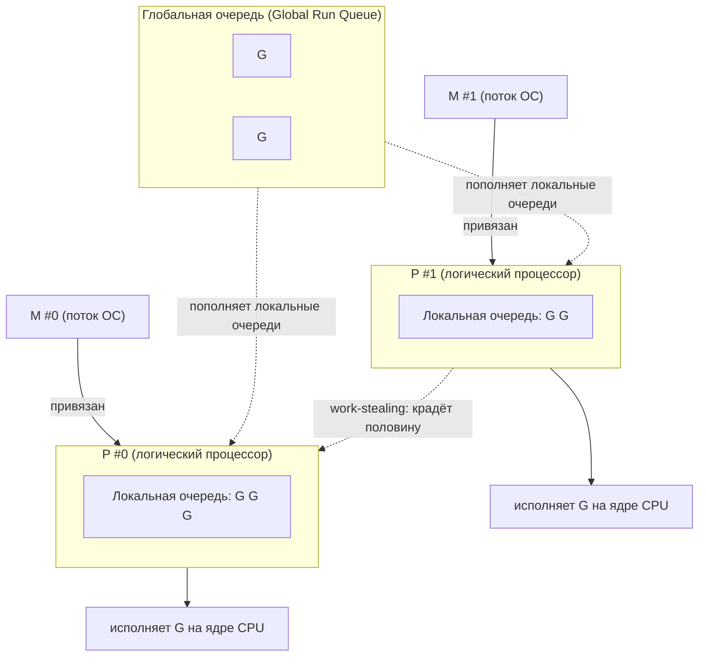
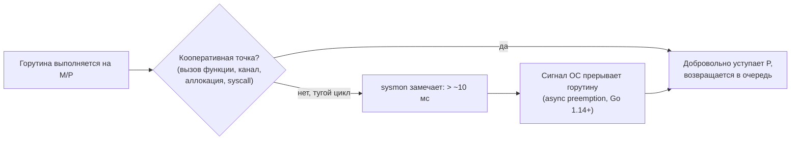
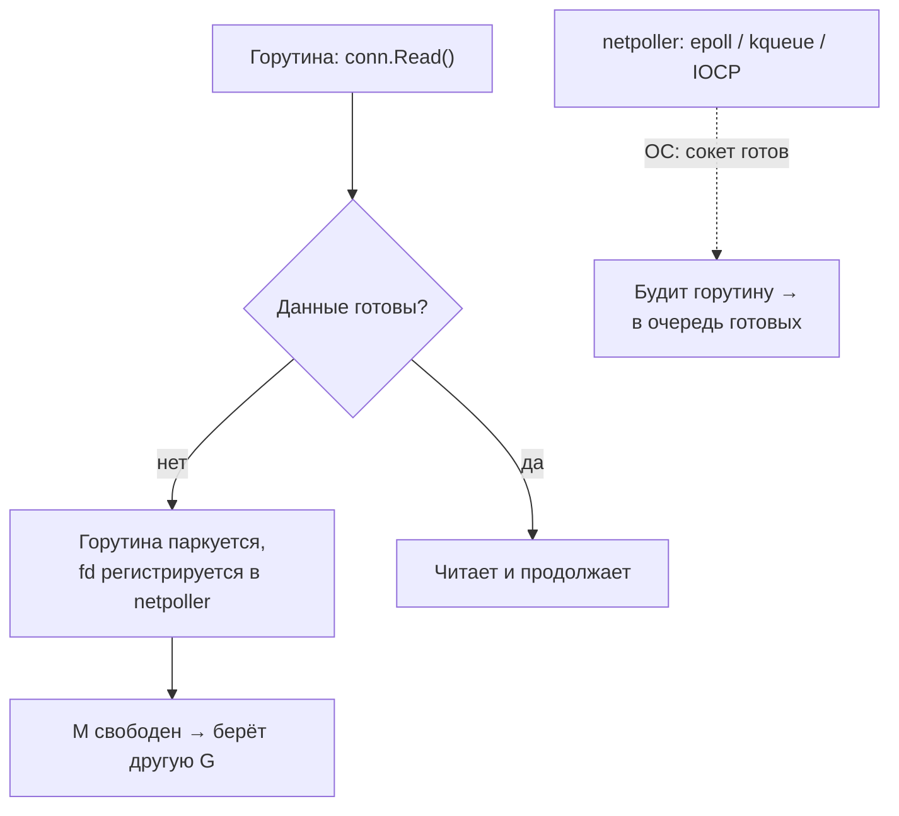

# Горутины и планировщик GMP

Горутина — это единица конкурентного выполнения в Go, настолько дешёвая, что запускать их сотнями тысяч — норма, а не экстрим. В этой главе разберём, что такое горутина на уровне рантайма, почему её стек начинается с ~2 КБ и растёт динамически, и как устроен планировщик **GMP**, который мультиплексирует миллионы горутин на горстку потоков ОС.

Для .NET-разработчика тут есть прямая, но обманчивая аналогия с `ThreadPool` и планировщиком задач TPL. Аналогия полезна, чтобы зацепиться, но в деталях всё иначе: горутина — это **не** `Task` и **не** поток ОС. Это легковесная сущность рантайма со своим стеком, которой управляет встроенный в язык планировщик.

## Что такое горутина

Запуск горутины — это ключевое слово `go` перед вызовом функции:

```go
package main

import (
	"fmt"
	"sync"
)

func main() {
	var wg sync.WaitGroup

	for i := 0; i < 3; i++ {
		wg.Add(1)
		go func(id int) { // запускаем горутину
			defer wg.Done()
			fmt.Println("горутина", id)
		}(i)
	}

	wg.Wait() // ждём завершения всех (про WaitGroup — глава 4)
}
```

Выражение `go f()` означает: «запусти `f` конкурентно и сразу продолжай выполнение текущей горутины». Вызывающий код не блокируется и не получает никакого «хендла» в духе `Task`. Горутина просто начинает жить своей жизнью; если вам нужен её результат или факт завершения — это организуется отдельно (через канал или `WaitGroup`).

**Параллель с .NET:** ближайший по ощущению аналог — `Task.Run(() => f())`, который ставит делегат в очередь `ThreadPool`. Но `Task.Run` возвращает `Task`, за которым можно `await`-ить, отлавливать исключения и забирать результат. `go f()` не возвращает ничего — это «fire and forget» на уровне синтаксиса, и всю координацию вы выстраиваете сами.

### Лёгкость: динамический стек

Главная причина дешевизны горутин — стек.

- **Поток ОС** резервирует под стек фиксированный большой регион (по умолчанию ~1 МБ на Linux/Windows). Создание потока — это системный вызов, регистрация в ядре, выделение памяти; переключение между потоками проходит через ядро и стоит дорого (сохранение/восстановление регистров, смена адресного пространства TLB, попадание в планировщик ОС).
- **Горутина** стартует со стеком ~2 КБ в куче, управляемым рантаймом Go. Когда стека не хватает (например, при глубокой рекурсии), рантайм выделяет блок побольше, **копирует** туда содержимое старого стека и правит указатели — это называется *stack copying* (growable/contiguous stacks). Когда потребность падает, стек может и уменьшиться при сборке мусора.

Итог: 100 000 горутин — это десятки/сотни мегабайт, а не 100 ГБ, как было бы со 100 000 потоков по 1 МБ. И переключение между горутинами происходит **в пользовательском пространстве**, без обращения к ядру, по стоимости близко к вызову функции.

| | Поток ОС | Горутина |
| --- | --- | --- |
| Начальный стек | ~1 МБ (фиксированный) | ~2 КБ (растёт/сжимается) |
| Кто создаёт | Ядро ОС (syscall) | Рантайм Go |
| Стоимость переключения | Высокая (через ядро) | Низкая (user-space) |
| Реалистичный масштаб | тысячи | сотни тысяч / миллионы |
| Идентичность | есть thread id, TLS | анонимна, нет «goroutine id» в API |

> Обратите внимание: у горутины намеренно **нет** публичного идентификатора и нет аналога `[ThreadStatic]` / `ThreadLocal<T>`. Это сознательное архитектурное решение — оно подталкивает передавать состояние явно (через параметры и `context.Context`), а не прятать в thread-local хранилище.

## Модель планировщика GMP

Чтобы мультиплексировать множество горутин на ограниченное число потоков, рантайм Go использует планировщик с тремя видами сущностей — **G**, **M** и **P**. Отсюда название «GMP» (иногда пишут «MPG»).

- **G (Goroutine)** — сама горутина: её стек, указатель инструкций, состояние. Дёшева, их может быть очень много.
- **M (Machine)** — поток ОС. Именно M реально исполняет код на ядре процессора. Их число ограничено (по умолчанию верхний предел — 10 000), и создаются они по мере необходимости.
- **P (Processor)** — логический процессор, *контекст планирования*. P — это право выполнять Go-код. Число P фиксировано и равно `GOMAXPROCS`. Каждый P держит **локальную очередь** готовых к выполнению горутин (runqueue).

Чтобы M мог исполнять Go-код, ему нужно «захватить» свободный P. Связка выглядит так: **M исполняет G, будучи привязанным к P; G берётся из локальной очереди этого P**.



Помимо локальных очередей P есть **глобальная очередь** (global run queue) — для горутин, которым не нашлось места локально, и для балансировки. Планировщик периодически заглядывает в неё, чтобы локальные очереди не «закисали» в изоляции.

**Параллель с .NET:** P с его локальной очередью концептуально похож на воркер `ThreadPool`, у которого есть своя local work-stealing queue, плюс глобальная очередь пула. M ≈ поток-воркер. Но в .NET этим заведует библиотечный планировщик пула/TPL поверх потоков ОС, а в Go планировщик встроен в рантайм языка и работает на уровне горутин, а не делегатов.

### GOMAXPROCS

`GOMAXPROCS` — это число P, то есть **сколько горутин могут исполнять Go-код одновременно** (степень реального параллелизма). Начиная с Go 1.5 значение по умолчанию равно числу логических ядер CPU. Менять его можно через переменную окружения `GOMAXPROCS` или вызовом `runtime.GOMAXPROCS(n)`.

```go
import "runtime"

n := runtime.GOMAXPROCS(0) // 0 — только прочитать текущее значение
fmt.Println("GOMAXPROCS =", n)
```

Важно различать **конкурентность** и **параллелизм**: горутин может быть миллион (конкурентность), но одновременно исполняться их будет не больше `GOMAXPROCS` (параллелизм). Остальные ждут своей очереди.

> Нюанс для контейнеров: исторически рантайм Go определял число ядер по «железу» хоста и не учитывал CPU-лимиты cgroups, из-за чего в Kubernetes `GOMAXPROCS` мог оказаться завышенным. Долгое время это лечили библиотекой `go.uber.org/automaxprocs`. В Go 1.25 рантайм научился учитывать cgroup CPU limit при выборе значения по умолчанию, так что на свежих версиях проблема снимается из коробки.

### Work-stealing

Если у P закончились горутины в локальной очереди, его M не простаивает. Сначала он заглядывает в глобальную очередь и netpoller, а затем **крадёт работу** — забирает примерно половину горутин из локальной очереди случайно выбранного другого P. Это и есть **work-stealing**: дешёвый децентрализованный механизм балансировки нагрузки без единого узкого места.

**Параллель с .NET:** ровно та же идея, что и в work-stealing очередях `ThreadPool`/TPL: простаивающий воркер забирает задачи с «хвоста» очереди занятого. Механика разная, принцип один.

### Вытеснение: кооперативное и асинхронное

Планировщик Go в основном **кооперативный**: горутина уступает процессор в естественных точках — на вызовах функций (где проверяется флаг необходимости переключиться), при операциях с каналами, блокировках, аллокациях, системных вызовах. Это эффективно, но есть проблема: горутина с «тугим» циклом без вызовов функций (например, `for { i++ }`) могла бы держать P бесконечно и **заморить голодом** остальных.

До Go 1.14 это была реальная боль: такой цикл мог застопорить планировщик и, в частности, помешать сборщику мусора (которому нужно остановить все горутины в безопасной точке). Лечилось вручную — вставкой `runtime.Gosched()` для добровольной уступки.

Начиная с **Go 1.14** добавлено **асинхронное вытеснение** (asynchronous preemption). Реализовано через сигналы ОС: специальный системный поток (`sysmon`) замечает, что горутина выполняется слишком долго (порядка 10 мс), и посылает потоку сигнал; обработчик сигнала безопасно прерывает горутину и возвращает управление планировщику. Благодаря этому даже «тугие» циклы без вызовов функций больше не монополизируют процессор, и `runtime.Gosched()` вручную почти никогда не нужен.



**Параллель с .NET:** потоки в Windows/Linux вытесняются **ядром** превентивно по кванту времени — это полноценная превентивная многозадачность на уровне ОС. У Go своя, гибридная модель: кооперативная в общем случае плюс сигнальное вытеснение как страховка от голодания. Это компромисс между эффективностью кооперативного переключения и надёжностью превентивного.

### Блокирующие системные вызовы и handoff

Что произойдёт, если горутина сделает **блокирующий syscall** (например, чтение из файла, который надолго подвиснет)? M, на котором она выполняется, заблокируется в ядре. Если бы P оставался привязан к этому M, то один зависший syscall выводил бы из строя целый логический процессор и все горутины в его очереди.

Поэтому рантайм делает **handoff**: при входе в потенциально долгий блокирующий syscall P **отцепляется** от заблокированного M и передаётся другому M (свободному из кеша или вновь созданному), который продолжает крутить остальные горутины из очереди этого P. Когда syscall завершится, бывший M попытается снова захватить какой-нибудь свободный P; если свободного нет — его горутина уйдёт в глобальную очередь, а сам M отправится «спать» в кеш потоков.

```mermaid
sequenceDiagram
    participant G as Горутина G1
    participant M1 as M #1 (поток)
    participant P as P #0
    participant M2 as M #2 (поток)

    G->>M1: блокирующий syscall (напр. файловый I/O)
    Note over M1: M1 блокируется в ядре
    M1-->>P: handoff: отцепляем P
    P->>M2: P привязывается к свободному M2
    Note over M2,P: M2 крутит остальные G из очереди P
    Note over M1: syscall завершился
    M1->>M1: ищу свободный P; нет — G в глобальную очередь, M1 в кеш
```

Именно поэтому несколько горутин, застрявших в блокирующих syscalls, не «съедают» весь параллелизм программы: число P остаётся постоянным, а M рантайм создаёт по потребности (до лимита).

### Сетевой I/O: netpoller

Для **сетевого** и других «опрашиваемых» видов I/O Go использует не блокирующий syscall на поток, а интегрированный **netpoller** — обёртку над механизмами мультиплексирования ОС: `epoll` (Linux), `kqueue` (BSD/macOS), IOCP (Windows).

Когда горутина делает сетевую операцию (`conn.Read`, `conn.Write`), которая не может завершиться немедленно, происходит следующее:

1. Файловый дескриптор сокета регистрируется в netpoller.
2. Горутина **паркуется** (переходит в состояние ожидания) — но поток (M) **не блокируется**! M освобождается и сразу берёт следующую готовую горутину.
3. Когда ОС сигнализирует, что сокет готов (есть данные / можно писать), netpoller «будит» припаркованную горутину и возвращает её в очередь готовых.



Это ключ к масштабируемости Go-серверов: 100 000 одновременных соединений обслуживаются горсткой потоков ОС, потому что ожидающие горутины ничего не стоят, а netpoller эффективно опрашивает все сокеты разом.

**Параллель с .NET:** это прямой аналог асинхронного I/O в .NET. Когда вы пишете `await stream.ReadAsync(...)`, под капотом тоже работает мультиплексор ОС (IOCP/epoll через `SocketAsyncEngine`), поток пула не блокируется на ожидании, а продолжение (`continuation`) ставится в очередь по готовности. Разница в эргономике: в .NET ради этого приходится «красить» весь стек вызовов в `async`/`await`, а в Go вы пишете обычный, синхронный на вид, `conn.Read(...)` — а рантайм сам превращает его в неблокирующую операцию с парковкой горутины. **Тот же неблокирующий I/O, но без «цвета функций».**

## Итог: чем горутина отличается от Task и потока

- **Горутина — не поток ОС.** Стек начинается с ~2 КБ и растёт копированием; переключение — в user-space; их могут быть сотни тысяч.
- **Горутина — не `Task`.** Она ничего не возвращает и не является awaitable-объектом. Результат и завершение организуются через каналы и `WaitGroup`.
- **Планировщик GMP** мультиплексирует горутины (G) на потоки ОС (M) через логические процессоры (P), число которых = `GOMAXPROCS`. Балансировка — через work-stealing и глобальную очередь.
- **Вытеснение** в основном кооперативное, плюс асинхронное сигнальное (Go 1.14+) против голодания на тугих циклах.
- **Блокирующие syscalls** не выводят из строя P (handoff на другой M), а **сетевой I/O** проходит через netpoller, паркующий горутину без блокировки потока.

В следующей главе — про каналы, основной способ заставить горутины общаться и синхронизироваться.

---

[⌂ Главная](../../README.md) · [↑ Раздел](./README.md) · [→ Следующий: Каналы](./02-channels.md)
