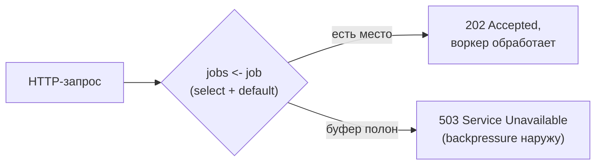
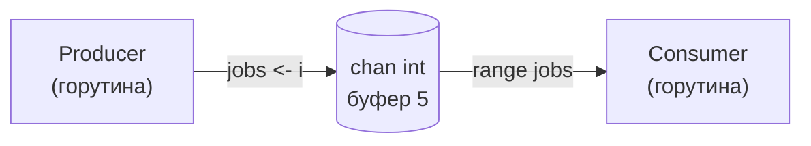
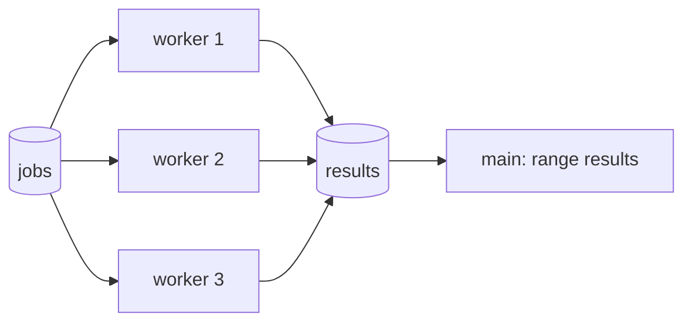
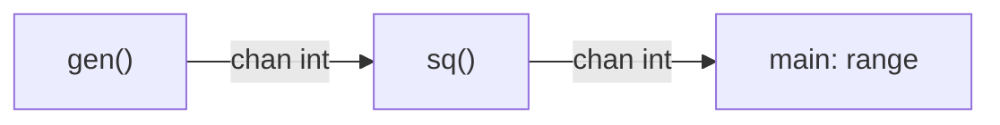

# Каналы

Если горутины — это «кто выполняет работу», то каналы — это «как они общаются». Канал (`chan`) — типизированный конвейер, по которому одна горутина передаёт значения другой. Это и средство передачи данных, и средство синхронизации одновременно: сама операция отправки/приёма координирует горутины во времени. Именно каналы воплощают девиз Go «share memory by communicating» — вместо блокировок вокруг общих данных вы передаёте сами данные.

Для .NET-разработчика прямой аналог — `System.Threading.Channels` (`Channel<T>`), а отчасти и TPL Dataflow. Разница в том, что в Go каналы встроены в язык и работают в связке с оператором `select` (см. следующую главу), а не являются библиотекой.

## Создание канала

Каналы создаются встроенной функцией `make`. Канал — ссылочный тип; нулевое значение неинициализированного канала — `nil`.

```go
ch1 := make(chan int)     // небуферизованный канал значений int
ch2 := make(chan int, 10) // буферизованный канал, ёмкость буфера = 10
var ch3 chan int          // nil-канал (НЕ создан через make!) — см. ниже
```

Тип `chan T` означает «канал значений типа `T`». Передавать можно что угодно: примитивы, структуры, указатели, даже другие каналы (`chan chan T`).

## Небуферизованные и буферизованные каналы

Это фундаментальное различие, определяющее семантику синхронизации.

### Небуферизованный канал — синхронная встреча (rendezvous)

`make(chan T)` без размера создаёт канал **без буфера**. Отправка по нему блокируется до тех пор, пока другая горутина не выполнит приём — и наоборот. Передача данных и точка синхронизации совпадают: отправитель и получатель «встречаются» в один момент времени.

```go
func main() {
	ch := make(chan string) // небуферизованный

	go func() {
		fmt.Println("горутина: готовлюсь отправить")
		ch <- "привет" // блокируется, пока main не примет
		fmt.Println("горутина: отправлено")
	}()

	time.Sleep(time.Second)            // имитируем работу в main
	fmt.Println("main: принимаю")
	msg := <-ch                        // приём разблокирует отправителя
	fmt.Println("main: получено:", msg)
}
```

Гарантия здесь сильная: после `msg := <-ch` вы точно знаете, что отправитель дошёл до своей строки `ch <- ...`. Небуферизованный канал — это передача данных **плюс** синхронизация «рукопожатием».

### Буферизованный канал — асинхронность до заполнения

`make(chan T, n)` создаёт канал с буфером на `n` элементов. Отправка блокируется, только **когда буфер полон**; приём блокируется, только **когда буфер пуст**. Пока есть место — отправитель кладёт значение и идёт дальше, не дожидаясь получателя.

```go
ch := make(chan int, 2)
ch <- 1 // ок, в буфере 1/2 — не блокирует
ch <- 2 // ок, в буфере 2/2 — не блокирует
// ch <- 3 // заблокировалось бы: буфер полон, нет приёмника

fmt.Println(<-ch) // 1
fmt.Println(<-ch) // 2
```

**Параллель с .NET:** небуферизованный канал ≈ `Channel.CreateBounded<T>(1)` с поведением блокировки писателя (приближённо — встреча всё же строже); буферизованный канал ≈ `Channel.CreateBounded<T>(n)`. Неограниченного канала (`Channel.CreateUnbounded`) в Go из коробки нет — и это сознательно: backpressure (обратное давление) через блокировку отправителя помогает не «съесть» всю память неконтролируемым ростом очереди.

| | Небуферизованный `make(chan T)` | Буферизованный `make(chan T, n)` |
| --- | --- | --- |
| Отправка блокируется | пока нет приёмника | пока буфер полон |
| Приём блокируется | пока нет отправителя | пока буфер пуст |
| Семантика | синхронная встреча | асинхронная очередь с лимитом |
| Гарантия после send | получатель уже принял | значение лишь положено в буфер |

## Размер буфера: насколько большой и зачем

Раз `n` в `make(chan T, n)` может быть любым, возникает вопрос: какой выбрать? Короткий ответ: **по умолчанию берите небуферизованный канал (0), а буфер добавляйте только с конкретным обоснованием** — и его размер почти всегда диктуется задачей, а не интуицией «пусть будет побольше».

### Технически: чем ограничен размер

`n` — это `int`, и буфер на `n` элементов **выделяется сразу** при `make` (непрерывный массив под `n` значений типа `T`). То есть `make(chan BigStruct, 1_000_000)` мгновенно займёт `1e6 × sizeof(BigStruct)` байт, даже если канал пуст. Жёсткого предела у языка нет — потолок задаёт доступная память. Практический вывод: большой буфер — это сразу большая аллокация; для крупных `T` буферизуйте указатели и держите `n` скромным.

### Главный принцип: буфер не отменяет backpressure, а откладывает его

Полный буфер всё равно **блокирует** отправителя. Если продюсер устойчиво быстрее консьюмера, любой конечный буфер рано или поздно заполнится — вы лишь отсрочили блокировку. Небуферизованный и маленький буфер передают backpressure (обратное давление) сразу: «притормози». Большой буфер просто поглощает временный всплеск до того, как давление дойдёт до отправителя.

❌ Поэтому большой буфер — **плохое «лечение»** дедлока или медленного консьюмера: это отсрочка, которая маскирует реальную нехватку пропускной способности, пока сервис не упрётся в память (OOM).

### Как выбирать размер: осмысленные значения

- **0 (небуферизованный) — значение по умолчанию.** Даёт синхронизацию и немедленный backpressure. Берите его, пока нет причины для иного.
- **1** — развязать отправителя на один шаг: «результат с буфером 1», чтобы горутина дописала результат и вышла, даже если получатель уже ушёл по таймауту/отмене (см. [Синхронизация и утечки](./04-sync-and-leaks.md)); сигнальные каналы (`done`, «перезагрузи конфиг») в паре с `select`.
- **N = известное число отправок** — когда точно знаете, сколько значений придёт (разослали запрос N бэкендам — собираете N ответов): буфер на N даёт каждой горутине отправить и завершиться, не блокируясь на медленном сборщике.
- **N = лимит конкурентности** — буферизованный канал как счётный семафор (пример ниже): размер = сколько операций разрешено одновременно.
- **Размер реальной очереди** — ограниченная очередь задач, чья ёмкость выбрана как осознанный лимит in-flight работы ради backpressure.

❌ Анти-паттерн: «поставлю 1000 на всякий случай». Это прячет баги, оттягивает backpressure, тратит память — и всё равно заблокируется, когда наполнится. Если буфер реально нужен для сглаживания всплесков — оцените его из **измеренного** размера всплеска, а не угадывайте.

### Реальные примеры в веб-сервисе

**1. Семафор: ограничить конкурентность.** Не более N одновременных обращений к внешнему API/БД из обработчиков. Размер буфера = лимит.

```go
// Глобально: не более 20 одновременных вызовов внешнего API
var sem = make(chan struct{}, 20)

func callBackend(ctx context.Context, req Request) (Response, error) {
    select {
    case sem <- struct{}{}: // заняли слот; блокируемся, если все 20 заняты
    case <-ctx.Done():
        return Response{}, ctx.Err() // не ждём слот вечно — уважаем отмену
    }
    defer func() { <-sem }() // освободили слот
    return doHTTPCall(ctx, req)
}
```

**2. Ограниченная очередь задач + 503 при переполнении.** HTTP-обработчик кладёт задачу в очередь фиксированного размера; воркеры разбирают. Когда очередь полна — отдаём backpressure наружу как `503`, а не копим память.

```go
type Server struct{ jobs chan Job }

func NewServer() *Server {
    s := &Server{jobs: make(chan Job, 256)} // ёмкость = осознанный лимит in-flight
    for i := 0; i < 8; i++ {
        go s.worker() // 8 воркеров разбирают очередь
    }
    return s
}

func (s *Server) handle(w http.ResponseWriter, r *http.Request) {
    select {
    case s.jobs <- Job{ /* ... */ }: // встали в очередь
        w.WriteHeader(http.StatusAccepted) // 202
    default: // буфер полон — не блокируем запрос и не растим память
        http.Error(w, "server busy", http.StatusServiceUnavailable) // 503
    }
}
```



**3. Параллельный сбор ответов (fan-in), буфер = число источников.** Каждая горутина гарантированно отправит результат и завершится, даже если сборщик медленный или запрос отменили — буфер на `len(ids)` исключает утечку.

```go
func fetchAll(ctx context.Context, ids []int) []Result {
    results := make(chan Result, len(ids)) // буфер = число горутин
    var wg sync.WaitGroup
    for _, id := range ids {
        wg.Add(1)
        go func(id int) {
            defer wg.Done()
            results <- fetchOne(ctx, id) // отправит и выйдет, не зависнув
        }(id)
    }
    wg.Wait()
    close(results)

    out := make([]Result, 0, len(ids))
    for r := range results {
        out = append(out, r)
    }
    return out
}
```

**4. Асинхронные события/логи с дропом при переполнении.** Горячий путь запроса не должен ждать отправку аналитики. Буфер сглаживает всплески; при переполнении событие роняем (это осознанная политика), но запрос не тормозим.

```go
type Analytics struct{ events chan Event }

func (a *Analytics) Track(e Event) {
    select {
    case a.events <- e: // быстрый неблокирующий путь
    default:
        droppedEvents.Inc() // буфер полон: роняем событие, НЕ блокируем обработчик
    }
}
// фоновая горутина читает a.events и шлёт во внешнюю систему батчами
```

**Параллель с .NET:** всё это почти дословно — `System.Threading.Channels`. `Channel.CreateBounded<T>(capacity)` ≈ буферизованный канал, а `BoundedChannelFullMode` (`Wait` / `DropOldest` / `DropNewest` / `DropWrite`) — это ровно выбор политики из примеров 2 и 4 (блокировать или ронять). `Channel.CreateUnbounded<T>()` — опасный дефолт без лимита (в Go его и нет из коробки). Семафор из примера 1 — это `SemaphoreSlim(20)`. Общий урок один: осознанно выбирайте ограниченную ёмкость и политику переполнения, а не «безразмерную» очередь.

## Операции с каналами

```go
ch <- v          // отправка значения v в канал
v := <-ch        // приём значения из канала
v, ok := <-ch    // приём со флагом: ok == false, если канал закрыт и пуст
<-ch             // приём с отбрасыванием значения (часто — для синхронизации)
```

Форма `v, ok := <-ch` критична для понимания закрытия канала (см. ниже): `ok == false` сигнализирует, что канал закрыт и в нём не осталось данных.

### Направленные каналы

Канал можно ограничить только на отправку или только на приём — это делается в **типах параметров функций** и служит документацией и защитой от ошибок на этапе компиляции:

```go
// chan<- T — только отправка; <-chan T — только приём
func producer(out chan<- int) {
	for i := 0; i < 5; i++ {
		out <- i
	}
	close(out)
}

func consumer(in <-chan int) {
	for v := range in {
		fmt.Println(v)
	}
}

func main() {
	ch := make(chan int) // двунаправленный
	go producer(ch)      // передаётся как chan<- int
	consumer(ch)         // передаётся как <-chan int
}
```

Двунаправленный `chan T` неявно приводится к `chan<- T` или `<-chan T`. Обратное приведение запрещено. Попытка принять из `chan<- T` или закрыть `<-chan T` — ошибка компиляции. Это дёшево и резко снижает число ошибок «не туда написал».

**Параллель с .NET:** прямой аналог — разделение `Channel<T>` на `channel.Writer` (`ChannelWriter<T>`) и `channel.Reader` (`ChannelReader<T>`). Идея та же — отдать продюсеру только запись, консьюмеру только чтение.

## Закрытие канала: `close`

`close(ch)` сигнализирует «данных больше не будет». Это **не освобождение ресурса** (каналы собирает GC) — это семантический сигнал получателям. Правила строгие, и их нарушение — паника или вечная блокировка.

**Приём из закрытого канала:**
- Если в канале остались данные — они вычитываются как обычно (`ok == true`).
- Когда данные закончились — приём немедленно возвращает **нулевое значение** типа и `ok == false`. Не блокирует.
- Цикл `for v := range ch` корректно завершается, когда канал закрыт и опустошён.

```go
ch := make(chan int, 2)
ch <- 10
ch <- 20
close(ch)

v, ok := <-ch // 10, true
v, ok = <-ch  // 20, true
v, ok = <-ch  // 0, false  ← канал закрыт и пуст
v, ok = <-ch  // 0, false  ← можно читать сколько угодно
```

**Паники (`panic`) — операции, которые так делать нельзя:**

| Операция | Результат |
| --- | --- |
| `ch <- v` в **закрытый** канал | ❌ `panic: send on closed channel` |
| `close(ch)` уже **закрытого** канала | ❌ `panic: close of closed channel` |
| `close(ch)` для **nil**-канала | ❌ `panic: close of nil channel` |

**Поведение nil-каналов (без паники, но коварно):**
- Отправка в `nil`-канал блокируется **навсегда**.
- Приём из `nil`-канала блокируется **навсегда**.

Это не баг, а используемая идиома: в `select` (следующая глава) `nil`-канал позволяет «отключить» ветку. Но если канал оказался `nil` по ошибке (забыли `make`), вы получите тихий вечный блок — частая причина утечки горутины (глава 4).

> **Правило хорошего тона:** закрывать канал должен **отправитель**, а не получатель — ведь только отправитель знает, что данных больше не будет. Получатель закрывать канал не должен: он не может гарантировать, что кто-то ещё не пишет, и рискует вызвать панику у другого отправителя. Если отправителей несколько — координируйте закрытие отдельно (например, через `sync.WaitGroup` + закрытие одной «дирижирующей» горутиной).

**Параллель с .NET:** `close(ch)` ≈ `channel.Writer.Complete()`. Чтение из завершённого канала в .NET тоже корректно опустошает остаток, а `await foreach (var x in reader.ReadAllAsync())` ≈ `for v := range ch`. Существенная разница: в Go повторное закрытие или отправка в закрытый канал — это **паника** (аварийное завершение), тогда как `Complete()` второй раз бросает обычное исключение. В Go к закрытию надо относиться дисциплинированно.

## Паттерны на каналах

Каналы — это конструктор, из которого собираются классические конкурентные паттерны.

### Producer–Consumer

Базовый паттерн: одна горутина производит данные, другая потребляет. `range` по каналу и закрытие отправителем делают его идиоматичным.

```go
func main() {
	jobs := make(chan int, 5)

	// Producer
	go func() {
		for i := 1; i <= 10; i++ {
			jobs <- i
		}
		close(jobs) // важно: закрываем, чтобы range у consumer завершился
	}()

	// Consumer (в main)
	for job := range jobs {
		fmt.Println("обработал job", job)
	}
}
```



### Fan-out / Fan-in

**Fan-out** — несколько горутин-воркеров читают из одного канала задач, распараллеливая обработку. **Fan-in** — результаты от нескольких воркеров сливаются в один канал. Вместе это даёт пул воркеров.

```go
func worker(id int, jobs <-chan int, results chan<- int, wg *sync.WaitGroup) {
	defer wg.Done()
	for j := range jobs { // fan-out: воркеры конкурируют за jobs
		results <- j * j  // fan-in: все пишут в общий results
	}
}

func main() {
	jobs := make(chan int, 100)
	results := make(chan int, 100)
	var wg sync.WaitGroup

	for w := 1; w <= 3; w++ { // 3 воркера
		wg.Add(1)
		go worker(w, jobs, results, &wg)
	}

	for j := 1; j <= 9; j++ {
		jobs <- j
	}
	close(jobs) // воркеры завершат range и выйдут

	// Закрываем results, когда все воркеры закончили
	go func() {
		wg.Wait()
		close(results)
	}()

	for r := range results {
		fmt.Println("результат:", r)
	}
}
```



**Параллель с .NET:** fan-out на воркерах ≈ несколько `Task`-консьюмеров, читающих один `ChannelReader<T>` (или `Parallel.ForEachAsync` поверх него). Обратите внимание на идиому «закрыть `results` в отдельной горутине после `wg.Wait()`» — её прямой аналог в .NET: `Task.WhenAll(workers).ContinueWith(_ => writer.Complete())`.

### Pipeline

Конвейер: выход одной стадии — вход следующей. Каждая стадия — горутина, читающая из входного канала и пишущая в выходной.

```go
// Стадия 1: генерируем числа
func gen(nums ...int) <-chan int {
	out := make(chan int)
	go func() {
		defer close(out)
		for _, n := range nums {
			out <- n
		}
	}()
	return out
}

// Стадия 2: возводим в квадрат
func sq(in <-chan int) <-chan int {
	out := make(chan int)
	go func() {
		defer close(out)
		for n := range in {
			out <- n * n
		}
	}()
	return out
}

func main() {
	for v := range sq(gen(2, 3, 4)) { // gen → sq → main
		fmt.Println(v) // 4, 9, 16
	}
}
```



**Параллель с .NET:** это ровно та задача, под которую создан TPL Dataflow (`TransformBlock<TIn, TOut>` соединяются через `LinkTo`). В Go тот же конвейер собирается из голых каналов и горутин — без отдельной библиотеки, но и без её встроенных возможностей (батчинг, дросселирование), которые при необходимости пишутся руками.

## Deadlock

**Deadlock** — взаимная блокировка: набор горутин ждёт друг друга и ни одна не может продолжить. У Go есть приятная особенность: рантайм **детектирует** ситуацию, когда **все** горутины заблокированы, и аварийно завершает программу с явным сообщением:

```
fatal error: all goroutines are asleep - deadlock!
```

> Важное ограничение детектора: он срабатывает, только когда заблокированы **ВСЕ** горутины разом. Если хотя бы одна продолжает работать (например, бесконечный цикл или вечно ждущий сетевой сервер), а остальные намертво застряли — это всё ещё взаимная блокировка/утечка, но рантайм её **не** поймает. Такие частичные блокировки — это goroutine leaks, и о них отдельный разговор в главе 4.

Типичные причины deadlock ❌:

```go
// ❌ 1. Отправка в небуферизованный канал без приёмника
func main() {
	ch := make(chan int)
	ch <- 1 // блок навсегда: некому принять → fatal error: deadlock
}
```

```go
// ❌ 2. Приём из канала, в который никто не отправит
func main() {
	ch := make(chan int)
	<-ch // блок навсегда → deadlock
}
```

```go
// ❌ 3. range по каналу, который забыли закрыть
func main() {
	ch := make(chan int, 1)
	ch <- 42
	for v := range ch { // получит 42, затем ждёт следующий вечно
		fmt.Println(v)
	} // никто не вызвал close(ch) → deadlock
}
```

```go
// ❌ 4. Операция с nil-каналом
func main() {
	var ch chan int // nil! забыли make
	<-ch            // приём из nil блокирует навсегда → deadlock
}
```

Как избегать:
- ✅ Закрывайте каналы у отправителя, когда поток данных закончен (иначе `range` зависнет).
- ✅ Убедитесь, что у каждой блокирующей отправки есть приёмник (и наоборот).
- ✅ Не забывайте `make` — `nil`-канал блокирует вечно.
- ✅ Для операций, которые могут не завершиться, используйте `select` с `default` или таймаут/`context` (следующая глава) — это превращает потенциальный вечный блок в обрабатываемую ситуацию.

**Параллель с .NET:** встроенного «детектора дедлоков всех потоков» в .NET нет — зависший на `Task.Wait()` или `Channel.Reader.ReadAsync()` код просто молча висит, и диагностировать приходится дампами/профайлером. Сообщение Go `all goroutines are asleep - deadlock!` в типичных учебных случаях экономит часы отладки. Но не обольщайтесь: на реальном сервере, где всегда есть живые горутины, оно не сработает.

## Итог

- Канал — это типизированный конвейер, совмещающий передачу данных и синхронизацию.
- **Небуферизованный** = синхронная встреча (rendezvous); **буферизованный** = асинхронная очередь с лимитом и backpressure.
- `v, ok := <-ch` различает живой канал и закрытый-пустой; `range ch` завершается на закрытии.
- `close` — сигнал «данных больше не будет»; закрывает **отправитель**. Отправка/повторное закрытие/закрытие nil — **паника**. Операции с `nil`-каналом блокируют вечно.
- Из каналов собираются producer-consumer, fan-out/fan-in, pipeline — без отдельных библиотек.
- Рантайм ловит deadlock, **только когда заблокированы все горутины**; частичные блокировки — это утечки (глава 4).

Дальше — `select` и `context`: как ждать сразу несколько каналов, делать таймауты и отменять целые деревья горутин.

---

[⌂ Главная](../../README.md) · [↑ Раздел](./README.md) · [← Предыдущий: Горутины и планировщик](./01-goroutines-and-scheduler.md) · [→ Следующий: select и context](./03-select-and-context.md)
