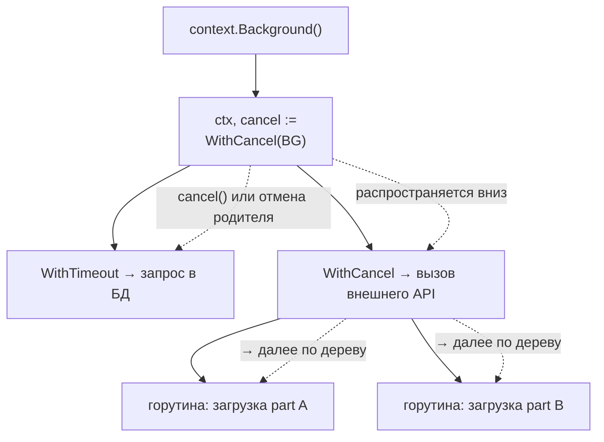

# `select` и `context`

Одного канала мало, когда нужно ждать **несколько** событий сразу: данные из одного из нескольких источников, либо данные либо таймаут, либо данные либо сигнал отмены. За это отвечает оператор `select`. А `context.Context` — это стандартный механизм Go для распространения отмены, дедлайнов и request-scoped значений сквозь весь стек вызовов и дерево горутин.

Для .NET-разработчика связка «`select` + `context`» закрывает то, что в .NET делают `Task.WhenAny` / `Task.Delay` (ожидание одного из нескольких) и `CancellationToken` / `CancellationTokenSource` (отмена и дедлайны). Но `context` устроен богаче: он несёт отмену, дедлайн и значения единым объектом, который проходит через всю цепочку вызовов.

## Оператор `select`

`select` похож на `switch`, но его `case`-ветки — это операции с каналами (отправка или приём). Семантика:

1. Если **готова ровно одна** ветка (канал готов к приёму/отправке) — выполняется она.
2. Если готовы **несколько** — выбирается **случайная** из готовых (это защищает от голодания: ни один канал не имеет приоритета).
3. Если **ни одна не готова** — `select` блокируется до готовности любой ветки.
4. Если есть ветка `default` — она выполняется немедленно, когда ничего не готово (неблокирующий `select`).

```go
select {
case v := <-ch1:
	fmt.Println("из ch1:", v)
case v := <-ch2:
	fmt.Println("из ch2:", v)
case ch3 <- 42:
	fmt.Println("отправили в ch3")
default:
	fmt.Println("ничего не готово прямо сейчас") // неблокирующий вариант
}
```

### Неблокирующие операции через `default`

`default` превращает `select` в попытку «сделать, если можно прямо сейчас»:

```go
// Неблокирующий приём
select {
case v := <-ch:
	fmt.Println("получили:", v)
default:
	fmt.Println("канал пуст, не ждём")
}

// Неблокирующая отправка
select {
case ch <- v:
	fmt.Println("отправили")
default:
	fmt.Println("получатель не готов, пропускаем")
}
```

**Параллель с .NET:** `select` без `default` ≈ `await Task.WhenAny(...)` по нескольким каналам/задачам, но с важным отличием — `WhenAny` при нескольких готовых вернёт первую завершившуюся, а `select` выбирает случайно. `select` с `default` ≈ синхронная проверка `reader.TryRead(out var item)` / `writer.TryWrite(item)` — «сделай, если получится немедленно».

### `select` в цикле

Часто `select` крутится в цикле — горутина обслуживает несколько каналов до сигнала завершения:

```go
func worker(jobs <-chan int, done <-chan struct{}) {
	for {
		select {
		case job := <-jobs:
			fmt.Println("обрабатываю", job)
		case <-done: // сигнал «пора заканчивать»
			fmt.Println("завершаюсь")
			return
		}
	}
}
```

Канал типа `chan struct{}` — идиома Go для сигнала без полезной нагрузки: `struct{}` занимает 0 байт, важен лишь сам факт отправки/закрытия. Закрытие такого канала разом «будит» все горутины, читающие из него (broadcast-сигнал).

## Таймауты

Самый частый сценарий `select` — «операция или таймаут». Канал-таймер приходит из пакета `time`.

### `time.After`

`time.After(d)` возвращает канал, в который через `d` придёт текущее время. В паре с `select` это даёт лимит ожидания:

```go
select {
case res := <-resultCh:
	fmt.Println("успели, результат:", res)
case <-time.After(2 * time.Second):
	fmt.Println("таймаут: операция не уложилась в 2 секунды")
}
```

> **Нюанс `time.After`:** таймер, который он создаёт, до недавнего времени не мог быть собран GC до своего срабатывания. В горячем цикле, где `time.After` вызывался на каждой итерации и почти всегда «проигрывал» другой ветке, это приводило к накоплению таймеров и росту памяти. В **Go 1.23** поведение таймеров улучшили: теперь незадействованные таймеры могут собираться раньше, и эта проблема в основном снята. Тем не менее в долгоживущих циклах исторически рекомендуют явный `time.NewTimer` с `Stop()` и `Reset()` для полного контроля.

### `time.NewTimer` и `time.NewTicker`

Когда таймер нужен переиспользовать или гарантированно остановить, берите `time.NewTimer`:

```go
timer := time.NewTimer(2 * time.Second)
defer timer.Stop() // освобождаем таймер, если вышли раньше

select {
case res := <-resultCh:
	fmt.Println("результат:", res)
case <-timer.C: // поле C — это канал таймера
	fmt.Println("таймаут")
}
```

Для периодических событий есть `time.NewTicker` (тикает каждые `d`, не забывайте `Stop()`).

**Параллель с .NET:** `time.After(d)` ≈ `Task.Delay(d)`, а паттерн `select { case <-resultCh; case <-time.After(d) }` ≈ `await Task.WhenAny(workTask, Task.Delay(d))` с последующей проверкой, кто выиграл. Но дальше начинается разница: в Go таймаут обычно выражают не голым `time.After`, а через `context.WithTimeout` (см. ниже) — потому что таймаут как часть `context` автоматически прокидывается во все вложенные вызовы.

## `context.Context`

`context.Context` — это интерфейс из стандартной библиотеки для трёх связанных задач:

1. **Отмена** — сообщить дереву горутин «прекращайте работу».
2. **Дедлайны и таймауты** — автоматическая отмена по времени.
3. **Значения** (request-scoped) — пробросить небольшие данные, привязанные к запросу (например, trace id, user id из middleware).

Интерфейс компактен:

```go
type Context interface {
	Done() <-chan struct{}              // канал, который закрывается при отмене
	Err() error                          // причина отмены (после закрытия Done)
	Deadline() (deadline time.Time, ok bool)
	Value(key any) any                   // request-scoped значение
}
```

Ключевое — `Done()`: это канал, который **закрывается** при отмене контекста. Закрытый канал, как мы знаем из главы 2, мгновенно «отдаёт» приём всем читателям — поэтому `<-ctx.Done()` в `select` это и есть точка реакции на отмену. После закрытия `Err()` вернёт причину: `context.Canceled` (отменили вручную) или `context.DeadlineExceeded` (истёк дедлайн/таймаут).

### Корневые контексты и конструкторы

Дерево контекстов растёт от корня. Корни:

- `context.Background()` — пустой корневой контекст (для `main`, инициализации, верхнего уровня сервера).
- `context.TODO()` — заглушка «контекст пока не продуман»; семантически = Background, но маркирует место для будущей доработки.

Производные контексты создаются обёртыванием родителя:

```go
// Отмена вручную
ctx, cancel := context.WithCancel(parent)

// Отмена по таймауту (относительно «сейчас»)
ctx, cancel := context.WithTimeout(parent, 5*time.Second)

// Отмена по абсолютному дедлайну
ctx, cancel := context.WithDeadline(parent, time.Now().Add(5*time.Second))

// Значение (request-scoped)
ctx := context.WithValue(parent, key, value) // без cancel
```

Каждый из `WithCancel`/`WithTimeout`/`WithDeadline` возвращает **функцию `cancel`**. Её **обязательно** нужно вызвать — обычно через `defer cancel()` — чтобы освободить связанные ресурсы (таймер, удаление узла из дерева отмены). Невызванный `cancel` от `WithTimeout`/`WithDeadline` — это утечка до момента срабатывания дедлайна; `go vet` об этом предупреждает.

### Пример: отмена по таймауту

```go
func fetchData(ctx context.Context) (string, error) {
	result := make(chan string, 1)

	go func() {
		// имитация долгой работы
		time.Sleep(3 * time.Second)
		result <- "данные"
	}()

	select {
	case res := <-result:
		return res, nil
	case <-ctx.Done(): // контекст отменён или истёк дедлайн
		return "", ctx.Err() // context.DeadlineExceeded или context.Canceled
	}
}

func main() {
	ctx, cancel := context.WithTimeout(context.Background(), 2*time.Second)
	defer cancel() // обязательно, даже если таймаут сработает сам

	data, err := fetchData(ctx)
	if err != nil {
		fmt.Println("ошибка:", err) // ошибка: context deadline exceeded
		return
	}
	fmt.Println(data)
}
```

Обратите внимание: канал `result` сделан буферизованным (`make(chan string, 1)`). Это важно — иначе при срабатывании таймаута `fetchData` вернётся, никто не прочитает `result`, и внутренняя горутина навсегда зависнет на `result <- "данные"` (goroutine leak — глава 4). Буфер на 1 позволяет ей отправить значение «в никуда» и спокойно завершиться.

### Идиомы использования `context`

Эти правила — устоявшийся канон Go, нарушение которого считается «code smell»:

- ✅ **`ctx` — первый параметр функции**, именованный `ctx`: `func Do(ctx context.Context, arg T) error`. Это конвенция всей экосистемы.
- ❌ **Не храните `Context` в полях структуры.** Контекст привязан к конкретному вызову/запросу, а не к времени жизни объекта. Передавайте его явным аргументом метода. (Редкие исключения существуют, но по умолчанию — нет.)
- ✅ **Всегда вызывайте `cancel`** — `defer cancel()` сразу после создания контекста с отменой. Это не опционально.
- ✅ **Прокидывайте `ctx` по всему стеку вызовов** — от обработчика HTTP-запроса до запроса в БД. Тогда отмена/таймаут на верхнем уровне автоматически дойдёт до самой нижней операции (`database/sql`, `net/http` и др. умеют принимать `ctx`).
- ❌ **Не передавайте `nil` как контекст.** Если не знаете, какой передать, — `context.TODO()`.
- ❌ **Не кладите в `context.Value` бизнес-параметры функции.** Value — только для request-scoped «сквозных» данных (trace id, аутентификация, локаль). Обязательные аргументы передавайте явными параметрами: значения в контексте не типобезопасны и невидимы в сигнатуре.

> Про ключи для `WithValue`: чтобы избежать коллизий, ключ должен быть **значением собственного неэкспортируемого типа**, а не строкой:
> ```go
> type ctxKey int
> const userIDKey ctxKey = 0
> ctx = context.WithValue(ctx, userIDKey, 42)
> id, ok := ctx.Value(userIDKey).(int)
> ```

## Отмена дерева горутин

Главная сила `context` — **распространение отмены вниз по дереву**. Когда вы создаёте производный контекст, он становится «ребёнком» родителя. Отмена родителя автоматически отменяет **всех** потомков (рекурсивно). Отмена ребёнка на родителя не влияет.

```go
func worker(ctx context.Context, id int) {
	for {
		select {
		case <-ctx.Done(): // реагируем на отмену
			fmt.Printf("worker %d: останавливаюсь (%v)\n", id, ctx.Err())
			return
		default:
			// делаем порцию работы
			time.Sleep(200 * time.Millisecond)
		}
	}
}

func main() {
	ctx, cancel := context.WithCancel(context.Background())

	for i := 1; i <= 3; i++ {
		go worker(ctx, i) // все три разделяют один ctx
	}

	time.Sleep(time.Second)
	cancel() // одним вызовом отменяем ВСЕ три горутины
	time.Sleep(500 * time.Millisecond) // даём им завершиться
}
```

Дерево контекстов с распространением отмены:



Закрытие `Done()`-канала родителя каскадно закрывает `Done()` у всех детей — поэтому каждая горутина, которая «слушает» свой `ctx.Done()` в `select`, узнаёт об отмене практически мгновенно. Это позволяет одним `cancel()` свернуть целое поддерево конкурентной работы — отменить все ещё не завершившиеся подзапросы, как только стал не нужен их общий результат.

**Параллель с .NET:** `context.WithCancel` ≈ `CancellationTokenSource` + его `Token`; `cancel()` ≈ `cts.Cancel()`; `ctx.Done()` ≈ `token.WaitHandle` / регистрация `token.Register(...)`; проверка `ctx.Err()` ≈ `token.IsCancellationRequested` / `token.ThrowIfCancellationRequested()`. Распространение отмены вниз по дереву ≈ **linked tokens** (`CancellationTokenSource.CreateLinkedTokenSource(parent)`): отмена родителя гасит связанные. `WithTimeout`/`WithDeadline` ≈ `new CancellationTokenSource(TimeSpan)` или `cts.CancelAfter(...)`.

Принципиальные отличия:

- **Context несёт больше**, чем `CancellationToken`: отмену, дедлайн **и** значения единым объектом, который вы и так прокидываете везде первым аргументом. В .NET для значений отдельно использовали бы `AsyncLocal<T>` / `SynchronizationContext`, а дедлайн жил бы в самом `CancellationTokenSource`.
- В Go реакция на отмену **всегда явная** — вы обязаны сами проверять `ctx.Done()` в `select`. Нет встроенного «магического» прерывания горутины извне. В .NET кооперативная отмена тоже требует проверок `token`, но многие библиотечные `await`-методы кидают `OperationCanceledException` за вас.

## Итог

- `select` мультиплексирует операции с каналами: одна готова — она; несколько — случайная; ни одной — блок (или `default` для неблокирующего варианта).
- Таймауты: `select` + `time.After` для простых случаев, `time.NewTimer`/`Stop` для контроля; но идиоматично таймаут выражают через `context.WithTimeout`.
- `context.Context` несёт отмену, дедлайны и request-scoped значения; `ctx.Done()` — канал-сигнал, `ctx.Err()` — причина.
- Канон: `ctx` — первый параметр, не хранить в структурах, всегда `defer cancel()`, прокидывать сквозь весь стек, в `Value` — только сквозные данные.
- Отмена родителя каскадно отменяет всё поддерево горутин — один `cancel()` сворачивает целую ветку работы.

Дальше — про синхронизацию без каналов (`sync.Mutex` и друзья) и про goroutine leaks, которых `context` помогает избежать.

---

[⌂ Главная](../../README.md) · [↑ Раздел](./README.md) · [← Предыдущий: Каналы](./02-channels.md) · [→ Следующий: Синхронизация и утечки](./04-sync-and-leaks.md)
