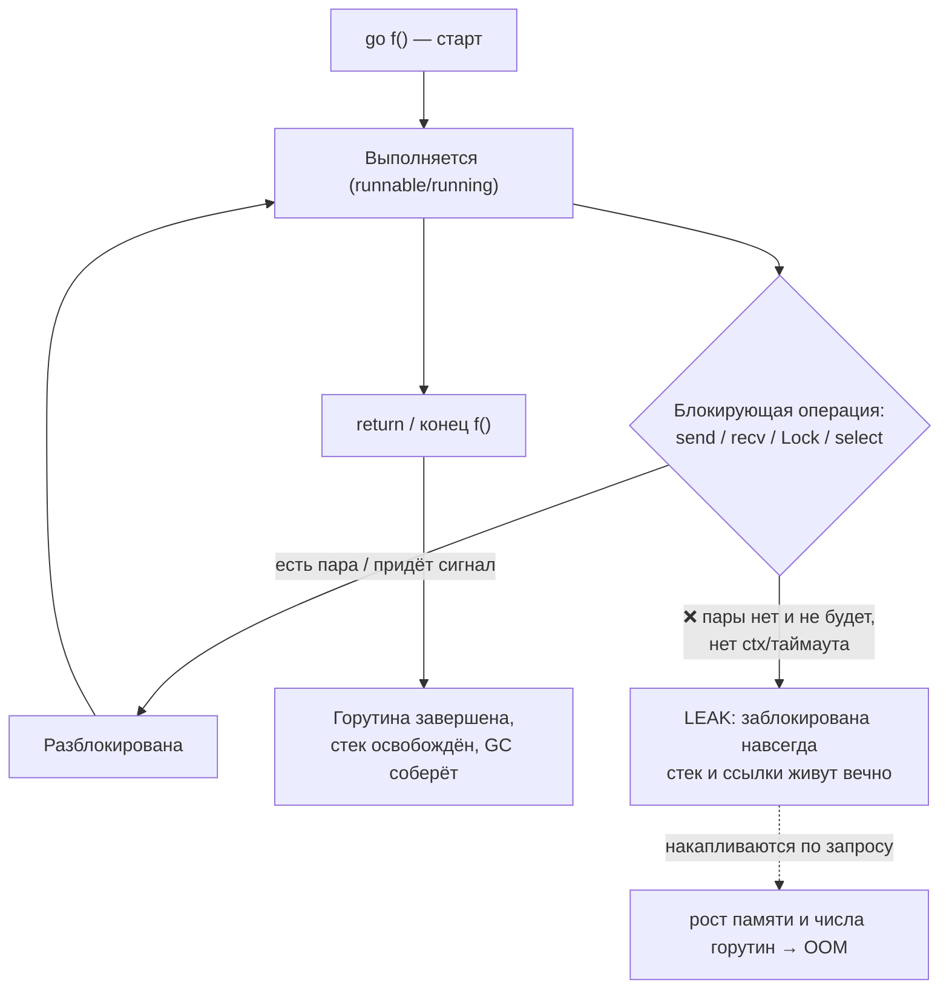

# Синхронизация и утечки

Девиз «share memory by communicating» не означает «никогда не используй блокировки». Бывают сценарии, где канал — это лишнее усложнение, а старая добрая защита общей памяти мьютексом проще, быстрее и понятнее: счётчик, кеш в памяти, конфиг, разделяемая мапа. Для этого в Go есть пакет `sync` и `sync/atomic`. В этой главе разберём эти примитивы, модель памяти Go (happens-before), детектор гонок и главную «утечку» конкурентного Go — **goroutine leaks**.

Для .NET-разработчика тут много знакомого: `sync.Mutex` ≈ `lock`, `sync.RWMutex` ≈ `ReaderWriterLockSlim`, `sync.WaitGroup` ≈ `Task.WaitAll`, `sync/atomic` ≈ `Interlocked`. Но есть одна ловушка, на которой обжигаются почти все пришедшие из C#: **мьютекс в Go не реентерабельный**. Об этом — первым делом.

## Когда каналы не нужны: защита общей памяти

Эвристика сообщества: используйте каналы для **передачи владения данными** и оркестрации потока выполнения; используйте мьютексы для **защиты состояния**, которое по своей природе разделяемое (кеши, счётчики, реестры). Если вы заметили, что гоняете данные по каналу только чтобы «защитить» одну переменную, — вероятно, мьютекс будет проще.

### `sync.Mutex`

Взаимное исключение: только одна горутина владеет блокировкой в каждый момент.

```go
type Counter struct {
	mu    sync.Mutex
	value int
}

func (c *Counter) Inc() {
	c.mu.Lock()
	defer c.mu.Unlock() // освобождаем даже при панике
	c.value++
}

func (c *Counter) Value() int {
	c.mu.Lock()
	defer c.mu.Unlock()
	return c.value
}
```

Идиомы:
- Нулевое значение `sync.Mutex` уже готово к работе — `var mu sync.Mutex` без инициализации.
- `defer mu.Unlock()` сразу после `Lock()` — гарантирует освобождение при любом выходе, включая `panic`.
- ❌ **Не копируйте мьютекс** (и структуры, его содержащие) после первого использования — копия не разделяет состояние блокировки. Поэтому методы определяют на указателе (`*Counter`), а не на значении. `go vet` ловит копирование.

> ### ❌ Mutex НЕ реентерабельный — ключевое отличие от `lock`!
>
> В C# `lock` (а под капотом `Monitor`) **реентерабельный** (recursive): один поток может войти в один и тот же `lock` повторно, не заблокировав сам себя — учитывается счётчик вхождений.
>
> ```csharp
> private readonly object _gate = new();
> void Outer() { lock (_gate) { Inner(); } }     // C#: ОК
> void Inner() { lock (_gate) { /* работаем */ } } // тот же поток входит снова — норма
> ```
>
> В Go `sync.Mutex` **нереентерабельный**. Повторный `Lock()` той же горутиной — это **самодедлок**: горутина навсегда заблокируется в ожидании самой себя.
>
> ```go
> // ❌ САМОДЕДЛОК
> func (c *Counter) Outer() {
> 	c.mu.Lock()
> 	defer c.mu.Unlock()
> 	c.Inner() // Inner снова делает c.mu.Lock() → блок навсегда
> }
> func (c *Counter) Inner() {
> 	c.mu.Lock() // та же горутина уже держит mu → deadlock
> 	defer c.mu.Unlock()
> 	// ...
> }
> ```
>
> Это **сознательное** решение авторов Go: реентерабельность маскирует ошибки проектирования (раз вы повторно берёте блокировку — вероятно, инвариант под ней уже нарушен). Правильный паттерн — разделить публичный метод (берёт блокировку) и приватный метод-«сердце» (предполагает, что блокировка уже взята):
>
> ```go
> // ✅ Публичный метод блокирует, приватный — нет
> func (c *Counter) Outer() {
> 	c.mu.Lock()
> 	defer c.mu.Unlock()
> 	c.innerLocked() // вызываем версию «под уже взятой блокировкой»
> }
> func (c *Counter) innerLocked() { // соглашение: вызывать с удержанным mu
> 	// ...без Lock()...
> }
> ```

### `sync.RWMutex`

Разделяемая блокировка чтения / эксклюзивная блокировка записи. Много читателей одновременно **или** один писатель. Выгодна при паттерне «часто читаем, редко пишем».

```go
type Cache struct {
	mu   sync.RWMutex
	data map[string]string
}

func (c *Cache) Get(k string) (string, bool) {
	c.mu.RLock()         // блокировка на чтение — параллельна с другими RLock
	defer c.mu.RUnlock()
	v, ok := c.data[k]
	return v, ok
}

func (c *Cache) Set(k, v string) {
	c.mu.Lock()          // эксклюзивная блокировка на запись
	defer c.mu.Unlock()
	c.data[k] = v
}
```

`RWMutex` тоже нереентерабельный, и у него есть тонкости (например, не стоит апгрейдить RLock до Lock). При низкой конкуренции обычный `Mutex` часто быстрее из-за меньших накладных расходов — `RWMutex` оправдан при действительно интенсивном чтении.

**Параллель с .NET:** `sync.RWMutex` ≈ `ReaderWriterLockSlim` (`EnterReadLock`/`EnterWriteLock`). `ReaderWriterLockSlim` поддерживает upgradeable-режим, у `RWMutex` его нет.

### `sync.WaitGroup`

Счётчик для ожидания завершения группы горутин. `Add(n)` увеличивает счётчик, `Done()` уменьшает на 1 (обычно через `defer`), `Wait()` блокируется, пока счётчик не станет 0.

```go
func main() {
	var wg sync.WaitGroup
	urls := []string{"a", "b", "c"}

	for _, url := range urls {
		wg.Add(1) // ВАЖНО: Add ДО запуска горутины
		go func(u string) {
			defer wg.Done()
			fmt.Println("обрабатываю", u)
		}(url)
	}

	wg.Wait() // ждём, пока все три вызовут Done()
	fmt.Println("все горутины завершились")
}
```

Правила:
- ✅ `Add` вызывайте **до** `go`, а не внутри горутины — иначе `Wait()` может проскочить раньше, чем горутина успеет инкрементировать счётчик (гонка).
- ✅ `defer wg.Done()` первым делом в горутине.
- ❌ Не копируйте `WaitGroup` — передавайте указателем (`*sync.WaitGroup`).

> С Go 1.25 появился удобный метод `wg.Go(func(){...})`, который сам делает `Add(1)` и `Done()`. Но классический паттерн `Add`/`defer Done` остаётся самым распространённым, и его важно знать.

**Параллель с .NET:** `wg.Wait()` ≈ `Task.WaitAll(tasks)` / `await Task.WhenAll(tasks)`. Концептуальная разница: `WhenAll` агрегирует **результаты и исключения** задач, а `WaitGroup` просто считает завершения — у горутин нет «результата», и паники она не собирает (паника в горутине без `recover` роняет весь процесс).

### `sync.Once`

Гарантирует, что переданная функция выполнится **ровно один раз**, сколько бы горутин её ни вызвали. Классика для ленивой инициализации синглтона.

```go
var (
	once     sync.Once
	instance *Service
)

func GetService() *Service {
	once.Do(func() {
		instance = &Service{ /* дорогая инициализация */ }
	})
	return instance // гарантированно инициализирован к этому моменту
}
```

`once.Do` блокирует конкурентных вызывающих, пока первый не завершит инициализацию, — все получат полностью готовый объект.

**Параллель с .NET:** `sync.Once` ≈ `Lazy<T>` (с `LazyThreadSafetyMode.ExecutionAndPublication`) или `LazyInitializer.EnsureInitialized`.

### `sync/atomic`

Атомарные операции над числами и указателями без блокировок — для счётчиков и флагов в горячем пути. С Go 1.19 есть типобезопасные обёртки `atomic.Int64`, `atomic.Bool`, `atomic.Pointer[T]` и др.

```go
import "sync/atomic"

var ops atomic.Int64

func worker() {
	for i := 0; i < 1000; i++ {
		ops.Add(1) // атомарный инкремент, без мьютекса
	}
}

// чтение: ops.Load(), запись: ops.Store(x), CAS: ops.CompareAndSwap(old, new)
```

Атомики быстрее мьютекса для одиночных значений, но защищают **только саму операцию**, а не группу инвариантов. Если нужно согласованно менять несколько полей — берите `Mutex`.

**Параллель с .NET:** `sync/atomic` ≈ `System.Threading.Interlocked` (`Interlocked.Increment`, `Interlocked.CompareExchange`) и `Volatile.Read/Write`. Типы `atomic.Int64` и т.п. ближе к `Interlocked`-обёрткам, удобно инкапсулирующим значение.

### `sync.Map` (для специфичных сценариев)

`sync.Map` — потокобезопасная мапа, **но это не замена** обычной `map` + `Mutex` по умолчанию. Она оптимизирована под два узких сценария: (1) ключ пишется один раз и потом много читается; (2) горутины работают с непересекающимися наборами ключей. В общем случае `map` под `RWMutex` проще и часто быстрее. Используйте `sync.Map` только когда профилирование показало, что она реально выигрывает.

**Параллель с .NET:** концептуально похожа на `ConcurrentDictionary<K,V>`, но `ConcurrentDictionary` — универсальный потокобезопасный словарь на все случаи, тогда как `sync.Map` намеренно нишевая. Не переносите привычку «всегда брать ConcurrentDictionary» на Go.

## Модель памяти Go и happens-before

Без синхронизации компилятор и процессор вправе переупорядочивать чтения/записи памяти, а изменения, сделанные одной горутиной, могут быть **не видны** другой. Модель памяти Go определяет, когда видимость гарантирована, через отношение **happens-before**: если событие A happens-before события B, то эффекты A гарантированно видны в B.

Что устанавливает happens-before (кратко и корректно):
- **Отправка в канал** happens-before завершения соответствующего **приёма** из этого канала.
- **Закрытие канала** happens-before приёма, который получил нулевое значение из-за закрытия.
- Для небуферизованного канала **приём** happens-before завершения соответствующей **отправки**.
- `Unlock` мьютекса happens-before последующего `Lock` того же мьютекса.
- Завершение `once.Do(f)` happens-before возврата любого другого `once.Do`.
- `wg.Wait()` возвращается после всех соответствующих `wg.Done()`.

Практический вывод — **нельзя полагаться на гонки**:

```go
// ❌ ГОНКА: нет happens-before между записью в done и его чтением
var done bool
var result int

func main() {
	go func() {
		result = 42
		done = true // запись без синхронизации
	}()
	for !done { // чтение без синхронизации — может крутиться вечно или увидеть result=0
	}
	fmt.Println(result) // поведение НЕ определено
}
```

Здесь нет ни канала, ни мьютекса, ни атомика — значит нет happens-before, и нет гарантии, что `main` вообще увидит `done = true` или корректное `result`. Это **data race**, и его поведение не определено. Чините синхронизацией — каналом, мьютексом или `atomic.Bool`.

**Параллель с .NET:** у .NET тоже есть формальная memory model с понятиями volatile-семантики, барьеров и happens-before-подобных гарантий от `lock`/`Interlocked`/`Volatile`. Принцип идентичен: межпоточная видимость гарантируется только через примитивы синхронизации, а не «само собой».

## Детектор гонок: `-race`

Главный инструмент Go против data races — встроенный **детектор гонок**. Флаг `-race` добавляется к стандартным командам:

```bash
go test -race ./...   # прогон тестов с детектором (самое частое применение)
go run -race main.go  # запуск программы под детектором
go build -race        # сборка инструментированного бинарника
```

Под `-race` рантайм инструментирует обращения к памяти и **во время выполнения** ловит конкурентный доступ к одной ячейке без синхронизации (если хотя бы одно из обращений — запись). При обнаружении печатается подробный отчёт: какие горутины, на каких строках, кто читал, кто писал.

Важные свойства:
- Детектор находит **только реально случившиеся** гонки на данном прогоне (это не статический анализ). Поэтому его запускают на тестах с хорошим покрытием конкурентных путей и в CI.
- Накладные расходы существенные (память ×5–10, замедление ×2–20), поэтому `-race` — для тестов/стейджинга, а не для прода.
- Гонка, которую детектор поймал, — это **всегда баг**, даже если «пока работает». Чините немедленно.

**Параллель с .NET:** в стандартном тулчейне .NET прямого аналога нет — гонки ловят сторонними инструментами и ревью. Встроенный `-race` — одна из сильнейших сторон тулинга Go; пользуйтесь им регулярно.

## Goroutine leaks

В .NET «утечка» обычно ассоциируется с забытыми ссылками, не освобождёнными `IDisposable` или незавершёнными `Task`. В Go есть своя характерная и коварная разновидность — **goroutine leak**: горутина, которая **навсегда** заблокирована и никогда не завершится.

### Почему это утечка

Заблокированная горутина не исчезает — она продолжает занимать память (минимум свой стек) и держать всё, на что ссылается из своего стека (буферы, соединения, замыкания). Эти объекты не соберёт GC, потому что на них есть живая ссылка из «зависшей» горутины. В долгоживущем сервисе утёкшие горутины **накапливаются** с каждым запросом — и медленно, но верно растут память и число горутин, пока процесс не упадёт по OOM. При этом, как мы помним из главы 2, рантайм-детектор deadlock такое **не** заметит: пока работают другие горутины, программа «жива».

Типичные причины утечки:

```go
// ❌ 1. Отправка в канал, который никто не прочитает
func leak1() {
	ch := make(chan int) // небуферизованный
	go func() {
		ch <- 42 // блок навсегда: приёмника нет
	}()
	// функция вышла, ch недостижим, но горутина висит на send → leak
}
```

```go
// ❌ 2. Приём из канала, в который никто не отправит
func leak2() {
	ch := make(chan int)
	go func() {
		<-ch // блок навсегда: отправителя нет → leak
	}()
}
```

```go
// ❌ 3. Горутина без способа отмены при раннем выходе вызывающего
func search(query string) string {
	ch := make(chan string) // небуферизованный!
	go func() {
		ch <- slowBackend(query) // если вызывающий ушёл по таймауту — блок навсегда
	}()
	select {
	case res := <-ch:
		return res
	case <-time.After(time.Second):
		return "" // вернулись по таймауту, горутина зависла на ch <- ... → leak
	}
}
```

### Как чинить

✅ **Буферизуйте канал результата на 1**, чтобы горутина-отправитель могла завершиться, даже если получатель уже ушёл:

```go
func search(query string) string {
	ch := make(chan string, 1) // ✅ буфер на 1
	go func() {
		ch <- slowBackend(query) // даже без приёмника отправка пройдёт → горутина выйдет
	}()
	select {
	case res := <-ch:
		return res
	case <-time.After(time.Second):
		return "" // горутина допишет в буфер и спокойно завершится — нет утечки
	}
}
```

✅ **Прокидывайте `context` и реагируйте на `ctx.Done()`** — это системное решение для отмены целых деревьев горутин (глава 3):

```go
func search(ctx context.Context, query string) (string, error) {
	ch := make(chan string, 1)
	go func() {
		ch <- slowBackend(query) // буфер → горутина не зависнет
	}()
	select {
	case res := <-ch:
		return res, nil
	case <-ctx.Done():
		return "", ctx.Err() // выходим по отмене, горутина не утекает
	}
}
```

✅ **Закрывайте каналы у отправителя** и используйте `range`, чтобы получатели завершались (глава 2). ✅ Давайте долгоживущим горутинам явный канал/контекст для выхода.

### Жизненный цикл горутины и точка утечки



### Обнаружение утечек

- **`runtime.NumGoroutine()`** — текущее число горутин. Грубый, но мгновенный индикатор: если оно монотонно растёт под стабильной нагрузкой — почти наверняка утечка. Полезно логировать в метрику.
- **pprof goroutine profile** — подключите `net/http/pprof` и снимите профиль: `go tool pprof http://localhost:6060/debug/pprof/goroutine` (или откройте `/debug/pprof/goroutine?debug=2` в браузере для полного дампа стеков). Он покажет, **где именно** застряли горутины (на какой строке какого `<-ch`/`Lock`), и сгруппирует одинаковые стеки — мгновенно видно утечку, когда тысячи горутин висят на одной строке.
- **`go.uber.org/goleak`** — библиотека для тестов: проверяет, что после теста не осталось «лишних» горутин. Ставится одной строкой в `TestMain` или конкретном тесте:
  ```go
  func TestMain(m *testing.M) {
      goleak.VerifyTestMain(m) // упадёт, если тест оставил утёкшие горутины
  }
  ```
  Это переводит борьбу с утечками из реактивной (ловим на проде) в проактивную (ловим в CI).

**Параллель с .NET:** ближайший аналог goroutine leak — «забытые» незавершённые `Task` (особенно `async void` или потерянные `Task`, никем не ожидаемые) и «висящие» продолжения, ждущие отмены, которая не придёт. В .NET такое диагностируют дампами и счётчиками (`dotnet-counters`, число тредов пула, ThreadPool starvation). В Go профиль `pprof goroutine` делает это нагляднее: каждая горутина видна со своим стеком.

## Сводка соответствий .NET → Go

| .NET | Go | Нюанс |
| --- | --- | --- |
| `lock` (Monitor) | `sync.Mutex` | **Mutex нереентерабельный!** |
| `ReaderWriterLockSlim` | `sync.RWMutex` | у RWMutex нет upgrade-режима |
| `Interlocked` / `Volatile` | `sync/atomic` (`atomic.Int64`…) | защищает одну операцию, не группу |
| `Lazy<T>` / `LazyInitializer` | `sync.Once` | выполнить ровно один раз |
| `Task.WaitAll` / `Task.WhenAll` | `sync.WaitGroup` | WaitGroup не собирает результаты/исключения |
| `ConcurrentDictionary<K,V>` | `map` + `RWMutex` (по умолчанию); `sync.Map` (нишево) | `sync.Map` — не универсальная замена |
| забытые `Task` / зависшие continuations | goroutine leak | чинится буфером/`context`; ловится `goleak`/pprof |

## Итог

- Каналы — для оркестрации и передачи владения; `sync.Mutex`/`RWMutex` — для защиты разделяемого состояния. Выбирайте по задаче.
- ❌ `sync.Mutex` **нереентерабельный** — повторный `Lock()` той же горутиной это самодедлок. Разделяйте публичный (блокирует) и приватный (`...Locked`) методы.
- `WaitGroup` (`Add` до `go`, `defer Done`, `Wait`), `Once`, `sync/atomic` — рабочие лошадки синхронизации; `sync.Map` — только для узких сценариев.
- Видимость памяти между горутинами гарантируется лишь через happens-before (каналы/sync/atomic); на гонки полагаться нельзя — ловите их `go test -race`.
- **Goroutine leak** — заблокированная навсегда горутина; в долгоживущем сервисе ведёт к OOM и не ловится deadlock-детектором. Чините буфером результата и `context`; обнаруживайте через `NumGoroutine`, pprof и `goleak`.

В заключительной главе раздела соберём всё в единый мостик async/await ↔ горутины и сводную таблицу примитивов.

---

[⌂ Главная](../../README.md) · [↑ Раздел](./README.md) · [← Предыдущий: select и context](./03-select-and-context.md) · [→ Следующий: Жизненный цикл горутины и закрытие ресурсов](./05-goroutine-lifecycle-and-streams.md)
