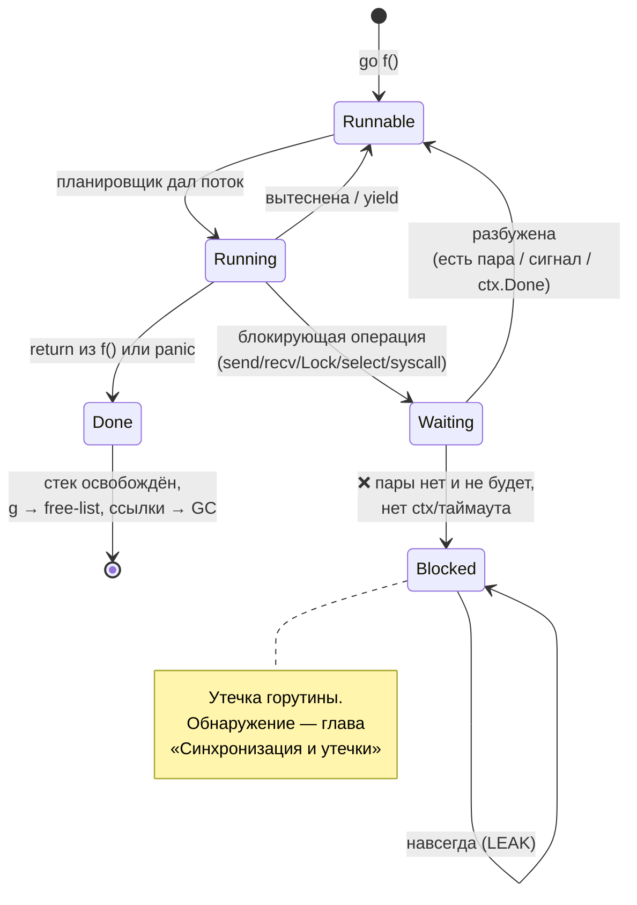

# Жизненный цикл горутины и закрытие ресурсов

Глава [Синхронизация и утечки](./04-sync-and-leaks.md) ввела само понятие goroutine leak, три типовые причины и инструменты обнаружения (`NumGoroutine`, pprof, `goleak`). Эта глава идёт глубже: разбираем, **как** горутина на самом деле завершается и освобождает память, почему её принципиально нельзя убить снаружи, какими паттернами гарантировать её завершение и — главное — как правильно закрывать каналы, стримы и ресурсы. Незакрытый ресурс или канал — самый частый источник утечек на проде, и именно дисциплина закрытия отличает прототип от сервиса, который не падает по OOM на третьи сутки.

## Жизненный цикл и освобождение памяти

Горутина рождается одним оператором — `go f()`. С этого момента она проходит через несколько состояний планировщика:

- **runnable** — готова выполняться, ждёт свободного потока (`M`/`P`);
- **running** — выполняется на потоке прямо сейчас;
- **waiting** — заблокирована на операции (приём/отправка в канал, `Lock`, `select`, системный вызов, `time.Sleep`) и не потребляет CPU, пока не будет разбужена.

Завершается горутина **единственным способом** — когда её функция доходит до `return` (или до конца тела), либо когда в ней происходит неперехваченная `panic`. Во втором случае паника, если её не поймать через `recover`, не остаётся внутри горутины — она **роняет весь процесс** (об этом подробнее в разделе про ошибки).

### Что происходит с памятью при завершении

Когда функция горутины возвращается, рантайм аккуратно разбирает её следы:

- **Стек горутины** освобождается. Стартовый размер стека — очень маленький (порядка пары килобайт против мегабайта у потока ОС); по мере необходимости рантайм наращивает его, копируя в больший сегмент, и при сжатии может уменьшать обратно. После завершения весь этот стек возвращается рантайму.
- **Структура `g`** (внутреннее описание горутины) не уничтожается, а попадает во **free-list** планировщика и переиспользуется под следующую `go f()`. Поэтому повторный запуск горутин — дешёвая операция: рантайм не идёт каждый раз в аллокатор.
- **Захваченные замыканием переменные** после завершения горутины перестают быть достижимыми из её (уже несуществующего) стека. Если на них больше никто не ссылается, они становятся мусором и их соберёт GC в свой срок. Память освобождает не «конец горутины», а сборщик — горутина лишь снимает последнюю ссылку.

> **Параллель с .NET:** освобождение стека и переиспользование служебной структуры концептуально близки к тому, как пул потоков (`ThreadPool`) переиспользует потоки, а `Task` после завершения отдаёт свои ресурсы. Но есть разница в стоимости: горутина легче потока ОС на порядки, и её «перерождение» из free-list дешевле, чем возврат потока в пул.

### Ключевое: горутину нельзя убить извне

Это центральный тезис главы. В Go **нет** способа прервать чужую горутину снаружи:

- нет `Thread.Abort()`;
- нет `goroutine.Cancel()` или `kill(goroutineID)`;
- нет даже стабильного публичного API, чтобы узнать ID конкретной горутины и как-то на неё сослаться.

Горутина завершается **только сама** — вернувшись из своей функции. Снаружи вы можете лишь **попросить** её завершиться (закрыть канал, отменить `context`), но решение «выйти» принимает только её собственный код, дойдя до `return`. Если код горутины никогда не проверяет сигнал отмены и навсегда блокируется на канале — всё, она зависла, и сделать с ней извне нельзя ничего. Отсюда вырастает вся дисциплина остальной главы: раз убить нельзя, единственная стратегия — **проектировать гарантированный путь выхода заранее**.



> **Параллель с .NET:** в .NET принудительного прерывания тоже фактически нет. `Thread.Abort()` объявлен устаревшим и на .NET Core/5+ при вызове бросает `PlatformNotSupportedException` — то есть его попросту убрали. Канон .NET — **кооперативная** остановка через `CancellationToken`: вы передаёте токен, а целевой код сам обязан проверять `IsCancellationRequested` / вызывать `ThrowIfCancellationRequested()`. Это ровно та же модель, что в Go с `context`: остановка — это просьба, а не приказ.

## «Запустил горутину — знай, как она закончится»

Это золотое правило конкурентного Go. У **каждой** запущенной через `go` горутины должен быть заранее продуманный, гарантированный путь выхода. Прежде чем написать `go f()`, ответьте себе на вопрос: «при каких условиях эта горутина вернётся — и кто/что эти условия обеспечит?». Если ответа нет — вы только что посадили потенциальную утечку.

Главный анти-паттерн — **fire-and-forget** без отмены: запустили фоновую горутину «и забыли», не дав ей ни канала, ни контекста для остановки. На прототипе работает, в долгоживущем сервисе — медленно течёт.

### Каталог «зависает навсегда»

Сводка ситуаций, в которых горутина блокируется навсегда. Часть из них пересекается с главой [Синхронизация и утечки](./04-sync-and-leaks.md) (там — про обнаружение) и с механикой из [Каналов](./02-channels.md); здесь — компактный справочник «симптом → причина → лечение».

| Симптом | Причина | Лечение |
| --- | --- | --- |
| Горутина висит на `ch <- v` | Отправка в канал, который никто не читает (нет приёмника / приёмник ушёл) | Буфер на результат (`make(chan T, 1)`), приём через `select` с `ctx.Done()`, направленные каналы для контроля |
| Горутина висит на `<-ch` | Приём из канала, в который никто не отправит и который не закрыт | Гарантировать отправителя или `close` у отправителя; `select` с отменой |
| `for v := range ch` не завершается | Канал-источник так и не закрыли | **Отправитель** обязан `close(ch)`, когда данных больше не будет |
| `select` блокируется навсегда | Нет ни одного готового `case`, нет `default` и нет ветки `<-ctx.Done()` | Добавить `case <-ctx.Done()` или (для неблокирующего варианта) `default` |
| Любая операция с каналом висит вечно | Канал `nil` (забыли `make`) — send и recv в `nil`-канал блокируют навсегда | Инициализировать через `make`; помнить, что `nil`-ветка в `select` «выключена» осознанно |
| `wg.Wait()` не возвращается | Забыли `Done()` или сделали `Add(n)` больше фактического числа `Done()` | `defer wg.Done()` первым делом в горутине; `Add` **до** `go`, на точное число |
| Две горутины висят на `Lock()` | Взаимный дедлок мьютексов: захват в разном порядке (A→B и B→A) | Единый глобальный порядок захвата блокировок; по возможности — один мьютекс или `defer Unlock` |

Заметьте: `nil`-канал и пропущенный `close` — это не баги языка, а обратная сторона легальных идиом. `nil`-канал намеренно «отключает» ветку `select` (см. [select и context](./03-select-and-context.md)), а `close` — это явный контракт отправителя. Утечкой они становятся, только когда вы получили их **по ошибке**.

## Гарантированное завершение: паттерны

Раз убить горутину нельзя, остаётся одно — встроить в неё реакцию на сигнал остановки. Ниже — рабочие паттерны от простого к комплексному.

### `context` повсюду

Базовый инструмент кооперативной остановки — `context.Context` (детально — в [select и context](./03-select-and-context.md)). Правило: в любом достаточно длинном цикле или между итерациями длинной работы проверяйте `ctx.Done()`.

```go
func process(ctx context.Context, items []Item) error {
	for _, it := range items {
		select {
		case <-ctx.Done():
			return ctx.Err() // отменили сверху — выходим немедленно
		default:
		}
		heavyWork(it) // одна итерация работы
	}
	return nil
}
```

Голый `default` здесь делает проверку **неблокирующей**: если отмены нет — мгновенно проваливаемся к работе; если есть — выходим. Так горутина гарантированно завершится в течение одной итерации после `cancel()`.

### done-канал для долгоживущих воркеров

Долгоживущий воркер обслуживает поток задач, пока ему не скажут остановиться. Идиома — `select` в бесконечном цикле, где одна ветка ловит работу, другая — сигнал выхода:

```go
func worker(ctx context.Context, jobs <-chan Job) {
	for {
		select {
		case <-ctx.Done(): // graceful-остановка
			return
		case job, ok := <-jobs:
			if !ok {
				return // канал задач закрыт — работы больше не будет
			}
			handle(job)
		}
	}
}
```

Здесь сразу **два** легальных пути выхода: отмена через `ctx` и закрытие канала `jobs` отправителем. Любой из них корректно завершает горутину. Вместо `ctx` для простых случаев иногда используют отдельный `stopCh chan struct{}` (закрытие — broadcast-сигнал всем воркерам сразу), но `context` предпочтительнее: он проходит сквозь весь стек и каскадно отменяет поддерево.

### worker pool с `context` + `sync.WaitGroup`

Пул воркеров с гарантированным завершением: `context` сворачивает работу по отмене, `WaitGroup` даёт дождаться, что **все** воркеры реально вышли.

```go
func runPool(ctx context.Context, jobs <-chan Job, workers int) {
	var wg sync.WaitGroup
	for range workers { // Go 1.22+: for range по int
		wg.Add(1)
		go func() {
			defer wg.Done()
			for {
				select {
				case <-ctx.Done():
					return
				case job, ok := <-jobs:
					if !ok {
						return
					}
					handle(job)
				}
			}
		}()
	}
	wg.Wait() // блокируемся, пока каждый воркер не вернулся
}
```

`wg.Wait()` в конце — это и есть «знаю, как они закончатся»: функция не вернётся, пока живёт хоть один воркер, поэтому утечке неоткуда взяться.

### `errgroup`: отмена по первой ошибке

`golang.org/x/sync/errgroup` — практически незаменимый инструмент для «запустить группу задач, дождаться всех, получить первую ошибку и автоматически отменить остальные». В главе [Синхронизация и утечки](./04-sync-and-leaks.md) его не было, а на проде он встречается постоянно — это, по сути, типобезопасный `Task.WhenAll` с встроенной отменой.

```go
import "golang.org/x/sync/errgroup"

func fetchAll(ctx context.Context, urls []string) ([]string, error) {
	g, ctx := errgroup.WithContext(ctx) // ctx отменится при первой ошибке
	results := make([]string, len(urls))

	for i, url := range urls {
		g.Go(func() error { // Go 1.22+: i, url захватываются корректно per-iteration
			body, err := fetch(ctx, url)
			if err != nil {
				return err // вернёт ошибку → отменит ctx → остальные g.Go свернутся
			}
			results[i] = body // каждый пишет в свой индекс — гонки нет
			return nil
		})
	}

	if err := g.Wait(); err != nil { // ждём всех; возвращает ПЕРВУЮ ошибку
		return nil, err
	}
	return results, nil
}
```

Что здесь происходит:

- `errgroup.WithContext(ctx)` возвращает группу **и** производный `ctx`. Как только любая из функций `g.Go` вернёт ненулевую ошибку, этот `ctx` автоматически отменяется — и все остальные задачи, которые слушают `ctx.Done()`, сворачиваются. Это и есть «отмена по первой ошибке».
- `g.Wait()` блокируется до завершения всех запущенных функций и возвращает ошибку **первой** из упавших (остальные ошибки отбрасываются).
- `g.SetLimit(n)` ограничивает число одновременно работающих горутин (встроенный семафор) — удобно, когда задач тысячи, а ресурсов на всех сразу нет.

> **Параллель с .NET:** `errgroup` ≈ `Task.WhenAll` **в связке с** `CancellationTokenSource`, плюс автоматика, которой в `WhenAll` нет из коробки. `WhenAll` дожидается всех задач и агрегирует исключения в `AggregateException`, но **сам не отменяет** остальные при первом падении — это вы дописываете руками. `errgroup` делает отмену за вас и отдаёт именно первую ошибку. `g.SetLimit(n)` ≈ ограничение параллелизма через `SemaphoreSlim` или `Parallel.ForEachAsync` с `MaxDegreeOfParallelism`.

## Закрытие каналов, стримов и ресурсов

Это главная практическая тема главы. Цепочка проста и беспощадна: **незакрытый или недочитанный стрим/канал → заблокированная навсегда горутина или соединение → утечка** (память, файловые дескрипторы, соединения в пуле). Большинство прод-утечек живёт именно здесь, а не в экзотических гонках.

### Каналы: закрывает только отправитель

Повторим контракт из главы [Каналы](./02-channels.md) под углом «как не утечь»:

- `close(ch)` — это **сигнал** «данных больше не будет», а **не** освобождение памяти (каналы собирает GC). Закрытие нужно, чтобы получатели в `for v := range ch` корректно завершили цикл — иначе они зависнут навсегда (строка из каталога выше).
- Закрывает канал **только отправитель** и **никогда** получатель: лишь отправитель знает, что поток данных закончен.
- Паники, которых нельзя допускать: `ch <- v` в закрытый канал → `panic: send on closed channel`; повторный `close` → `panic: close of closed channel`; `close(nil)` → `panic: close of nil channel`.

Когда отправитель один — всё просто: «отправил всё → закрыл».

```go
// ✅ Один отправитель закрывает канал сам
func produce(out chan<- int) {
	defer close(out) // закроется при любом выходе, в т.ч. по return из цикла
	for i := range 10 {
		out <- i
	}
}
```

Когда отправителей **несколько**, ни один из них не вправе закрыть канал в одиночку (он не знает, закончили ли остальные, и рискует словить `send on closed channel` у соседа). Правильный паттерн — отдельная «дирижирующая» горутина закрывает канал **после** того, как `WaitGroup` дождётся всех отправителей:

```go
// ✅ Несколько отправителей: закрытие координируется через WaitGroup
func fanOutProduce(producers int) <-chan int {
	out := make(chan int)
	var wg sync.WaitGroup

	for p := range producers {
		wg.Add(1)
		go func() {
			defer wg.Done()
			for i := range 5 {
				out <- p*10 + i
			}
		}()
	}

	go func() {
		wg.Wait()  // ждём, пока ВСЕ отправители закончат
		close(out) // и только теперь безопасно закрываем — ровно один раз
	}()

	return out // получатель спокойно делает for v := range out
}
```

### `io.Closer` и `defer x.Close()`

Файлы, сетевые соединения, тела HTTP-ответов реализуют `io.Closer`. Идиома — `defer x.Close()` сразу после успешного открытия:

```go
f, err := os.Open("data.txt")
if err != nil {
	return err
}
defer f.Close() // закроется при любом выходе из функции
// ... читаем f ...
```

Для чтения проигнорировать ошибку `Close()` обычно не страшно. А вот **при записи** игнорировать её нельзя: финальный flush буфера может произойти именно в `Close()`, и там же всплывёт ошибка «диск переполнен» / «сеть отвалилась». Потерять её — значит молча потерять данные. Канонический приём — закрыть через `defer` и записать ошибку `Close` в **именованный возврат**, если основной ошибки ещё не было:

```go
func writeConfig(path string, data []byte) (err error) { // именованный err
	f, err := os.Create(path)
	if err != nil {
		return err
	}
	defer func() {
		if cerr := f.Close(); err == nil { // не затираем уже случившуюся ошибку
			err = cerr // но если её не было — отдаём ошибку Close (потерянный flush)
		}
	}()

	_, err = f.Write(data)
	return err // если Write упал — вернётся он; иначе — результат Close
}
```

### HTTP-клиент: закрыть и дочитать `resp.Body`

Один из самых частых прод-багов. Тело HTTP-ответа **обязательно** нужно закрывать, а для переиспользования keep-alive соединения — ещё и **дочитывать** до конца. Не сделаете — соединение не вернётся в пул и не освободит файловый дескриптор; под нагрузкой это утечка соединений и FD.

```go
// ❌ Утечка: тело не закрыто — соединение не вернётся в пул
resp, err := http.Get(url)
if err != nil {
	return err
}
data, err := io.ReadAll(resp.Body) // забыли resp.Body.Close()
```

```go
// ✅ Закрываем всегда; дочитываем остаток для keep-alive
resp, err := http.Get(url)
if err != nil {
	return err
}
defer func() {
	io.Copy(io.Discard, resp.Body) // дочитать «хвост», чтобы соединение переиспользовалось
	resp.Body.Close()              // и закрыть
}()

data, err := io.ReadAll(resp.Body)
// ...
```

Если вы и так читаете тело целиком (`io.ReadAll`), остаток дочитывать не нужно — достаточно `defer resp.Body.Close()`. Дочитывание критично в случаях, когда вы читаете тело **частично** (например, только заголовок или первые N байт) и выходите раньше: без `io.Copy(io.Discard, ...)` соединение застрянет.

### gRPC-стримы

У gRPC-стримов своя дисциплина закрытия (детали gRPC — в Разделе 8, здесь — суть):

- При **client-streaming** клиент, отправив всё, обязан вызвать `stream.CloseSend()` — это сигнал серверу «больше не пишу». Затем нужно **читать ответы до `io.EOF`**: пока вы не дочитали стрим до конца, на сервере висит горутина-обработчик и держится соединение.
- Недочитанный или незакрытый стрим = подвисшая горутина и соединение на сервере. Это та же цепочка «незакрытый стрим → блокировка → утечка», только распределённая.
- Отмена стрима — через `context`: отменили `ctx`, с которым создан стрим, — стрим рвётся с обеих сторон.

### Таймеры и тикеры

`time.NewTimer` и `time.NewTicker` тоже требуют остановки — `defer ticker.Stop()`, иначе тикер продолжит слать в свой канал, а связанные ресурсы не освободятся:

```go
ticker := time.NewTicker(time.Second)
defer ticker.Stop() // обязательно — иначе тикер живёт дальше
for {
	select {
	case <-ctx.Done():
		return
	case <-ticker.C:
		poll()
	}
}
```

> **Параллель с .NET:** вся эта дисциплина закрытия в .NET сосредоточена вокруг `IDisposable`/`IAsyncDisposable` и `using`/`await using`. Соответствия один в один:
> - `defer x.Close()` ≈ `using (var x = ...)` / `await using` — гарантированное освобождение на выходе из области;
> - `resp.Body.Close()` ≈ `HttpResponseMessage.Dispose()`; необходимость **дочитать** тело перекликается с тем, как `HttpClient` управляет пулом соединений (`SocketsHttpHandler`) — недопотреблённый ответ так же мешает переиспользованию;
> - дочитывание/отмена gRPC-стрима ≈ корректный disposal `IAsyncEnumerable<T>` (через `await foreach` или `IAsyncEnumerator.DisposeAsync()`): брошенный на середине асинхронный стрим в .NET тоже надо завершать/отменять;
> - отмена через `ctx` ≈ `CancellationToken`, переданный в `HttpClient`/gRPC-вызов.
> Разница в инструменте: в C# освобождение навешано на тип (`IDisposable`) и синтаксис (`using`), в Go — на универсальный `defer` плюс соглашение `Close() error`.

## Итог

- Горутина рождается через `go f()` и завершается **только сама** — `return` из своей функции или паникой. Принудительно прервать её извне **нельзя**: нет `Thread.Abort`, нет `Cancel()`. Снаружи можно лишь попросить (закрыть канал, отменить `context`).
- При завершении стек горутины освобождается, структура `g` уходит во free-list и переиспользуется, а захваченные переменные становятся мусором и собираются GC.
- Правило «запустил горутину — знай, как она закончится»: у каждой `go`-горутины должен быть заранее заложенный путь выхода. Анти-паттерн — fire-and-forget без отмены. Каталог «зависает навсегда» помогает быстро ставить диагноз.
- Гарантированное завершение строится на `context` (проверять `ctx.Done()`), done-канале/`stopCh` для воркеров, паре `context` + `sync.WaitGroup` для пулов и `errgroup` для «дождаться всех + отмена по первой ошибке».
- Закрытие ресурсов — главный источник прод-утечек. Каналы закрывает **только отправитель** (для нескольких отправителей — координация через `WaitGroup` + закрытие в отдельной горутине). `io.Closer` — через `defer Close()`, при записи — проверять ошибку `Close` (именованный возврат). `resp.Body` всегда закрывать и желательно дочитывать. gRPC-стримы — `CloseSend` + читать до `io.EOF` + отмена через `ctx`. Таймеры/тикеры — `defer Stop()`.
- Цепочка утечки одна и та же: незакрытый/недочитанный стрим или канал → заблокированная навсегда горутина/соединение → рост памяти и FD. Обнаружение — в главе [Синхронизация и утечки](./04-sync-and-leaks.md).

Дальше — обзорное сравнение конкурентной модели Go и .NET, сводящее весь раздел в единую картину async/await ↔ горутины.

---

[⌂ Главная](../../README.md) · [↑ Раздел](./README.md) · [← Предыдущий: Синхронизация и утечки](./04-sync-and-leaks.md) · [→ Следующий: Сравнение с .NET](./06-comparison-with-dotnet.md)
