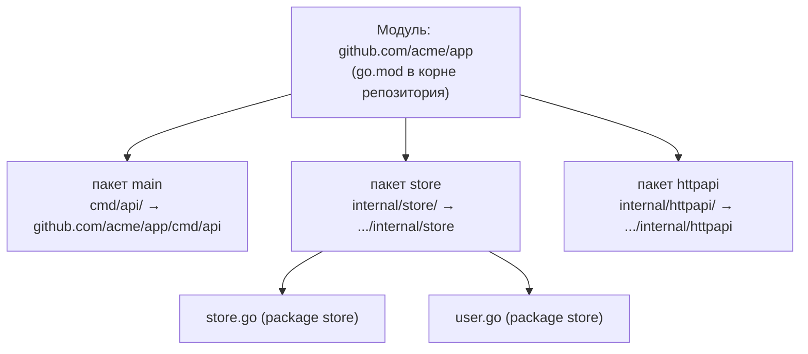

# Модули и пакеты: базовые понятия

Прежде чем раскладывать код по каталогам и разбираться с `go.mod`, нужно твёрдо усвоить два слова, которые в Go означают **разные** вещи и которые .NET-разработчик по привычке сливает в одно — в «сборку». Это **пакет** и **модуль**. Понимание их различия — фундамент всего раздела: дальше мы будем постоянно опираться на то, что видимость живёт на уровне пакета, а версионирование — на уровне модуля.

Коротко: **пакет** — это единица компиляции и видимости (каталог исходников); **модуль** — единица версионирования и распространения (набор пакетов с одним `go.mod`). Разберём по порядку.

## Пакет: единица компиляции и видимости

**Пакет — это каталог** с `.go`-файлами, у которых одинаковая декларация `package`. Все файлы одного каталога с `package store` вместе образуют пакет `store` — неважно, один это файл или десять.

```text
store/
├── store.go    // package store
├── user.go     // package store
└── query.go    // package store   → всё это ОДИН пакет `store`
```

Пакет — это единица сразу нескольких вещей:

- **компиляции** — компилятор обрабатывает пакет как целое;
- **импорта** — вы импортируете пакет по пути и обращаетесь к нему по имени (`store.New()`);
- **видимости** — экспорт через заглавную букву и каталог `internal/` действуют на уровне пакета (детали — в главе [Пакеты и видимость](./03-packages-and-visibility.md)).

Внутри одного пакета **нет приватности между файлами и типами**: `user.go` свободно видит неэкспортируемые (со строчной буквы) идентификаторы из `store.go`, потому что это один пакет. Пакет `main` — особый: он даёт исполняемый бинарь, а не библиотеку.

Важно: пакет **не** является артефактом развёртывания. Это логическая единица внутри собираемой программы, а не отдельный `.dll`, который куда-то кладут.

## Модуль: единица версионирования и распространения

**Модуль — это набор пакетов, которые версионируются и распространяются вместе.** Модуль определяется файлом `go.mod` в его корне:

```go
// go.mod
module github.com/acme/app   // путь модуля
go 1.22                      // минимальная версия Go
require (                    // зависимости — это другие МОДУЛИ
    github.com/google/uuid v1.6.0
)
```

Модуль — это единица:

- **зависимости** — когда вы делаете `go get`, вы подключаете **модуль** (а не отдельный пакет);
- **версионирования** — версия — это git-тег на весь модуль (`v1.6.0`); пакеты внутри по отдельности не версионируются;
- **распространения** — модуль целиком тянется из VCS-репозитория и кешируется.

Обычно действует правило **один репозиторий = один модуль = много пакетов**. Это конвенция, а не жёсткое требование (в одном репозитории может быть несколько модулей, но это редкий случай — см. главу [Воркспейсы](./05-workspaces.md)). Механика `go.mod`/`go.sum`, версий и команд разобрана в главе [Зависимости и go-модули](./04-dependencies-go-modules.md).

## Как они соотносятся: путь импорта

Связь пакета и модуля видна прямо в **пути импорта**:

> путь импорта = **путь модуля** + относительный путь пакета внутри модуля

Например, в модуле `github.com/acme/app` пакет, лежащий в каталоге `internal/store`, импортируется как `github.com/acme/app/internal/store`. Путь модуля — это «префикс-пространство имён» для путей всех его пакетов.



Один модуль (`go.mod`) содержит дерево каталогов-пакетов; каждый пакет — это набор файлов. Версионируется и подключается модуль целиком; компилируется и инкапсулируется — каждый пакет в отдельности.

## Сводка: пакет против модуля

| | Пакет | Модуль |
| --- | --- | --- |
| Что это | каталог `.go`-файлов с одной декларацией `package` | набор пакетов с общим `go.mod` |
| Чем задаётся | каталогом + `package X` | файлом `go.mod` (путь модуля) |
| Единица чего | компиляции, импорта, **видимости** | **версионирования**, зависимостей, распространения |
| Гранулярность | мелкая (в проекте их десятки) | крупная (обычно один на репозиторий) |
| Что вы `import` / `go get` | `import` пакета по пути | `go get` модуля |

## Главный мостик к .NET: «сборка» расщеплена на два понятия

Вот ключевой инсайт для перехода. В .NET **сборка** (assembly, `.dll`) совмещает в себе сразу несколько ролей:

- единица компиляции;
- граница доступа `internal`;
- единица версионирования (`AssemblyVersion`, NuGet-пакет);
- единица развёртывания и зависимости (`.nupkg`).

В Go эти роли **разнесены** на два разных понятия:

| Роль | .NET (всё — сборка) | Go |
| --- | --- | --- |
| Компиляция | assembly | **пакет** (каталог) |
| Видимость / инкапсуляция (`internal`) | assembly | **пакет** (регистр имени, каталог `internal/`) |
| Версионирование | версия сборки / NuGet | **модуль** (`go.mod` + git-тег) |
| Распространение, зависимость | NuGet-пакет (`.nupkg`) | **модуль** (`go get` из VCS) |

Практический вывод: в Go вопрос «как **скрыть** код» решается на уровне **пакета**, а вопрос «как **версионировать и подключить** код» — на уровне **модуля**, и это два **разных** инструмента. В .NET оба вопроса упирались в одну сущность — сборку. Именно поэтому в Go вы не «создаёте Class Library как единицу всего сразу»: видимость задаёте пакетами и каталогом `internal/`, а версионируемую распространяемую единицу — модулем.

> **Параллель с .NET:** грубое соответствие — пакет ≈ `namespace` (логическая группировка + часть роли `internal`-границы), модуль ≈ NuGet-пакет (версионируемая распространяемая единица). Но это лишь ориентир: `namespace` в C# чисто логический и не привязан к каталогу, а пакет Go — это физический каталог, и он же несёт `internal`-границу, которой у `namespace` нет.

## Частые заблуждения

- ❌ «Один файл — один пакет.» Нет: пакет — это **каталог**; несколько файлов с одним `package` — это один пакет.
- ❌ «Пакет публикуют как модуль.» Нет: версионируется и публикуется **модуль целиком**; пакеты внутри по отдельности не версионируются.
- ❌ «Модуль — это обязательно репозиторий.» Обычно один к одному, но формально модуль задаётся наличием `go.mod`; в репозитории может быть и несколько модулей.
- ✅ Практическое правило по умолчанию: **один репозиторий → один модуль (`go.mod` в корне) → много пакетов-каталогов внутри**.

## Итог

- **Пакет** — каталог `.go`-файлов с одной декларацией `package`; единица **компиляции, импорта и видимости**. Внутри пакета приватности между файлами нет.
- **Модуль** — набор пакетов с одним `go.mod`; единица **версионирования, зависимостей и распространения**. То, что вы `go get`, — это модуль.
- Связь: **путь импорта = путь модуля + путь пакета внутри него** (`github.com/acme/app` + `internal/store`).
- Главное отличие от .NET: роль «сборки» **расщеплена** — видимость и компиляция живут в пакете, версионирование и распространение — в модуле.
- По умолчанию: один репозиторий = один модуль = много пакетов.

Дальше — как именно раскладывать эти пакеты по каталогам (`cmd/`, `internal/`, `pkg/`) и где миф об «официальном стандарте».

---

[⌂ Главная](../../README.md) · [↑ Раздел](./README.md) · [← Предыдущий: Обзор раздела](./README.md) · [→ Следующий: Структура проекта](./02-project-layout.md)
