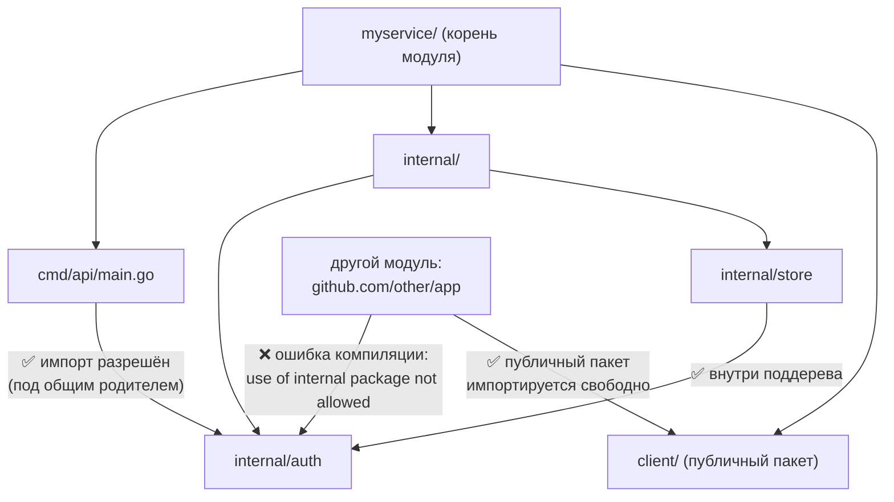

# Структура проекта

Первый вопрос, который задаёт .NET-разработчик, начиная Go-проект: «А где здесь правильная структура папок? Где аналог шаблона, который генерирует Visual Studio?» В .NET вы привыкли, что структура во многом задаётся за вас: `dotnet new` раскладывает файлы, `.sln` агрегирует проекты, каждый `.csproj` — это сборка. В Go стартовая структура — это пустой каталог с одним файлом `go.mod`. Дальше вы раскладываете код сами, и здесь легко налететь на главное заблуждение экосистемы.

## Миф об «официальном стандарте»

В сети повсеместно ссылаются на репозиторий [`golang-standards/project-layout`](https://github.com/golang-standards/project-layout) как на «официальную структуру Go-проекта». Это **не** официальный стандарт. Несмотря на вводящее в заблуждение имя организации `golang-standards`, репозиторий **не аффилирован** с командой Go и не является её рекомендацией. Это набор конвенций, собранный сообществом из крупных проектов, — и он регулярно подвергается критике за то, что подталкивает новичков к преждевременной сложности: люди заводят десяток каталогов (`pkg/`, `api/`, `build/`, `deployments/`, `test/`) для проекта из трёх файлов.

Что **реально** говорит команда Go? Официальная позиция гораздо скромнее и сводится к минимализму:

- Для маленькой программы достаточно **одного каталога с несколькими `.go`-файлами** в пакете `main`. Никаких подпапок не нужно.
- Структуру следует **наращивать по мере роста**, а не закладывать «на вырост» с первого дня.
- Авторитетный ориентир — не сторонний репозиторий, а официальные документы: [Organizing a Go module](https://go.dev/doc/modules/layout) на go.dev и стандартная библиотека Go как образец вкуса.

> **Параллель с .NET:** в .NET есть официальные шаблоны (`dotnet new console`, `webapi`, `classlib`) и устоявшиеся соглашения от Microsoft. В Go официальный «шаблон структуры» намеренно отсутствует — есть лишь рекомендация «начинай плоско». То, что выглядит как «стандарт» (`golang-standards/project-layout`), — это народная конвенция уровня community-блога, а не аналог гайдлайнов Microsoft.

## С чего начинать: плоская структура

Идиоматичный старт — плоско. Для небольшой утилиты или библиотеки всё лежит в корне модуля:

```text
myapp/
├── go.mod
├── go.sum
├── main.go
├── server.go
└── server_test.go
```

Все файлы в корне принадлежат одному пакету. Если это исполняемая программа — пакету `main`; если библиотека — пакету с именем по каталогу (об именовании — в следующей главе). Делить на подпапки имеет смысл, лишь когда появляется явная причина: разные исполняемые файлы, желание скрыть внутренности, логически обособленные подсистемы.

> **Параллель с .NET:** в C# принято раскладывать классы «по одному типу на файл» и группировать по папкам внутри проекта, причём папки часто (но не обязательно) отражают namespace. В Go всё проще и строже: **каталог — это пакет**, в одном файле спокойно живут несколько типов, а складывать каждый тип в свой файл/подпапку не принято и даже вредно (плодит лишние пакеты).

## Community Layout: когда структура вырастает

Когда проект перерастает плоскую раскладку, де-факто стандартом стали несколько каталогов. Важно понимать назначение каждого и когда он оправдан, а когда — оверкилл.

```text
myservice/
├── go.mod
├── go.sum
├── cmd/                  # точки входа (по одному подкаталогу на бинарь)
│   ├── api/
│   │   └── main.go       # package main → бинарь "api"
│   └── worker/
│       └── main.go       # package main → бинарь "worker"
├── internal/            # приватный код (enforced компилятором)
│   ├── auth/
│   ├── store/
│   └── config/
├── pkg/                 # публичные библиотеки для внешнего импорта (спорно)
│   └── client/
├── api/                 # схемы контрактов: OpenAPI, .proto
└── configs/             # шаблоны конфигов
```

| Каталог | Назначение | Когда оправдан | Когда оверкилл |
| --- | --- | --- | --- |
| `cmd/<app>/` | точки входа, по подкаталогу на исполняемый файл | есть **несколько** бинарей или нужно отделить `main` от логики | единственная программа — проще держать `main.go` в корне |
| `internal/` | приватный код, недоступный извне модуля | как только появляется код «не для внешнего импорта» (почти всегда) | для крошечной утилиты, у которой и так нет внешних потребителей |
| `pkg/` | публичные библиотеки, явно предназначенные для импорта чужими модулями | вы **намеренно** публикуете переиспользуемые пакеты | по умолчанию — почти всегда; см. ниже |
| `api/` | определения контрактов (`.proto`, OpenAPI, JSON-схемы) | есть внешний API-контракт, особенно gRPC/protobuf | нет внешнего API |
| `configs/` | шаблоны и примеры конфигурационных файлов | нужны файлы конфигурации в репозитории | конфиг целиком через env-переменные |

Отдельно про `pkg/`. Это **самый спорный** элемент конвенции. Идея: «публичные» пакеты складывать в `pkg/`, чтобы отличать их от приватных. Критика обоснованная: каталог не несёт никакой семантики для компилятора (в отличие от `internal/`), удлиняет пути импорта (`myservice/pkg/client` вместо `myservice/client`) и для приложения, которое никто не импортирует как библиотеку, просто бесполезен. Многие крупные проекты (включая саму стандартную библиотеку Go) `pkg/` не используют. Практическое правило: **по умолчанию не заводите `pkg/`**; кладите публичные пакеты прямо в корень модуля, а для приватных используйте `internal/`. Заводите `pkg/`, только если у вас реально много публичных пакетов и вы хотите их визуально сгруппировать.

> **Параллель с .NET:** каталоги `cmd/`, `internal/`, `pkg/` — это **не** аналог структуры решения с проектами. В .NET каждый такой раздел стал бы отдельным `.csproj` (а значит, отдельной сборкой со своей границей доступа и своим узлом зависимостей). В Go это просто папки внутри **одного** модуля, и единственная из них, что несёт реальную семантику доступа, — `internal/`.

## `internal/` — это механизм языка, а не конвенция

Ключевой момент, который часто упускают: `internal/` — не просто «папка, где по договорённости лежит приватное». Это **правило, встроенное в компилятор** (с Go 1.4). Формулировка из спецификации инструмента:

> Код в каталоге `internal/` может быть импортирован только пакетами, чей корень — родитель этого `internal/`. Любой импорт извне этого поддерева — **ошибка компиляции**.

Иными словами, пакет `.../internal/auth` доступен для импорта только из пакетов, лежащих под общим родителем каталога `internal/`. Снаружи (другой модуль, или даже другое поддерево того же модуля выше `internal/`) такой импорт компилятор запретит.



Это даёт ровно то, чего в .NET вы добиваетесь модификатором `internal` на уровне сборки: «видно внутри моего модуля, не видно снаружи». Но в Go контроль точнее — границу проводит **любой** каталог `internal/` в любом месте дерева, а не только корень. Можно ограничить видимость пакета не всем модулем, а лишь конкретным поддеревом, разместив `internal/` глубже.

> **Параллель с .NET:** `internal/` в Go ≈ модификатор `internal` в C#, но граница задаётся **расположением в дереве каталогов**, а не сборкой. В .NET `internal` означает «видно в пределах этой сборки»; чтобы приоткрыть доступ дружественной сборке, нужен атрибут `[assembly: InternalsVisibleTo("...")]`. В Go аналога `InternalsVisibleTo` нет: правило `internal/` жёсткое и не имеет «белого списка» исключений — вы лишь выбираете, на каком уровне дерева провести границу.

## Пакет `main` и сборка бинарей

Исполняемая программа в Go — это пакет с именем `main`, содержащий функцию `func main()`. Команда `go build` в таком пакете создаёт исполняемый файл. Имя бинаря по умолчанию берётся от **каталога** (не от имени пакета — он всегда `main`).

```go
// файл cmd/api/main.go
package main

import "fmt"

func main() {
    fmt.Println("api server starting...")
}
```

```bash
go build ./cmd/api      # создаст исполняемый файл "api"
go build -o bin/api ./cmd/api  # явное имя
go run ./cmd/api        # собрать во временный файл и сразу запустить
```

## Один модуль — много бинарей через `cmd/`

Здесь раскрывается смысл каталога `cmd/`: в **одном** модуле может быть сколько угодно исполняемых файлов — по подкаталогу с пакетом `main` на каждый. Все они переиспользуют общий код из `internal/`, не дублируя его.

```text
myservice/
├── go.mod                 # один модуль
├── internal/
│   └── store/             # общая логика — пишется один раз
├── cmd/
│   ├── api/main.go        # бинарь 1: HTTP-сервер
│   ├── worker/main.go     # бинарь 2: фоновый обработчик
│   └── migrate/main.go    # бинарь 3: миграции БД
```

```bash
go build ./cmd/...   # соберёт все три бинаря
```

Все три исполняемых файла живут в одном модуле, делят один `go.mod` и один набор зависимостей, и свободно импортируют общий `internal/store`.

> **Параллель с .NET:** в .NET «несколько исполняемых файлов с общим кодом» обычно решается несколькими проектами в одном решении: пара `Console App` проектов плюс общий `Class Library`, связанные project references. В Go тот же сценарий — это **один модуль** с несколькими `cmd/<app>/` и общим `internal/`. Не нужно ни заводить отдельные проекты, ни прописывать ссылки между ними: общий код импортируется по пути внутри модуля. Когда же стоит всё-таки разнести на **несколько модулей** (аналог нескольких решений/независимо версионируемых сборок) — разбираем в главе про зависимости.

## Итог

- `golang-standards/project-layout` — **не** официальный стандарт и не рекомендация команды Go; это народная конвенция, которую часто критикуют за преждевременную сложность.
- Команда Go рекомендует **минимализм**: начинайте с плоской структуры (несколько `.go`-файлов в корне), усложняйте только по мере реального роста.
- Community Layout (`cmd/`, `internal/`, `pkg/`, `api/`, `configs/`) — это просто папки внутри **одного** модуля, а не аналог проектов решения. `pkg/` — спорный, по умолчанию не нужен.
- `internal/` — **механизм языка**: код в нём импортируется только из поддерева общего родителя, нарушение — ошибка компиляции (аналог `internal` в .NET, но граница — по дереву каталогов, без `InternalsVisibleTo`).
- Бинарь — это пакет `main`; имя файла берётся от каталога. **Один модуль легко даёт много бинарей** через `cmd/<app>/`, переиспользуя общий `internal/`.

Дальше — как именно работает видимость на уровне пакетов и почему единица инкапсуляции в Go — пакет, а не тип.

---

[⌂ Главная](../../README.md) · [↑ Раздел](./README.md) · [← Предыдущий: Модули и пакеты](./01-modules-and-packages.md) · [→ Следующий: Пакеты и видимость](./03-packages-and-visibility.md)
