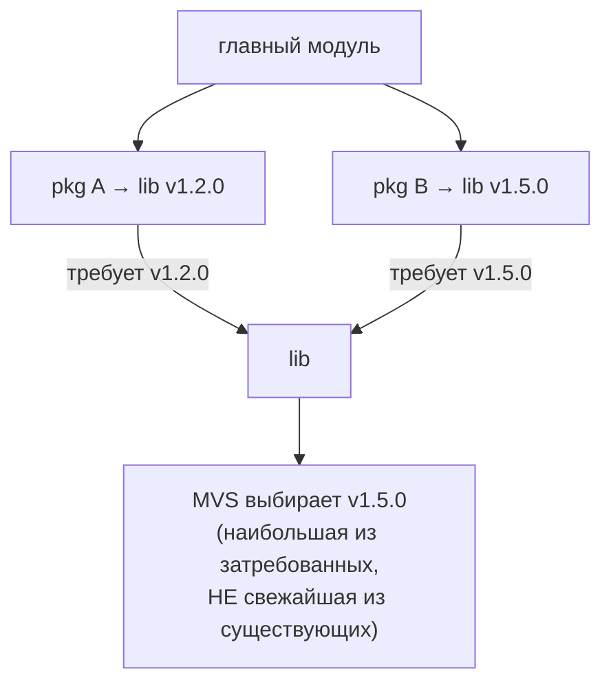
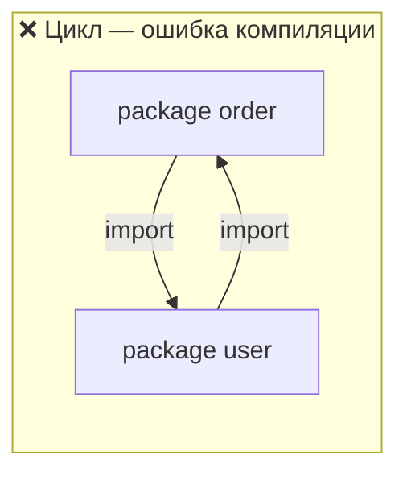
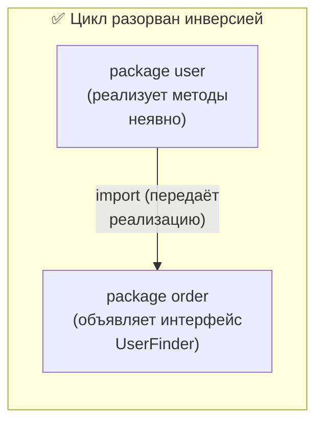

# Зависимости и go-модули

В .NET управление зависимостями означает NuGet: центральный реестр (nuget.org), пакеты `.nupkg`, восстановление перед сборкой, lock-файл `packages.lock.json` и резолвер, который решает уравнение совместимости версий. В Go модель радикально иная: зависимости тянутся **напрямую из систем контроля версий** (обычно Git), описываются в одном файле `go.mod`, фиксируются контрольными суммами в `go.sum`, а версии выбираются предельно простым и детерминированным алгоритмом. Эта глава разбирает go-модули — единицу версионирования и распространения кода в Go (введены в Go 1.11, обязательны с Go 1.16).

Важно держать в голове разделение ролей, заложенное ещё в прошлых главах: **пакет** — единица компиляции и инкапсуляции (каталог), **модуль** — единица версионирования и зависимостей (дерево пакетов с одним `go.mod` в корне). Один модуль обычно содержит много пакетов.

## `go.mod`: манифест модуля

`go.mod` лежит в корне модуля и описывает его идентичность и зависимости. Минимальный пример:

```go
module github.com/acme/myservice

go 1.22

require (
    github.com/jackc/pgx/v5 v5.6.0
    golang.org/x/sync v0.7.0
)

require (
    github.com/some/indirect v1.2.3 // indirect
)
```

Основные директивы:

- **`module`** — путь модуля (module path). Это **префикс ко всем путям импорта** внутри модуля: пакет в каталоге `internal/store` будет импортироваться как `github.com/acme/myservice/internal/store`. Путь обычно совпадает с адресом репозитория, потому что именно по нему `go get` найдёт код.
- **`go`** — минимальная версия Go, под которую написан модуль. Влияет на доступные языковые возможности и на ряд поведений инструментария (например, на правила обрезки графа модулей).
- **`require`** — прямые и косвенные зависимости с версиями. Пометка `// indirect` означает, что зависимость нужна не вашему коду напрямую, а кому-то из ваших зависимостей (либо не зафиксирована в `go.mod` промежуточного модуля).
- **`replace`** — подменяет источник или версию модуля. Частые применения: локальная разработка (`replace github.com/acme/lib => ../lib`), форк вместо оригинала, временный pin. Действует только в **главном** модуле — на потребителей вашего модуля `replace` не распространяется.
- **`exclude`** — исключает конкретную версию модуля из рассмотрения (например, известную сломанную).

> **Параллель с .NET:** `go.mod` ≈ совокупность того, что в .NET размазано по `.csproj` (`<PackageReference>`), `Directory.Build.props` и `nuget.config`. Директива `module` ≈ корневой namespace/идентичность пакета, но с жёсткой привязкой: путь модуля обязан быть импортируемым адресом. `replace` на локальный путь ≈ временно заменить `<PackageReference>` на `<ProjectReference>` ради локальной отладки, только декларативно и без правки структуры решения.

## `go.sum`: контрольные суммы

`go.sum` — это **не** lock-файл в привычном смысле (он не фиксирует выбранные версии — это делает сам `go.mod` плюс детерминированный алгоритм). `go.sum` хранит **криптографические контрольные суммы** (хеши) содержимого каждого модуля и его `go.mod`, которые когда-либо участвовали в сборке. Назначение двойное:

1. **Воспроизводимость и безопасность**: при каждой сборке Go сверяет скачанный код с записанным хешем. Если содержимое версии вдруг изменилось (перезаписанный тег, MITM, скомпрометированный прокси) — сборка падает с ошибкой несовпадения. Это защита от подмены «той же» версии.
2. Дополняется механизмом **checksum database** (`sum.golang.org`) — глобальной прозрачной базой хешей, через которую Go по умолчанию проверяет суммы при первом скачивании модуля.

`go.sum` обязательно коммитится в репозиторий вместе с `go.mod`.

> **Параллель с .NET:** ближайший аналог — `packages.lock.json`, но роли разнесены. В Go **выбор версий не хранится в файле вовсе** — он каждый раз вычисляется детерминированно (см. MVS ниже), поэтому «lock»-файла как списка решённых версий нет. `go.sum` отвечает только за вторую функцию lock-файла — **верификацию целостности** (как поле `contentHash` в `packages.lock.json`), плюс к этому есть прозрачный публичный реестр хешей, аналога которому в NuGet по умолчанию нет.

## Команды управления зависимостями

| Команда | Что делает |
| --- | --- |
| `go get <модуль>@<версия>` | добавляет или обновляет зависимость в `go.mod` (и скачивает). `@latest`, `@v1.2.3`, `@<хеш-коммита>` |
| `go get -u ./...` | обновляет зависимости до более новых минорных/патч-версий |
| `go mod tidy` | приводит `go.mod`/`go.sum` в порядок: добавляет недостающие, удаляет неиспользуемые, чистит избыточные требования |
| `go mod download` | скачивает модули в локальный кеш (без изменения `go.mod`) — для прогрева кеша в CI/Docker |
| `go build` / `go test` / `go run` | автоматически докачивают недостающие зависимости по ходу дела |
| `go mod verify` | проверяет, что закешированные модули не были подменены после скачивания |

Несколько практических нюансов:

- **`go mod tidy` — ваша рабочая лошадка.** Запускайте после любой ручной правки импортов: он синхронизирует `go.mod` с тем, что **реально** импортирует код, и убирает мусор. (С Go 1.16+ `go build` больше не правит `go.mod` сам — поэтому tidy стал обязательной привычкой.)
- **Скачанные модули кешируются** в `$GOPATH/pkg/mod` (по умолчанию `~/go/pkg/mod`) и переиспользуются всеми проектами. Это глобальный, доступный только на чтение кеш — не per-project `packages/` или `node_modules/`.
- Не путайте `go get` и `go install`. С Go 1.16+ `go get` отвечает за **зависимости** (правит `go.mod`), а установка исполняемых утилит — это `go install <модуль>@<версия>`. Подробнее об этом — в разделе про тулинг.

> **Параллель с .NET:** `go get pkg@v1.2.3` ≈ `dotnet add package Pkg --version 1.2.3`. `go mod tidy` грубо ≈ `dotnet restore` плюс чистка лишних `<PackageReference>`, но с акцентом на синхронизацию с фактическими импортами. Главное отличие в кешировании: вместо восстановления пакетов в папку проекта (или `~/.nuget/packages` плюс per-project resolution) Go держит **один глобальный модульный кеш** и не копирует зависимости в проект (если только вы не включили вендоринг — см. ниже).

## Откуда берётся код: Git вместо реестра

Поворотный для .NET-разработчика момент: у Go **нет обязательного центрального реестра** уровня nuget.org. Путь импорта — это, по сути, адрес VCS-репозитория. `go get github.com/jackc/pgx/v5` идёт прямо на GitHub, читает теги (которые и есть версии), скачивает нужный коммит. Любой публичный Git-репозиторий с `go.mod` автоматически является «пакетом» — публиковать его куда-либо отдельно не нужно.

Между вашей машиной и репозиториями по умолчанию стоит **модульный прокси** (`proxy.golang.org`): он кеширует модули, ускоряет скачивание и гарантирует доступность версии, даже если оригинальный тег позже удалят. Поведение настраивается переменными `GOPROXY` (можно указать корпоративный прокси или `direct` для прямого доступа к VCS), `GOPRIVATE`/`GONOSUMDB` (для приватных репозиториев в обход публичного прокси и checksum database).

> **Параллель с .NET:** модель «реестр против Git» — фундаментальное различие. NuGet — это реестр артефактов: автор собирает `.nupkg` и **публикует** его. В Go «публикация» — это `git push` с тегом версии; артефакта-пакета нет, есть исходники в репозитории. `proxy.golang.org` ≈ кеширующий зеркало-фид (как корпоративный NuGet-фид поверх nuget.org), а `GOPRIVATE` ≈ настройка приватных фидов/источников в `nuget.config`.

## Semantic Import Versioning: `/v2` в пути

Go использует [SemVer](https://semver.org/) (`vMAJOR.MINOR.PATCH`, теги с префиксом `v`: `v1.4.2`). Но есть ключевое правило, аналога которому в NuGet нет, — **Semantic Import Versioning**:

> Начиная с major-версии 2, путь модуля **обязан** содержать суффикс major-версии (`/v2`, `/v3`, …), совпадающий с major-версией.

То есть модуль `example.com/mod` на версии `v1.x.x` импортируется как `example.com/mod`, а на `v2.x.x` — уже как `example.com/mod/v2`. Major-суффикс становится **частью пути импорта**:

```go
import (
    "example.com/mod"      // это v0 или v1
    modv2 "example.com/mod/v2" // это v2.x.x — другой путь импорта
)
```

Логика — **правило совместимости импортов**: «если у старого и нового пакета одинаковый путь импорта, новый обязан быть обратно совместим со старым». Мажорная версия по определению ломает совместимость — значит, ей нужен новый путь. Практические следствия:

- `v0` и `v1` **не** имеют суффикса (v0 считается нестабильной, v1 — стабильной базовой).
- Благодаря разным путям импорта **две мажорные версии одного модуля могут сосуществовать** в одной сборке. Это «из коробки» решает diamond-зависимость, где разным потребителям нужны `v1` и `v2`.
- Особый случай — `gopkg.in`: там суффикс мажора обязателен даже для v0/v1 и пишется через точку (`gopkg.in/yaml.v3`).

Для коммитов **без тега версии** (например, зависимость от конкретного коммита ветки) Go формирует **псевдо-версию** — синтетическую SemVer-совместимую строку вида `vX.Y.Z-<timestamp>-<hash>`, где `timestamp` — это UTC-время коммита (`yyyymmddhhmmss`), а `hash` — 12 символов хеша коммита. Например `v0.0.0-20191109021931-daa7c04131f5` (нет базовой версии) или `v1.2.4-0.20191109021931-daa7c04131f5` (базовая релизная версия — мажор/минор/патч инкрементируется). Псевдо-версии полностью упорядочиваемы и встают в общий механизм выбора версий.

> **Параллель с .NET:** в NuGet мажорная версия пакета **не меняет** идентификатор: `Newtonsoft.Json` остаётся `Newtonsoft.Json` и на 12.x, и на 13.x, а две мажорные версии одной сборки в одном графе обычно конфликтуют (нужен binding redirect/assembly load context). В Go мажор зашит в **путь импорта** (`/v2`), поэтому версии — это с точки зрения системы **разные пакеты**, и diamond-конфликт мажоров решается их мирным сосуществованием. Псевдо-версия ≈ ссылка на nightly/CI-сборку из приватного фида, только генерируется автоматически из любого коммита.

## MVS: как Go выбирает версии

Здесь Go расходится с NuGet сильнее всего. NuGet (и большинство менеджеров) при конфликте требований стремится взять **максимально новую** версию, удовлетворяющую всем ограничениям, и в сложных случаях это превращается в задачу поиска решения (SAT-подобный резолвер с эвристиками и возможными «взрывами» комбинаций).

Go использует **MVS (Minimal Version Selection)** — нарочито простой и детерминированный алгоритм:

> MVS стартует от главного модуля, обходит граф зависимостей по `require`-директивам и для каждого модуля запоминает **наибольшую затребованную** версию. Набор этих наибольших версий и есть итоговый build list — это **минимальные** версии, удовлетворяющие всем требованиям.

Звучит парадоксально («minimal», но берём «наибольшую»). Смысл термина: для каждого модуля берётся **минимально достаточная** версия — самая старшая из тех, что **кто-то явно потребовал**, и ни на йоту новее. Если пакет A требует `lib v1.2.0`, а пакет B — `lib v1.5.0`, MVS выберет `v1.5.0` (наибольшее из затребованного) — и **не** станет автоматически подтягивать вышедшую вчера `v1.9.0`, которую никто не просил.

Ключевые свойства MVS:

- **Детерминизм**: результат зависит только от `go.mod`-файлов в графе, а не от того, что появилось в реестре. Поэтому build list **не хранится** в lock-файле — он одинаково вычисляется при каждой команде.
- **Воспроизводимость по умолчанию**: новая версия зависимости, вышедшая в мир, **не** меняет вашу сборку, пока вы сами не запросите обновление (`go get -u`). Никаких «поплыло из-за плавающей версии».
- **Без бэктрекинга**: нет комбинаторного перебора — обход графа линеен. Это устраняет класс проблем «резолвер думает минуту» / «не смог решить».
- Модифицируется директивами `exclude` (убрать версию из графа) и `replace` (подменить).



> **Параллель с .NET:** NuGet при `lib >= 1.2.0` и `lib >= 1.5.0` тоже возьмёт `1.5.0`, но его модель — «найти максимум, совместимый со всеми диапазонами», и при сложных диапазонах это полноценное разрешение ограничений. MVS принципиально не оперирует диапазонами — каждый `require` это **одна** минимально-нужная версия, а не диапазон, и итог — простой максимум по графу. Цена — версии «консервативнее» (новое не приезжает само); выгода — детерминизм, воспроизводимость и отсутствие «версионного ада».

## Запрет циклических импортов

Жёсткое правило Go: **циклический импорт между пакетами — это ошибка компиляции**, а не предупреждение. Если пакет `a` импортирует `b`, а `b` (прямо или транзитивно) импортирует `a`, сборка падает с `import cycle not allowed`. Граф импортов пакетов обязан быть ацикличным (DAG).



Как ломать циклы — стандартные приёмы, по сути это **инверсия зависимостей**:

1. **Вынести общий тип/интерфейс в третий пакет**, от которого зависят оба. Если `order` и `user` ссылаются друг на друга из-за общих типов — выделить их в пакет `model`/`domain`, тогда оба зависят от него, а не друг от друга.
2. **Объявить интерфейс на стороне потребителя.** В Go интерфейсы реализуются неявно (см. Раздел 2), поэтому пакету `order` не нужно импортировать `user`, чтобы зависеть от его поведения, — достаточно объявить у себя узкий интерфейс с нужными методами; `user` его удовлетворит автоматически. Зависимость от конкретного пакета превращается в зависимость от локального интерфейса.



> **Параллель с .NET:** в .NET циклы запрещены **между сборками** (нельзя, чтобы `A.dll` и `B.dll` ссылались друг на друга project reference'ами), но **внутри одной сборки** классы свободно ссылаются циклически: `Order` держит ссылку на `User`, а `User` — на `Order`, и это норма. В Go запрет строже и проходит по **пакету**: даже два пакета в одном модуле не имеют права импортировать друг друга. Поэтому привычная для C# взаимная ссылка классов в Go вынуждает либо держать оба типа в **одном** пакете, либо разрывать связь инверсией зависимостей через интерфейс — что заодно подталкивает к более чистой архитектуре.

## `go.work`: воркспейсы

С Go 1.18 появились **воркспейсы** — файл `go.work`, позволяющий собрать **несколько локальных модулей** в единую рабочую область. Это решает боль «правлю модуль A и его зависимость-модуль B одновременно» без расстановки временных `replace` в `go.mod`:

```go
// go.work
go 1.22

use (
    ./myservice
    ./mylib
)
```

Пока активен `go.work`, импорты `mylib` из `myservice` берутся из **локального** каталога `./mylib`, а не из скачанной версии. `go.work` обычно **не коммитят** (он про локальную среду разработчика); для CI и потребителей действуют обычные `go.mod`.

> **Параллель с .NET:** `go.work` с несколькими `use` ≈ файл решения `.sln`, объединяющий несколько проектов для совместной локальной разработки с автоматическим использованием локальных версий вместо опубликованных. Разница: `.sln` — основной и коммитируемый способ организации, а `go.work` — опциональный локальный инструмент поверх самодостаточных модулей.

## Вендоринг

Команда `go mod vendor` создаёт в корне модуля каталог `vendor/` с **копиями исходников** всех зависимостей, нужных для сборки. Если каталог `vendor/` присутствует, Go по умолчанию собирает из него, игнорируя модульный кеш и сеть.

Зачем это нужно:

- Полностью **герметичная сборка** без доступа в сеть (строгие CI, air-gapped окружения).
- Гарантия, что код зависимостей не исчезнет (вместе с `go.sum` даёт максимальную воспроизводимость).
- Возможность ревьюить и аудитить код зависимостей прямо в репозитории.

Файл `vendor/modules.txt` фиксирует, какие версии вендорнуты, и служит источником информации о версиях при сборке из `vendor/`.

> **Параллель с .NET:** вендоринг ≈ коммит восстановленных пакетов прямо в репозиторий, аналог старого `packages/`-каталога времён `packages.config` или подхода «положить `.nupkg` в локальную папку-фид и собирать офлайн». В .NET сегодня это редкость (полагаются на restore и кеш); в Go вендоринг — штатно поддерживаемый и иногда востребованный режим, хотя по умолчанию используется глобальный кеш.

## Итог

- **Модуль** (`go.mod` в корне) — единица версионирования и зависимостей; путь модуля служит префиксом всех путей импорта. **Пакет** (каталог) — единица компиляции; модуль содержит много пакетов.
- `go.sum` — **не** список решённых версий, а **контрольные суммы** для целостности и воспроизводимости (плюс публичная checksum database). Выбор версий в файле не хранится — он детерминированно вычисляется.
- Зависимости тянутся **прямо из Git** (путь импорта = адрес репозитория), без обязательного реестра; между вами и VCS стоит кеширующий `proxy.golang.org`. Кеш — **один глобальный**, не per-project.
- **Semantic Import Versioning**: мажор v2+ входит в путь импорта (`/v2`), поэтому разные мажоры — это разные пакеты и могут сосуществовать. Коммиты без тега получают псевдо-версию `vX.Y.Z-timestamp-hash`.
- **MVS** выбирает для каждого модуля **наибольшую затребованную** версию (не свежайшую существующую) — детерминированно, без бэктрекинга и плавающих версий, в отличие от разрешения ограничений в NuGet.
- **Циклический импорт пакетов — ошибка компиляции** (строже, чем в .NET, где циклы запрещены лишь между сборками). Лечится инверсией зависимостей: общий тип в третий пакет или интерфейс на стороне потребителя.
- `go.work` (1.18) ≈ `.sln` для локальной мультимодульной разработки; `go mod vendor` копирует зависимости в `vendor/` для герметичных сборок.

Дальше — консолидированный мостик: собираем все различия «.NET → Go» по структуре, доступу и зависимостям в один справочник с ответами на «как мне сделать привычное X».

---

[⌂ Главная](../../README.md) · [↑ Раздел](./README.md) · [← Предыдущий: Пакеты и видимость](./02-packages-and-visibility.md) · [→ Следующий: Сравнение с .NET](./04-comparison-with-dotnet.md)
