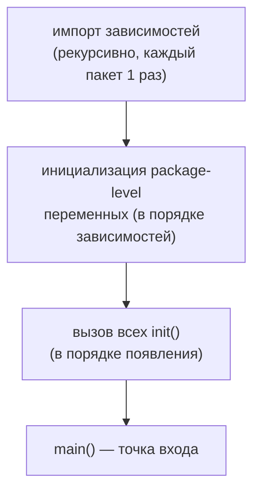

# Пакеты и видимость

В C# у вас два независимых слоя организации: **namespace** (логическая группировка имён, может разъезжаться по файлам и сборкам) и **сборка** (физическая единица компиляции и развёртывания, она же граница `internal`). Инкапсуляцию вы выстраиваете внутри типа — `private`/`protected`-члены класса. В Go всё устроено принципиально иначе и куда более «физически»: организация, компиляция и инкапсуляция сходятся в одной сущности — **пакете**, и пакет — это просто каталог на диске.

## Пакет = каталог

Базовое правило Go: **один каталог — один пакет**. Все `.go`-файлы в одном каталоге обязаны объявлять одно и то же имя пакета в первой строке (`package foo`), и вместе они образуют единицу компиляции. Файлы внутри пакета видят все объявления друг друга без всякого `import` — пакет компилируется как одно целое.

```text
store/
├── store.go      // package store
├── postgres.go   // package store
└── cache.go      // package store
```

```go
// файл store/store.go
package store

type Repository struct { /* ... */ }

// файл store/postgres.go — тот же пакет, видит Repository напрямую
package store

func NewPostgres() *Repository { return &Repository{} } // никакого import не нужно
```

Нельзя в одном каталоге объявить два разных пакета (компилятор это отвергнет). Единственное исключение — тестовый пакет `foo_test` в том же каталоге для «чёрнотестовых» тестов; это разбирается в разделе про тестирование.

> **Параллель с .NET:** в C# `namespace` — чисто логический и не привязан к файловой системе: один namespace может быть размазан по десяткам файлов в разных папках и даже разных сборках, а в одном файле можно объявить несколько namespace. В Go пакет **физичен** — это ровно содержимое одного каталога, и «размазать» его по дереву нельзя. Зато внутри пакета нет нужды что-либо импортировать: все файлы каталога автоматически видят объявления друг друга, как если бы это был один большой файл.

## Имя пакета vs путь импорта

Это два разных понятия, и их легко спутать:

- **Путь импорта** (import path) — то, что вы пишете в `import`: уникальный адрес пакета, начинающийся с module path. Например, `github.com/acme/myservice/internal/store`.
- **Имя пакета** (package name) — короткий идентификатор из строки `package ...`, под которым вы обращаетесь к экспортированным именам в коде. Например, `store`.

Обычно имя пакета совпадает с последним сегментом пути, но **не обязано**. Вы импортируете по полному пути, а используете по имени:

```go
import "github.com/acme/myservice/internal/store"

func main() {
    repo := store.NewPostgres() // обращение по ИМЕНИ пакета (store), не по пути
    _ = repo
}
```

Если имя пакета не совпадает с последним сегментом пути или конфликтует с другим импортом, его можно задать псевдонимом:

```go
import (
    crand "crypto/rand"  // псевдоним: имя пакета rand конфликтовало бы
    "math/rand"
)
```

> **Параллель с .NET:** путь импорта Go ≈ полное имя namespace, по которому вы делаете `using`. Но в C# `using` подключает namespace, а далее вы обращаетесь к типам по короткому имени. В Go обращение к чужому пакету **всегда квалифицировано** именем пакета (`store.NewPostgres`) — нет аналога «`using` втащил всё в текущую область, пиши без префикса». Псевдоним импорта (`crand "crypto/rand"`) ≈ `using Crand = Crypto.Rand;` в C#.

## Экспорт через регистр первой буквы

Здесь — самая характерная черта модели видимости Go, заменяющая модификаторы доступа целиком. Видимость идентификатора определяется **регистром его первой буквы**:

- **Заглавная** буква (`Repository`, `NewPostgres`, `MaxRetries`) — идентификатор **экспортируется**: виден из других пакетов.
- **Строчная** буква (`repository`, `newPostgres`, `maxRetries`) — идентификатор **не экспортируется**: виден только внутри своего пакета.

Правило работает единообразно для **всего**: типов, функций, методов, констант, переменных уровня пакета и даже **отдельных полей структуры**.

```go
package store

type Repository struct {
    Name    string // экспортируется: видно снаружи пакета
    timeout int    // не экспортируется: видно только внутри store
}

func New() *Repository  { return &Repository{} } // экспортируется
func validate() error   { return nil }            // приватная, только внутри пакета

const MaxConns = 100 // экспортируется
const bufSize  = 64  // приватная
```

Из другого пакета будут доступны `store.Repository`, `store.Repository.Name`, `store.New`, `store.MaxConns` — и **не** будут доступны `timeout`, `validate`, `bufSize`. Обратите внимание: поле `Name` экспортируется, а `timeout` в той же структуре — нет; это позволяет публиковать тип, скрывая часть его состояния.

> **Параллель с .NET:** регистр первой буквы заменяет `public`/`private`/`internal`/`protected` сразу. Грубое отображение: заглавная ≈ `public`, строчная ≈ «видно в пределах пакета». Но это лишь **два** уровня против четырёх в C#. Отдельного `protected` в Go нет в принципе (нет наследования — нечего защищать для наследников). Роль `internal` (видно в пределах сборки/модуля) играет связка «строчная буква + каталог `internal/`» из прошлой главы. А тонкого `private protected` / `protected internal` нет вовсе.

## Пакет — единица инкапсуляции (не тип!)

Это сдвиг мышления, который у выходцев из C# вызывает больше всего трения. В C# граница инкапсуляции — **тип**: `private`-поле класса `A` невидимо даже для класса `B` в том же namespace и той же сборке. В Go граница инкапсуляции — **пакет**: всё, что объявлено в пакете, видно **любому** коду этого пакета, независимо от того, в каком типе или файле оно лежит.

```go
package store

type Repository struct {
    secret string // "приватно" — но приватно для ПАКЕТА, не для типа
}

type Auditor struct{}

// Метод ДРУГОГО типа спокойно читает приватное поле Repository —
// они в одном пакете. В C# это была бы ошибка компиляции.
func (a Auditor) Inspect(r *Repository) string {
    return r.secret // ✅ доступ есть: один пакет
}
```

В C# аналогичный `r.secret` из метода другого класса не скомпилировался бы (нужны были бы `internal` плюс трюки или вложенные типы). В Go это норма: внутри пакета вы свободно строите взаимодействующие типы, разделяющие приватное состояние, а наружу выставляете лишь то, что начинается с заглавной. Практический вывод: **проектируйте границы по пакетам, а не по типам**. Если двум типам нужен общий доступ к приватным данным — держите их в одном пакете.

> **Параллель с .NET:** ближайшая (но не точная) аналогия — если бы C# имел только `public` и `internal`, причём «`internal`-сборкой» был бы каждый отдельный каталог. Внутрипакетный код в Go подобен типам внутри одной сборки, помеченным `internal`: они видят друг друга целиком. Концепции «приватно для конкретного класса» (`private`) в Go нет — минимальная единица сокрытия — пакет.

## Переменные уровня пакета и `init()`

В пакете можно объявлять переменные и константы уровня пakета (вне функций) — они живут всё время работы программы, как `static`-поля в C#:

```go
package config

var defaultTimeout = 30 * time.Second // приватная переменная пакета
var Version = "1.0.0"                  // экспортируемая
```

Для нетривиальной инициализации, которую нельзя выразить простым выражением, есть специальная функция `init()`:

```go
package config

var rules map[string]string

func init() {
    rules = make(map[string]string)
    rules["timeout"] = "30s"
    // ... сложная настройка, чтение env и т.п.
}
```

Особенности `init()`:

- Вызывается автоматически **рантаймом**, до `main()`, и **никогда** не вызывается из кода вручную.
- В одном пакете может быть **несколько** функций `init()` (даже в одном файле) — они выполнятся в порядке появления.
- У `init()` нет параметров и возвращаемого значения.

## Порядок инициализации пакетов

Порядок строго определён спецификацией и устраняет неоднозначность:

1. Сначала инициализируются **импортированные пакеты** (рекурсивно): пакет инициализируется только после всех своих зависимостей. Каждый пакет инициализируется **ровно один раз**, даже если импортирован многократно.
2. Внутри пакета: сначала **переменные уровня пакета** в порядке зависимостей между ними (Go сам определяет порядок по ссылкам, а не по тексту), затем все `init()` в порядке появления.
3. В самом конце — функция `main()` (только в пакете `main`).



Поскольку каждый импортированный пакет гарантированно инициализируется до того, кто его импортирует, и ровно один раз, на это можно опираться. Отсюда же — идиома **импорта ради побочного эффекта**: иногда пакет импортируют только для того, чтобы выполнился его `init()` (например, регистрация драйвера БД), а сами имена пакета не используют. Для этого служит «пустой» импорт через `_`:

```go
import _ "github.com/lib/pq" // нужен только init(): драйвер сам регистрируется в database/sql
```

> **Параллель с .NET:** `init()` ≈ статический конструктор (`static ClassName()`), а package-level переменные ≈ `static`-поля. Но есть разница в гарантиях: статический конструктор в .NET выполняется **лениво**, при первом обращении к типу (`beforefieldinit` может ещё и сдвинуть момент). `init()` в Go выполняется **жадно и детерминированно** — весь граф пакетов инициализируется до `main()`, в строго заданном порядке. Пустой импорт `_ "pkg"` ради `init()` ≈ загрузка сборки только для срабатывания её module/`static`-инициализаторов или регистрации через атрибуты.

## Идиомы именования пакетов

Имя пакета — это префикс к каждому экспортированному имени при использовании (`store.New`, `http.Client`), поэтому именование подчиняется отдельным правилам вкуса:

- **Короткое, в нижнем регистре, одно слово**: `http`, `json`, `store`, `auth`. Без `under_scores`, без `camelCase`, без `MixedCaps`.
- **Существительное, отражающее содержимое**: `time`, `bytes`, `user`. Не глагол.
- **Избегайте «мусорных» имён** `util`, `common`, `helpers`, `base`, `shared`, `misc`. Такой пакет превращается в свалку без чёткой ответственности и порождает уродливые вызовы `util.DoThing()`. Лучше назвать пакет по тому, что он делает: не `util` со строковыми хелперами, а `strings`/`textutil` с узкой темой.
- **Не дублируйте имя пакета в идентификаторах.** Имя уже служит префиксом, поэтому `http.HTTPServer` — масло масляное; идиоматично `http.Server`. Аналогично `store.StoreError` → `store.Error`, `chess.NewChessGame` → `chess.NewGame`.

```go
// ❌ плохо
package util
func StringReverse(s string) string { ... } // вызов: util.StringReverse — невнятно

// ✅ хорошо
package textutil
func Reverse(s string) string { ... }        // вызов: textutil.Reverse — читается фразой
```

И отдельно — пакет `main`. Имя `main` зарезервировано для исполняемых программ: пакет с этим именем и функцией `func main()` компилируется в бинарь. Его нельзя импортировать из других пакетов — это конечная точка, а не библиотека.

> **Параллель с .NET:** в C# принято `PascalCase` и длинные описательные namespace (`Company.Product.Feature.SubFeature`), а классы-утилиты (`StringHelper`, `Utils`) — обычная практика. В Go ценности противоположны: имя пакета короткое и строчное, а пакеты-свалки `util`/`common` считаются антипаттерном. Дублирование вроде `Company.Json.JsonSerializer` в C# терпимо, но прямой перенос в Go (`json.JSONSerializer`) — стилистическая ошибка, потому что имя пакета и так стоит префиксом.

## Итог

- **Пакет = каталог.** Все `.go`-файлы каталога объявляют одно имя пакета и видят объявления друг друга без `import`. Правило «один каталог — один пакет» нерушимо.
- **Имя пакета ≠ путь импорта.** Импортируете по полному пути (адрес от module path), обращаетесь по короткому имени пакета; имя можно переопределить псевдонимом.
- **Видимость задаёт регистр первой буквы**: Заглавная = экспортируется, строчная = только внутри пакета. Работает для типов, функций, методов, констант, переменных и **полей структур**.
- **Единица инкапсуляции — пакет, а не тип.** Внутри пакета любой код видит любые приватные имена, включая поля чужих типов. Проектируйте границы по пакетам.
- `init()` ≈ статический конструктор, но **жадный и детерминированный**: граф пакетов инициализируется до `main()` в строгом порядке; пустой импорт `_ "pkg"` запускает `init()` ради побочного эффекта.
- Имена пакетов — короткие, строчные, существительные; избегайте `util`/`common` и дублирования имени пакета в идентификаторах.

Дальше — как пакеты собираются в модуль, как тянутся внешние зависимости и почему циклический импорт между пакетами в Go запрещён жёстче, чем в .NET.

---

[⌂ Главная](../../README.md) · [↑ Раздел](./README.md) · [← Предыдущий: Структура проекта](./02-project-layout.md) · [→ Следующий: Зависимости и go-модули](./04-dependencies-go-modules.md)
