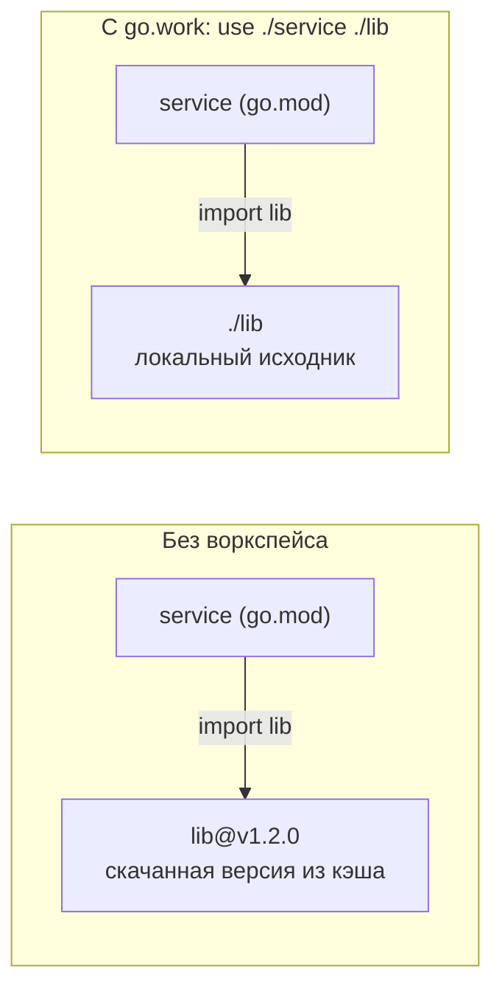

# Воркспейсы Go (`go.work`): разработка нескольких модулей вместе

В .NET работать сразу над несколькими проектами — норма по умолчанию: `.sln` собирает их вместе, а `ProjectReference` позволяет собирать один проект против исходников другого. В Go норма противоположная — **один самодостаточный модуль на репозиторий**. Но иногда вам действительно нужно разрабатывать несколько модулей одновременно: сервис и его общую библиотеку-модуль, набор модулей в монорепозитории, локальный патч зависимости через границу модулей. До Go 1.18 это делали временными `replace` в `go.mod` — и это было больно. **Воркспейсы (`go.work`)** решают задачу чисто.

Эта глава — подробный разбор: какую боль закрывает воркспейс, как им пользоваться, когда он нужен (а когда нет), коммитить его или нет, и чем он отличается от `replace`. Базовое знакомство было в главе [Зависимости и go-модули](./04-dependencies-go-modules.md); здесь — вглубь.

## Боль, которую закрывает воркспейс

Представьте два модуля, у каждого свой `go.mod`: сервис `service` зависит от общей библиотеки `lib` (отдельный модуль). Вы правите `lib` и хотите, чтобы `service` собирался против вашего **локального** `lib`, а не против опубликованной версии.

До 1.18 единственный способ — добавить в `go.mod` сервиса временный `replace`:

```go
// go.mod сервиса — ❌ временный локальный replace
require example.com/lib v1.2.0
replace example.com/lib => ../lib   // указывает на локальный каталог
```

Проблемы такого подхода:

- ❌ Этот `replace` с **относительным путём** нельзя коммитить: у коллеги и в CI каталога `../lib` нет — сборка сломается. А забыть убрать его перед коммитом/релизом очень легко.
- ❌ Если локально вы ведёте сразу несколько взаимозависимых модулей, таких `replace` накапливается много, и каждый надо помнить и вычищать.

Воркспейс выносит эту «локальную проводку» из `go.mod` в **отдельный файл, который не является частью модуля**. `go.mod` остаётся чистым и релизно-корректным.



## Что такое воркспейс

Воркспейс задаётся файлом `go.work`, который перечисляет каталоги локальных модулей через директиву `use`. Когда `go.work` активен (находится в текущем каталоге или выше по дереву), Go переходит в **режим воркспейса**: все перечисленные модули входят в сборку, а импорты между ними резолвятся в **локальный код**, переопределяя `require`/`replace` из их `go.mod` для этих модулей. Это слой **поверх** `go.mod`, локальный для вашей машины.

```go
// go.work
go 1.22

use (
    ./service
    ./lib
)

// при необходимости — общий replace на весь воркспейс:
// replace example.com/x => ./forks/x
```

Рядом автоматически появляется `go.work.sum` — контрольные суммы для зависимостей, нужных воркспейсу, но отсутствующих в `go.sum` отдельных модулей (механизм целостности тот же, что у `go.sum`, см. главу про модули).

## Как пользоваться: команды

```bash
# создать go.work и сразу добавить модули
go work init ./service ./lib

# добавить ещё один модуль позже
go work use ./tools

# рекурсивно добавить ВСЕ модули под текущим каталогом (удобно в монорепо)
go work use -r .

# протолкнуть выбранные воркспейсом версии зависимостей обратно в go.mod модулей
go work sync

# какой go.work сейчас активен (или пусто, если режима нет)
go env GOWORK

# разовый запуск БЕЗ воркспейса — так, как это увидит CI или потребитель
GOWORK=off go build ./...
```

Ключевое о механике:

- Go ищет `go.work`, поднимаясь от текущего каталога вверх (как `git` ищет `.git`). Нашёл — режим воркспейса включён для всех команд (`build`, `test`, `run`, `vet`).
- Переменная окружения `GOWORK` управляет режимом: путь к файлу включает конкретный воркспейс, `GOWORK=off` — выключает. Это удобно для CI и для проверки «а соберётся ли без воркспейса».
- `go work sync` — мост между воркспейсом и `go.mod`: он переносит версии, выбранные в режиме воркспейса, в `require` отдельных модулей, чтобы их обычные (неворкспейсные) сборки были согласованы.

## Когда использовать — и когда нет

✅ **Используйте воркспейс, когда:**

- Разрабатываете несколько **взаимозависимых модулей одновременно**: сервис + общая библиотека-модуль; несколько модулей монорепозитория.
- Нужно временно собрать или отладить **локальный патч зависимости** через границу модулей.
- Модули лежат в **разных репозиториях**, склонированных рядом, и вы хотите собрать их вместе локально.

❌ **Воркспейс не нужен, когда:**

- У вас **один модуль** — а это подавляющее большинство проектов. Не добавляйте `go.work` «на будущее»: одиночному модулю он не даёт ничего.
- Зависимость нужно перенаправить **постоянно** (форк, внутреннее зеркало) — это `replace` в `go.mod`, который коммитится, а не воркспейс.
- Для **CI и релиза** — там действуют обычные `go.mod`; воркспейс по своей природе локальный.

## Коммитить `go.work` или нет

Тонкий вопрос без единственно верного ответа — есть два сценария.

- **Не коммитить (по умолчанию для отдельных репозиториев / личной раскладки).** `go.work` кодирует **локальную** структуру каталогов конкретного разработчика (относительные пути `./service`, `./lib`) и набор модулей, над которыми **он** сейчас работает. У коллеги раскладка может отличаться — закоммиченный `go.work` сломает ему сборку. Поэтому исторический совет команды Go — добавить `go.work` и `go.work.sum` в `.gitignore`.
- **Коммитить (в монорепозитории с фиксированной раскладкой).** Если все модули лежат в одном репозитории по стабильным относительным путям, коммит `go.work` даёт всем единую рабочую область «из коробки»: `git clone` → всё собирается вместе. Это осознанный выбор для монорепо.

Эвристика: разные репозитории / индивидуальная раскладка → `.gitignore`; контролируемый монорепозиторий с фиксированной структурой → можно коммитить.

> **Параллель с .NET:** ситуация «коммитить или нет» похожа на разницу между общим `.sln`, который кладут в репозиторий, и личными/временными решениями, которые держат локально. В монорепо `go.work` играет роль коммитимого `.sln`; в разрозненных репозиториях — роль личного локального файла сборки.

## Воркспейс против `replace`

Обе конструкции умеют «подменить» источник модуля, но назначение у них разное.

| | `replace` в `go.mod` | `go.work` (`use`) |
| --- | --- | --- |
| Где живёт | в `go.mod` конкретного модуля | в отдельном файле воркспейса |
| Коммитится | да (часть модуля) | обычно нет (локальный) |
| Назначение | **постоянное** перенаправление (форк, зеркало) | **временная** локальная мультимодульная разработка |
| Влияние на потребителей | `replace` главного модуля **игнорируется**, когда модуль подключают как зависимость | только локальные сборки в воркспейсе |
| Главный риск | забыть убрать локальный относительный `replace` перед релизом ❌ | `go.mod` остаётся чистым ✅ |

Суть: воркспейс **выносит локальную проводку из коммитимого `go.mod`**, поэтому `go.mod` всегда остаётся корректным для релиза.

## Плюсы и минусы

✅ **Плюсы:**

- Локальная мультимодульная разработка **без правки `go.mod`**; `go.mod` остаётся релизно-корректным, нет риска закоммитить локальный `replace`.
- Легко добавлять и убирать модули из активного набора (`go work use`), не трогая код модулей.
- Работает поверх **отдельных репозиториев**, склонированных рядом.
- Включается и выключается одним переключателем `GOWORK`, без изменений в модулях.

❌ **Минусы и подводные камни:**

- Только **локальные** сборки. Воркспейс может **замаскировать** то, что вы забыли обновить `require` в `go.mod`: локально всё резолвится в локальный код и собирается, а CI без воркспейса (или внешний потребитель) — падает. Лечение: `go work sync` и периодическая проверка сборки с `GOWORK=off`.
- Не заменяет версионирование: для настоящего релиза всё равно нужно поднять версию в `go.mod` и поставить git-тег (см. Semantic Import Versioning в главе про модули).
- Относительные пути в `go.work` привязаны к раскладке: закоммиченный, но не подходящий чужой машине `go.work` ломает сборку.
- Для одномодульных проектов — лишняя сущность без пользы.
- CI и тулинг должны знать про режим воркспейса (или явно выставлять `GOWORK=off`).

## Параллель с .NET (сводно)

- `go.work` с несколькими `use` ≈ локальный `.sln`, агрегирующий несколько независимо версионируемых проектов/модулей для совместной разработки. `ProjectReference` в .NET позволяет собирать против **исходников** соседнего проекта вместо его NuGet-пакета — `go.work` даёт ровно эту возможность «собирать против локального исходника другого модуля», не трогая манифест.
- Боль «временно поставил `replace`, не забыть убрать перед релизом» ≈ временная замена `PackageReference` (NuGet) на `ProjectReference` (локальный исходник) на период разработки с откатом перед релизом. `go.work` — чистый способ сделать эту подмену **локально, не меняя коммитимый манифест**.
- Разница в философии: в .NET `.sln` — **основной и коммитируемый** способ организации, вы всегда «внутри решения». В Go норма — самодостаточный одиночный модуль, а `go.work` — **опциональный локальный инструмент**, который достают только когда реально нужно собирать несколько модулей вместе.

## Итог

- Воркспейс (`go.work`, с Go 1.18) собирает **несколько локальных модулей** в единую рабочую область: импорты между ними резолвятся в локальный код, переопределяя `go.mod`.
- Он закрывает боль мультимодульной разработки **без временных `replace`** в `go.mod` — манифест остаётся чистым и релизно-корректным.
- Команды: `go work init`, `go work use` (в т.ч. `-r`), `go work sync`; режим управляется переменной `GOWORK` (`off` — выключить).
- Нужен **только** для одновременной работы над несколькими модулями; одномодульному проекту (большинство) — не нужен.
- Коммитить: обычно **нет** (личная локальная раскладка → `.gitignore`); в монорепо с фиксированной структурой — можно.
- Главный риск — маскировка незакоммиченных версий: проверяйте сборку с `GOWORK=off` и используйте `go work sync`.

---

[⌂ Главная](../../README.md) · [↑ Раздел](./README.md) · [← Предыдущий: Зависимости и go-модули](./04-dependencies-go-modules.md) · [→ Следующий: Сравнение с .NET](./06-comparison-with-dotnet.md)
