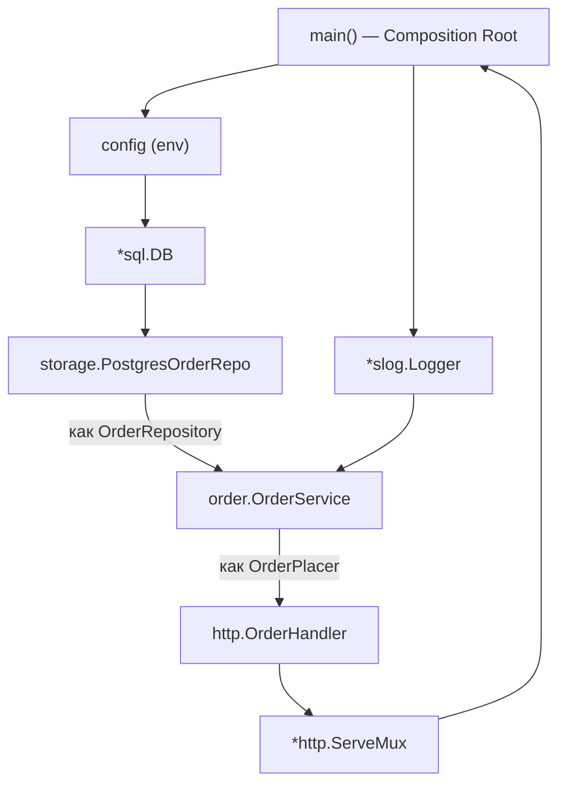
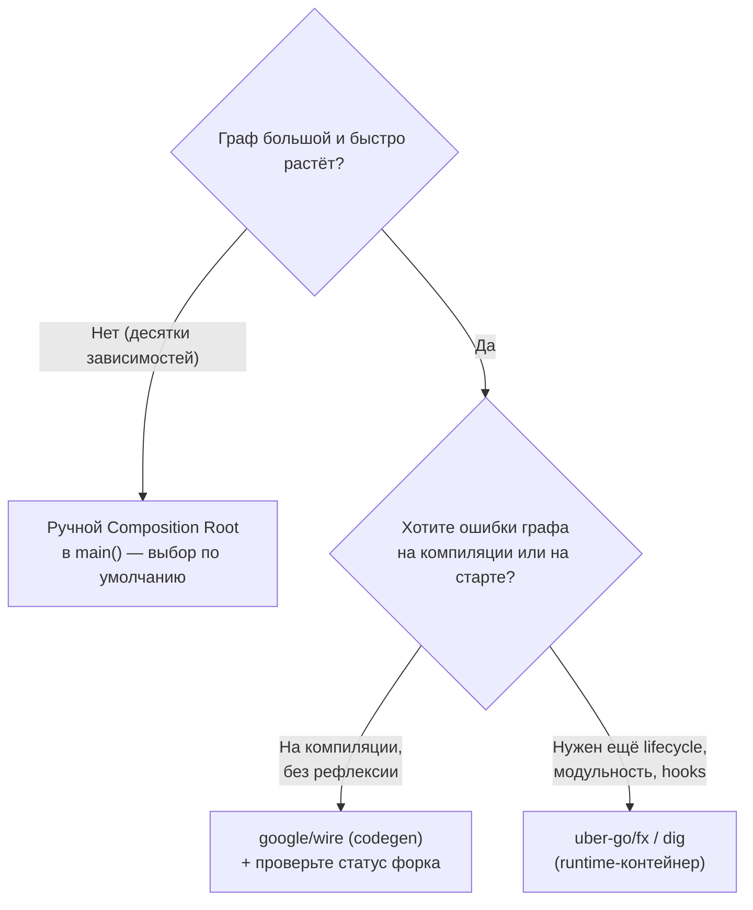

# Внедрение зависимостей (DI)

В .NET внедрение зависимостей — это инфраструктура. Вы регистрируете типы в `IServiceCollection`, а `ServiceProvider` на рантайме разрешает граф: видит, что `OrderService` требует в конструкторе `IOrderRepository`, находит зарегистрированную реализацию, создаёт её (попутно разрешая её собственные зависимости) и отдаёт готовый объект. Граф вы описываете декларативно (`AddScoped`, `AddSingleton`), а собирает его контейнер через рефлексию.

В Go первая перенастройка мышления здесь такая: **встроенного DI-контейнера нет, и культура — ручной DI.** Принцип инверсии контроля (IoC) и сам паттерн «внедрение зависимостей» остаются — зависимость по-прежнему приходит извне, а не создаётся внутри, — но **механизма авторазрешения нет**. Вы собираете дерево зависимостей сами, явным кодом, обычно в `main()`. Это не пробел экосистемы, а сознательный выбор: Go-сообщество ценит явность и «отсутствие магии» выше, чем экономию строк на проводке.

> **Параллель с .NET:** разделите две вещи. **DI как паттерн** (зависимость передаётся снаружи через конструктор) в Go жив и идиоматичен. **DI-контейнер как механизм** (`ServiceProvider`, который сам разрешает граф) в Go по умолчанию отсутствует — его роль выполняет ваш код в `main`. То есть вы пишете руками то, что в .NET за вас делает контейнер.

## Constructor injection: фундамент

Базовая единица DI в Go — конструктор-функция `NewXxx`, принимающая зависимости и возвращающая готовый объект. Сама зависимость живёт как **поле структуры**, причём поле имеет **интерфейсный тип** (контракт), а не конкретный.

```go
// Зависимость объявлена как интерфейс — потребителю важен контракт, не реализация.
type OrderRepository interface {
	Save(ctx context.Context, o Order) error
	ByID(ctx context.Context, id string) (Order, error)
}

type OrderService struct {
	repo OrderRepository // зависимость = поле интерфейсного типа
	log  *slog.Logger
}

// Конструктор принимает зависимости снаружи. Это и есть constructor injection.
func NewOrderService(repo OrderRepository, log *slog.Logger) *OrderService {
	return &OrderService{repo: repo, log: log}
}

func (s *OrderService) Place(ctx context.Context, o Order) error {
	if err := s.repo.Save(ctx, o); err != nil {
		return fmt.Errorf("place order: %w", err)
	}
	s.log.InfoContext(ctx, "order placed", "id", o.ID)
	return nil
}
```

Здесь нет ни атрибутов, ни регистрации, ни контейнера. `OrderService` ничего не знает о том, **какая** реализация `OrderRepository` ему достанется, — он работает с контрактом. Кто и чем заполнит это поле — решается в одной точке сборки (см. ниже).

> **Параллель с .NET:** `NewOrderService(repo, log)` — это ровно ваш `public OrderService(IOrderRepository repo, ILogger log)`. Разница в том, что в .NET вы этот конструктор **никогда не вызываете руками** — его вызывает контейнер, разрешив `IOrderRepository` по регистрации. В Go вы вызываете `NewOrderService(...)` сами и сами решаете, что передать первым аргументом.

## «Accept interfaces, return structs»

Это, пожалуй, главная идиома проектирования в Go, и она напрямую влияет на DI. Формулировка: **принимай интерфейсы, возвращай структуры.**

- **Return structs.** Конструктор `NewOrderService` возвращает конкретный `*OrderService`, а не интерфейс. Вызывающий получает полный тип со всеми методами и полями; абстрагировать его раньше времени незачем.
- **Accept interfaces.** Зависимости (входы) принимаются как интерфейсы — минимально узкие, описывающие лишь то, что реально используется.

Второе следствие переворачивает .NET-привычку: **интерфейс объявляет потребитель, а не реализация.** В C# `IOrderRepository` обычно живёт рядом с `OrderRepository` (в слое данных) и «принадлежит» реализации. В Go интерфейс принято объявлять в пакете-**потребителе** — там, где он используется. `OrderService` сам декларирует, какой `OrderRepository` ему нужен; конкретная реализация в другом пакете удовлетворяет этот интерфейс **неявно** (структурная типизация, см. [Раздел 2](../02-memory-gc-and-types/04-interfaces-and-duck-typing.md)), даже не импортируя пакет с интерфейсом.

```go
// Пакет storage: конкретная реализация. Об интерфейсе OrderRepository она НЕ знает.
package storage

type PostgresOrderRepo struct {
	db *sql.DB
}

func NewPostgresOrderRepo(db *sql.DB) *PostgresOrderRepo { // return struct ✅
	return &PostgresOrderRepo{db: db}
}

func (r *PostgresOrderRepo) Save(ctx context.Context, o order.Order) error { /* ... */ return nil }
func (r *PostgresOrderRepo) ByID(ctx context.Context, id string) (order.Order, error) { /* ... */ return order.Order{}, nil }
```

`PostgresOrderRepo` возвращается как структура и нигде не упоминает интерфейс `order.OrderRepository` — но удовлетворяет ему, потому что имеет нужные методы. Это и есть «accept interfaces, return structs» в действии: производитель отдаёт конкретный тип, а потребитель сам решает, через какой узкий контракт его принять.

> **Параллель с .NET:** в C# интерфейс — это явный контракт, который реализация декларирует (`class PostgresOrderRepo : IOrderRepository`) и который обычно лежит в одной сборке с реализацией. В Go направление обратное: интерфейс — это **запрос потребителя**, объявленный на его стороне, а реализация совпадает с ним структурно и об этом контракте может вообще не знать. Практический выигрыш — нет «интерфейсов ради интерфейсов» в слое данных и нет лишней связанности: потребитель не зависит от пакета реализации.

## Composition Root: дерево собирается в `main()`

Раз контейнера нет, должно быть одно место, где все конкретные реализации создаются и сшиваются в граф. Это место называется **Composition Root**, и в Go это, как правило, `main()` (или фабрика, которую `main` вызывает). Дерево собирается **сверху вниз**: сначала «листья» (соединение с БД, конфиг, логгер), затем то, что от них зависит, и так до HTTP-хендлеров на вершине.

Рассмотрим типичный трёхслойный граф: **репозиторий → сервис → хендлер**.



Стрелки «как `OrderRepository`» / «как `OrderPlacer`» показывают ключевое: на каждом стыке конкретный тип подставляется через **интерфейс, объявленный потребителем**. Код сборки:

```go
package main

func main() {
	ctx := context.Background()

	// 1. Листья графа: конфиг, логгер, соединение с БД.
	cfg, err := config.Load() // маппинг env → структура (см. главу 2)
	if err != nil {
		log.Fatalf("config: %v", err)
	}
	logger := slog.New(slog.NewJSONHandler(os.Stdout, nil))

	db, err := sql.Open("pgx", cfg.DatabaseURL)
	if err != nil {
		log.Fatalf("db open: %v", err)
	}
	defer db.Close()

	// 2. Поднимаемся вверх по дереву: repo ← db, service ← repo+logger, handler ← service.
	repo := storage.NewPostgresOrderRepo(db)        // *PostgresOrderRepo
	svc := order.NewOrderService(repo, logger)       // repo подставляется как OrderRepository
	handler := httpapi.NewOrderHandler(svc, logger)  // svc подставляется как OrderPlacer

	// 3. Вершина: маршрутизация и запуск сервера.
	mux := http.NewServeMux()
	handler.Register(mux)

	srv := &http.Server{Addr: cfg.Addr, Handler: mux}
	logger.InfoContext(ctx, "listening", "addr", cfg.Addr)
	if err := srv.ListenAndServe(); err != nil && !errors.Is(err, http.ErrServerClosed) {
		log.Fatalf("server: %v", err)
	}
}
```

Сопоставьте это с .NET, где тот же граф вы описываете **декларативно**, а сшивает его контейнер:

```csharp
// .NET: вы регистрируете типы, граф разрешает ServiceProvider (через рефлексию).
var builder = WebApplication.CreateBuilder(args);
builder.Services.AddSingleton<IOrderRepository, PostgresOrderRepo>();
builder.Services.AddScoped<OrderService>();
// Контейнер сам увидит, что OrderService требует IOrderRepository, и подставит его.
var app = builder.Build();
```

В .NET связи между типами заданы регистрациями, а **порядок** создания и подстановку вычисляет контейнер на рантайме. В Go связи и порядок — это и есть тот явный код в `main`: что в каком порядке создать и что куда передать, вы пишете сами и видите целиком.

Весь граф зависимостей виден в десятке строк, сверху вниз, без рефлексии. Подмена реализации — это **смена одной строки** в Composition Root: захотели in-memory репозиторий для локального запуска — `repo := storage.NewInMemoryOrderRepo()`, и больше ничего не меняется, потому что `svc` принимает интерфейс. В тестах вы точно так же передаёте в `NewOrderService` мок-реализацию `OrderRepository` напрямую, **без всякого контейнера и без подмены регистраций**.

Хендлер на вершине, для полноты картины, тоже принимает интерфейс — но уже **свой**, объявленный в пакете `httpapi`:

```go
package httpapi

// Хендлеру не нужен весь OrderService — только умение разместить заказ.
// Поэтому он объявляет узкий интерфейс под себя.
type OrderPlacer interface {
	Place(ctx context.Context, o order.Order) error
}

type OrderHandler struct {
	svc OrderPlacer
	log *slog.Logger
}

func NewOrderHandler(svc OrderPlacer, log *slog.Logger) *OrderHandler {
	return &OrderHandler{svc: svc, log: log}
}
```

Обратите внимание на узость `OrderPlacer`: хендлеру не нужен весь `OrderService`, достаточно метода `Place`. Это идиоматично — узкие интерфейсы на стороне потребителя проще мокать и они честнее описывают зависимость. В .NET под влиянием ISP вы бы тоже могли выделить узкий интерфейс, но на практике чаще регистрируется и инъектируется «толстый» сервисный интерфейс целиком.

### Где в Go аналог lifetimes (Singleton/Scoped/Transient)?

В .NET время жизни — это **настройка контейнера**: `AddSingleton` отдаёт один экземпляр на всё приложение, `AddTransient` создаёт новый на каждое разрешение, `AddScoped` — один на scope (обычно HTTP-запрос). Контейнер управляет этим за вас.

В Go отдельного понятия «lifetime» нет — оно **выражается тем, где в коде вы создаёте объект**:

- **Singleton** = создать один раз в `main` и переиспользовать (как `db`, `logger`, `svc` выше). Это поведение по умолчанию для всего, что собрано в Composition Root.
- **Transient** = создавать новый экземпляр там, где он нужен (просто вызвать `NewXxx(...)` в нужном месте).
- **Scoped (per-request)** = создавать в обработчике запроса. Но request-scoped **данные** (trace id, текущий пользователь) в Go передают не через DI-scope, а через `context.Context` ([Раздел 3](../03-concurrency/03-select-and-context.md)). Отдельного «scope» как у контейнера нет.

> **Параллель с .NET:** lifetimes в Go не настраиваются — они «получаются» из структуры кода. Singleton — это просто переменная, созданная в `main`. Главное практическое следствие: в Go нет классической .NET-ловушки **captive dependency** (когда Singleton случайно держит Scoped-зависимость), потому что нет контейнера, который мог бы вас в неё завести, — все времена жизни вы расставляете руками и видите глазами.

## Инструменты DI: когда контейнер всё же берут

Ручная сборка отлично масштабируется до десятков зависимостей. Но на больших графах (сотни провайдеров, глубокая вложенность) `main` распухает, а ручной порядок инициализации становится утомительным. Тогда в ход идут инструменты. Их два класса.

### `google/wire` — compile-time codegen

[`google/wire`](https://github.com/google/wire) генерирует код проводки **на этапе компиляции**. Вы описываете «провайдеры» (те же `NewXxx`), а `wire` по сигнатурам строит граф и **генерирует** обычный Go-файл с ручной сборкой — ровно такой, какой вы написали бы сами.

```go
//go:build wireinject

func InitializeServer() (*http.Server, error) {
	wire.Build(
		config.Load,
		storage.NewPostgresOrderRepo,
		wire.Bind(new(order.OrderRepository), new(*storage.PostgresOrderRepo)),
		order.NewOrderService,
		// ... остальные провайдеры
	)
	return nil, nil // тело-заглушка; реальную сборку wire сгенерирует
}
```

Команда `wire` создаёт `wire_gen.go` с настоящей реализацией `InitializeServer`. На рантайме **никакой рефлексии нет** — это статический код, который проверяет компилятор; недостающую зависимость вы увидите как ошибку компиляции, а не как панику при старте.

> **Важно про статус:** официальный репозиторий `google/wire` **заархивирован в августе 2025** и переведён в режим read-only (в проде у многих он по-прежнему работает, формат стабилен). Если нужен активно поддерживаемый аналог, сообщество мигрирует на форк [`goforj/wire`](https://github.com/goforj/wire), совместимый с импортом `github.com/google/wire`. Перед стартом нового проекта на codegen-DI проверьте актуальное состояние форков.

### `uber-go/dig` и `uber-go/fx` — runtime-контейнер

[`uber-go/dig`](https://github.com/uber-go/dig) — это **рефлексивный** DI-контейнер: вы регистрируете конструкторы (`Provide`), а `dig` на рантайме разрешает граф по типам — ближайший по духу аналог `ServiceProvider` из .NET. [`uber-go/fx`](https://github.com/uber-go/fx) (актуальная версия v1.24.0) — это фреймворк приложения поверх `dig`: добавляет управление жизненным циклом (`OnStart`/`OnStop` хуки), graceful shutdown и модульность.

```go
fx.New(
	fx.Provide(
		config.Load,
		storage.NewPostgresOrderRepo,
		fx.Annotate(
			order.NewOrderService,
			fx.As(new(order.OrderRepository)), // привязка реализации к интерфейсу
		),
		newHTTPServer,
	),
	fx.Invoke(func(*http.Server) {}), // точка входа: запросить корень графа
).Run()
```

`fx` сам определит порядок создания, запустит хуки и корректно остановит всё при завершении. Цена — рефлексия на старте, неявный порядок и ошибки графа на рантайме (паника при запуске), а не на компиляции.

### Когда что оправдано



| Инструмент | Когда разрешается граф | Рефлексия | Аналог в .NET | Когда оправдан |
| --- | --- | --- | --- | --- |
| Ручной DI (`main`) | при компиляции (вы пишете код) | нет | — (вы — контейнер) | По умолчанию; малые и средние графы |
| `google/wire` | при компиляции (codegen) | нет | compile-time контейнер | Большой граф, важна статическая проверка и нулевой рантайм-оверхед |
| `uber-go/fx` / `dig` | на рантайме (старт) | да | `ServiceProvider` ближе всего | Очень большой граф + нужен lifecycle/модульность |

**Почему многие Go-команды обходятся без инструментов вовсе.** Для типичного сервиса ручная сборка — это явный, отлаживаемый код без зависимостей и без «магии»: граф виден целиком, переход к определению работает обычным «go to definition», а не уводит в сгенерированный или рефлексивный слой. Сравните с .NET, где `services.AddScoped<...>()` лаконично, но цена — невидимый на глаз граф и ошибки разрешения, всплывающие лишь при первом запросе. Go-сообщество массово считает, что для большинства проектов несколько десятков строк проводки в `main` **дешевле**, чем привнесённый DI-фреймворк. Инструмент берут тогда, когда ручная сборка реально начинает болеть, — а не превентивно.

> **Параллель с .NET:** соответствие такое — `google/wire` ≈ DI, разрешаемый **на компиляции** (как если бы Source Generator развернул ваши `AddScoped` в явный код без рантайм-контейнера); `fx`/`dig` ≈ привычный **runtime-контейнер** `ServiceProvider` с рефлексией и жизненным циклом. Но дефолт всей экосистемы — это не контейнер вообще, а тот самый ручной Composition Root, которого в мире .NET почти не встретишь.

## Итог

- **DI как паттерн** в Go идиоматичен (зависимость приходит через конструктор `NewXxx`), но **DI-контейнера в стандартной поставке нет** — культура ручного DI, осознанный выбор в пользу явности.
- **Constructor injection**: зависимость — это поле структуры **интерфейсного типа**, заполняемое конструктором. Никаких атрибутов и регистраций.
- **«Accept interfaces, return structs»**: конструкторы возвращают конкретные типы, а зависимости принимают узкими интерфейсами, причём **интерфейс объявляет потребитель** (обратное к .NET направление), а реализация удовлетворяет его неявно.
- **Composition Root** — одно место (обычно `main()`), где весь граф собирается сверху вниз явным кодом. Подмена реализации = одна строка; тесты передают моки напрямую, без контейнера.
- **Lifetimes** (Singleton/Scoped/Transient) в Go не настраиваются, а **выражаются тем, где вы создаёте объект**; request-scoped данные идут через `context.Context`, а не через DI-scope.
- **Инструменты по необходимости**: `google/wire` (compile-time codegen, без рефлексии; репозиторий заархивирован в 2025 — смотрите форк `goforj/wire`) и `uber-go/fx`/`dig` (runtime-контейнер с lifecycle, ближе к `ServiceProvider`). Большинство сервисов обходятся без них.

Дальше — откуда сервис берёт настройки: философия `env`, маппинг переменных окружения в структуру и обзор конфиг-библиотек.

---

[⌂ Главная](../../README.md) · [↑ Раздел](./README.md) · [← Предыдущий: Обзор раздела](./README.md) · [→ Следующий: Конфигурация](./02-configuration.md)
