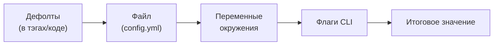

# Конфигурация

В .NET конфигурация — это слоёная система `IConfiguration`. `appsettings.json` лежит в репозитории как база, `appsettings.{Environment}.json` переопределяет его по окружению, сверху накладываются переменные окружения, секреты (User Secrets, Key Vault) и аргументы командной строки. Всё это сливается в единое дерево ключей, а `IOptions<T>` биндит его секции в типизированные классы. Файл-в-репозитории здесь — нормальная отправная точка.

В Go доминирует другая философия — **12-factor app**: *«store config in the environment»*. Конфигурация (адреса БД, таймауты, фиче-флаги, секреты) живёт в **переменных окружения**, а не в файлах внутри репозитория. Причина прагматична: один и тот же собранный бинарник (или Docker-образ) должен запускаться в dev, staging и prod **без пересборки** — меняется только окружение. Файл с настройками в репозитории нарушает это: он привязывает артефакт к среде и провоцирует утечку секретов в git.

> **Параллель с .NET:** в терминах .NET это похоже на конфигурацию, где **есть только Environment Variables Provider** и нет `appsettings.json` в репозитории. Идея «12-factor» применима и к .NET (в контейнерах часто так и делают, прокидывая `ConnectionStrings__Default` через env), но там она опциональна, а в Go это поведение по умолчанию и культурная норма.

## Маппинг env → структура

Базовый строительный блок — типизированная структура конфигурации, поля которой помечены тэгом `env:"..."` (про синтаксис тэгов подробно — в [следующей главе](./03-struct-tags-reflection-validation.md)). Библиотека читает переменные окружения и через рефлексию заполняет поля, приводя строки к нужным типам.

Можно прочитать env и руками (`os.Getenv` + `strconv`), но на десятке полей это превращается в гору шаблонного кода с ручным парсингом и дефолтами. Поэтому идиоматично берут небольшую библиотеку. Рассмотрим три популярных варианта и их нишу.

| Библиотека | Источники | Дефолты | Вес / зависимости | Ниша |
| --- | --- | --- | --- | --- |
| [`caarlos0/env`](https://github.com/caarlos0/env) (v11) | только env | `envDefault:"..."` | минимальный | «Чистый 12-factor»: только env, ничего лишнего |
| [`ilyakaznacheev/cleanenv`](https://github.com/ilyakaznacheev/cleanenv) | env **+ файлы** (YAML/JSON/TOML/.env) | `env-default:"..."` | лёгкий | Нужны и env, и файл-дефолты, и `.env` локально |
| [`spf13/viper`](https://github.com/spf13/viper) (v1.21) | env, файлы, флаги, **remote** (etcd/Consul), live-reload | через `SetDefault` | тяжёлый, много транзитивных зависимостей | Сложные требования: много форматов, watch, удалённый конфиг |

Практическое правило: для типичного сервиса начинайте с `caarlos0/env` или `cleanenv` — они закрывают 90% случаев маленькой зависимостью. `viper` мощный, но тащит значительный граф зависимостей и оправдан, когда вам реально нужны его «батарейки» (несколько источников, remote-конфиг, горячая перезагрузка). Брать `viper` «на всякий случай» — против духа Go.

### Пример: `caarlos0/env`

Чистый 12-factor: вся конфигурация — из окружения, с дефолтами прямо в тэгах.

```go
package config

import (
	"time"

	"github.com/caarlos0/env/v11"
)

type Config struct {
	Addr        string        `env:"ADDR" envDefault:":8080"`
	DatabaseURL string        `env:"DATABASE_URL,required"`        // ошибка, если переменной нет
	LogLevel    string        `env:"LOG_LEVEL" envDefault:"info"`
	Timeout     time.Duration `env:"HTTP_TIMEOUT" envDefault:"5s"` // парсится как time.Duration
	Workers     int           `env:"WORKERS" envDefault:"4"`       // парсится в int
	Hosts       []string      `env:"HOSTS" envSeparator:","`       // "a,b,c" → []string{"a","b","c"}
	Debug       bool          `env:"DEBUG" envDefault:"false"`
}

// Load — часть Composition Root: один вызов превращает окружение в типизированный Config.
func Load() (*Config, error) {
	cfg, err := env.ParseAs[Config]() // generic-парсинг (Go 1.18+); вернёт Config или ошибку
	if err != nil {
		return nil, fmt.Errorf("parse config: %w", err)
	}
	return &cfg, nil
}
```

Что здесь происходит:

- `env.ParseAs[Config]()` читает окружение и заполняет поля, **приводя типы** (строка → `int`, `bool`, `time.Duration`, слайс). Это то, что в .NET за вас делает биндер `IOptions<T>`.
- `envDefault` задаёт значение, если переменной нет, — аналог дефолтов в `appsettings.json`.
- Опция `,required` делает переменную обязательной: при отсутствии `Load` вернёт ошибку, и приложение упадёт на старте с понятным сообщением, а не позже с `nil`-конфигом. Это идиома **fail-fast**.
- `envSeparator` разбивает строку в слайс.

Вызов `Load()` встраивается в Composition Root из [предыдущей главы](./01-dependency-injection.md) как первый «лист» графа. В .NET тот же результат — типизированный конфиг из настроек — даёт связка `appsettings.json` + биндинг:

```csharp
// .NET: секция appsettings.json (+ env override) биндится в типизированный класс.
public sealed class Config
{
    public string Addr { get; init; } = ":8080";    // дефолт прямо в свойстве
    public required string DatabaseURL { get; init; } // required-свойство C# 11
    public TimeSpan Timeout { get; init; } = TimeSpan.FromSeconds(5);
}

builder.Services.Configure<Config>(builder.Configuration.GetSection("App"));
// далее в сервис инжектится IOptions<Config>.
```

Разница не в идее (структура + приведение типов рефлексией), а в источнике и способе доставки: в .NET база — `appsettings.json`, а конфиг приходит в сервис как инжектируемый `IOptions<Config>`; в Go база — окружение, а конфиг вы получаете явным вызовом `Load()` и передаёте дальше руками.

### Пример: `cleanenv` (env + файл + дефолты)

Если хочется и переменных окружения, и файла-дефолтов (например, базовый `config.yml` в образе, переопределяемый env в проде), берут `cleanenv`. Один набор тэгов обслуживает и YAML, и env:

```go
type Config struct {
	Addr     string `yaml:"addr" env:"ADDR" env-default:":8080"`
	Database struct {
		URL string `yaml:"url" env:"DATABASE_URL" env-required:"true"`
	} `yaml:"database"`
	LogLevel string `yaml:"log_level" env:"LOG_LEVEL" env-default:"info"`
}

// ReadConfig: сперва читает файл, затем env (переопределяет файл), затем дефолты.
err := cleanenv.ReadConfig("config.yml", &cfg)

// ReadEnv: только окружение, без файла (чистый 12-factor).
err := cleanenv.ReadEnv(&cfg)
```

Полезные тэги cleanenv: `env-default` (дефолт), `env-required:"true"` (обязательная), `env-separator` (разделитель списков), `env-description` (для автогенерации справки по переменным). Приоритет внутри `ReadConfig` фиксирован: **env перекрывает файл, файл перекрывает дефолты**.

> **Параллель с .NET:** `cleanenv.ReadConfig("config.yml", &cfg)` — это, по сути, «`appsettings.yml` как база + Environment Variables Provider поверх + дефолты», свёрнутые в один вызов с одной структурой. Различие: в .NET слои и их порядок вы настраиваете в `ConfigurationBuilder` (можно добавить сколько угодно провайдеров), а здесь набор источников и их приоритет заданы библиотекой.

## Флаги и приоритет источников

Кроме env, у Go есть стандартный пакет [`flag`](https://pkg.go.dev/flag) для аргументов командной строки — типичен для CLI-утилит и операционных параметров (`--config-path`, `--migrate`).

```go
addr := flag.String("addr", ":8080", "HTTP listen address")
flag.Parse()
fmt.Println(*addr) // запуск: ./server --addr=:9000
```

Когда источников несколько, важен **порядок приоритета**. Устоявшаяся конвенция (её же реализует `viper`, и её обычно воспроизводят руками):



Чем правее источник, тем выше приоритет: **флаги перекрывают env, env перекрывает файл, файл перекрывает дефолты**. Это та же иерархия, что в .NET задаёт порядок регистрации провайдеров в `ConfigurationBuilder` (последний добавленный выигрывает). Если вы собираете несколько источников вручную, реализуйте именно этот порядок — он привычен и предсказуем для эксплуатации.

> **Параллель с .NET:** `flag` ≈ Command-Line Configuration Provider. Сам приоритет «флаги > env > файл > дефолты» концептуально совпадает с .NET, но в Go его либо обеспечивает библиотека (`viper`), либо вы выкладываете руками; «из коробки» единого слоёного дерева, как `IConfiguration`, нет.

## Секреты

12-factor распространяется и на секреты, и здесь правила жёсткие:

- ❌ **Никогда не коммитьте секреты в git** — ни в коде, ни в `config.yml`, ни в `.env`. Файл `.env` добавляют в `.gitignore`.
- ✅ **`.env` — только для локальной разработки.** Его можно подгружать локально (например, [`joho/godotenv`](https://github.com/joho/godotenv) или средствами IDE/`docker compose`), но в проде секреты приходят из реального окружения. Важный нюанс: `godotenv` лишь **загружает** `.env` в переменные окружения процесса — а уже их читает ваша конфиг-библиотека (`env.Parse`/`cleanenv`). Это не замена парсеру, а его «питатель».
- ✅ **В проде** секреты инжектируются платформой: Kubernetes Secrets как env, секрет-менеджеры (Vault, AWS/GCP Secrets Manager), CI/CD-переменные. Для приложения это по-прежнему просто переменные окружения — код не меняется.

> **Параллель с .NET:** связка соответствует так: `.env` локально ≈ **User Secrets** (тоже не в репозитории, только для dev); прод-секреты из платформы ≈ **Key Vault / переменные окружения контейнера**. Принцип «секреты вне репозитория» в обеих экосистемах одинаков. Разница чисто механическая: в .NET секрет-провайдеры подключаются как ещё один слой `IConfiguration`, а в Go секрет почти всегда сводится к переменной окружения, которую читает та же конфиг-структура, — отдельного «провайдера секретов» в коде нет.

## Итог

- Философия Go — **12-factor**: конфиг в **переменных окружения**, а не в файлах репозитория; один артефакт запускается в любой среде без пересборки. Это поведение по умолчанию, в отличие от опциональной env-конфигурации в .NET.
- Базовый приём — **маппинг env → структура** с тэгами `env:"..."` и дефолтами; библиотека через рефлексию приводит строки к типам (как `IOptions<T>` binding).
- Выбор библиотеки: `caarlos0/env` (только env, минимум) и `cleanenv` (env + файлы + дефолты) покрывают почти всё; `viper` мощный (много источников, remote, watch), но тяжёлый — берут под реальные сложные требования, а не превентивно.
- **Флаги** (`flag`) — для CLI/операционных параметров; приоритет источников: **флаги > env > файл > дефолты** (как порядок провайдеров в `ConfigurationBuilder`).
- **Секреты** не коммитят: `.env` — только локально (`godotenv` лишь загружает его в окружение), в проде секреты приходят из платформы как обычные переменные окружения.

Дальше — механика, на которой держится и конфиг, и валидация: что такое struct tags, как их читает рефлексия и какова её цена.

---

[⌂ Главная](../../README.md) · [↑ Раздел](./README.md) · [← Предыдущий: Внедрение зависимостей](./01-dependency-injection.md) · [→ Следующий: Тэги структур, рефлексия, валидация](./03-struct-tags-reflection-validation.md)
