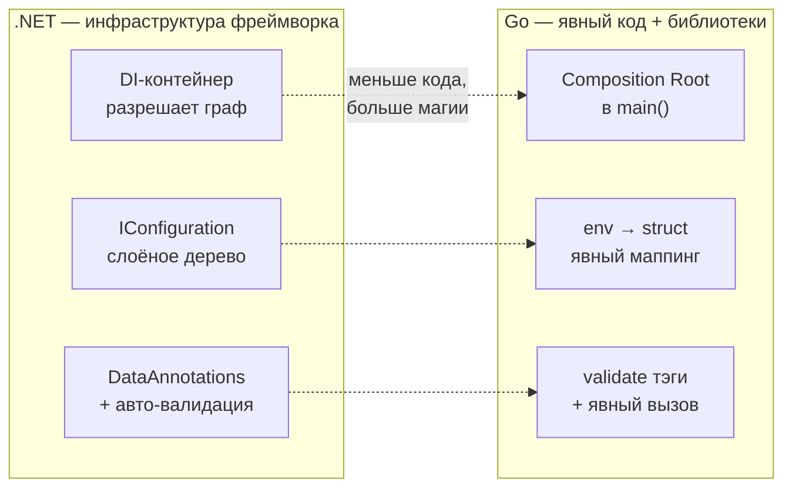

# Сравнение с .NET

Это итоговая глава раздела — консолидированный «мостик» между тем, как .NET и Go решают три задачи прикладной архитектуры: **сборку зависимостей, конфигурацию и валидацию**. Главы выше разбирали каждую тему отдельно; здесь мы сводим всё в таблицы и явно проговариваем сквозную мысль раздела. А мысль одна: там, где .NET предлагает **фреймворк-инфраструктуру** (контейнер, `IConfiguration`, DataAnnotations), Go предлагает **явный код плюс лёгкие библиотеки**, сознательно меняя лаконичность на видимость и предсказуемость.

## Сквозное различие: «магия фреймворка» vs явность

Во всех трёх темах повторяется один и тот же сдвиг.

.NET оптимизирует под **меньше шаблонного кода**: контейнер сам найдёт реализацию, конфиг сам сольёт слои, модель сама провалидируется в пайплайне. Цена — поведение, которого не видно в коде, и ошибки, всплывающие на рантайме (не разрешилась зависимость, не нашёлся ключ конфига). Go оптимизирует под **видимость**: граф зависимостей читается в `main`, источник каждой настройки прослеживается, валидация — это явный вызов. Цена — больше строк проводки. Это не «лучше/хуже», а разный инженерный компромисс; ниже — по каждой теме предметно.

## DI: контейнер vs Composition Root

| Аспект | .NET (`IServiceCollection`) | Go (ручной DI) |
| --- | --- | --- |
| Разрешение графа | автоматически контейнером (рефлексия на рантайме) | вручную, явным кодом в `main()` |
| Регистрация | `AddScoped<IFoo, Foo>()` | вызов `NewFoo(deps...)` в нужном порядке |
| Где живёт интерфейс | у реализации (слой данных) | у **потребителя** (узкий контракт) |
| Время жизни | настройка: Singleton / Scoped / Transient | следствие места создания объекта |
| Подмена для тестов | подмена регистрации в контейнере | передать мок прямо в конструктор |
| Когда видна ошибка графа | на рантайме (первое разрешение) | на компиляции (не собралось) |
| Request-scoped данные | `Scoped`-сервисы | `context.Context` |

**Плюсы Composition Root (Go):**

- ✅ **Явность.** Весь граф виден в одном месте сверху вниз; «go to definition» ведёт к реальному коду, а не в рефлексивный/сгенерированный слой.
- ✅ **Нет магии и рефлексии** на старте — детерминированный порядок инициализации, ошибки на компиляции.
- ✅ **Тривиальные тесты** — мок передаётся в конструктор напрямую, без подмены регистраций и без контейнера.
- ✅ Нет классов ошибок контейнера: **captive dependency** (Singleton держит Scoped) попросту негде возникнуть.

**Минусы:**

- ❌ **Бойлерплейт.** На большом графе `main` распухает; проводку пишут руками.
- ❌ Нет «из коробки» управления жизненным циклом (graceful start/stop) — это либо руками, либо через `fx`.

**Чем закрывают минусы:** `google/wire` (codegen, разрешение графа на компиляции, без рантайм-рефлексии; репозиторий заархивирован в 2025 — см. форк `goforj/wire`) или `uber-go/fx`/`dig` (runtime-контейнер с lifecycle, ближайший аналог `ServiceProvider`). Но дефолт экосистемы — ручная сборка; инструмент берут, когда она реально начинает болеть.

> **Параллель с .NET:** соответствие времён жизни особенно важно. В .NET lifetime — это **аргумент регистрации** (`AddSingleton`/`AddScoped`/`AddTransient`). В Go это не настройка, а **место в коде**: Singleton — переменная в `main`; Transient — `NewXxx()` там, где нужен; Scoped — создание в обработчике запроса (а сквозные данные запроса — через `context`). Переучивайтесь искать «время жизни» не в конфигурации контейнера, а в структуре кода.

## Конфигурация: `IConfiguration`/`IOptions` vs env + маппинг

| Аспект | .NET | Go |
| --- | --- | --- |
| Базовый источник | `appsettings.json` в репозитории | переменные окружения (12-factor) |
| Дерево источников | `ConfigurationBuilder`: json + env + секреты + CLI | обычно один источник (env), иногда + файл |
| Биндинг в типы | `IOptions<T>` (рефлексия в DI) | `env.Parse(&cfg)` / `cleanenv.ReadEnv(&cfg)` — явный вызов |
| Дефолты | значения в `appsettings.json` | тэг `envDefault`/`env-default` |
| Обязательность | вручную (валидация options) | опция `,required` / `env-required` (fail-fast) |
| Флаги CLI | Command-Line Provider | пакет `flag` |
| Приоритет | порядок провайдеров (последний выигрывает) | конвенция «флаги > env > файл > дефолты» |
| Секреты | User Secrets / Key Vault как слой | env из платформы; `.env` только локально |
| Горячая перезагрузка | `IOptionsMonitor<T>` | `viper.WatchConfig` (если нужен `viper`) |

Ключевая разница не в механике биндинга (он похож — рефлексия по типу), а в **философии источника**: .NET по умолчанию кладёт базу настроек в файл репозитория и наслаивает провайдеры; Go по умолчанию держит конфиг в окружении, чтобы один артефакт ехал во все среды без пересборки. `IConfiguration` — это богатое слоёное дерево «из коробки»; в Go аналогичную многоисточниковость либо приносит `viper`, либо она вам не нужна и хватает `caarlos0/env`/`cleanenv`.

> **Параллель с .NET:** мысленная модель — «Go по умолчанию ≈ .NET, где включён только Environment Variables Provider». Если в Go захотелось всю мощь `IConfiguration` (несколько форматов, remote-конфиг, watch) — это `viper`, и берут его осознанно из-за веса. `IOptions<T>` ≈ ваша конфиг-структура, но заполняется она **явным вызовом** `Load()` в Composition Root, а не инжектируется контейнером.

## Валидация: атрибуты/DataAnnotations vs тэги + валидатор

| Аспект | .NET (DataAnnotations) | Go (`go-playground/validator`) |
| --- | --- | --- |
| Носитель правил | атрибуты (`[Required]`, `[Range(1,100)]`) | тэг `validate:"required,..."` |
| Тип метаданных | типизированный класс-атрибут | строка |
| Проверка опечатки правила | **компилятором** ✅ | **никак** ❌ (молча игнорируется) |
| Запуск | авто в пайплайне MVC / `TryValidateObject` | явный `validate.Struct(x)` |
| Чтение метаданных | `System.Reflection` | пакет `reflect` |
| Кастомные правила | свой `ValidationAttribute` | `RegisterValidation("имя", fn)` |
| Межполевые правила | `IValidatableObject` | `RegisterStructValidation` |
| Сбор ошибок | `ValidationResult` | `validator.ValidationErrors` (срез) |

Функционально подходы близки: и там, и там правила висят на полях как метаданные и читаются рефлексией. Различие — в **типобезопасности и автоматизме**. Атрибут `[Range(1, 100)]` — это конструктор класса с аргументами: ошибётесь — не скомпилируется. Тэг `validate:"min=1,max=100"` — строка: опечатка `validate:"mni=1"` пройдёт сборку и просто не сработает. Плюс в ASP.NET Core валидация модели часто **автоматическая** (атрибут `[ApiController]` сам вернёт 400), а в Go `validate.Struct(...)` вы вызываете **руками** в нужной точке.

> **Параллель с .NET:** прямые соответствия — `[Required]` ≈ `validate:"required"`, `[EmailAddress]` ≈ `validate:"email"`, `[Range(18,120)]` ≈ `validate:"gte=18,lte=120"`, `[StringLength(50, MinimumLength=3)]` ≈ `validate:"min=3,max=50"`, кастомный `ValidationAttribute` ≈ `RegisterValidation`. Практический вывод: раз компилятор не страхует тэги, в Go-проектах валидацию **плотнее покрывают тестами** — тест на отвергнутый невалидный ввод заодно ловит опечатки в тэгах.

## Сводка: как делать привычное X

Шпаргалка для переноса навыков из .NET в Go по этому разделу.

| Привычная задача в .NET | Как это в Go |
| --- | --- |
| `services.AddSingleton<IFoo, Foo>()` | создать `foo := NewFoo(...)` один раз в `main` |
| `services.AddTransient<IFoo, Foo>()` | вызывать `NewFoo(...)` в каждом месте использования |
| `services.AddScoped<IFoo, Foo>()` | создавать в обработчике запроса; сквозные данные — через `context` |
| Авторазрешение графа контейнером | собрать дерево вручную в Composition Root (`main`) |
| Большой граф, нужна compile-time проверка | `google/wire` (codegen; смотрите форк) |
| Большой граф + lifecycle/модульность | `uber-go/fx` / `uber-go/dig` |
| `class C : IFoo` (реализация знает контракт) | интерфейс объявить у потребителя; реализация совпадает неявно |
| Подменить сервис в тесте | передать мок в конструктор `NewXxx(mock)` |
| `appsettings.json` + биндинг | `Config`-структура с тэгами `env` + `env.Parse(&cfg)` |
| `IConfiguration` со многими провайдерами | `viper` (если реально нужно) или несколько источников вручную |
| `IOptions<T>` | заполнить конфиг-структуру вызовом `Load()` в `main` |
| User Secrets / Key Vault | env из платформы; `.env` (в `.gitignore`) только локально |
| Аргументы командной строки | пакет `flag` |
| `[Required]` / `[Range]` / `[EmailAddress]` | тэг `validate:"required,gte=...,email"` |
| Авто-валидация модели в `[ApiController]` | явный `validate.Struct(req)` в хендлере |
| Кастомный `ValidationAttribute` | `validate.RegisterValidation("имя", fn)` |
| Reflection Emit / Source Generators | `reflect` (дозированно) или кодогенерация (Раздел 7) |

## Итог раздела

- **Сквозная тема — «магия фреймворка vs явность».** .NET даёт инфраструктуру (контейнер, `IConfiguration`, DataAnnotations) и экономит код ценой невидимого поведения; Go даёт явный код и лёгкие библиотеки, платя строками за видимость и предсказуемость.
- **DI:** контейнер с авторазрешением и lifetimes против ручного Composition Root в `main`; плюсы Go — явность, отсутствие рефлексии/магии, тривиальные тесты, нет captive-dependency; минус — бойлерплейт (его закрывают `wire`/`fx`, но дефолт — ручная сборка).
- **Конфигурация:** `appsettings.json` + `IConfiguration` + `IOptions` против 12-factor env + явного маппинга в структуру; «Go по умолчанию ≈ .NET с одним лишь env-провайдером», а полноценное слоёное дерево приносит `viper` по необходимости.
- **Валидация:** типобезопасные атрибуты + авто-валидация против строковых тэгов + явного `validate.Struct`; тэги проще, но **опечатку компилятор не ловит** ❌, поэтому валидацию плотнее покрывают тестами.
- **Общий вектор:** переучивайтесь искать «время жизни», «источник конфига» и «правила валидации» не в конфигурации фреймворка, а в **явном коде** — в `main`, в вызове `Load()`, в вызове `validate.Struct`.

На этом раздел об архитектуре, DI и конфигурациях завершён. Вы умеете собирать граф зависимостей руками, конфигурировать сервис по 12-factor и валидировать модели через тэги — и понимаете, чем эта явная модель принципиально отличается от инфраструктурного подхода .NET.

---

[⌂ Главная](../../README.md) · [↑ Раздел](./README.md) · [← Предыдущий: Тэги структур, рефлексия, валидация](./03-struct-tags-reflection-validation.md)
