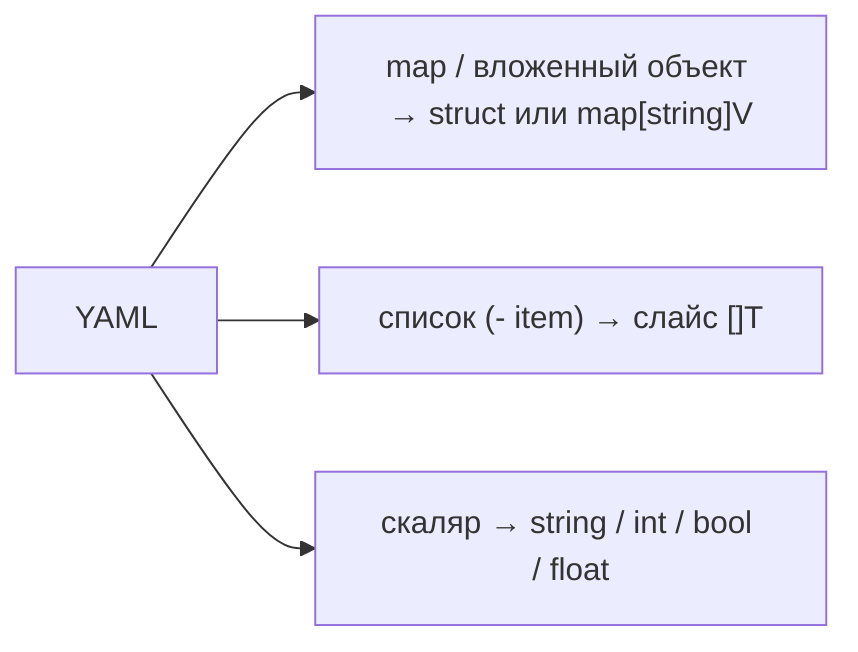

# YAML

JSON хорош для API, но конфиги люди пишут руками — и тут правит YAML: комментарии, отсутствие кавычек и запятых, человекочитаемая вложенность. Kubernetes, CI-пайплайны, `docker-compose`, конфиги приложений — всё это YAML. Принципиальное отличие от JSON в Go: **YAML не входит в стандартную библиотеку**. Его, как и в .NET, тянут отдельной зависимостью. Это нормально и ожидаемо — `encoding/yaml` в stdlib никогда не было и не планируется.

> **Параллель с .NET:** ситуация зеркальная. В .NET JSON и XML — в составе фреймворка (`System.Text.Json`, `System.Xml`), а YAML из коробки нет: вы ставите `YamlDotNet` из NuGet. В Go ровно так же: JSON в stdlib, YAML — внешний пакет. Так что «для YAML нужна зависимость» — привычная вам реальность, а не особенность Go.

## Какую библиотеку брать: важный нюанс с `go-yaml`

Де-факто стандартом много лет был пакет `gopkg.in/yaml.v3` (репозиторий `go-yaml/yaml`). Здесь есть свежий факт, который надо знать:

- В **апреле 2025** репозиторий `go-yaml/yaml` был **заархивирован** автором — новых релизов в нём больше не будет.
- Канонический преемник — **`go.yaml.in/yaml/v3`**: совместимый форк под эгидой `yaml.org`, drop-in замена (меняется только путь импорта). Именно его рекомендуют для нового кода.
- Старый импорт `gopkg.in/yaml.v3` всё ещё резолвится и работает (код стабилен и проверен годами), но он «заморожен». Существуют и альтернативы с активной разработкой, например `github.com/goccy/go-yaml`.

Практически: API у `gopkg.in/yaml.v3` и `go.yaml.in/yaml/v3` идентичен, поэтому всё ниже применимо к обоим. В новых проектах указывайте `go.yaml.in/yaml/v3`; в существующих можно мигрировать заменой пути импорта.

```bash
go get go.yaml.in/yaml/v3
```

В примерах ниже пакет импортируется как `yaml` (`import "go.yaml.in/yaml/v3"`).

## `Marshal` и `Unmarshal`: тот же паттерн, что в JSON

API сознательно повторяет `encoding/json` — те же две функции-зеркала, тот же приём с указателем при разборе:

```go
func Marshal(in any) ([]byte, error)
func Unmarshal(in []byte, out any) error
```

```go
type Server struct {
    Host string `yaml:"host"`
    Port int    `yaml:"port"`
}

s := Server{Host: "localhost", Port: 8080}
data, _ := yaml.Marshal(s)
// host: localhost
// port: 8080

var back Server
yaml.Unmarshal(data, &back) // снова через указатель
```

Те же два правила, что и в JSON: сериализуются **только экспортируемые поля**, а целью `Unmarshal` должен быть указатель. Если уже прочитали главу про `encoding/json` — здесь всё знакомо.

### Теги `yaml:"..."`

Имена и опции задаются тегом `yaml`, по той же схеме, что `json`:

```go
type Config struct {
    AppName  string `yaml:"app_name"`           // переименование
    Debug    bool   `yaml:"debug,omitempty"`    // опустить пустое
    Secret   string `yaml:"-"`                   // не сериализовать
    Replicas int    `yaml:"replicas,omitempty"`
}
```

- Без тега `yaml.v3` использует имя поля в **нижнем регистре** (`AppName` → `appname`) — в отличие от JSON, который оставляет имя как есть. Поэтому теги для YAML практически обязательны, если хотите `snake_case` или предсказуемые имена.
- `yaml:"-"` — пропуск поля (как `json:"-"`).
- `omitempty` — опустить пустое значение; семантика «пустого» аналогична JSON-овской `omitempty` (нулевые числа/строки/булевы, nil и пустые слайсы/мапы).
- Есть опция `,inline` — встраивает поля вложенной структуры или мапы в родителя (аналог развёртывания): полезно для общих секций конфига.
- `,flow` — выводит коллекцию в «потоковом» (JSON-подобном) стиле `[a, b]` / `{k: v}` вместо блочного.

> **Параллель с .NET:** теги `yaml:"..."` ≈ атрибуты `YamlDotNet` (`[YamlMember(Alias = "app_name")]`, `[YamlIgnore]`). В `YamlDotNet` соглашение об именах задаётся через `INamingConvention` (`UnderscoredNamingConvention` для snake_case) на уровне (де)сериализатора, тогда как в Go регистр/имя вы фиксируете тегом на каждом поле. И там и там — внешняя библиотека с атрибутами/тегами поверх той же модели «структура ↔ документ».

## Разбор сложных конфигов: вложенность, списки, мапы

Реальная сила YAML — иерархические конфиги. `yaml.v3` отображает их на вложенные структуры, слайсы и мапы естественным образом:

```yaml
service:
  name: payments
  timeout: 30s
  replicas: 3
database:
  host: db.internal
  port: 5432
  pool:
    max_open: 25
    max_idle: 5
endpoints:
  - name: primary
    url: https://api.example.com
  - name: fallback
    url: https://api2.example.com
features:
  beta_ui: true
  new_billing: false
```

Структура-зеркало:

```go
type Config struct {
    Service struct {
        Name     string `yaml:"name"`
        Timeout  string `yaml:"timeout"`
        Replicas int    `yaml:"replicas"`
    } `yaml:"service"`
    Database struct {
        Host string `yaml:"host"`
        Port int    `yaml:"port"`
        Pool struct {
            MaxOpen int `yaml:"max_open"`
            MaxIdle int `yaml:"max_idle"`
        } `yaml:"pool"`
    } `yaml:"database"`
    Endpoints []struct {
        Name string `yaml:"name"`
        URL  string `yaml:"url"`
    } `yaml:"endpoints"`
    Features map[string]bool `yaml:"features"`
}

var cfg Config
yaml.Unmarshal(data, &cfg)
// cfg.Database.Pool.MaxOpen == 25
// cfg.Endpoints[0].Name == "primary"
// cfg.Features["beta_ui"] == true
```

Соответствия конструкций:



Если структура документа заранее неизвестна (плагины, произвольный конфиг), разбирайте в `map[string]any` — но помните урок из главы про JSON: в Go-картах значения будут динамическими (`any`), и числа/вложенность придётся доставать через type assertion. Для известной схемы всегда предпочитайте типизированную структуру.

## Якоря и ссылки (`&` / `*`)

YAML умеет то, чего нет в JSON: **якоря** (`&name`) и **ссылки** (`*name`) — объявить кусок один раз и переиспользовать, плюс слияние `<<` для «наследования» мап:

```yaml
defaults: &defaults       # объявляем якорь
  retries: 3
  timeout: 30s

production:
  <<: *defaults           # подмешиваем содержимое defaults
  timeout: 60s            # переопределяем одно поле

staging:
  <<: *defaults           # те же дефолты
```

`yaml.v3` разворачивает якоря и слияния **прозрачно** при `Unmarshal` — в вашу структуру придут уже «склеенные» значения (`production.retries == 3`, `production.timeout == "60s"`), отдельной работы не требуется. Это удобно в рукописных конфигах, но злоупотребление якорями быстро превращает YAML в нечитаемый ребус — применяйте умеренно. (Замечание про безопасность: рекурсивные/раздутые якоря — вектор «YAML-бомбы»; для конфигов из доверенных источников это не проблема, но не парсите чужой произвольный YAML беспечно.)

## Строгий разбор: `KnownFields`

Как и JSON, по умолчанию `yaml.v3` **молча игнорирует** ключи, которым нет поля в структуре. Для конфигов это опасно: опечатка в имени ключа (`tieout` вместо `timeout`) тихо проигнорируется, и приложение возьмёт значение по умолчанию вместо вашего. Включить строгий режим можно через `Decoder.KnownFields(true)`:

```go
dec := yaml.NewDecoder(bytes.NewReader(data))
dec.KnownFields(true) // неизвестный ключ → ошибка
var cfg Config
if err := dec.Decode(&cfg); err != nil {
    // yaml: unmarshal errors: line 4: field tieout not found in type Config ✅
}
```

Историческая деталь: в `yaml.v2` для этого была функция `yaml.UnmarshalStrict`. В `v3` её убрали — теперь только через `Decoder` + `KnownFields(true)`. Для конфигов строгий режим — настоятельно рекомендуемая практика: лучше упасть на старте с понятной ошибкой, чем молча работать не с теми настройками.

> **Параллель с .NET:** `KnownFields(true)` ≈ поведение `YamlDotNet` по умолчанию — там десериализатор как раз **бросает исключение** на неизвестных свойствах, и чтобы их игнорировать, нужно явно вызвать `.IgnoreUnmatchedProperties()` в билдере. То есть дефолты противоположны: Go прощает, `YamlDotNet` строг. Для конфигов вам, скорее всего, нужно строгое поведение в обоих мирах — в Go его надо включить руками.

## Потоковый API и несколько документов

`yaml.NewEncoder(w)`/`yaml.NewDecoder(r)` работают поверх `io.Writer`/`io.Reader` — как и в JSON. Бонус YAML: один файл может содержать **несколько документов**, разделённых `---`. `Decoder.Decode` в цикле читает их по одному (это частый паттерн для k8s-манифестов, где в файле несколько ресурсов):

```go
dec := yaml.NewDecoder(file)
for {
    var doc map[string]any
    if err := dec.Decode(&doc); err == io.EOF {
        break
    } else if err != nil {
        return err
    }
    process(doc) // обрабатываем каждый --- документ
}
```

## Когда YAML, а когда JSON

Выбор формата — не вкусовщина, у каждого своя ниша:

| Критерий | YAML | JSON |
| --- | --- | --- |
| Основное применение | **конфиги** (приложение, k8s, CI, compose) | **API и обмен между сервисами** |
| Пишут ли люди руками | да, это его сильная сторона | редко (машинный формат) |
| Комментарии | есть (`#`) | нет (важное ограничение для конфигов) |
| Якоря/переиспользование | есть (`&`/`*`/`<<`) | нет |
| Многословность | компактнее, без `{}`/`""`/`,` | больше «синтаксического шума» |
| Скорость парсинга | медленнее | быстрее |
| Чувствительность к отступам | да (источник ошибок) | нет |
| В stdlib Go | нет (внешняя зависимость) | да (`encoding/json`) |

Практическое правило: **конфиг, который читают/правят люди → YAML; данные, которыми обмениваются программы → JSON.** Многие приложения используют оба: YAML для файла настроек, JSON для HTTP-API.

Удобная деталь: поскольку оба формата отображаются на одни и те же Go-структуры, одну структуру конфига нередко снабжают **обоими** тегами сразу — и она читается хоть из YAML, хоть из JSON:

```go
type Config struct {
    Host string `yaml:"host" json:"host"`
    Port int    `yaml:"port" json:"port"`
}
```

## Итог

- YAML в Go — **внешняя зависимость** (как `YamlDotNet` в .NET): в stdlib его нет и не будет. Канонический пакет сегодня — `go.yaml.in/yaml/v3` (преемник заархивированного в апреле 2025 `gopkg.in/yaml.v3`; API идентичен).
- API повторяет `encoding/json`: `Marshal`/`Unmarshal` (через указатель), теги `yaml:"name,omitempty"`, только экспортируемые поля. Без тега имя берётся в нижнем регистре, поэтому теги почти обязательны.
- Сложные конфиги ложатся на вложенные структуры/слайсы/мапы естественно; якоря (`&`/`*`) и слияние (`<<`) `yaml.v3` разворачивает прозрачно — удобно, но не злоупотребляйте.
- По умолчанию неизвестные ключи **игнорируются** — для конфигов включайте строгий разбор через `Decoder.KnownFields(true)` (в `YamlDotNet`, наоборот, строгость по умолчанию).
- Эвристика выбора: **YAML — для рукописных конфигов** (комментарии, якоря, читаемость), **JSON — для машинного обмена** (скорость, повсеместность). Одну структуру можно пометить тегами обоих форматов.

Дальше — бинарная сериализация: «родной» Go-формат `gob` и кросс-языковой Protobuf.

---

[⌂ Главная](../../README.md) · [↑ Раздел](./README.md) · [← Предыдущий: JSON](./01-json.md) · [→ Следующий: Бинарные форматы](./03-binary-formats.md)
