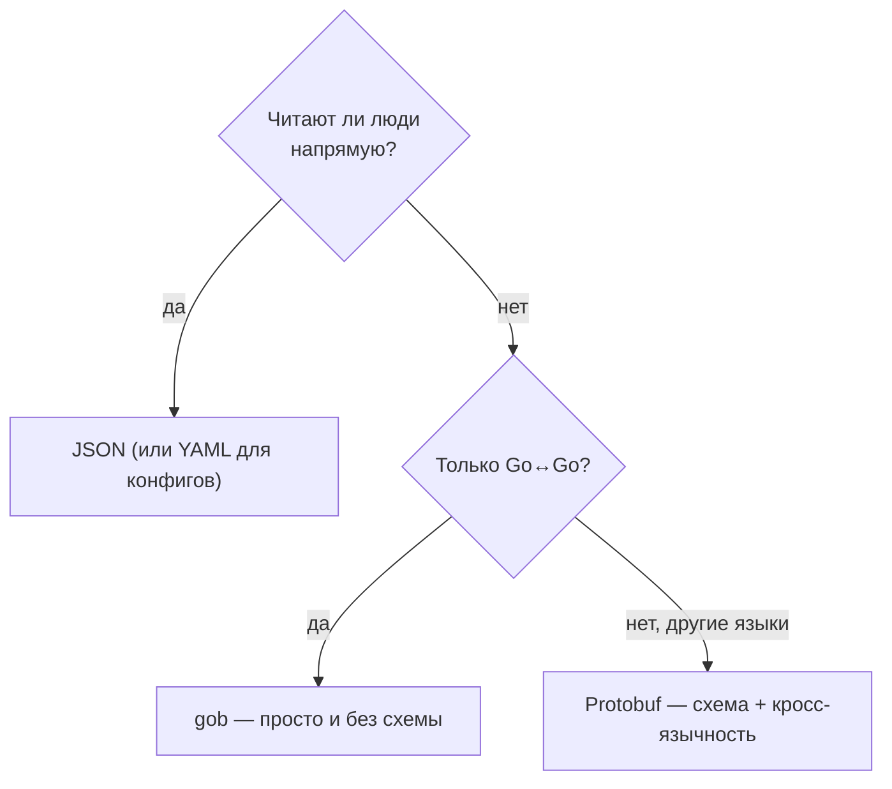

# Бинарные форматы: gob и Protobuf

JSON и YAML текстовые: читаемые, но многословные и небыстрые. Когда важны компактность и скорость, в ход идут бинарные форматы. В Go-мире их два принципиально разных:

- **`encoding/gob`** — «родной» бинарный формат стандартной библиотеки, понятный **только Go**. Аналог идеи `BinaryFormatter` из .NET, но живой и безопасный.
- **Protobuf** — кросс-языковой формат от Google со схемой и кодогенерацией. Один и тот же в Go и в .NET.

Выбор между ними сводится к одному вопросу: данные останутся внутри Go-мира или поедут в сервис на другом языке?

## `encoding/gob`: бинарь между своими

`gob` — это часть stdlib (`encoding/gob`), спроектированная специально под сериализацию Go-значений для обмена между Go-программами. Ключевые свойства:

- **Самоописываемый.** В поток вместе с данными пишется описание типов (имена и типы полей). Декодер не обязан знать тип заранее в той же мере, что в «голом» бинаре, и устойчив к незначительным расхождениям структур.
- **Только Go↔Go.** Формат не стандартизирован для других языков. Реализации `gob` вне Go практически нет — это его сознательное ограничение, а не недоработка.
- **Эффективный для повторяющихся типов.** Описание типа отправляется один раз на поток; дальше идут только данные. На потоке однотипных значений накладные расходы амортизируются.

API снова зеркальный — `Encoder`/`Decoder` поверх `io`:

```go
type Snapshot struct {
    Version int
    Users   []string
    Meta    map[string]int
}

// Кодирование в буфер (или файл, сокет — любой io.Writer)
var buf bytes.Buffer
enc := gob.NewEncoder(&buf)
err := enc.Encode(Snapshot{
    Version: 1,
    Users:   []string{"alice", "bob"},
    Meta:    map[string]int{"n": 2},
})

// Декодирование
var snap Snapshot
dec := gob.NewDecoder(&buf)
err = dec.Decode(&snap) // снова указатель
```

Те же знакомые правила: только **экспортируемые** поля, декодирование через **указатель**. Никакой схемы, никаких тегов, никакой кодогенерации — берёте структуру и пишете её.

### Регистрация типов для интерфейсов: `gob.Register`

Тонкость, которую нужно знать. Если поле имеет тип **интерфейса** (`any`, или ваш интерфейс), `gob` при декодировании должен знать **конкретный** тип, который туда положили, — иначе он не сможет его воссоздать. Конкретные типы, едущие через интерфейс, надо заранее **зарегистрировать** через `gob.Register`:

```go
type Shape interface{ Area() float64 }
type Circle struct{ R float64 }
type Square struct{ Side float64 }

func (c Circle) Area() float64 { return 3.14 * c.R * c.R }
func (s Square) Area() float64 { return s.Side * s.Side }

type Drawing struct {
    Shapes []Shape // поле-интерфейс
}

func init() {
    gob.Register(Circle{}) // без этого декодер не воссоздаст Circle ❌
    gob.Register(Square{}) // регистрируем все конкретные реализации
}
```

Без регистрации `Encode`/`Decode` вернёт ошибку вида «type not registered». Регистрацию обычно делают в `init()`. Конкретные типы (без интерфейсов) регистрировать не нужно — они описываются автоматически.

### Где уместен gob

`gob` хорош ровно там, где обе стороны — Go и схема не нужна:

- ✅ **Внутренний RPC** между Go-сервисами (`net/rpc` использует gob по умолчанию).
- ✅ **Кэш**: сериализовать структуру в Redis/файл/BoltDB и поднять обратно.
- ✅ **Снапшоты/чекпоинты** состояния, персистентные очереди, передача между Go-процессами.

И плох там, где нужна совместимость:

- ❌ Обмен с сервисами на **других языках** (нет реализаций gob).
- ❌ Долгоживущее хранилище с **жёсткой эволюцией схемы** и гарантиями совместимости — gob терпим к изменениям, но формальных правил версионирования, как у protobuf, не даёт.
- ❌ Публичные API (там JSON).

| Плюсы gob | Минусы gob |
| --- | --- |
| В stdlib, нулевые зависимости | Только Go↔Go |
| Компактнее и быстрее JSON | Не для кросс-языкового обмена |
| Самоописываемый, без схемы и тегов | Нет формального версионирования схемы |
| Простой API (`Encode`/`Decode`) | Нужен `gob.Register` для интерфейсов |

> **Параллель с .NET:** `gob` занимает нишу, которую в .NET исторически закрывали `BinaryFormatter` и `System.Runtime.Serialization` (`DataContractSerializer` в бинарном режиме, `NetDataContractSerializer`): «быстро сериализовать объект для своих». Но есть критическая разница: **`BinaryFormatter` объявлен устаревшим и небезопасным** (он десериализует произвольные типы из потока, что годами было источником RCE-уязвимостей; в .NET 9 он удалён из рантайма). `gob` этой дырой не страдает: он работает только с заранее известными/зарегистрированными типами и не инстанцирует произвольные классы из данных. Так что мораль не «gob = BinaryFormatter», а «gob — это то, чем `BinaryFormatter` стоило бы быть»: бинарь для своих, но без подарка в виде удалённого выполнения кода. Современная .NET-альтернатива для бинаря между своими — `MessagePack` или тот же protobuf.

## Protobuf: схема, кодогенерация, кросс-язычность

Protocol Buffers (protobuf) — это бинарный формат с **внешней схемой**: вы описываете сообщения в `.proto`-файле, а кодогенератор порождает типы и код (де)сериализации для нужного языка. Один `.proto` → код для Go, C#, Java, Python, Rust… — и все они бинарно совместимы. Это его главное преимущество и причина существования.

Схема в `.proto`:

```protobuf
syntax = "proto3";
package user;
option go_package = "example.com/gen/userpb";

message User {
  int64  id    = 1;   // номер поля — часть бинарного формата
  string name  = 2;
  string email = 3;
  repeated string roles = 4; // repeated ≈ слайс
}
```

Каждое поле имеет **номер** (`= 1`, `= 2`) — именно номер, а не имя, кодируется в байты. Это ключ к эволюции схемы (ниже).

### Кодогенерация в Go

Из `.proto` код генерирует компилятор `protoc` с плагином `protoc-gen-go`. Канонические инструменты сегодня:

- рантайм-библиотека — **`google.golang.org/protobuf`** (она пришла на смену старому `github.com/golang/protobuf`; в новом коде берите именно её);
- плагин-генератор — **`protoc-gen-go`** (из того же модуля).

```bash
# сгенерировать user.pb.go из user.proto
protoc --go_out=. --go_opt=paths=source_relative user.proto
```

Получившийся `user.pb.go` содержит структуру `User` с методами и тегами для (де)сериализации. Использование:

```go
import "google.golang.org/protobuf/proto"

u := &userpb.User{Id: 1, Name: "Alice", Roles: []string{"admin"}}

data, err := proto.Marshal(u)   // структура → компактные байты
// ...
var back userpb.User
err = proto.Unmarshal(data, &back) // байты → структура
```

Важно: **руками `.pb.go` не пишут и не правят** — это сгенерированный артефакт. Источник истины — `.proto`. Это и есть «кодогенерация как философия Go» — компилятор schema→code вместо рантайм-рефлексии (тема [Раздела 7](../07-code-generation/README.md)).

### Эволюция схемы: обратная совместимость

Главная инженерная ценность protobuf — **управляемая эволюция**. Поскольку в байты пишется **номер** поля, а не имя, схему можно менять, не ломая старых читателей/писателей, если соблюдать правила:

- ✅ **Добавлять** новые поля с новыми номерами — старый код их просто проигнорирует (forward-совместимость), новый прочитает старые данные с дефолтами (backward-совместимость).
- ✅ **Переименовывать** поле — имя в байты не идёт, номер тот же → совместимо.
- ❌ **Менять номер** существующего поля или **переиспользовать** номер удалённого поля — ломает совместимость. Удалённые номера резервируют через `reserved`.
- ❌ Несовместимо менять тип поля.

Это превращает protobuf в формат, пригодный для долгоживущих контрактов между сервисами и версиями, чего text-форматы и gob «из коробки» не гарантируют.

### Где уместен protobuf

- ✅ **Кросс-языковой обмен** (Go-сервис ↔ C#/Java/Python-сервис).
- ✅ **gRPC** — protobuf там и формат сообщений, и язык описания сервисов (детально — [Раздел 8](../08-networking-api-grpc/README.md)).
- ✅ Высоконагруженный обмен, где важны **размер и скорость**.
- ✅ Контракты с **жёсткими гарантиями совместимости** между версиями.

Цена: нужен `.proto`, тулчейн кодогенерации в сборке, и данные нечитаемы глазами (бинарь).

> **Параллель с .NET:** **protobuf в обоих мирах — это один и тот же формат и одна и та же схема.** `.proto`-файл, написанный для Go, без изменений используется в .NET; различается только тулинг кодогенерации. В .NET это `Google.Protobuf` + плагин `protoc` (через NuGet-пакеты `Grpc.Tools`, которые встраивают генерацию в MSBuild прямо при сборке `.csproj`). В Go генерация — отдельный шаг (`protoc`/`buf`), порождающий `.pb.go`. То есть концепция идентична, а DX отличается: .NET прячет `protoc` за MSBuild, Go вызывает его явно (часто через `buf` или `//go:generate`). Знание protobuf переносится между стеками один-в-один — это редкий случай полного совпадения.

## Сравнение: gob vs Protobuf vs JSON

Сводка по ключевым осям:

| Критерий | JSON | gob | Protobuf |
| --- | --- | --- | --- |
| Представление | текст | бинарь | бинарь |
| Читаемость глазами | да | нет | нет |
| Кросс-язычность | да (универсален) | **нет** (только Go) | да (много языков) |
| Нужна схема | нет | нет (самоописываемый) | **да** (`.proto`) |
| Кодогенерация | нет (рефлексия) | нет (рефлексия) | **да** (`protoc`) |
| Размер | большой | средний/малый | **малый** |
| Скорость | медленно | быстро | **быстро** |
| Эволюция схемы | неявная, «прощающая» | терпимая, без гарантий | **формальные правила совместимости** |
| В stdlib Go | да | да | нет (внешний модуль) |
| Типичное применение | API, конфиги, логи | Go↔Go RPC, кэш, снапшоты | gRPC, кросс-языковой обмен |

Как выбирать на практике:



Эвристика одной фразой: **JSON — когда читают люди или нужна универсальность; gob — бинарь для своих (Go↔Go) без церемоний; protobuf — когда нужны схема, кросс-язычность и эволюция контракта.**

## Итог

- `encoding/gob` — stdlib-формат для сериализации Go-значений **только между Go-программами** (RPC, кэш, снапшоты). Самоописываемый, без схемы и тегов; интерфейсные поля требуют `gob.Register` конкретных типов.
- gob занимает нишу .NET-ного `BinaryFormatter`/`System.Runtime.Serialization`, но **без его дыр**: `BinaryFormatter` устарел и удалён из .NET как небезопасный (RCE при десериализации), а gob не инстанцирует произвольные типы.
- **Protobuf** — кросс-языковой бинарный формат со схемой `.proto` и кодогенерацией (`google.golang.org/protobuf` + `protoc-gen-go`). Компактный, быстрый, с **формальными правилами эволюции схемы** (номера полей, `reserved`).
- **Protobuf одинаков в Go и .NET** — та же схема, тот же формат; различается лишь тулинг генерации (явный `protoc`/`buf` в Go vs встроенный в MSBuild `Grpc.Tools` в .NET). Знание переносится без потерь.
- Выбор: люди читают → JSON/YAML; бинарь только для Go → gob; схема + кросс-язычность + эволюция → protobuf.

Дальше — консолидированное сравнение сериализации в Go и .NET: `System.Text.Json`/`Newtonsoft.Json` против `encoding/json`, полиморфизм, перформанс и «как сделать привычное X».

---

[⌂ Главная](../../README.md) · [↑ Раздел](./README.md) · [← Предыдущий: YAML](./02-yaml.md) · [→ Следующий: Сравнение с .NET](./04-comparison-with-dotnet.md)
