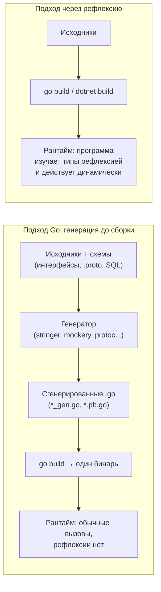

# Философия: генерация (compile-time) vs рефлексия (runtime)

Перед тем как разбирать инструменты, нужно понять **выбор ценностей**, который Go делает за вас. Любой статически типизированный язык рано или поздно упирается в задачу «у меня есть тип `T`, и я хочу по нему что-то сделать автоматически» — сериализовать, сравнить, склонировать, построить мок, смаппить в строку БД. Есть два принципиально разных момента, когда это «что-то» может произойти:

- **В рантайме** — программа на лету изучает тип через рефлексию и действует динамически.
- **До сборки** — отдельный инструмент заранее порождает обычный код, который компилируется вместе со всем остальным.

.NET исторически тяготел к первому пути: рефлексия, `Reflection.Emit`, деревья выражений, динамические прокси — всё это рантайм-механизмы, давшие экосистеме невероятную гибкость (DI, ORM, сериализаторы «из коробки»). Go сознательно выбирает второй путь как **путь по умолчанию**. Эта глава — про то, почему.

## Два момента времени: до сборки и в рантайме

Разница лучше всего видна на диаграмме «когда происходит работа».



В подходе с генерацией вся «умная» работа сделана **заранее и один раз**: на выходе — статический код без сюрпризов. В подходе с рефлексией работа происходит **на каждом запуске** (часто с кэшированием, но всё равно в рантайме), и тип изучается динамически.

> **Параллель с .NET:** это тот же водораздел, что между `System.Text.Json` в режиме рефлексии (по умолчанию изучает типы в рантайме) и его **source-generated** режимом (`JsonSerializerContext`, код маршалинга порождается компилятором). Microsoft двигает экосистему в сторону source-gen ровно по тем причинам, которые для Go были дефолтом с самого начала: скорость, AOT-совместимость, предсказуемость. Go просто начал с этого конца.

## Почему Go предпочитает генерацию: четыре причины

### 1. Производительность: на горячем пути нет рефлексии

Рефлексия — это динамический разбор метаданных типа в рантайме: обход полей, проверка тегов, боксинг значений в `interface{}`/`any`, аллокации. Даже с кэшированием это в разы дороже прямого статического кода. Сгенерированный код выглядит так, будто его написал человек, который заранее знал тип, — никакого обхода метаданных, прямые присваивания полей.

Сравните концептуально. Рефлексивная сериализация (упрощённо, как внутри `encoding/json`):

```go
// Что делает encoding/json под капотом (схематично):
// для каждого поля — reflect.Value, чтение тега, выбор кодировщика, бокс в any.
func marshalReflect(v any) []byte {
    rv := reflect.ValueOf(v)
    t := rv.Type()
    for i := 0; i < t.NumField(); i++ {
        field := t.Field(i)
        tag := field.Tag.Get("json") // разбор тега в рантайме
        val := rv.Field(i)           // reflect.Value, не конкретный тип
        _ = tag
        _ = val
        // ... динамическая диспетчеризация по типу поля
    }
    return nil
}
```

А вот что порождает генератор маршалинга (например, `easyjson`) — прямой код без `reflect`:

```go
// Сгенерированный MarshalJSON: типы известны, рефлексии нет.
func (u User) MarshalEasyJSON(w *jwriter.Writer) {
    w.RawString(`{"id":`)
    w.Int64(u.ID)            // прямой вызов под конкретный тип
    w.RawString(`,"name":`)
    w.String(u.Name)         // никакого обхода метаданных
    w.RawByte('}')
}
```

Второй вариант — это просто последовательность прямых вызовов, которую отлично оптимизирует компилятор. Поэтому в перформансном Go-коде сериализацию, сравнение и копирование часто **выносят из рефлексии в генерацию**.

### 2. Типобезопасность: ошибки ловит компилятор, а не паника в проде

Рефлексия работает со значениями типа `any` и `reflect.Value` — компилятор о них почти ничего не знает. Несоответствие типов всплывает **в рантайме** паникой или ошибкой, часто на конкретных данных в проде. Сгенерированный код полностью статически типизирован: если схема изменилась несовместимо, проект просто **не скомпилируется**.

Канонический пример — `stringer` (глава 2): он порождает метод `String()` для набора констант. Если вы добавите новую константу-перечисление, но забудете перегенерировать, рассинхрон обнаружится при сборке/проверке (например, в CI `go generate` + `git diff`), а не превратится в «магическое» неверное значение в рантайме.

> **Параллель с .NET:** это та же мотивация, что стоит за переходом с рефлексивного `JsonSerializer` на source-generated контексты и за усилиями вокруг **Native AOT**: рефлексия плохо дружит с trimming и AOT именно потому, что компилятор не видит, какие типы понадобятся в рантайме. Сгенерированный код виден компилятору целиком.

### 3. Читаемость и отладка: сгенерированный код можно прочитать и пройти дебаггером

Это недооценённое, но важное преимущество. Рефлексивная и IL-эмитящая «магия» — чёрный ящик: вы не можете поставить точку останова «внутри» динамически сгенерированного метода и пройти его пошагово, стек-трейсы невнятны. Сгенерированный Go-код — это **обычный `.go`-файл в вашем репозитории**: его можно открыть, прочитать, поставить брейкпоинт, увидеть в стек-трейсе с точным номером строки.

Когда «что-то идёт не так» с сериализацией или моком, разница между «читаю сгенерированный `user_gen.go`» и «дизассемблирую IL динамического прокси» — это разница между обычной отладкой и археологией.

### 4. Явность вместо магии: код «виден» в репозитории

Go-культура ценит явность (вспомните Раздел 1: «спартанский» дух, отсутствие неявных перегрузок и скрытого поведения). Кодогенерация идеально ложится на эту ценность: вместо невидимого поведения, которое материализуется только в рантайме, у вас есть **физические файлы**, которые лежат в Git, проходят code review и видны в дереве проекта. Поведение системы не прячется в рефлексивных недрах библиотеки — оно выписано явным кодом.

## Где рефлексия в Go всё-таки есть

Было бы неверно сказать, что Go обходится без рефлексии. Пакет `reflect` — часть стандартной библиотеки, и на нём стоят очень популярные вещи:

- **`encoding/json`** (Раздел 5) — стандартный маршалинг/анмаршалинг JSON изучает структуры и теги полей рефлексией в рантайме. Это удобный дефолт, и для подавляющего большинства задач его производительности достаточно.
- **Валидаторы** вроде `go-playground/validator` (Раздел 6) — читают теги `validate:"required,email"` рефлексией и применяют правила динамически.
- **ORM** вроде GORM, мапперы конфигов, DI-контейнеры — тоже опираются на рефлексию для маппинга «структура ↔ внешний мир».

Ключевой нюанс: рефлексию в Go **не запрещают — её дозируют**. Дефолтные библиотеки используют её ради удобства, а когда профилировщик показывает, что сериализация стала горячим путём, команда переходит на сгенерированный код (`easyjson`, `protobuf`, `sqlc`). То есть рефлексия — это удобный старт, а генерация — оптимизация и/или способ получить типобезопасность там, где она критична.

> **Параллель с .NET:** идентичная развилка. `JsonSerializer` по умолчанию = рефлексия (удобно); под нагрузкой или для AOT включают source generator (быстро, типобезопасно). Разница не в наличии выбора, а в том, что Go-культура раньше и охотнее тянется к генерации, тогда как в .NET рефлексивный путь был «дорогой по умолчанию» десятилетиями.

## Сгенерированный код — это обычные `.go`-файлы (и их коммитят)

Несколько практических конвенций, которые сразу бросаются в глаза новичку из .NET.

**Это файлы в репозитории.** Сгенерированный код — не артефакт сборки, спрятанный в `obj/`, как у `.NET`. В Go его, как правило, **коммитят в Git** наравне с рукописным кодом. Причины: `go build` не запускает генерацию автоматически (об этом — глава 2), поэтому без закоммиченных файлов проект не соберётся «из чистого клона»; плюс сгенерированный код виден в code review и diff'ах.

**Узнаваемые имена.** По соглашению генераторы кладут результат в файлы с суффиксами: `*_gen.go`, `*_string.go` (от `stringer`), `*.pb.go` (protobuf), `mock_*.go` (моки). Это позволяет с одного взгляда отличить сгенерированное от рукописного.

**Обязательный заголовок «DO NOT EDIT».** Каждый сгенерированный файл начинается со специального комментария:

```go
// Code generated by stringer -type=Status; DO NOT EDIT.

package order
```

Это не просто вежливость. Формат строки стандартизирован (регулярное выражение `^// Code generated .* DO NOT EDIT\.$`), и инструменты экосистемы его **распознают**: например, `gofmt`/`go vet` и многие линтеры относятся к таким файлам особым образом, а покрытие/ревью-боты могут их игнорировать. Главный посыл человеку — **не правьте этот файл руками**: при следующей генерации правки затрутся. Изменения вносят в источник (схему, `.proto`, SQL, шаблон) и перегенерируют.

> **Параллель с .NET:** в .NET сгенерированный код чаще невидим — Source Generators отдают файлы прямо в компиляцию, не записывая их в дерево исходников (их можно увидеть только включив `EmitCompilerGeneratedFiles`), а партиал-классы дизайнера (`*.Designer.cs`) хоть и лежат на диске, но воспринимаются как «не трогай, это IDE». В Go сгенерированный файл — полноправный, видимый и закоммиченный артефакт, а маркер «DO NOT EDIT» — машиночитаемая конвенция, а не просто комментарий.

## Концептуальный водораздел: один абзац, который стоит запомнить

Если свести раздел к одной мысли: **.NET по традиции сдвигает «умную» работу с типами в рантайм (рефлексия, IL-эмит, прокси), а Go сдвигает её до сборки (генерация явного кода).** Оба мира сейчас движутся к compile-time (Source Generators в .NET — прямое тому свидетельство), но отправные точки и культурные дефолты противоположны. Для вас как для разработчика это означает смену рефлекса: там, где в .NET вы бы потянулись за рефлексией или атрибутом-с-магией, в Go стоит сначала спросить — «а нет ли тут генератора, который выпишет это явным кодом?».

## Итог

- В Go есть два момента, когда можно «поработать с типом»: **в рантайме** (рефлексия) и **до сборки** (кодогенерация). Идиоматичный Go выбирает второе как путь по умолчанию.
- Четыре причины выбора генерации: **производительность** (нет рефлексии на горячем пути), **типобезопасность** (ошибки ловит компилятор, а не паника в проде), **читаемость/отладка** (сгенерированный код можно прочитать и пройти дебаггером), **явность вместо магии** (поведение лежит файлами в Git).
- Рефлексия в Go есть и активно используется (`encoding/json`, валидаторы, ORM), но её **дозируют**: удобный дефолт, который под нагрузкой или ради типобезопасности заменяют генерацией.
- Сгенерированный код — это обычные `.go`-файлы: их **коммитят** в репозиторий, узнают по суффиксам (`*_gen.go`, `*.pb.go`) и помечают машиночитаемым заголовком `// Code generated ... DO NOT EDIT.`.
- Концептуальный водораздел с .NET: рантайм-магия против compile-time явного кода. Оба мира тянутся к compile-time, но Go начал с этого конца.

Дальше — механика: как именно директива `//go:generate` и команда `go generate` запускают внешние инструменты, и что это за инструменты.

---

[⌂ Главная](../../README.md) · [↑ Раздел](./README.md) · [← Предыдущий: Обзор раздела](./README.md) · [→ Следующий: go:generate и инструменты](./02-go-generate-and-tools.md)
