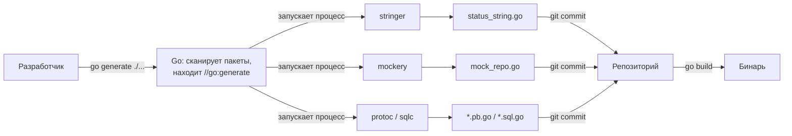

# `go:generate` и инструменты

Разобравшись с философией (генерация вместо рефлексии), перейдём к механике: как Go вообще запускает генерацию. Здесь новичка из .NET ждёт небольшой сюрприз. В .NET генерация интегрирована в сборку: Source Generators запускаются компилятором автоматически, T4 — целью MSBuild. В Go всё устроено намного скромнее и явнее: **сам Go ничего не генерирует и не знает о ваших генераторах.** Он лишь предоставляет соглашение и команду, чтобы вы могли удобно запускать **внешние** инструменты.

## Директива `//go:generate` — это просто маркер

`//go:generate <команда>` — специальный комментарий, который вы пишете прямо в `.go`-файле. Сам по себе он не делает ничего: при обычной сборке (`go build`) он полностью игнорируется, как любой комментарий. Это лишь **запись о том, какую команду надо выполнить**, когда вы решите перегенерировать код.

```go
package order

//go:generate stringer -type=Status

type Status int

const (
    StatusPending Status = iota
    StatusPaid
    StatusShipped
    StatusCancelled
)
```

Синтаксис строгий: `//go:generate` (без пробела после `//`), затем через пробел — команда с аргументами. Это обычная shell-подобная команда: имя исполняемого файла, который должен быть доступен в `PATH`, и его аргументы.

## Команда `go generate` запускает эти маркеры

Чтобы маркеры сработали, вы **вручную** запускаете:

```bash
go generate ./...
```

`go generate` обходит указанные пакеты, находит все комментарии `//go:generate` и выполняет записанные в них команды — каждую в директории её файла. Принципиально:

- Это **отдельный шаг**, который запускает **человек** (или CI-скрипт). `go build`, `go test`, `go run` его **не вызывают**. Сборка использует уже сгенерированные (и закоммиченные) файлы.
- Go выступает **оркестратором**: он только находит маркеры и запускает внешние процессы. Что именно сгенерируется — целиком на совести вызванного инструмента. Go не парсит его вывод и не знает, что получилось.



> **Параллель с .NET:** ближайший аналог по духу — **T4-шаблоны**, которые тоже исторически запускались отдельным шагом (`TextTransform` / клик в IDE), а не на каждой сборке. А вот Source Generators — наоборот, часть компиляции: они работают всегда и автоматически, без отдельной команды. Go-модель ближе к T4: явный отдельный запуск, результат — файлы. Подробнее это сравнение — в [главе 3](./03-comparison-with-dotnet.md).

### Полезные переменные окружения

При запуске команды `go generate` подставляет несколько переменных, которые удобно использовать в аргументах: `$GOFILE` (имя текущего файла), `$GOPACKAGE` (имя пакета), `$GOLINE` (номер строки с директивой) и другие. Например, `//go:generate mockery --name=$GOPACKAGE` подставит имя пакета автоматически.

## Экосистема инструментов

Сам по себе `go generate` бесполезен без инструментов. Вот те, что встречаются чаще всего — каждый закрывает задачу, которую в .NET решали бы рефлексией, атрибутами или Source Generator'ом.

### `stringer`: перечисления (iota) → метод `String()`

Самый каноничный пример. В Go нет полноценного типа-перечисления как в C#; «энумы» делают через именованный целочисленный тип и `iota` (см. Раздел 1). Беда в том, что по умолчанию такое значение печатается как число, а не как имя. `stringer` (официальный инструмент из `golang.org/x/tools`) порождает метод `String()`, превращающий константы в их имена.

Источник:

```go
//go:generate stringer -type=Status
type Status int

const (
    StatusPending Status = iota
    StatusPaid
    StatusShipped
)
```

После `go generate ./...` появляется файл `status_string.go` (схематично):

```go
// Code generated by "stringer -type=Status"; DO NOT EDIT.

package order

import "strconv"

const _Status_name = "StatusPendingStatusPaidStatusShipped"

var _Status_index = [...]uint8{0, 13, 23, 36}

func (i Status) String() string {
    if i < 0 || i >= Status(len(_Status_index)-1) {
        return "Status(" + strconv.FormatInt(int64(i), 10) + ")"
    }
    return _Status_name[_Status_index[i]:_Status_index[i+1]]
}
```

Обратите внимание на технику: вместо `map[Status]string` генератор склеивает все имена в одну строку и хранит срезы-индексы — это компактно и не аллоцирует. Такой код руками писать утомительно и легко ошибиться при добавлении константы; генератор делает это надёжно.

> **Параллель с .NET:** в C# `enum.ToString()` и `Enum.GetName` работают «из коробки» — но **через рефлексию** по метаданным. `stringer` достигает того же результата сгенерированным статическим кодом без рефлексии. Это микромодель всей философии раздела: то, что .NET даёт рантайм-рефлексией, Go предпочитает получить генерацией.

### `mockery`: моки из интерфейсов

Для юнит-тестов нужны тестовые двойники (моки) интерфейсов. В .NET это делают рантайм-библиотеки вроде Moq/NSubstitute, которые строят прокси **динамически** через `Reflection.Emit`/`DispatchProxy`. В Go идиоматичный путь — **сгенерировать** реализацию интерфейса заранее. Популярный инструмент — `mockery`.

```go
//go:generate mockery --name=UserRepository

type UserRepository interface {
    GetByID(ctx context.Context, id int64) (*User, error)
    Save(ctx context.Context, u *User) error
}
```

`go generate` создаёт файл с типом `MockUserRepository`, реализующим интерфейс, с настраиваемыми ожиданиями (`On("GetByID", ...).Return(...)`). Это обычный код, который компилятор проверяет: если интерфейс изменится, а мок не перегенерируют, тест **не скомпилируется** — рассинхрон виден сразу. Подробно про тестирование и моки — в Разделе 14.

> **Параллель с .NET:** Moq строит мок в рантайме, поэтому несоответствие сигнатур всплывает при выполнении теста (или не всплывает вовсе, если настройка `Setup` ссылается на несуществующий метод косвенно). Сгенерированный мок Go ловит несоответствие на этапе компиляции — снова обмен «рантайм-гибкость → compile-time гарантии».

### `protoc` / `protoc-gen-go`: Protobuf и gRPC

Для Protocol Buffers и gRPC схема описывается в `.proto`-файлах, а компилятор `protoc` с плагином `protoc-gen-go` (и `protoc-gen-go-grpc` для сервисов) порождает Go-типы и клиент/серверные заглушки — файлы `*.pb.go`. Это, пожалуй, самый массовый источник сгенерированного кода в продакшен-Go.

```protobuf
// user.proto
message User {
  int64 id = 1;
  string name = 2;
}
```

```go
//go:generate protoc --go_out=. --go-grpc_out=. user.proto
```

Сериализация в сгенерированном `*.pb.go` — статическая и быстрая, без рефлексии на горячем пути. Детально gRPC и protobuf разбираются в Разделе 8.

### `sqlc`: SQL → типобезопасный Go

`sqlc` переворачивает привычную ORM-модель: вы пишете **обычный SQL**, а инструмент генерирует типобезопасные Go-функции и структуры под каждый запрос — без рефлексии и без рантайм-маппинга строк в объекты.

```sql
-- name: GetUser :one
SELECT id, name FROM users WHERE id = $1;
```

```go
//go:generate sqlc generate
```

На выходе — метод вроде `func (q *Queries) GetUser(ctx context.Context, id int64) (User, error)` с уже разобранными колонками. ORM на рефлексии (GORM) удобнее на старте, но `sqlc` даёт скорость и проверяемость SQL. Доступ к данным — тема Раздела 10.

### Родственная фича: `//go:embed`

Стоит особняком, но идейно — родня кодогенерации: директива `//go:embed` встраивает содержимое файлов прямо в бинарь **на этапе компиляции**. Это не отдельный инструмент и не `go generate` — это встроенная возможность компилятора.

```go
import _ "embed"

//go:embed schema.sql
var schemaSQL string

//go:embed templates/*.html
var templates embed.FS
```

Файлы становятся частью бинаря; в рантайме не нужно искать их на диске. Роднит это с генерацией то же «всё решается до запуска, рантайм получает готовое» — никакого файлового I/O и рефлексии при старте.

> **Параллель с .NET:** `//go:embed` ≈ `EmbeddedResource` в `.csproj` + чтение через `Assembly.GetManifestResourceStream`, только намного эргономичнее: содержимое сразу доступно как типизированная переменная (`string`, `[]byte` или `embed.FS`), без возни с потоками и именами ресурсов.

## Установка инструментов

Поскольку генераторы — внешние программы, их нужно установить так, чтобы они оказались в `PATH` (тогда `go generate` их найдёт).

### Классический способ: `go install`

```bash
go install golang.org/x/tools/cmd/stringer@latest
go install github.com/vektra/mockery/v2@latest
```

`go install <путь>@<версия>` собирает инструмент и кладёт бинарь в `$GOBIN` (по умолчанию `$GOPATH/bin`, который держат в `PATH`). Важна **версия**: `@latest` ставит свежую, но для воспроизводимости в команде фиксируют конкретную (`@v2.40.1`).

Историческая боль: версии инструментов жили **вне** `go.mod`, поэтому у разных разработчиков и в CI могли разойтись. Классический обходной приём — «tools.go» с пустыми импортами и build-тегом, чтобы зафиксировать инструменты в зависимостях модуля.

### Современный способ: директива `tool` в `go.mod` (Go 1.24+)

Начиная с **Go 1.24** проблему решили на уровне языка: в `go.mod` появилась директива `tool`, фиксирующая инструменты как полноценные зависимости модуля с версиями.

```bash
# добавить инструмент в go.mod как tool-зависимость
go get -tool golang.org/x/tools/cmd/stringer
```

Это записывает в `go.mod` строку вида:

```
tool golang.org/x/tools/cmd/stringer
```

После чего инструмент можно запускать через `go tool`, а версия зафиксирована в модуле для всех:

```bash
go tool stringer -type=Status
```

Соответственно директиву можно писать так, чтобы она использовала именно зафиксированную версию:

```go
//go:generate go tool stringer -type=Status
```

Это вытесняет старый хак с `tools.go`. Подробно про модули, `go.mod` и управление зависимостями — в Разделе 13.

> **Параллель с .NET:** директива `tool` в `go.mod` концептуально близка к **.NET local tools** — `dotnet tool install` с манифестом `dotnet-tools.json`, который коммитят в репозиторий, чтобы у всей команды и в CI была одна и та же версия инструмента. И там, и там цель одна: версии инструментов воспроизводимы и живут рядом с проектом, а не «у кого что установлено глобально».

## Сквозной цикл: интерфейс → `go:generate` → мок

Соберём всё вместе на типичном цикле работы с моками.

**Шаг 1.** Объявляем интерфейс и помечаем его директивой:

```go
package repo

//go:generate mockery --name=UserRepository --output=./mocks

type UserRepository interface {
    GetByID(ctx context.Context, id int64) (*User, error)
}
```

**Шаг 2.** Один раз ставим инструмент (или фиксируем через `go get -tool`):

```bash
go install github.com/vektra/mockery/v2@latest
```

**Шаг 3.** Запускаем генерацию:

```bash
go generate ./...
```

**Шаг 4.** Появляется сгенерированный файл `mocks/UserRepository.go` с заголовком `// Code generated by mockery; DO NOT EDIT.` и типом `MockUserRepository`. Его **коммитим** в Git.

**Шаг 5.** Используем мок в тесте — обычный типизированный код, проверяемый компилятором:

```go
func TestService(t *testing.T) {
    m := mocks.NewMockUserRepository(t)
    m.On("GetByID", mock.Anything, int64(1)).
        Return(&User{ID: 1, Name: "Alice"}, nil)

    svc := NewService(m)
    // ... проверки
}
```

**Цикл сопровождения.** Изменили интерфейс — повторили `go generate ./...` и закоммитили обновлённый мок. Частая практика в CI: запустить `go generate ./...` и затем `git diff --exit-code`; если diff не пуст — кто-то забыл перегенерировать, и сборка падает. Это и есть compile-time/dev-time дисциплина вместо рантайм-магии.

## Итог

- `//go:generate <команда>` — **просто маркер-комментарий**: при `go build` он игнорируется и сам по себе ничего не делает.
- `go generate ./...` — **отдельный шаг, запускаемый человеком/CI**; он находит маркеры и выполняет внешние команды. `go build`/`go test` его не вызывают, а используют уже сгенерированные (закоммиченные) файлы.
- Go — **оркестратор**: он лишь запускает внешние инструменты и не знает, что они порождают. Вся генерация — на стороне инструментов.
- Ключевые инструменты: `stringer` (iota → `String()`), `mockery` (моки интерфейсов, Раздел 14), `protoc`/`protoc-gen-go` (protobuf/gRPC, Раздел 8), `sqlc` (SQL → типобезопасный Go, Раздел 10); родственная встроенная фича — `//go:embed` (встраивание файлов на этапе компиляции).
- Установка: классически `go install tool@version` (версии вне модуля, отсюда старый хак `tools.go`); современно — директива `tool` в `go.mod` через `go get -tool` и запуск `go tool` (Go 1.24+, Раздел 13).
- Сквозной цикл (интерфейс → `go:generate mockery` → мок) показывает дисциплину: источник правим руками, артефакт перегенерируем и коммитим; в CI ловим забытую генерацию через `git diff --exit-code`.

Дальше — прямое сравнение этого подхода с миром .NET: C# Source Generators и `Reflection.Emit`.

---

[⌂ Главная](../../README.md) · [↑ Раздел](./README.md) · [← Предыдущий: Генерация vs рефлексия](./01-philosophy-codegen-vs-reflection.md) · [→ Следующий: Сравнение с .NET](./03-comparison-with-dotnet.md)
