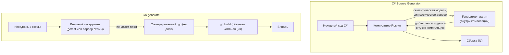
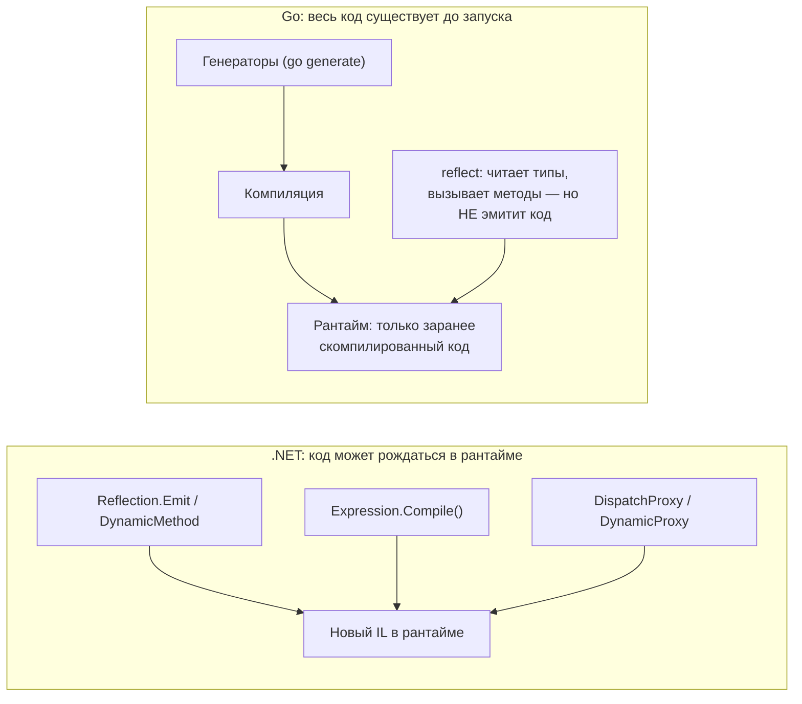

# Сравнение с .NET

Мы разобрали философию (генерация вместо рефлексии) и механику (`go:generate` + внешние инструменты). Эта глава ставит подход Go рядом с тем, что есть в .NET, и проводит чёткие границы. Главный вывод забегая вперёд: **оба мира движутся к compile-time генерации по одинаковым мотивам — скорость, типобезопасность, AOT — но механика у них принципиально разная.** В .NET генератор встроен в компилятор и видит семантическую модель кода; в Go генератор внешний и порождает плоский текст, а Go лишь его запускает.

## C# Source Generators vs подход Go

C# Source Generators (появились в .NET 5 / C# 9, второе поколение — **Incremental Generators**) — это, на первый взгляд, прямой аналог кодогенерации Go. Но различий больше, чем сходств.

**Source Generators — часть компилятора Roslyn.** Генератор — это сборка-плагин, которую компилятор подгружает и запускает **во время компиляции**. У него есть полный доступ к **синтаксическому дереву и семантической модели** компилируемого кода: он «видит» типы, символы, атрибуты, наследование — всё, что знает компилятор. Он добавляет новые исходные файлы в ту же компиляцию (но **не может менять** существующий код — только дописывать). Incremental Generators вдобавок встроены в конвейер инкрементальной компиляции: при правке файла перезапускается только затронутая часть генерации, что делает их пригодными для работы в IDE на каждое нажатие клавиши.

**Go-генератор — внешняя программа, порождающая текст.** Инструмент вроде `stringer` — это отдельный бинарь. Он сам по себе **не часть компилятора Go** и обычно даже не использует богатый семантический анализ: чаще всего он парсит исходники пакетом `go/ast` (синтаксическое дерево) или читает внешнюю схему (`.proto`, SQL), после чего **печатает текст** `.go`-файла — нередко простой подстановкой в шаблон `text/template`. Этот файл затем компилируется обычным `go build` как любой рукописный код. Связь с компилятором — нулевая: Go-компилятор не знает, что файл сгенерирован (кроме как по комментарию-маркеру).

Практические следствия этой разницы:

| Аспект | C# Source Generators | Go (`go generate` + инструменты) |
| --- | --- | --- |
| Где выполняется | внутри компилятора (compile-time) | отдельный шаг до сборки (dev-time) |
| Кто запускает | компилятор, **автоматически** при каждой сборке | человек/CI, **вручную** командой `go generate` |
| Доступ к модели кода | полный: символы, типы, семантика | обычно только синтаксис (`go/ast`) или внешняя схема |
| Что на выходе | исходники, добавленные в компиляцию (на диск не пишутся) | `.go`-файлы на диске, **коммитятся** в Git |
| Инкрементальность | да (Incremental Generators), работа в IDE | нет: перегенерация — это перезапуск процесса целиком |
| Видимость результата | по умолчанию скрыт (нужен `EmitCompilerGeneratedFiles`) | всегда виден: обычный файл в репозитории |
| Интеграция с IDE | мгновенная (генерируется на лету при наборе) | отложенная (после ручного `go generate`) |
| Отладка генератора | отладка плагина-сборки | отладка обычной CLI-программы |

> **Параллель с .NET:** если совсем огрублять — Go-подход ближе по духу к старым **T4-шаблонам** (внешний шаг, печать текста в файл), а не к Source Generators. Но мотивация у Source Generators и у Go-генерации одна и та же: **убрать рефлексию из рантайма**, выписав код заранее. Просто .NET встроил это в компилятор, а Go оставил отдельным инструментом — что согласуется с минимализмом тулчейна Go (компилятор делает мало, экосистема — остальное).

## `Reflection.Emit` и динамические прокси: чего в Go нет вовсе

Здесь — самая жёсткая граница. В .NET есть мощный пласт **рантайм-генерации кода**:

- **`System.Reflection.Emit`** / `DynamicMethod` — построение IL-методов прямо в рантайме.
- **`System.Linq.Expressions`** — сборка дерева выражений и его компиляция в делегат (`Expression.Compile()`) на лету.
- **Динамические прокси** — `DispatchProxy`, Castle DynamicProxy: классы, которых нет в исходниках, материализуются в рантайме (на них стоят Moq, перехватчики DI, ленивые прокси ORM).

В **идиоматичном Go ничего этого нет.** В языке и стандартной библиотеке отсутствует механизм породить и скомпилировать новый исполняемый код в рантайме. Пакет `reflect` умеет **читать** типы и **вызывать** существующие методы динамически (`reflect.Value.Call`), умеет даже создавать значения новых типов структур (`reflect.StructOf`) — но он **не генерирует и не компилирует машинный код на лету**. Нет аналога `Expression.Compile()`, нет `Reflection.Emit`, нет динамических прокси-классов.

Это прямое следствие модели Go: статическая компиляция в один бинарь, отсутствие JIT и тяжёлого рантайма с загрузчиком типов. Задачи, которые в .NET решают рантайм-эмитом (быстрые сериализаторы, мапперы, моки, перехватчики), в Go закрывают **кодогенерацией до сборки** — ровно тем, о чём весь этот раздел.

> **Параллель с .NET:** интуицию «сделаю прокси/делегат на лету через `Emit`/`Expression.Compile`» в Go нужно полностью отключить — такого инструмента просто нет. Если задача требовала рантайм-эмита в .NET, в Go её перепроектируют под генерацию на этапе разработки (или, реже, под `reflect` с динамическим вызовом — но без порождения нового кода). Любопытно, что и в .NET этот пласт под давлением **Native AOT** отходит на второй план: AOT несовместим с рантайм-эмитом, и экосистема мигрирует на source-gen — то есть в ту же сторону, где Go был изначально.

## Сводная таблица: где что выполняется

Соберём весь водораздел в один взгляд.

| Механизм | Мир | Когда выполняется | Интеграция | Отладка | Типобезопасность |
| --- | --- | --- | --- | --- | --- |
| Рефлексия (`System.Reflection` / `reflect`) | оба | runtime | библиотека | трудная (динамика) | слабая (ошибки в рантайме) |
| `Reflection.Emit` / `Expression.Compile` | .NET | runtime (эмит IL) | библиотека/рантайм | очень трудная (нет исходников) | слабая |
| Динамические прокси (Moq, DynamicProxy) | .NET | runtime | библиотека | трудная | слабая |
| Source Generators (Roslyn) | .NET | compile-time | **в компиляторе**, автоматически | средняя (отладка плагина) | сильная (виден компилятору) |
| T4-шаблоны | .NET | dev-time/build | отдельный шаг | обычная (исходники видны) | сильная |
| `go generate` + инструменты | Go | dev-time (до сборки) | **внешний шаг**, вручную | обычная (файл в репо) | сильная (обычный `.go`) |
| `//go:embed` | Go | compile-time | в компиляторе | n/a (данные, не код) | сильная |
| `reflect` (чтение/вызов) | Go | runtime | библиотека | трудная (динамика) | слабая |

Читать так: **runtime-строки** — это гибкость ценой скорости, отладки и типобезопасности; **compile-time/dev-time строки** — наоборот. И .NET, и Go в последние годы добавляют именно нижние, compile-time строки (Source Generators, директива `tool`, `go:embed`), вытесняя верхние из горячих путей.

## Вывод: одна мотивация, разная механика

Сведём раздел воедино.

- **Мотивация совпадает.** И C# Source Generators, и Go-кодогенерация решают одну задачу — **убрать рефлексию/рантайм-магию с горячего пути**, получив скорость, типобезопасность и совместимость с AOT. То, что Microsoft активно продвигает Source Generators и Native AOT, — это, по сути, движение в ту же сторону, где Go стоял с самого начала. Тренд общий: **сдвиг работы с типами из рантайма в compile-time.**

- **Механика различается принципиально.** .NET встроил генерацию **в компилятор**: генератор видит семантическую модель, работает инкрементально, интегрирован с IDE, но результат скрыт и привязан к Roslyn. Go оставил генерацию **внешней**: отдельный инструмент печатает плоский текст `.go`, который вы коммитите и компилируете обычным `go build`; запускается это вручную (`go generate`), без инкрементальности и без участия компилятора. Это согласуется с философией Go — маленький тулчейн, явные шаги, видимые артефакты.

- **`Reflection.Emit` и динамические прокси — это разрыв, а не разница.** Рантайм-эмита кода в идиоматичном Go нет вообще; соответствующие задачи перепроектируют под генерацию до сборки. Это самый резкий контраст между мирами.

Практический вывод для вас: переходя с .NET, замените рефлекс «сделаю это рефлексией/прокси/эмитом в рантайме» на вопрос «какой генератор выпишет это явным кодом до сборки?». Чаще всего ответ уже есть в экосистеме (`stringer`, `mockery`, `protoc`, `sqlc`), а сам Go даст лишь тонкий слой оркестрации — `go generate`.

## Итог

- C# **Source Generators** интегрированы в компилятор Roslyn: видят синтаксис и семантику, инкрементальны, работают в IDE автоматически — но результат скрыт и привязан к компилятору.
- Go-подход — **внешние инструменты + `go generate`**: генерация плоского текста `.go`, отдельный ручной шаг, файлы коммитятся в репозиторий; ближе по духу к T4, чем к Source Generators.
- **`Reflection.Emit`, `Expression.Compile`, динамические прокси** — мощный пласт рантайм-генерации в .NET, которого в идиоматичном Go **нет вовсе**; `reflect` умеет читать типы и вызывать методы, но не порождает новый код.
- Сводная таблица «runtime vs compile-time» показывает обмен: рантайм-механизмы — гибкость ценой скорости/отладки/типобезопасности; compile-time — наоборот. Оба мира добавляют именно compile-time строки.
- Общий вывод: **мотивация одна** (убрать рефлексию из рантайма ради скорости, типобезопасности и AOT), **механика разная** (интегрированный компилятор в .NET против внешнего текстового генератора в Go). Меняя .NET на Go, замените рефлекс «эмит в рантайме» на «генерация до сборки».

Это завершает раздел о кодогенерации. Вы видели, *почему* Go выбирает явный сгенерированный код, *как* это запускается через `go generate`, и *чем* подход отличается от инструментария .NET.

---

[⌂ Главная](../../README.md) · [↑ Раздел](./README.md) · [← Предыдущий: go:generate и инструменты](./02-go-generate-and-tools.md)
