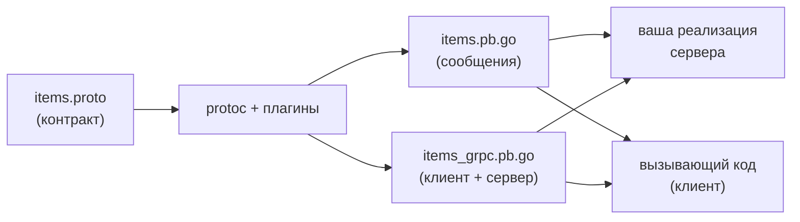
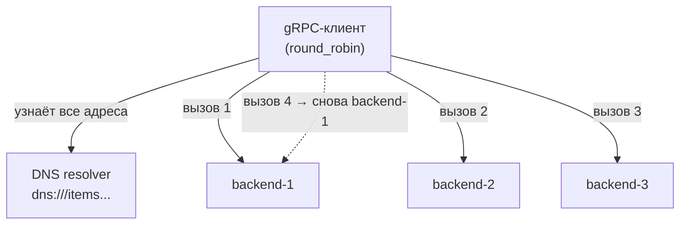

# gRPC и Protobuf

Когда сервисы общаются между собой, текстовый JSON-over-HTTP — не всегда лучший выбор: он многословен, не типизирован на уровне контракта и относительно медленно сериализуется. gRPC предлагает альтернативу: строгий контракт, бинарный формат (Protocol Buffers) и HTTP/2 в качестве транспорта со стримингом из коробки.

Для .NET-разработчика gRPC не новость — `grpc-dotnet` встроен в платформу. Но в .NET кодогенерация спрятана: вы добавляете `.proto` в `.csproj` через `<Protobuf>`, и при сборке проекта Visual Studio/SDK незаметно генерирует C#-классы клиента и сервера. В Go этот шаг **явный и внешний**: контракт описывается в `.proto`, а код генерируется отдельной командой (`protoc` или, по-современному, `buf` — об этом следующая глава). Эта глава разбирает gRPC в Go end-to-end: от контракта до балансировки и mTLS.

## Контракт в `.proto`

Всё начинается с файла `.proto` — языко-независимого описания сервиса и сообщений. Это **единственный источник правды** о контракте; код для любого языка генерируется из него.

```proto
syntax = "proto3";

package items.v1;

// Куда генерировать Go-код (важно для импортов).
option go_package = "github.com/acme/items/gen/items/v1;itemsv1";

service ItemService {
  // Unary: один запрос — один ответ.
  rpc GetItem(GetItemRequest) returns (Item);
}

message GetItemRequest {
  string id = 1; // номера полей — часть бинарного контракта, менять нельзя
}

message Item {
  string id = 1;
  string name = 2;
  int64 price_cents = 3;
}
```

Ключевая для Go деталь — `option go_package`: она задаёт путь импорта генерируемого пакета (часть до `;`) и его имя (после `;`). Номера полей (`= 1`, `= 2`) — это и есть бинарный контракт Protobuf: на проводе передаются именно они, а не имена, поэтому переименовать поле безопасно, а вот менять номер — нельзя.

> **Параллель с .NET:** сам `.proto` в Go и .NET идентичен — это общий стандарт Protobuf, файлы переносимы между платформами один в один. Различие только в `option go_package` (Go-специфичная директива) и в том, **когда** и **как** из этого `.proto` появляется код. В .NET — неявно, при сборке проекта. В Go — явной командой, а результат коммитится в репозиторий.

## Кодогенерация: `protoc` + плагины

Классический тулчейн состоит из компилятора `protoc` и двух плагинов:

- **`protoc-gen-go`** — генерирует Go-структуры для `message` (сериализация/десериализация Protobuf).
- **`protoc-gen-go-grpc`** — генерирует интерфейсы клиента и сервера для `service`.

Плагины ставятся как Go-инструменты:

```bash
go install google.golang.org/protobuf/cmd/protoc-gen-go@latest
go install google.golang.org/grpc/cmd/protoc-gen-go-grpc@latest
```

Запуск генерации (голым `protoc` — в следующей главе увидим, почему его вытеснил `buf`):

```bash
protoc --go_out=. --go_opt=paths=source_relative \
       --go-grpc_out=. --go-grpc_opt=paths=source_relative \
       items/v1/items.proto
```

На выходе появляются два файла, которые **коммитятся в git**:

- `items/v1/items.pb.go` — структуры `GetItemRequest`, `Item` и их методы.
- `items/v1/items_grpc.pb.go` — интерфейсы `ItemServiceServer` (его вы реализуете) и `ItemServiceClient` (его вызываете).



## Реализация сервера

Сгенерированный `ItemServiceServer` — это интерфейс. Вы пишете тип, который его реализует, встраивая `UnimplementedItemServiceServer` (это даёт forward-совместимость: если в контракт добавят новый метод, ваш сервер не перестанет компилироваться).

```go
type itemServer struct {
    itemsv1.UnimplementedItemServiceServer // встраивание ради forward-совместимости
}

func (s *itemServer) GetItem(ctx context.Context, req *itemsv1.GetItemRequest) (*itemsv1.Item, error) {
    if req.GetId() == "" {
        // Ошибки gRPC несут код состояния (аналог HTTP-статуса).
        return nil, status.Error(codes.InvalidArgument, "id обязателен")
    }
    return &itemsv1.Item{
        Id:         req.GetId(),
        Name:       "Виджет",
        PriceCents: 999,
    }, nil
}

func main() {
    lis, err := net.Listen("tcp", ":50051")
    if err != nil {
        log.Fatal(err)
    }
    s := grpc.NewServer()
    itemsv1.RegisterItemServiceServer(s, &itemServer{})
    log.Fatal(s.Serve(lis)) // блокируется, обслуживая соединения
}
```

Обратите внимание: первый аргумент метода — `ctx context.Context`. Через него приходят дедлайн и отмена с клиентской стороны (см. [`select` и `context`](../03-concurrency/03-select-and-context.md)). Ошибки возвращаются не как обычный `error`, а с **кодом состояния** через `status.Error(codes.X, msg)` — это богаче, чем HTTP-статус, и стандартизировано для всех языков.

> **Параллель с .NET:** в `grpc-dotnet` вы наследуете сгенерированный базовый класс `ItemService.ItemServiceBase` и переопределяете методы; сервис регистрируется в DI и роутинге через `app.MapGrpcService<...>()`. В Go вместо наследования базового класса — **встраивание** `Unimplemented...` структуры (композиция вместо наследования), а вместо DI-регистрации — явный вызов `RegisterItemServiceServer(s, impl)`. Коды ошибок `codes.InvalidArgument`/`status.Error` соответствуют `RpcException(new Status(StatusCode.InvalidArgument, ...))`.

## Вызов с клиента

Современный grpc-go создаёт соединение через **`grpc.NewClient`** (старые `grpc.Dial`/`DialContext` помечены deprecated). Соединение (`*grpc.ClientConn`) — долгоживущее и потокобезопасное; его создают один раз и переиспользуют.

```go
conn, err := grpc.NewClient(
    "localhost:50051",
    grpc.WithTransportCredentials(insecure.NewCredentials()), // без TLS — только для локалки!
)
if err != nil {
    log.Fatal(err)
}
defer conn.Close()

client := itemsv1.NewItemServiceClient(conn)

ctx, cancel := context.WithTimeout(context.Background(), 2*time.Second)
defer cancel()

item, err := client.GetItem(ctx, &itemsv1.GetItemRequest{Id: "42"})
if err != nil {
    log.Fatalf("GetItem: %v", err)
}
fmt.Printf("%s — %d коп.\n", item.GetName(), item.GetPriceCents())
```

Два важных момента. Во-первых, `insecure.NewCredentials()` отключает TLS — это допустимо только для локальной разработки; в проде нужны транспортные credentials (ниже про mTLS). Во-вторых, `context` с таймаутом задаёт дедлайн на конкретный вызов — он автоматически прокинется на сервер.

> **Параллель с .NET:** `grpc.NewClient` + `NewItemServiceClient` ≈ создание канала `GrpcChannel.ForAddress(...)` и клиента `new ItemService.ItemServiceClient(channel)`. В ASP.NET Core клиента обычно регистрируют через `services.AddGrpcClient<ItemServiceClient>(...)` (с интеграцией в DI и `IHttpClientFactory`); в Go DI нет — вы держите `*grpc.ClientConn` сами и передаёте клиента как зависимость явно.

## Четыре вида вызовов

gRPC (поверх HTTP/2) поддерживает не только «запрос-ответ», а четыре режима. Различие задаётся ключевым словом `stream` в `.proto`:

```proto
service ChatService {
  rpc Send(Msg) returns (Ack);                       // 1. unary
  rpc Subscribe(Filter) returns (stream Msg);        // 2. server-streaming
  rpc Upload(stream Chunk) returns (UploadResult);   // 3. client-streaming
  rpc Chat(stream Msg) returns (stream Msg);         // 4. bidi-streaming
}
```

| Вид | `.proto` | Когда применять | Аналог в .NET |
| --- | --- | --- | --- |
| Unary | `(Req) returns (Resp)` | обычный запрос-ответ | `Task<Resp>` |
| Server-streaming | `(Req) returns (stream Resp)` | сервер шлёт поток (подписка, лента событий) | `IAsyncEnumerable<Resp>` / `responseStream` |
| Client-streaming | `(stream Req) returns (Resp)` | клиент шлёт поток (загрузка чанками) | `requestStream` |
| Bidi-streaming | `(stream Req) returns (stream Resp)` | двусторонний обмен (чат, телеметрия) | оба потока |

Unary мы уже видели. Для контраста — набросок **server-streaming** сервера: вместо `return` ответа вы много раз вызываете `stream.Send(...)`:

```go
func (s *chatServer) Subscribe(req *chatv1.Filter, stream chatv1.ChatService_SubscribeServer) error {
    for i := 0; i < 3; i++ {
        if err := stream.Send(&chatv1.Msg{Text: fmt.Sprintf("событие %d", i)}); err != nil {
            return err // клиент отвалился — прекращаем
        }
        time.Sleep(time.Second)
    }
    return nil // возврат nil закрывает поток
}
```

А вот клиент, читающий этот поток в цикле до `io.EOF`:

```go
stream, err := client.Subscribe(ctx, &chatv1.Filter{})
if err != nil {
    log.Fatal(err)
}
for {
    msg, err := stream.Recv()
    if err == io.EOF { // поток корректно закрыт сервером
        break
    }
    if err != nil {
        log.Fatal(err)
    }
    fmt.Println(msg.GetText())
}
```

Идиома `for { Recv() ... io.EOF }` — стандартный способ читать gRPC-поток в Go. В client-streaming симметрично: клиент много раз делает `stream.Send(...)`, затем `stream.CloseAndRecv()`. В bidi оба конца читают и пишут одновременно (часто из разных горутин).

> **Параллель с .NET:** server-streaming в `grpc-dotnet` обычно выражают через `IAsyncEnumerable<T>` на сервере (`yield return`) и `await foreach` на клиенте — компилятор прячет курсор потока. В Go стриминг **явный**: вы сами вызываете `Send`/`Recv` и сами ловите `io.EOF` как сигнал конца. Это многословнее, но прозрачно — видно каждое сообщение и каждую границу потока.

## Client-side балансировка: `round_robin`

Здесь — важное архитектурное отличие от привычной модели «балансировщик-прокси». gRPC использует **HTTP/2 с долгоживущими соединениями**: классический L4-балансировщик, раздающий *соединения* по бэкендам, бесполезен — все запросы поедут по одному залипшему коннекту. Поэтому gRPC балансирует **на стороне клиента**: клиент сам знает про все адреса бэкендов и раскидывает по ним *вызовы*.

Включается это связкой «resolver + service config». DNS-resolver (`dns:///`) узнаёт список адресов за именем, а service config указывает политику `round_robin`:

```go
conn, err := grpc.NewClient(
    "dns:///items.prod.svc.cluster.local:50051",          // dns:/// — резолвим ВСЕ A-записи
    grpc.WithTransportCredentials(insecure.NewCredentials()),
    grpc.WithDefaultServiceConfig(`{"loadBalancingConfig":[{"round_robin":{}}]}`),
)
```

Что здесь происходит:

- Схема `dns:///` (с тремя слешами) включает DNS-resolver, который вытягивает **все** адреса за именем (в Kubernetes — все Pod'ы за headless-сервисом), а не один.
- `round_robin` заставляет клиент открыть подсоединения ко всем адресам и раскладывать вызовы по кругу: 1-й вызов → backend-1, 2-й → backend-2, и так далее.



> **Параллель с .NET:** в `grpc-dotnet` ту же client-side балансировку настраивают через `GrpcChannelOptions` со `ServiceConfig { LoadBalancingConfigs = { new RoundRobinConfig() } }` и резолвер адресов. Концепция идентична (балансирует клиент, а не прокси) — отличается лишь синтаксис: в Go политика задаётся **строкой JSON** в `WithDefaultServiceConfig`, что языко-независимо и совпадает с форматом `service config` из спецификации gRPC.

## Безопасность: mTLS через `credentials`

В проде соединения шифруют TLS, а для межсервисного доверия часто используют **mTLS** (mutual TLS): не только клиент проверяет сервер, но и сервер проверяет клиента по его сертификату. В Go это настраивается через пакет `credentials` поверх стандартного `crypto/tls`.

```go
// Сервер: предъявляет свой серт и требует+проверяет серт клиента.
serverCert, _ := tls.LoadX509KeyPair("server.crt", "server.key")
caPool := x509.NewCertPool()
caPEM, _ := os.ReadFile("ca.crt")
caPool.AppendCertsFromPEM(caPEM)

creds := credentials.NewTLS(&tls.Config{
    Certificates: []tls.Certificate{serverCert},
    ClientCAs:    caPool,
    ClientAuth:   tls.RequireAndVerifyClientCert, // <- это и делает TLS взаимным
})
s := grpc.NewServer(grpc.Creds(creds))
```

```go
// Клиент: предъявляет свой серт и проверяет серт сервера по тому же CA.
clientCert, _ := tls.LoadX509KeyPair("client.crt", "client.key")
creds := credentials.NewTLS(&tls.Config{
    Certificates: []tls.Certificate{clientCert},
    RootCAs:      caPool,
})
conn, _ := grpc.NewClient("items.prod:50051", grpc.WithTransportCredentials(creds))
```

Суть взаимности — в `ClientAuth: tls.RequireAndVerifyClientCert` на сервере: без неё это был бы обычный односторонний TLS. Оба конца доверяют сертификатам, подписанным общим CA.

> **Параллель с .NET:** это `tls.Config`/`credentials.NewTLS` против `HttpClientHandler.ClientCertificates` на клиенте и настроек Kestrel (`ConfigureHttpsDefaults` с `ClientCertificateMode.RequireCertificate`) на сервере. Механика X.509 и mTLS одинаковая (это уровень TLS, а не gRPC); различается лишь API настройки `tls.Config` против `HttpsConnectionAdapterOptions`.

## Перехватчики (interceptors)

Аналог HTTP-middleware в мире gRPC — **interceptors**. Они оборачивают вызовы для сквозной логики (логирование, метрики, аутентификация, recover). Бывают unary и stream, по обе стороны (клиент/сервер):

```go
// Серверный unary-перехватчик: логирует метод и длительность каждого вызова.
func loggingUnary(
    ctx context.Context,
    req any,
    info *grpc.UnaryServerInfo,
    handler grpc.UnaryHandler,
) (any, error) {
    start := time.Now()
    resp, err := handler(ctx, req) // передаём управление дальше (как next в HTTP-middleware)
    log.Printf("%s — %s — err=%v", info.FullMethod, time.Since(start), err)
    return resp, err
}

s := grpc.NewServer(grpc.ChainUnaryInterceptor(loggingUnary /*, authUnary, ... */))
```

`grpc.ChainUnaryInterceptor` (и парный `ChainStreamInterceptor`) собирает несколько перехватчиков в цепочку — прямой аналог цепочки HTTP-middleware из предыдущей главы. Структурно `handler(ctx, req)` здесь играет ту же роль, что `next.ServeHTTP(w, r)` в HTTP.

> **Параллель с .NET:** gRPC-interceptors ≈ `Interceptor` из `grpc-dotnet` (базовый класс с `UnaryServerHandler` и т.п.), которые регистрируют через `options.Interceptors.Add<...>()`. Идея и место в конвейере те же; различие — в способе сборки цепочки (в Go это `ChainUnaryInterceptor`, в .NET — список в опциях с DI). Тема обсервабилити и перехвата подробно разбирается в [Разделе 11](../11-observability-middleware/README.md).

## Итог

- gRPC строится на контракте в `.proto`: один языко-независимый файл — источник правды для всех сторон. Сам `.proto` в Go и .NET идентичен; различается процесс генерации.
- В Go кодогенерация — **явный внешний шаг**: `protoc` + `protoc-gen-go` (сообщения) + `protoc-gen-go-grpc` (клиент/сервер); результат (`*.pb.go`) коммитится в репозиторий. В .NET это спрятано в сборку проекта через `<Protobuf>`.
- Сервер реализуют, **встраивая** `Unimplemented...` (композиция вместо наследования) и регистрируя через `RegisterXServiceServer`; ошибки несут код состояния (`status.Error(codes.X, ...)`).
- Клиент создают через **`grpc.NewClient`** (не устаревший `grpc.Dial`), переиспользуют `*grpc.ClientConn`, задают дедлайн через `context`.
- Четыре вида вызовов (unary, server/client/bidi-streaming) задаются словом `stream` в `.proto`; стриминг в Go явный — `Send`/`Recv` и `io.EOF` вместо `IAsyncEnumerable`.
- Балансировка в gRPC — **client-side** (`round_robin` + `dns:///`-resolver через `WithDefaultServiceConfig`), а не прокси, из-за долгоживущих HTTP/2-соединений.
- mTLS настраивается через `credentials.NewTLS` поверх `crypto/tls` (`tls.RequireAndVerifyClientCert` делает TLS взаимным); сквозная логика — через interceptors (аналог middleware).

Дальше — как командой шарить `.proto`-контракты между сервисами и почему ручной `protoc` уступил место инструменту Buf.

---

[⌂ Главная](../../README.md) · [↑ Раздел](./README.md) · [← Предыдущий: HTTP-сервер](./01-http-server.md) · [→ Следующий: Шаринг контрактов и Buf](./03-contract-sharing-buf.md)
