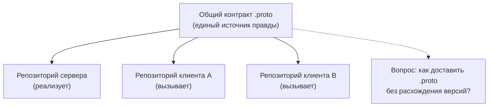
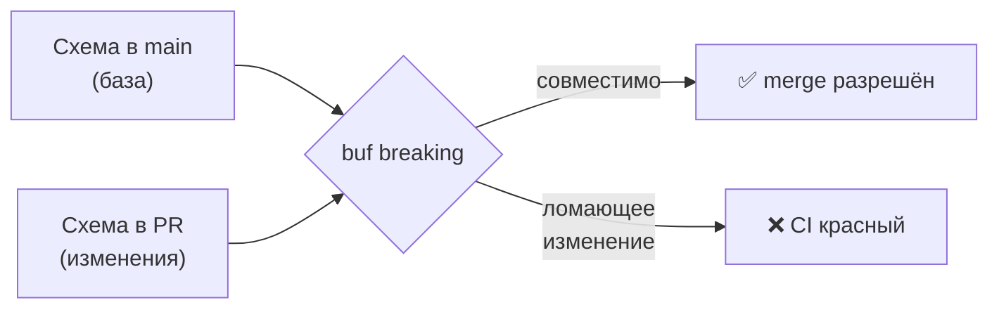

# Шаринг контрактов и Buf

В предыдущей главе мы сгенерировали Go-код из `.proto` голым `protoc`. Этого хватает для одного сервиса в одном репозитории. Но как только сервисов становится двое и больше, всплывает настоящая проблема промышленного gRPC: **как командно шарить контракты** между сервисами — так, чтобы серверы и клиенты не разъезжались, а ломающие изменения схемы ловились до прода, а не после.

Эта глава — про инструмент, который стал отраслевым стандартом решения этой задачи в Go-мире: **Buf**. Для .NET-разработчика отправная точка иная: там `.proto` чаще всего шарят как NuGet-пакет или общий проект решения, опираясь на встроенный тулинг. Buf же предлагает язык-агностичный подход, который не привязан к экосистеме конкретной платформы.

## Проблема: где живут общие `.proto`

Контракт `.proto` нужен **обеим** сторонам: серверу (он его реализует) и клиенту (он его вызывает). Если это разные сервисы — а в микросервисах так почти всегда — встаёт вопрос, где хранить исходный `.proto` и как доставлять его потребителям. Есть два полюса.

**Монорепо.** Все сервисы и общие `.proto` лежат в одном репозитории, обычно в каталоге вроде `proto/`. Плюс: контракт и все его потребители видны атомарно — изменение схемы и адаптация всех вызывающих делаются одним коммитом/PR. Минус: монорепо подходит не всем командам организационно.

**Отдельные репозитории.** У каждого сервиса свой репозиторий. Тогда общие `.proto` нужно как-то распространять между ними, и наивные способы плохи:

- ❌ **Копипаста `.proto` из репо в репо** — копии немедленно расходятся, и никто не знает, какая версия «настоящая».
- ❌ **Git submodule с контрактами** — технически работает, но управление сабмодулями болезненно и легко забыть обновить.
- ❌ **Каждый генерирует код сам своим `protoc`** — у всех чуть разные версии `protoc`/плагинов и разные флаги, на выходе несовместимый код.



Корень проблемы один: `.proto` — это **версионируемый артефакт с потребителями**, и его нужно публиковать, версионировать и проверять на совместимость так же дисциплинированно, как обычную библиотеку. Ровно это и автоматизирует Buf.

> **Параллель с .NET:** в .NET-мире эту задачу обычно решают **NuGet-пакетом**: общие `.proto` (или уже сгенерированные C#-классы) пакуют в пакет, публикуют в приватный feed, и каждый сервис подключает его как зависимость с версией. Это удобно внутри .NET, но привязано к платформе — пакет с C#-кодом бесполезен для сервиса на Go или TypeScript. Buf/BSR (ниже) решает ту же проблему **язык-агностично**: публикуется сама схема, а код под нужный язык каждый генерирует у себя.

## Buf: замена голому `protoc`

[Buf](https://buf.build) — это инструмент, который обращается с `.proto` как с полноценным модулем: его можно линтить, проверять на ломающие изменения, генерировать из него код одной командой и публиковать в реестр. Он по сути вытеснил ручной `protoc` в новых проектах. Почему:

- ❌ **Голый `protoc`** — это длинная, хрупкая командная строка с путями и флагами (вы видели её в прошлой главе), ручное управление путями импорта, никакого линтинга и никакого контроля совместимости.
- ✅ **Buf** — декларативная конфигурация в YAML, единообразная генерация (`buf generate`), встроенные линтер (`buf lint`) и детектор ломающих изменений (`buf breaking`), плюс реестр схем (BSR).

### `buf.yaml`: описание модуля

`buf.yaml` объявляет модуль(и) с `.proto`, правила линтинга и правила проверки совместимости. Актуальная версия конфигурации — **v2**:

```yaml
version: v2
modules:
  - path: proto                  # каталог с .proto
    name: buf.build/acme/items   # имя модуля в реестре (если публикуете в BSR)
lint:
  use:
    - STANDARD                   # набор правил по умолчанию (бывш. DEFAULT)
breaking:
  use:
    - FILE                       # консервативная проверка совместимости (по умолчанию)
```

### `buf.gen.yaml`: как генерировать код

`buf.gen.yaml` описывает, какими плагинами и куда генерировать код. В v2 здесь же можно объявить и **входные данные** (`inputs`), так что все настройки генерации лежат в одном месте, а не размазаны по флагам CLI:

```yaml
version: v2
plugins:
  - remote: buf.build/protocolbuffers/go   # удалённый плагин — не нужно ставить локально!
    out: gen
    opt:
      - paths=source_relative
  - remote: buf.build/grpc/go              # gRPC-клиент/сервер
    out: gen
    opt:
      - paths=source_relative
inputs:
  - directory: proto
```

Обратите внимание на `remote:` — Buf умеет запускать **удалённые плагины** со своей инфраструктуры. Это снимает классическую боль «у каждого своя версия `protoc-gen-go`»: версия плагина зафиксирована в конфиге и одинакова у всех. (При желании плагины можно держать и локально через `local:`.)

### `buf generate`: одна команда вместо простыни флагов

```bash
buf generate
```

Сравните с `protoc --go_out=. --go_opt=... --go-grpc_out=. --go-grpc_opt=... proto/...` из прошлой главы. Вся конфигурация теперь декларативна, воспроизводима и хранится в git рядом с кодом. Это и есть главная причина, по которой Buf вытеснил ручной `protoc`.

> **Параллель с .NET:** `buf.gen.yaml` + `buf generate` концептуально соответствуют записи `<Protobuf Include="..." GrpcServices="..." />` в `.csproj`, которая управляет генерацией на сборке. И то и другое — декларативное описание «что и как генерировать». Различие в триггере: в .NET генерация происходит **неявно при `dotnet build`**, а в Go это **отдельная явная команда** `buf generate`, результат которой коммитится. Плюс `remote:`-плагины Buf не имеют прямого аналога в .NET-тулчейне.

## `buf lint`: единый стиль контрактов

`buf lint` проверяет `.proto` на соответствие конвенциям (именование, версионирование пакетов, оформление сервисов и полей):

```bash
buf lint
# proto/items/v1/items.proto:12:3: Field name "ItemID" should be lower_snake_case, such as "item_id".
```

Это особенно ценно, когда контракты пишет много людей: линтер не даёт схеме «разъезжаться» стилистически и ловит антипаттерны (например, пакет без версии `v1`). Ближайший аналог в привычном мире — анализаторы Roslyn / `.editorconfig`, но прицельно для Protobuf-схем.

## `buf breaking`: детект ломающих изменений ✅

Это — киллер-фича Buf и главная причина его брать в многосервисном окружении. `buf breaking` сравнивает текущую схему с прошлой версией (из git-ветки, тега или BSR) и **проваливает проверку**, если изменение ломает совместимость:

```bash
# Сравнить текущее состояние с веткой main
buf breaking --against '.git#branch=main'
```

Что он ловит — ровно те ошибки, которые в Protobuf приводят к молчаливой порче данных на проводе:

- ❌ изменение номера поля (`id = 1` → `id = 2`) — номер это и есть бинарный контракт;
- ❌ изменение типа поля (`int32` → `string`);
- ❌ удаление поля, которое ещё могут читать старые клиенты (при строгой проверке);
- ❌ переименование/удаление RPC-метода или сервиса.



Поставленный в CI на каждый PR, `buf breaking` превращает совместимость контракта из устной договорённости в автоматический гейт. Это то, чего голый `protoc` не давал в принципе, а `grpc-dotnet` из коробки тоже не делает.

> **Параллель с .NET:** прямого встроенного аналога `buf breaking` в стандартном .NET-тулчейне нет. Ближайшее по духу — проверки бинарной/пакетной совместимости API (вроде анализаторов public API или инструментов сравнения сборок), но они про .NET-сборки, а не про wire-совместимость Protobuf. Именно автоматический контроль ломающих изменений схемы — одно из сильнейших отличий Buf-подхода.

## Buf Schema Registry (BSR)

BSR — это **реестр для Protobuf-схем** (по аналогии с тем, чем npm является для JS, а NuGet — для .NET, но именно для контрактов, а не для скомпилированного кода). Опубликованный в BSR модуль можно:

- подключать как зависимость в чужом `buf.yaml` (`deps:`), не копируя `.proto`;
- генерировать из него код через удалённые плагины;
- просматривать документацию по схеме и историю версий в вебе.

```bash
buf push   # опубликовать модуль в BSR (по name из buf.yaml)
```

Так замыкается полный цикл шаринга для отдельных репозиториев: контракт публикуется один раз в BSR, а каждый сервис (на любом языке) подтягивает его как зависимость и генерирует код под себя. Это и есть язык-агностичная замена «шарингу через NuGet».

> **Параллель с .NET:** BSR ≈ приватный NuGet feed, но для схем, а не для пакетов под конкретную платформу. Если в .NET вы публикуете NuGet с C#-классами (полезен только в .NET), то в BSR вы публикуете саму `.proto`-схему — и сервис на Go, TypeScript, Java или том же C# подтягивает её и генерирует нативный код. Один источник правды для полиглот-команды.

## Версионирование и обратная совместимость

Buf автоматизирует контроль, но дисциплину совместимости задаёте вы. Базовые правила Protobuf, которые `buf breaking` помогает соблюдать:

- ✅ **Версия — в имени пакета:** `package items.v1;`. Несовместимые изменения вводят как новый пакет `items.v2`, а `v1` живёт, пока есть его потребители (линтер требует версию в пакете не просто так).
- ✅ **Добавлять поля можно** — новые номера полей со старым кодом просто игнорируются (forward-совместимость заложена в Protobuf). Поэтому развитие схемы — это в основном добавление, а не изменение.
- ❌ **Нельзя переиспользовать номер удалённого поля.** Удалили поле — зарезервируйте его номер через `reserved 3;`, чтобы случайно не выдать его новому полю с другим смыслом.
- ❌ **Нельзя менять номер или тип существующего поля** — это и есть классическое ломающее изменение, которое ловит `buf breaking`.

Так контракт эволюционирует безопасно: старые клиенты продолжают работать с новым сервером, а новые поля добавляются без согласованного «большого взрыва» во всех сервисах сразу.

## Итог

- Как только сервисов больше одного, `.proto` становится **версионируемым артефактом с потребителями**: его нужно публиковать, версионировать и проверять на совместимость, а не копировать между репозиториями.
- Наивные способы шаринга (копипаста, сабмодули, генерация у каждого своим `protoc`) ведут к расхождению версий и несовместимому коду.
- **Buf** заменяет голый `protoc`: декларативные `buf.yaml`/`buf.gen.yaml` (актуальная версия — v2), генерация одной командой `buf generate`, удалённые плагины с зафиксированной версией.
- `buf lint` держит единый стиль контрактов; `buf breaking` — ключевая фича — автоматически ловит ломающие изменения схемы (смена номера/типа поля, удаление RPC) и ставится гейтом в CI.
- **BSR** — язык-агностичный реестр схем (аналог npm/NuGet, но для `.proto`): публикуете контракт один раз, любой сервис на любом языке подтягивает его как зависимость и генерирует нативный код.
- Совместимость держится дисциплиной Protobuf: версия в имени пакета, только добавление полей, `reserved` для удалённых номеров, запрет на смену номера/типа.

Дальше — итоговая глава раздела: консолидированное сравнение сетевого стека .NET и Go с таблицей соответствий и рецептами «как сделать привычное X».

---

[⌂ Главная](../../README.md) · [↑ Раздел](./README.md) · [← Предыдущий: gRPC и Protobuf](./02-grpc-protobuf.md) · [→ Следующий: Сравнение с .NET](./04-comparison-with-dotnet.md)
