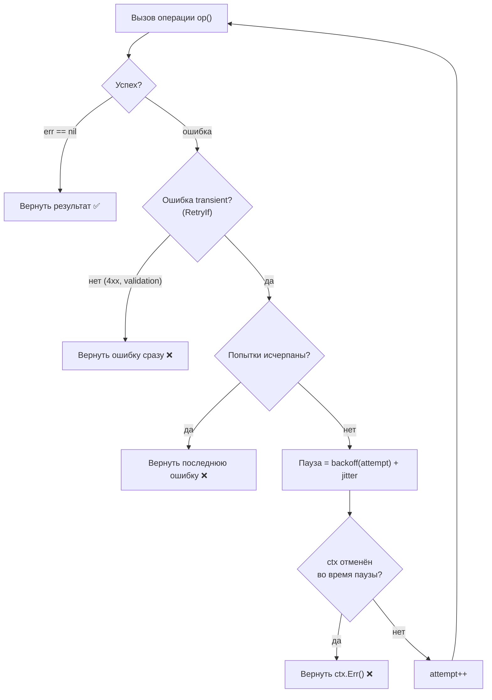

# Ретраи (Retries)

Сетевой вызов упал с `connection reset`. База ответила `deadline exceeded`. Соседний сервис вернул `503` ровно потому, что в этот момент перезапускал под. Все три ошибки объединяет одно: они **временные (transient)** — повторите запрос через мгновение, и он, скорее всего, пройдёт. Ретрай (повтор) — самый базовый паттерн отказоустойчивости и первое, что приходит в голову. Но именно из-за обманчивой простоты с ним проще всего выстрелить себе в ногу: заретраить то, что ретраить нельзя, и положить уже не один сервис, а всю систему.

В .NET вы бы потянулись за Polly и написали `AddRetry(...)`. В Go в простом случае вы напишете цикл `for` руками — и это идиоматично. А когда нужно больше (backoff, jitter, условия), возьмёте `avast/retry-go`. Разберём оба пути, но сначала — главное, что не зависит от языка: **что вообще можно ретраить.**

## Что можно ретраить, а что нельзя

Ретрай безопасен только тогда, когда повторное выполнение операции не вредит. Это сводится к двум вопросам: **идемпотентна ли операция** и **временная ли ошибка**.

**Идемпотентность.** Операция идемпотентна, если повторный вызов даёт тот же результат, что и однократный, без побочных эффектов-дубликатов.

- ✅ **Можно ретраить:** чтение (`GET`), `PUT` с полным телом (перезапись в то же состояние), `DELETE` по id (повторное удаление уже удалённого — no-op), операции с идемпотентным ключом (idempotency key), запросы к БД, обёрнутые в безопасную транзакцию.
- ❌ **Нельзя (без защиты):** «слепой» `POST`, создающий сущность (два ретрая → два заказа), списание денег без идемпотентного ключа, инкремент счётчика, отправка письма/уведомления, любая операция с накапливающимся побочным эффектом.

**Характер ошибки.** Ретраить имеет смысл только **transient**-ошибки — те, что пройдут сами.

- ✅ **Transient (ретраим):** таймауты, `connection refused`/`reset`, `503 Service Unavailable`, `502 Bad Gateway`, `429 Too Many Requests` (с уважением к `Retry-After`!), сетевые сбои DNS.
- ❌ **Постоянные (не ретраим — бессмысленно и вредно):** `400 Bad Request`, `401`/`403` (авторизация не починится повтором), `404`, `422 Validation`, ошибки сериализации, нарушение бизнес-правила. Ретрай здесь только жжёт ресурсы и оттягивает честный отказ.

> **Параллель с .NET:** ровно та же дисциплина, что в Polly с `ShouldHandle`: вы перечисляете, какие исключения/коды считаются transient (`HttpRequestException`, `5xx`, `408`, `429`), и только их повторяете. Polly из коробки ничего не угадывает за вас — `HttpClientFactory` лишь предлагает готовый `AddStandardResilienceHandler` с разумными дефолтами. В Go угадывания нет тем более: условие «что ретраить» вы пишете явно (см. `RetryIf` ниже). Принцип универсален: **ретрай неидемпотентной операции — это баг, а не фича.**

## Ретрай своими руками

Простейший ретрай — цикл с фиксированной паузой. Уже здесь видно, что без оглядки на `context` (см. [Раздел 3](../03-concurrency/03-select-and-context.md)) ретрай-цикл легко превращается в неотменяемое зависание.

```go
// Наивный ретрай: фиксированная задержка, БЕЗ учёта context — так не делать в проде.
func retryNaive(attempts int, delay time.Duration, op func() error) error {
	var err error
	for i := 0; i < attempts; i++ {
		if err = op(); err == nil {
			return nil // успех — выходим
		}
		time.Sleep(delay) // ❌ глухой сон: не реагирует на отмену
	}
	return err // вернули последнюю ошибку
}
```

Проблема одна, но серьёзная: `time.Sleep` нельзя прервать. Если вызывающий отменил `context` (пользователь закрыл соединение, истёк дедлайн запроса), цикл всё равно досидит все паузы и сделает все попытки. Правильный ретрай ждёт через `select` по `ctx.Done()`:

```go
// Ретрай, уважающий context: пауза прерывается отменой/дедлайном.
func retry(ctx context.Context, attempts int, delay time.Duration, op func() error) error {
	var err error
	for i := 0; i < attempts; i++ {
		if err = op(); err == nil {
			return nil
		}
		// последняя попытка — не ждём зря
		if i == attempts-1 {
			break
		}
		select {
		case <-time.After(delay): // ждём паузу
		case <-ctx.Done(): // ...но отмена/дедлайн прерывает ожидание
			return ctx.Err() // context.Canceled или context.DeadlineExceeded
		}
	}
	return err
}
```

Это уже рабочий каркас. Но фиксированная задержка плоха под нагрузкой — к ней нужны две добавки.

### Exponential backoff (экспоненциальная задержка)

Если сервис лежит, долбить его каждые 100 мс — значит мешать ему встать. Идея exponential backoff: **с каждой попыткой увеличивать паузу экспоненциально** — 100 мс, 200, 400, 800… Так первые ретраи быстры (вдруг это была разовая икота), а если проблема серьёзнее — вы экспоненциально снижаете давление на упавшую зависимость и даёте ей время восстановиться.

```go
// Задержка перед попыткой i (0-based): base * 2^i, с потолком maxDelay.
func backoff(base, maxDelay time.Duration, attempt int) time.Duration {
	d := base << attempt // base * 2^attempt (сдвиг = умножение на степень двойки)
	if d > maxDelay || d <= 0 {  // d <= 0 ловит переполнение при больших attempt
		return maxDelay
	}
	return d
}
```

Потолок `maxDelay` обязателен: без него пауза при 20-й попытке улетит в часы (и переполнит `int64`).

### Jitter (случайный разброс) и проблема «thundering herd»

Чистый exponential backoff порождает коварную проблему. Представьте: внешний сервис моргнул, и **тысяча** ваших инстансов одновременно получили ошибку. Все они ждут ровно 100 мс, потом ровно 200, потом ровно 400 — и **синхронно** бьют в сервис в одни и те же моменты. Сервис, едва встав, тут же получает залп из тысячи запросов и падает снова. Это и есть **thundering herd** («стадо слонов») — синхронизированные ретраи усиливают пиковую нагрузку вместо того, чтобы её сгладить.

Лекарство — **jitter**: добавить к задержке случайный разброс, чтобы «размазать» ретраи во времени и десинхронизировать клиентов.

```go
// Backoff с jitter: к экспоненциальной паузе добавляем случайную добавку.
func backoffJitter(base, maxDelay time.Duration, attempt int) time.Duration {
	d := backoff(base, maxDelay, attempt)
	jitter := time.Duration(rand.Int63n(int64(d) / 2)) // 0..50% от d
	return d/2 + jitter // итог в диапазоне [d/2, d): тот же порядок, но «размазано»
	// Go 1.20+: глобальный rand больше не нужно сидировать вручную.
}
```

Существуют разные стратегии jitter (full jitter — `rand(0, d)`; equal jitter — `d/2 + rand(0, d/2)`; decorrelated jitter). Подробности — в классической статье AWS «Exponential Backoff And Jitter». Практический вывод один: **под реальной нагрузкой backoff без jitter недостаточно; jitter обязателен.**

Полный поток ретраев с backoff и проверкой характера ошибки:



## Библиотека `avast/retry-go`

Писать backoff и jitter каждый раз руками утомительно. `github.com/avast/retry-go/v4` — самая популярная Go-библиотека для ретраев. Её ядро — функция `retry.Do`, принимающая операцию и набор опций-функций (functional options — идиома Go для конфигурации):

```go
func Do(retryableFunc RetryableFunc, opts ...Option) error
```

Где `RetryableFunc` — это `func() error`. Базовый пример:

```go
import "github.com/avast/retry-go/v4"

err := retry.Do(
	func() error {
		resp, err := http.Get("https://api.example.com/data")
		if err != nil {
			return err
		}
		defer resp.Body.Close()
		if resp.StatusCode >= 500 {
			return fmt.Errorf("сервер вернул %d", resp.StatusCode)
		}
		return nil
	},
	retry.Attempts(5),                 // максимум 5 попыток (по умолчанию 10)
	retry.Delay(100*time.Millisecond), // базовая задержка (по умолчанию 100 мс)
	retry.DelayType(retry.BackOffDelay), // экспоненциальный backoff (это и есть дефолт)
	retry.MaxJitter(50*time.Millisecond), // добавить jitter до 50 мс
)
if err != nil {
	log.Printf("не удалось после ретраев: %v", err)
}
```

Ключевые опции:

| Опция | Назначение | По умолчанию |
| --- | --- | --- |
| `retry.Attempts(n uint)` | Сколько попыток. `Attempts(0)` — бесконечно (до успеха) | `10` |
| `retry.Delay(d)` | Базовая задержка | `100ms` |
| `retry.MaxDelay(d)` | Потолок задержки (важен при backoff) | нет |
| `retry.DelayType(f)` | Стратегия задержки: `BackOffDelay`, `FixedDelay`, `RandomDelay`, `CombineDelay(...)` | `BackOffDelay` |
| `retry.MaxJitter(d)` | Разброс для jitter | нет |
| `retry.RetryIf(f func(error) bool)` | Ретраить ли данную ошибку | ретраить всё, кроме `Unrecoverable` |
| `retry.OnRetry(f func(n uint, err error))` | Колбэк между попытками (логирование) | нет |
| `retry.Context(ctx)` | Прервать ретраи по отмене/дедлайну `ctx` | `context.Background()` |
| `retry.LastErrorOnly(true)` | Вернуть только последнюю ошибку, а не агрегат всех | `false` |

### `DelayType`: backoff + jitter из коробки

`DelayType` — это функция `func(n uint, err error, config *Config) time.Duration`. Готовые реализации закрывают типовые нужды, а `CombineDelay` склеивает несколько: классический рецепт «exponential backoff + jitter» — это комбинация `BackOffDelay` и `RandomDelay`.

```go
err := retry.Do(
	op,
	retry.Attempts(6),
	retry.Delay(200*time.Millisecond),
	retry.MaxDelay(5*time.Second), // не ждать дольше 5 секунд между попытками
	// backoff (200ms, 400, 800, ...) ПЛЮС случайная добавка
	retry.DelayType(retry.CombineDelay(retry.BackOffDelay, retry.RandomDelay)),
	retry.MaxJitter(100*time.Millisecond), // питает RandomDelay
)
```

### `RetryIf`: ретраить только то, что нужно

Вот где формализуется правило «что можно ретраить». `RetryIf` отсекает постоянные ошибки, чтобы не жечь попытки на `400`/`404`:

```go
err := retry.Do(
	func() error { return callAPI() },
	retry.Attempts(4),
	retry.RetryIf(func(err error) bool {
		// ретраим только transient: сетевые и 5xx; всё прочее — мимо
		var apiErr *APIError
		if errors.As(err, &apiErr) {
			return apiErr.StatusCode >= 500 || apiErr.StatusCode == 429
		}
		return true // сетевые ошибки (не *APIError) считаем transient
	}),
)
```

Альтернатива `RetryIf` — обернуть «фатальную» ошибку в `retry.Unrecoverable(err)` прямо в операции: тогда `retry.Do` остановится немедленно и вернёт эту ошибку, не делая повторов.

### Уважение `context` через `retry.Context`

Как и в ручном варианте, ретраи обязаны прерываться отменой. Передайте `ctx` опцией — и `retry.Do` прекратит попытки, как только контекст отменён или истёк его дедлайн:

```go
ctx, cancel := context.WithTimeout(context.Background(), 3*time.Second)
defer cancel()

err := retry.Do(
	func() error { return fetch(ctx) }, // саму операцию тоже кормим ctx!
	retry.Context(ctx),                  // ...и ретраи прервутся по дедлайну
	retry.Attempts(10),
	retry.Delay(500*time.Millisecond),
)
// если за 3 секунды не уложились — err обёрнут вокруг context.DeadlineExceeded
```

Важно: `ctx` нужно прокинуть **и в саму операцию** (`fetch(ctx)`), и в `retry.Context`. Первое прерывает текущий висящий вызов, второе — паузу между попытками и запуск следующей. Одно без другого оставляет дыру.

### Обработка результата и ошибок

По умолчанию `retry.Do` возвращает тип `retry.Error` — срез всех накопленных ошибок (по одной на попытку). Он поддерживает `errors.Is`/`errors.As` и `Unwrap` (возвращает последнюю ошибку), так что привычные проверки работают:

```go
err := retry.Do(op, retry.Attempts(3))
if errors.Is(err, context.DeadlineExceeded) {
	// дедлайн
}
```

Если нужна именно последняя ошибка без агрегата — `retry.LastErrorOnly(true)`. А когда операция возвращает данные, используйте дженерик-вариант `retry.DoWithData[T]`:

```go
data, err := retry.DoWithData(
	func() (User, error) { return fetchUser(ctx, id) },
	retry.Attempts(3),
	retry.Context(ctx),
)
```

> **Параллель с .NET:** `retry.Do` с backoff и jitter — это аналог Polly-стратегии retry. В классическом Polly v7 это `Policy.Handle<T>().WaitAndRetryAsync(...)`; в современном Polly v8 — `new ResiliencePipelineBuilder().AddRetry(new RetryStrategyOptions { MaxRetryAttempts = 5, BackoffType = DelayBackoffType.Exponential, UseJitter = true, ShouldHandle = ... })`. Сопоставление почти один-в-один: `Attempts` ≈ `MaxRetryAttempts`, `DelayType(BackOffDelay)` ≈ `BackoffType = Exponential`, `MaxJitter`/`RandomDelay` ≈ `UseJitter = true`, `RetryIf` ≈ `ShouldHandle`, `retry.Context(ctx)` ≈ `CancellationToken`, прокинутый в `ExecuteAsync`. Разница не в возможностях, а в упаковке: в .NET это **одна из стратегий единого `ResiliencePipeline`** (туда же доедут circuit breaker, timeout, fallback), а в Go `retry-go` — **самостоятельная библиотека**, делающая только ретраи; circuit breaker вы добавите отдельной библиотекой и склеите руками (см. [следующую главу](./02-circuit-breaker.md)).

## Итог

- Ретраить можно только **идемпотентные** операции и только **transient**-ошибки (таймауты, `5xx`, `429`, сетевые сбои). Ретрай неидемпотентного `POST` или постоянной ошибки `4xx` — это баг.
- Простой ретрай в Go пишется циклом `for` руками — идиоматично. Но пауза обязана идти через `select` по `ctx.Done()`, а не через глухой `time.Sleep`, иначе цикл не отменяется.
- **Exponential backoff** экспоненциально увеличивает паузу (с потолком `maxDelay`), снижая давление на упавшую зависимость. **Jitter** добавляет случайный разброс и спасает от **thundering herd** — синхронизированного залпа ретраев от множества клиентов.
- `avast/retry-go` (`retry.Do` + опции) даёт это из коробки: `Attempts`, `Delay`/`MaxDelay`, `DelayType` (`BackOffDelay` + `RandomDelay` через `CombineDelay`), `RetryIf` для фильтра ошибок, `Context` для отмены. Для данных — `DoWithData[T]`.
- В отличие от Polly, где retry — лишь одна стратегия единого пайплайна, в Go это отдельная библиотека; другие паттерны вы подключаете и комбинируете сами.

Ретраи лечат разовые сбои. Но если сервис лёг всерьёз, даже вежливые ретраи с backoff будут долбить труп и тратить ресурсы. От этого защищает следующий паттерн — предохранитель.

---

[⌂ Главная](../../README.md) · [↑ Раздел](./README.md) · [← Предыдущий: Обзор раздела](./README.md) · [→ Следующий: Circuit Breaker](./02-circuit-breaker.md)
