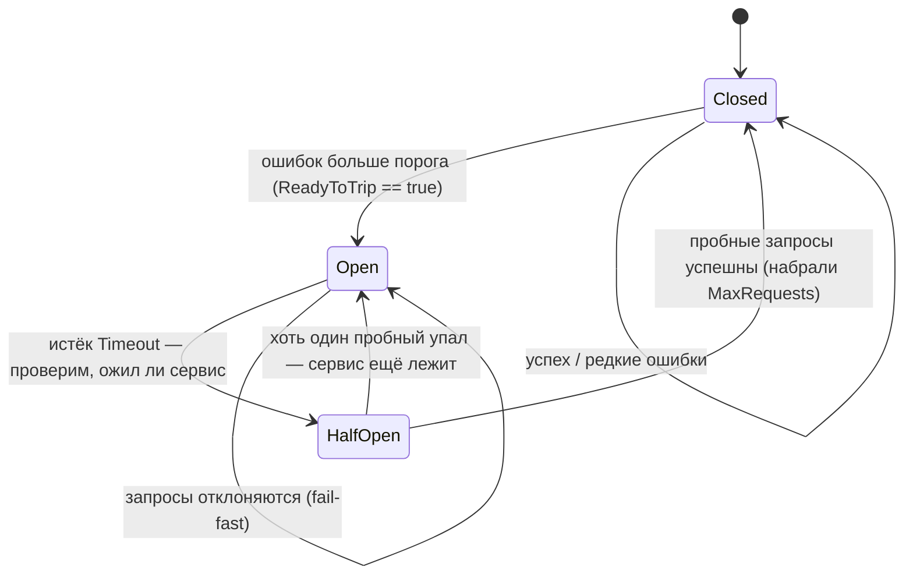
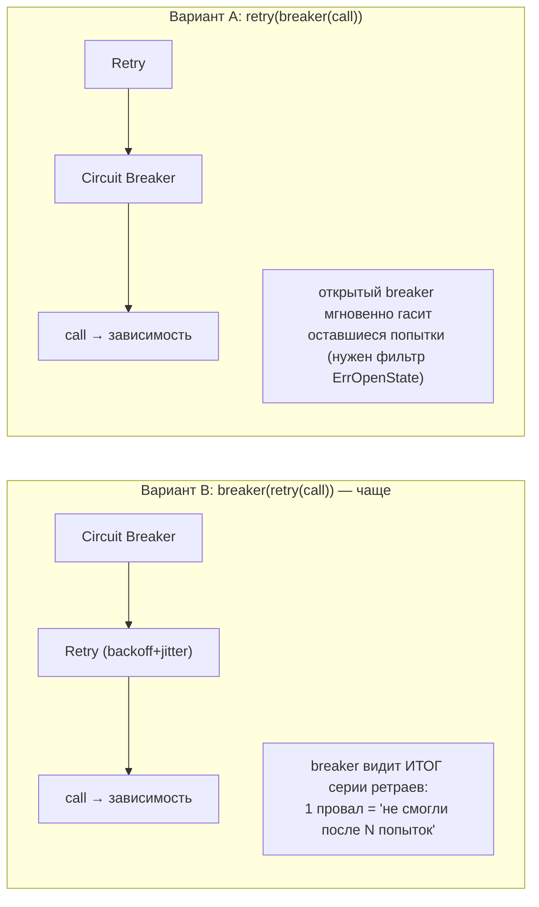

# Circuit Breaker

Ретраи из прошлой главы хороши против разовой икоты. Но представьте, что зависимость лежит **всерьёз** — база перегружена, сервис в дауне на пять минут. Теперь каждый ваш запрос обречён: он висит до таймаута (скажем, 30 секунд), занимает горутину и соединение, а с ретраями — ещё и повторяется. Под нагрузкой это убивает уже ваш сервис: пул соединений исчерпан, горутины копятся, латентность взлетает. Вы не помогаете упавшей зависимости — вы добиваете и её, и себя.

Паттерн **Circuit Breaker** («предохранитель», «автоматический выключатель») решает это по аналогии с электрическим автоматом в щитке: при перегрузке он **размыкает цепь** и перестаёт пропускать ток. В коде это значит: обнаружив, что зависимость стабильно падает, breaker начинает **мгновенно** отклонять запросы к ней, не делая реального вызова (**fail-fast**). Это даёт две вещи: упавший сервис получает передышку (мы перестали его долбить), а наш сервис не висит на заведомо обречённых вызовах, а быстро отдаёт ошибку и идёт по запасному пути.

В .NET это `CircuitBreakerStrategy` из Polly. В Go — отдельная библиотека, чаще всего `sony/gobreaker`.

## Три состояния предохранителя

Сердце паттерна — конечный автомат из трёх состояний:

- **Closed (замкнут)** — нормальный режим. Запросы проходят насквозь к зависимости. Breaker считает ошибки. Как только их доля/количество превышает порог — переходит в Open.
- **Open (разомкнут)** — режим fail-fast. Запросы **не выполняются** вовсе: breaker мгновенно возвращает ошибку (`ErrOpenState`), не трогая зависимость. По истечении таймаута (`Timeout`) переходит в Half-Open, чтобы проверить, не ожила ли зависимость.
- **Half-Open (полуоткрыт)** — пробный режим. Пропускается **ограниченное** число пробных запросов. Если они успешны — зависимость восстановилась, breaker возвращается в Closed. Если хоть один падает — зависимость ещё не готова, breaker снова уходит в Open и заводит таймер заново.



Логика интуитивна: пока всё хорошо — пропускаем (Closed); поняли, что плохо — закрываемся и не мешаем (Open); время от времени аккуратно проверяем, не стало ли лучше (Half-Open), и либо открываемся обратно в работу (Closed), либо снова закрываемся (Open).

## Библиотека `sony/gobreaker`

`github.com/sony/gobreaker/v2` — практически стандарт для circuit breaker в Go (порт из проекта Sony, основанный на описании паттерна Майклом Найгардом в книге «Release It!»). Версия v2 использует дженерики Go (1.18+) для типобезопасного возвращаемого значения.

Конфигурация задаётся структурой `Settings`:

```go
type Settings struct {
	Name          string                                  // имя (для логов/метрик)
	MaxRequests   uint32                                  // сколько пробных запросов пускать в Half-Open
	Interval      time.Duration                           // период сброса счётчиков в Closed
	Timeout       time.Duration                           // сколько держать Open перед Half-Open
	ReadyToTrip   func(counts Counts) bool                // условие перехода Closed → Open
	OnStateChange func(name string, from State, to State) // колбэк на смену состояния
	IsSuccessful  func(err error) bool                    // считать ли err успехом
}
```

Ключевые поля и их смысл:

| Поле | Смысл | Поведение по умолчанию |
| --- | --- | --- |
| `ReadyToTrip` | Вызывается после каждой ошибки в Closed. Вернул `true` → breaker размыкается (Open) | размыкается при `ConsecutiveFailures > 5` |
| `Timeout` | Сколько breaker остаётся в Open, прежде чем перейти в Half-Open и попробовать снова | `60s` |
| `MaxRequests` | Сколько запросов пропустить в Half-Open. Набрали столько успехов подряд → Closed | `0`, что означает **1** запрос |
| `Interval` | В Closed периодически обнуляет счётчики (скользящее окно). `0` → счётчики не сбрасываются по времени, только при смене состояния | `0` (без периодического сброса) |
| `IsSuccessful` | Решает, считать ли ошибку «успехом» для статистики (например, `context.Canceled` — не вина зависимости) | любая `err != nil` — провал |
| `OnStateChange` | Хук для наблюдаемости: логирование/метрики при переходах | нет |

Счётчики, которые видит `ReadyToTrip`, лежат в `Counts`:

```go
type Counts struct {
	Requests             uint32 // всего запросов в текущем окне
	TotalSuccesses       uint32
	TotalFailures        uint32
	ConsecutiveSuccesses uint32 // успехов подряд
	ConsecutiveFailures  uint32 // провалов подряд
}
```

### Базовый пример

`NewCircuitBreaker[T]` параметризуется типом результата, а вся работа идёт через `Execute`, который принимает `func() (T, error)`:

```go
func (cb *CircuitBreaker[T]) Execute(req func() (T, error)) (T, error)
```

Соберём breaker для HTTP-вызова, возвращающего `[]byte`:

```go
import "github.com/sony/gobreaker/v2"

cb := gobreaker.NewCircuitBreaker[[]byte](gobreaker.Settings{
	Name:        "external-api",
	MaxRequests: 3,                // в Half-Open пускаем до 3 пробных
	Interval:    60 * time.Second, // каждую минуту обнуляем счётчики в Closed
	Timeout:     10 * time.Second, // держим Open 10 секунд, потом пробуем
	ReadyToTrip: func(counts gobreaker.Counts) bool {
		// размыкаемся, если запросов хватает И провалов больше 60%
		failureRatio := float64(counts.TotalFailures) / float64(counts.Requests)
		return counts.Requests >= 10 && failureRatio >= 0.6
	},
	OnStateChange: func(name string, from, to gobreaker.State) {
		log.Printf("breaker %q: %s -> %s", name, from, to)
	},
})

// Использование: оборачиваем реальный вызов в cb.Execute
body, err := cb.Execute(func() ([]byte, error) {
	resp, err := http.Get("https://api.example.com/data")
	if err != nil {
		return nil, err
	}
	defer resp.Body.Close()
	if resp.StatusCode >= 500 {
		return nil, fmt.Errorf("сервер вернул %d", resp.StatusCode)
	}
	return io.ReadAll(resp.Body)
})

if err != nil {
	// различаем «нас отрезал предохранитель» и «реальная ошибка вызова»
	if errors.Is(err, gobreaker.ErrOpenState) || errors.Is(err, gobreaker.ErrTooManyRequests) {
		// breaker открыт (или превышен лимит Half-Open) — идём по fallback,
		// НЕ ретраим: зависимость заведомо недоступна прямо сейчас
		return serveFromCache()
	}
	return err // обычная ошибка вызова
}
```

Два специальных значения ошибки от самого breaker:

- `gobreaker.ErrOpenState` — breaker в Open, запрос даже не пытались выполнить (fail-fast).
- `gobreaker.ErrTooManyRequests` — breaker в Half-Open, но лимит `MaxRequests` пробных запросов уже выбран.

Их отличие от ошибок самого вызова принципиально: это сигнал «зависимость сейчас недоступна, не нагружай её», а не «вызов упал». Реагировать на них надо fallback'ом, а не ретраем.

### Дизайн `ReadyToTrip`

Дефолтное «5 ошибок подряд» (`ConsecutiveFailures > 5`) — простое, но грубое: один редкий, но стабильный поток ошибок на фоне общего успеха его не вскроет, а короткая серия при низком RPS вскроет ложно. На проде обычно считают **долю** ошибок в окне с порогом минимального числа запросов (как в примере выше: `Requests >= 10 && ratio >= 0.6`) — это и есть «advanced»-логика в терминах Polly. Порог запросов защищает от ложного размыкания на малой выборке (2 ошибки из 2 — это не 100% сбоев сервиса).

> **Параллель с .NET:** `IsSuccessful` в gobreaker — прямой аналог `ShouldHandle` в Polly (что считать провалом). А `IsExcluded` (есть в `Settings`, опущен выше для краткости) удобен, чтобы исключить из статистики «не вину зависимости» — например, `context.Canceled` при отмене пользователем не должен открывать breaker.

> **v1 vs v2:** широко распространённая `sony/gobreaker` v1 (без `/v2`) идентична по API, но без дженериков: `cb.Execute` принимает `func() (interface{}, error)` и возвращает `interface{}`, который надо приводить типом. v2 убирает это приведение через `[T any]`. Логика состояний, `Settings` и поведение — те же.

## Сочетание с ретраями: порядок имеет значение

Ретрай и circuit breaker решают разные задачи и отлично дополняют друг друга — но **порядок вложенности критичен**. Возможны два варианта:

**Вариант A — retry СНАРУЖИ, breaker ВНУТРИ** (ретраим вокруг breaker):

```
retry( breaker( call ) )
```

Каждая попытка ретрая проходит через breaker. Пока breaker закрыт — ретраи делают реальные вызовы. Как только breaker открылся — оставшиеся попытки ретрая получают мгновенный `ErrOpenState` и **быстро отваливаются**, не нагружая упавшую зависимость. Это обычно **нежелательно**, если `RetryIf` не отсекает `ErrOpenState`: ретрай будет жечь попытки на заведомо открытом breaker. Но при правильной фильтрации (не ретраить `ErrOpenState`) вариант разумен — ретраи гасятся, как только зависимость признана мёртвой.

**Вариант B — breaker СНАРУЖИ, retry ВНУТРИ** (breaker вокруг ретраев):

```
breaker( retry( call ) )
```

Здесь breaker видит **итог всей серии ретраев** как один результат. То есть для статистики breaker одна «неудача» = «не смогли даже после N ретраев». Это часто **предпочтительнее**: breaker считает не отдельные transient-моргания (которые ретрай и так сглаживает), а реальные провалы «совсем не получилось». Минус — одна логическая операция может занять заметное время (все ретраи с backoff внутри), прежде чем breaker узнает об исходе.

Практическое правило: **если хотите, чтобы breaker реагировал на устойчивую недоступность, а не на разовые моргания — берите вариант B (breaker снаружи)**. Если важно немедленно гасить ретраи при открытии breaker — вариант A с обязательной фильтрацией `ErrOpenState` в `RetryIf`. На практике вариант B встречается чаще.



Пример варианта B (breaker снаружи, retry внутри):

```go
body, err := cb.Execute(func() ([]byte, error) {
	// вся серия ретраев — внутри одного Execute; breaker увидит общий итог
	return retry.DoWithData(
		func() ([]byte, error) { return fetch(ctx) },
		retry.Context(ctx),
		retry.Attempts(3),
		retry.DelayType(retry.CombineDelay(retry.BackOffDelay, retry.RandomDelay)),
	)
})
```

## Итог

- Circuit Breaker защищает от «долбления трупа»: обнаружив устойчивые сбои зависимости, он переходит в **fail-fast** и мгновенно отклоняет запросы, давая упавшему сервису передышку, а вашему — не висеть на обречённых вызовах.
- Три состояния: **Closed** (пропускаем, считаем ошибки) → **Open** (отклоняем, ждём `Timeout`) → **Half-Open** (пускаем `MaxRequests` пробных) → обратно в Closed при успехе или в Open при провале.
- `sony/gobreaker` (v2 — с дженериками): конфигурация через `Settings` (`ReadyToTrip`, `Timeout`, `MaxRequests`, `Interval`, `IsSuccessful`, `OnStateChange`), вызов через `cb.Execute(func() (T, error))`. На проде `ReadyToTrip` считают по **доле** ошибок с порогом минимума запросов, а не по дефолтным «5 подряд».
- `ErrOpenState`/`ErrTooManyRequests` — это «зависимость недоступна, не нагружай», на них реагируют **fallback'ом, а не ретраем**.
- Сочетание с ретраями: **порядок важен**. Чаще берут breaker **снаружи** ретраев (вариант B) — тогда breaker реагирует на устойчивую недоступность, а не на разовые моргания, которые ретрай и так гасит.

Ретраи и breaker защищают вас, когда падает зависимость. Следующий паттерн смотрит в другую сторону — как не дать слишком частым запросам перегрузить либо вас самих, либо ту зависимость, которую вы вызываете.

---

[⌂ Главная](../../README.md) · [↑ Раздел](./README.md) · [← Предыдущий: Ретраи](./01-retries.md) · [→ Следующий: Rate Limiting](./03-rate-limiting.md)
