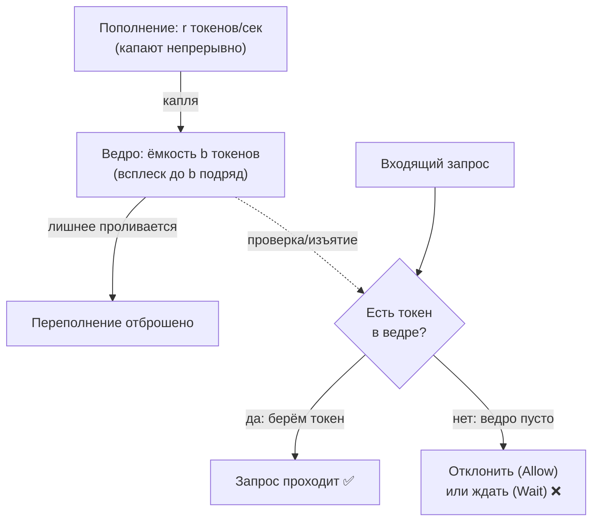

# Rate Limiting

Предыдущие два паттерна реагировали на чужие сбои. Rate limiting (ограничение частоты) — паттерн на упреждение: он не даёт **слишком частым** запросам навредить в принципе. Смотрит он в две стороны:

- **Защита себя (входящий трафик).** Публичный API не должен лечь оттого, что один клиент шлёт 10 000 запросов в секунду. Лимитер на входе режет шквал, отдавая лишним `429 Too Many Requests`, и сохраняет сервис живым для всех остальных.
- **Защита зависимостей (исходящий трафик).** Внешний API разрешает вам 100 запросов в секунду по контракту. Превысите — он сам начнёт вас банить (`429`) или, хуже, деградирует. Лимитер на исходящих вызовах удерживает вас в рамках квоты, сглаживая всплески.

В отличие от ретраев и circuit breaker, для которых в Go тянут сторонние библиотеки, для rate limiting есть **полу-стандартное** решение: пакет `golang.org/x/time/rate` (модуль `golang.org/x/time` — официальное расширение стандартной библиотеки от команды Go). Он реализует самый ходовой алгоритм — Token Bucket.

## Алгоритм Token Bucket («ведро токенов»)

Идея простая и наглядная. Представьте **ведро**, в которое с постоянной скоростью капают **токены**:

- Ведро вмещает максимум **b** токенов (burst — «ёмкость», размер всплеска). Переполниться оно не может: лишние капли проливаются мимо.
- Токены пополняются со скоростью **r** токенов в секунду (rate — средняя разрешённая частота).
- Чтобы выполнить запрос, нужно **взять из ведра один токен**. Есть токен — запрос проходит, токен изымается. Ведро пусто — запрос отклоняется (или ждёт следующей капли).

Что это даёт на практике:

- В **среднем** частота запросов не превысит `r` в секунду — ровно столько токенов докапывает.
- Но допускается короткий **всплеск (burst) до `b` запросов** подряд: если ведро было полным (вы давно не слали запросов), можно мгновенно потратить все `b` токенов. Это и отличает token bucket от жёсткого «не чаще чем раз в 1/r секунд» — он терпим к естественной неравномерности трафика, но держит средний потолок.



Параметры `r` и `b` настраиваются под задачу: `r` задаёт устойчивую среднюю частоту, `b` — насколько большой мгновенный всплеск вы готовы стерпеть. Например, `r=100/сек, b=100` означает «в среднем 100 rps, но можно разом выпустить накопленные 100».

## Пакет `golang.org/x/time/rate`

Центральный тип — `*rate.Limiter`, создаётся через `NewLimiter`:

```go
func NewLimiter(r Limit, b int) *Limiter
```

Здесь `r` — это `rate.Limit` (по сути `float64`, событий в секунду), а `b` — размер всплеска (burst). Скорость удобно задавать либо числом, либо через хелпер `rate.Every`:

```go
import "golang.org/x/time/rate"

// 100 запросов в секунду, всплеск до 30 подряд
lim := rate.NewLimiter(100, 30)

// то же через интервал: «не чаще одного раза в 10 мс» = 100/сек
lim2 := rate.NewLimiter(rate.Every(10*time.Millisecond), 30)

// особый случай: rate.Inf — без ограничения (burst игнорируется)
unlimited := rate.NewLimiter(rate.Inf, 0)
```

У лимитера три способа «взять токен», под три разных сценария.

### `Allow()` — неблокирующая проверка

`Allow()` отвечает на вопрос «можно прямо сейчас?» и сразу возвращает `bool`, ничего не ожидая. Токен есть — забирает его и возвращает `true`; нет — возвращает `false`, токен не тратится. Это идеальный режим для входящего HTTP: лишнему запросу мы хотим немедленно ответить `429`, а не держать его.

```go
if !lim.Allow() {
	http.Error(w, "too many requests", http.StatusTooManyRequests)
	return
}
// токен взят — обрабатываем запрос
```

### `Wait(ctx)` — блокирующее ожидание

`Wait(ctx)` **ждёт**, пока токен не появится (или пока `ctx` не отменится/истечёт), и только потом возвращает управление. Это режим для исходящих вызовов: мы не хотим отклонять собственный запрос — мы хотим **притормозить** его, чтобы уложиться в квоту внешнего API. Уважение `context` встроено: дедлайн/отмена прервут ожидание.

```go
func callExternal(ctx context.Context, lim *rate.Limiter) error {
	if err := lim.Wait(ctx); err != nil {
		return err // ctx отменён/просрочен, пока ждали токен
	}
	return doRequest(ctx) // токен получен — теперь точно в рамках квоты
}
```

`Wait` плавно «размазывает» исходящие вызовы по времени, не давая им вылететь за `r`. (Нюанс: если запросить больше токенов, чем `b`, `WaitN` вернёт ошибку немедленно — за один раз нельзя забрать больше ёмкости ведра.)

### `Reserve()` — резервирование с явным контролем

`Reserve()` — компромисс: он резервирует токен и возвращает `*Reservation`, из которого можно узнать, **сколько ждать** (`Delay()`), и решить самому — подождать или отказаться (и тогда вернуть резерв через `Cancel()`):

```go
r := lim.Reserve()
if !r.OK() {
	// невозможно выдать токен в принципе (например, n > burst)
	return errors.New("rate limit: запрос неудовлетворим")
}
delay := r.Delay() // сколько ждать до доступности токена
if delay > maxAcceptable {
	r.Cancel() // не готовы столько ждать — возвращаем токен в ведро
	return errTooSlow
}
time.Sleep(delay) // ждём ровно столько и действуем
doRequest()
```

`Reserve` нужен, когда хочется самостоятельно решать судьбу запроса на основе величины задержки — то, что `Allow` (просто да/нет) и `Wait` (жди сколько надо) не дают.

| Метод | Поведение при отсутствии токена | Когда применять |
| --- | --- | --- |
| `Allow()` | сразу `false`, не ждёт | входящий трафик: отклонить лишнее (`429`) |
| `Wait(ctx)` | блокируется до токена или отмены `ctx` | исходящий трафик: притормозить себя под квоту |
| `Reserve()` | возвращает требуемую задержку, решаете сами | нужен явный контроль по величине ожидания |

### Пример: HTTP middleware-лимитер

Сложим всё в типичный приём — middleware, ограничивающий входящие запросы. Тут уместен именно `Allow()`:

```go
// rateLimitMiddleware режет входящий поток до r rps с всплеском b.
func rateLimitMiddleware(next http.Handler, r rate.Limit, b int) http.Handler {
	lim := rate.NewLimiter(r, b)
	return http.HandlerFunc(func(w http.ResponseWriter, req *http.Request) {
		if !lim.Allow() { // токена нет — мгновенно отлуп
			w.Header().Set("Retry-After", "1")
			http.Error(w, "too many requests", http.StatusTooManyRequests)
			return
		}
		next.ServeHTTP(w, req) // токен есть — пропускаем дальше
	})
}

// Подключение:
// mux := http.NewServeMux()
// mux.Handle("/api/", apiHandler)
// srv := rateLimitMiddleware(mux, 100, 30) // 100 rps, всплеск 30
```

> **Лимит на клиента, а не глобально.** Один общий лимитер режет суммарный трафик. Чаще нужен лимит **на ключ** (IP, API-токен, user id) — тогда заводят `map[string]*rate.Limiter` (под мьютексом или через `sync.Map`) и берут/создают лимитер по ключу запроса. Не забудьте про вытеснение старых записей, иначе мапа растёт без границ — для этого удобен `Limiter` в связке с метрикой `IdleDuration`-подобной логики или готовые обёртки вроде `golang.org/x/time/rate` поверх LRU.

## Параллель с .NET

Здесь различие историческое и показательное. В Go токен-бакет лежит в `x/time/rate` **с 2015 года** — это давно устоявшийся, привычный инструмент. В .NET **встроенного** rate limiting долго не было: до .NET 7 каждый городил свой или тянул сторонние пакеты (AspNetCoreRateLimit и т.п.).

С **.NET 7** появилось пространство имён `System.Threading.RateLimiting` с набором готовых лимитеров:

- `TokenBucketRateLimiter` — прямой аналог `rate.Limiter` (тот же алгоритм token bucket);
- `FixedWindowRateLimiter` — фиксированное окно;
- `SlidingWindowRateLimiter` — скользящее окно;
- `ConcurrencyLimiter` — ограничение **одновременных** операций (это уже ближе к bulkhead/семафору, а не к частоте).

Сопоставление с `x/time/rate`:

```csharp
// .NET 7+: TokenBucketRateLimiter — аналог rate.NewLimiter(r, b)
var limiter = new TokenBucketRateLimiter(new TokenBucketRateLimiterOptions
{
    TokenLimit = 30,                                  // ёмкость ведра ≈ b (burst)
    TokensPerPeriod = 100,                            // пополнение ≈ r
    ReplenishmentPeriod = TimeSpan.FromSeconds(1),    // ...за этот период
    QueueLimit = 0,                                   // очередь ожидающих
    AutoReplenishment = true,
});

// Неблокирующая попытка ≈ rate.Allow()
using RateLimitLease lease = limiter.AttemptAcquire(1);
if (lease.IsAcquired) { /* пропускаем */ } else { /* 429 */ }

// Ожидание ≈ rate.Wait(ctx); CancellationToken ≈ context
using RateLimitLease lease2 = await limiter.AcquireAsync(1, cancellationToken);
```

Сопоставление метод-в-метод:

| Go `golang.org/x/time/rate` | .NET `System.Threading.RateLimiting` (7+) |
| --- | --- |
| `rate.NewLimiter(r, b)` | `new TokenBucketRateLimiter(options)` |
| `b` (burst) | `TokenLimit` |
| `r` (events/сек) | `TokensPerPeriod` / `ReplenishmentPeriod` |
| `Allow()` | `AttemptAcquire(1)` → `lease.IsAcquired` |
| `Wait(ctx)` | `await AcquireAsync(1, ct)` |
| `Reserve()` + `Delay()` | (нет прямого аналога; ближе всего `lease.TryGetMetadata(RetryAfter, ...)`) |

> **Параллель с .NET:** в ASP.NET Core с .NET 7 лимитер встроен как middleware — `app.UseRateLimiter(...)` с политиками; в Go аналог пишется руками как `http.Handler`-обёртка (пример выше) либо берётся готовый middleware из роутера (chi, gin и т.п.). Принципиальный вывод: в Go этот кирпич доступен годами и единообразен (все используют `x/time/rate`), тогда как в .NET-экосистеме до .NET 7 был зоопарк решений, и только недавно появился канонический встроенный.

## Итог

- Rate limiting защищает на упреждение: **себя** от шквала входящих (отдавая `429`) и **зависимости** от превышения их квот (притормаживая исходящие).
- **Token Bucket**: ведро ёмкости `b` (всплеск), токены капают со скоростью `r` (средняя частота); запрос тратит токен. Допускает короткий всплеск до `b`, но удерживает средний потолок `r`.
- `golang.org/x/time/rate` (`rate.NewLimiter(r, b)`) даёт три режима: `Allow()` (неблокирующий — для входящих, отклонить лишнее), `Wait(ctx)` (блокирующий — для исходящих, притормозить под квоту, уважает `context`), `Reserve()` (явный контроль по величине задержки).
- Типовой приём — HTTP middleware с `Allow()`; для лимита на клиента заводят `map[ключ]*rate.Limiter` с вытеснением старых записей.
- В .NET встроенный `System.Threading.RateLimiting` (`TokenBucketRateLimiter` и др.) появился только в **.NET 7**, тогда как в Go `x/time/rate` — давний полу-стандарт. Это наглядный пример, где Go-экосистема дала канонический инструмент раньше.

Мы прошли три паттерна по отдельности. В финальной главе соберём картину целиком и сравним два мира: единый фреймворк Polly против модульной, собираемой вручную отказоустойчивости Go.

---

[⌂ Главная](../../README.md) · [↑ Раздел](./README.md) · [← Предыдущий: Circuit Breaker](./02-circuit-breaker.md) · [→ Следующий: Сравнение с .NET](./04-comparison-with-dotnet.md)
