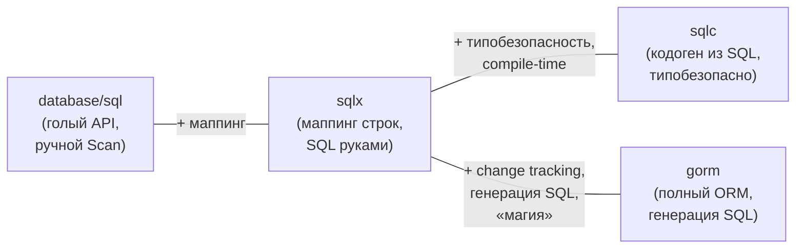

# `sqlx`

Предыдущая глава закончилась на главной боли «голого» `database/sql` — **ручном `Scan` по колонкам**: на каждую выборку вы пишете цикл `for rows.Next()`, перечисляете указатели на поля в правильном порядке, не забываете `rows.Close()` и `rows.Err()`. Это монотонно, легко ошибиться в порядке колонок и тяжело читать.

`github.com/jmoiron/sqlx` решает ровно эту проблему. Ключевое, что нужно понять про него .NET-разработчику: **`sqlx` — это не ORM**. Это **тонкая надстройка над `database/sql`**, которая добавляет маппинг строк в структуры (через тэги), но не привносит ни change tracking, ни генерацию SQL, ни LINQ-подобный язык запросов. Вы по-прежнему пишете SQL руками — `sqlx` лишь избавляет от рутины раскладки результата по полям. По духу это прямой аналог **Dapper**.

Важная деталь совместимости: типы `sqlx` — это «обёртки» над стандартными. `*sqlx.DB` встраивает `*sql.DB`, `*sqlx.Tx` встраивает `*sql.Tx`. Поэтому **все методы `database/sql` остаются доступны** (`QueryContext`, `BeginTx` и т. д.), а `sqlx` лишь *добавляет* новые. Перейти на `sqlx` можно постепенно, не переписывая существующий код, и в любой момент «спуститься» к голому API для нестандартного случая.

```go
import (
    "github.com/jmoiron/sqlx"
    _ "github.com/jackc/pgx/v5/stdlib"
)

// Connect = Open + Ping сразу
db, err := sqlx.Connect("pgx", dsn)
if err != nil {
    log.Fatal(err)
}
defer db.Close()

// Настройка пула — те же методы, ведь внутри обычный *sql.DB
db.SetMaxOpenConns(25)
```

`sqlx.Connect` — это удобный `Open` + `Ping` в одном вызове (есть и `sqlx.Open` без пинга, и `sqlx.NewDb(stdDB, "pgx")` — обернуть уже имеющийся `*sql.DB`).

## Тэги `db` и маппинг в структуры

Маппинг колонки на поле структуры задаётся тэгом `db:"column_name"`. Без тэга `sqlx` сопоставляет колонку с полем по имени **без учёта регистра** (колонка `name` → поле `Name`), но snake_case-имена колонок (`created_at`) под CamelCase-поля (`CreatedAt`) **не угадываются автоматически** — для них тэг обязателен.

```go
type User struct {
    ID        int64     `db:"id"`
    Name      string    `db:"name"`
    Email     string    `db:"email"`
    CreatedAt time.Time `db:"created_at"` // без тэга не сматчится с CreatedAt
}
```

> **Параллель с .NET:** тэг `db:"..."` — это аналог атрибута `[Column("created_at")]` из EF Core или кастомного маппинга в Dapper. По умолчанию Dapper матчит имена колонок к свойствам тоже довольно гибко (с `MatchNamesWithUnderscores` для snake_case). Принципиальная разница со «строковым» миром Go: тэги — это строки в бэктиках, проверяемые в рантайме (опечатку в `db:"emial"` компилятор не поймает), тогда как атрибуты C# — типизированные. Это общая черта Go-сериализации (см. Раздел 6 про JSON-тэги).

## `Get` и `Select`: одна строка и слайс — в одну строку кода

Два главных метода, ради которых берут `sqlx`:

- **`Get(dest, query, args...)`** — выбрать **одну** строку и разложить её в структуру (или скаляр). Аналог `QueryRowContext(...).Scan(...)`, но без перечисления полей.
- **`Select(dest, query, args...)`** — выбрать **много** строк в слайс структур. Аналог всего цикла `for rows.Next()` + `Scan` + `Close` + `Err` — одним вызовом.

Контекстные версии — `GetContext` / `SelectContext` (используйте их, как и в `database/sql`).

Сравним. Вот выборка списка на **голом `database/sql`** (из прошлой главы):

```go
func listUsers(ctx context.Context, db *sql.DB) ([]User, error) {
    rows, err := db.QueryContext(ctx, "SELECT id, name, email, created_at FROM users ORDER BY id")
    if err != nil {
        return nil, err
    }
    defer rows.Close()

    var users []User
    for rows.Next() {
        var u User
        if err := rows.Scan(&u.ID, &u.Name, &u.Email, &u.CreatedAt); err != nil {
            return nil, err
        }
        users = append(users, u)
    }
    if err := rows.Err(); err != nil {
        return nil, err
    }
    return users, nil
}
```

И то же самое на **`sqlx`**:

```go
func listUsers(ctx context.Context, db *sqlx.DB) ([]User, error) {
    var users []User
    err := db.SelectContext(ctx, &users,
        "SELECT id, name, email, created_at FROM users ORDER BY id")
    return users, err
}
```

Пятнадцать строк превратились в три. `sqlx` сам делает `Query`, перебор, `Scan` по тэгам, `Close` и проверку ошибок. Выборка одной строки так же коротка:

```go
func getUser(ctx context.Context, db *sqlx.DB, id int64) (User, error) {
    var u User
    err := db.GetContext(ctx, &u,
        "SELECT id, name, email, created_at FROM users WHERE id = $1", id)
    if errors.Is(err, sql.ErrNoRows) { // та же sql.ErrNoRows, что и в database/sql
        return User{}, fmt.Errorf("user %d not found: %w", id, err)
    }
    return u, err
}
```

Обратите внимание: `Get` при отсутствии строки возвращает ту же **`sql.ErrNoRows`** — семантика ошибок наследуется от `database/sql` без изменений.

`Get`/`Select` работают и со **скалярами/срезами примитивов**, не только со структурами:

```go
var count int
db.GetContext(ctx, &count, "SELECT count(*) FROM users")

var ids []int64
db.SelectContext(ctx, &ids, "SELECT id FROM users WHERE active")
```

> **Параллель с .NET:** это буквально Dapper. `db.Select(&users, sql)` ≈ `connection.Query<User>(sql).ToList()`, а `db.Get(&u, sql, id)` ≈ `connection.QueryFirst<User>(sql, new { id })` (а для «может не быть» — `QueryFirstOrDefault<User>`). Та же идея: «дай SQL и целевой тип — маппинг беру на себя», без построения запросов и трекинга. Тонкость: в Dapper результат — возвращаемое значение (`Query<T>` отдаёт `IEnumerable<T>`), а в `sqlx` вы передаёте **указатель на приёмник** (`&users`), потому что в Go возврат и заполнение по указателю — обычная идиома, а дженерик-методы появились поздно (`sqlx` спроектирован до Go 1.18 и остаётся на `interface{}`-приёмниках).

> **Осторожно с `Select` на больших выборках:** `Select` загружает **все** строки в слайс в памяти разом. Для огромных результатов это не подходит — там возвращаются к `Queryx` + построчному `StructScan` в цикле (потоковая обработка), как с обычным `rows.Next()`. `Select` — для разумных по размеру наборов.

## `StructScan`, `Queryx` и именованные запросы

Когда нужен контроль построчной обработки (большой результат, обработка «на лету»), `sqlx` даёт `Queryx`, возвращающий `*sqlx.Rows` с методом **`StructScan`** — он раскладывает текущую строку в структуру по тэгам (вместо ручного `Scan(&f1, &f2, ...)`):

```go
rows, err := db.QueryxContext(ctx, "SELECT id, name, email, created_at FROM users")
if err != nil {
    return err
}
defer rows.Close()

for rows.Next() {
    var u User
    if err := rows.StructScan(&u); err != nil { // вся строка → структура по тэгам
        return err
    }
    process(u)
}
return rows.Err()
```

Это «середина»: вы управляете циклом (как в `database/sql`), но `StructScan` снимает рутину перечисления полей.

### Именованные параметры: `NamedExec` / `NamedQuery`

Отдельная приятная вещь — **именованные параметры** через `:name`, где аргументы берутся из полей структуры (по тэгам `db`) или из `map[string]any`. Это решает и проблему разных плейсхолдеров у разных драйверов, и читаемость запросов с многими параметрами:

```go
u := User{Name: "Alice", Email: "alice@example.com"}

// :name и :email берутся из полей структуры по тэгам db
_, err := db.NamedExecContext(ctx,
    `INSERT INTO users (name, email) VALUES (:name, :email)`, u)
```

`NamedExec` под капотом превращает `:name`/`:email` в плейсхолдеры конкретного драйвера и подставляет значения из полей. Есть и `NamedQuery` для выборок. Особенно удобно для `INSERT`/`UPDATE` с десятком колонок — не нужно вручную поддерживать соответствие позиций `$1..$N`.

> **Параллель с .NET:** именованные параметры из полей структуры — это в точности Dapper-овский `connection.Execute(sql, new { name, email })`, где анонимный объект даёт значения для `@name`/`@email`. `NamedExec(sql, structOrMap)` ≈ `Execute(sql, param)`. Идея идентична; разница лишь в том, что в Go источник — поля структуры по тэгам `db`, а синтаксис плейсхолдера в SQL — `:name` (sqlx-овский), который транслируется под драйвер.

## Где `sqlx` на карте: `sqlc` и `gorm`

`sqlx` — лишь одна из точек на спектре «насколько близко к SQL». Полезно видеть всю карту, чтобы понимать выбор Go-сообщества.



### `sqlc` — кодогенерация из SQL (другой способ убрать рутину)

`sqlc` (`github.com/sqlc-dev/sqlc`) решает ту же задачу «не писать `Scan` руками», но **с противоположной стороны**: вместо рантайм-маппинга по тэгам он **генерирует типобезопасный Go-код из ваших SQL-запросов на этапе разработки**. Вы пишете обычный `.sql`-файл с запросами и аннотациями, запускаете `sqlc generate` — и получаете готовые Go-функции со строго типизированными параметрами и структурами результата. Никакой рефлексии в рантайме, опечатка в имени колонки ловится **при генерации**, а не в проде.

```sql
-- name: GetUser :one
SELECT id, name, email, created_at FROM users WHERE id = $1;
```

```go
// сгенерировано sqlc — вызываете готовую типобезопасную функцию:
user, err := queries.GetUser(ctx, id) // возвращает (User, error), всё типизировано
```

Это прямой мостик к **[Разделу 7](../07-code-generation/README.md)** про кодогенерацию как философию Go: `sqlc` — образцовый пример «генерация на этапе сборки вместо рантайм-магии». Многие в Go считают его лучшим из обоих миров: и SQL явный (вы его пишете), и маппинг типобезопасный (его генерируют).

### `gorm` — полноценный ORM (другой полюс)

`gorm` (`gorm.io/gorm`) — это полноценный ORM, ближайший по амбициям к **EF Core**: декларация моделей тэгами, автомиграции, ассоциации (`Has Many`/`Belongs To`), хуки, и построение запросов цепочками методов вместо сырого SQL:

```go
var user User
db.Where("email = ?", email).First(&user)        // SQL генерирует gorm
db.Create(&User{Name: "Bob", Email: "b@x.io"})    // INSERT за вас
```

gorm удобен для быстрого CRUD, но в Go-сообществе к нему относятся **сдержанно** — и это важная культурная деталь для приходящих из .NET. Причины, по которым многие предпочитают `sqlx`/`sqlc` полному ORM:

- **Скрытый SQL и неожиданные запросы.** Генерируемый ORM SQL (особенно для связей) бывает неоптимален и провоцирует проблему N+1; в `sqlx`/`sqlc` запрос всегда перед глазами.
- **«Магия» против явности.** Философия Go ценит явность и предсказуемость (Раздел 1); тяжёлый рефлексивный слой ORM этому противоречит и затрудняет отладку.
- **Цена абстракции.** Рефлексия и построение запросов в рантайме стоят производительности — а ради неё в Go обычно и уходят с тяжёлых фреймворков.

Это не значит, что gorm «плохой» — это значит, что в Go **дефолт сдвинут к близости к SQL**, тогда как в .NET дефолт — это EF Core. Подробное сравнение философий — в следующей главе.

## Итог

- `sqlx` — **тонкая надстройка над `database/sql`, а не ORM**: добавляет маппинг строк в структуры, но SQL вы по-прежнему пишете руками. По духу — прямой аналог **Dapper**.
- Полностью **совместим с `database/sql`**: `*sqlx.DB` встраивает `*sql.DB`, все стандартные методы и настройка пула доступны; миграция возможна постепенно.
- Маппинг задаётся тэгами **`db:"column"`** (для snake_case-колонок под CamelCase-поля — обязательны). `sql.ErrNoRows` и прочая семантика наследуются.
- Главная экономия — **`Get`** (одна строка → структура) и **`Select`** (много строк → слайс структур) вместо ручного цикла `Next`/`Scan`/`Close`/`Err`; для потоковой обработки больших выборок — `Queryx` + `StructScan`. Именованные параметры — `NamedExec`/`NamedQuery` (`:field` из структуры, как Dapper-овский `new { ... }`).
- На карте подходов: **`sqlc`** убирает ту же рутину кодогенерацией из SQL (типобезопасно, compile-time — мостик к Разделу 7), а **`gorm`** — это полный ORM «как EF Core». Go-сообщество по умолчанию тяготеет к `sqlx`/`sqlc` (близость к SQL, явность, производительность), а не к ORM.

Дальше — Redis и паттерн Cache-Aside: как кэшировать результаты этих самых запросов, чтобы не ходить в БД на каждый чих.

---

[⌂ Главная](../../README.md) · [↑ Раздел](./README.md) · [← Предыдущий: database/sql и пул соединений](./01-database-sql.md) · [→ Следующий: Redis и Cache-Aside](./03-redis-cache-aside.md)
