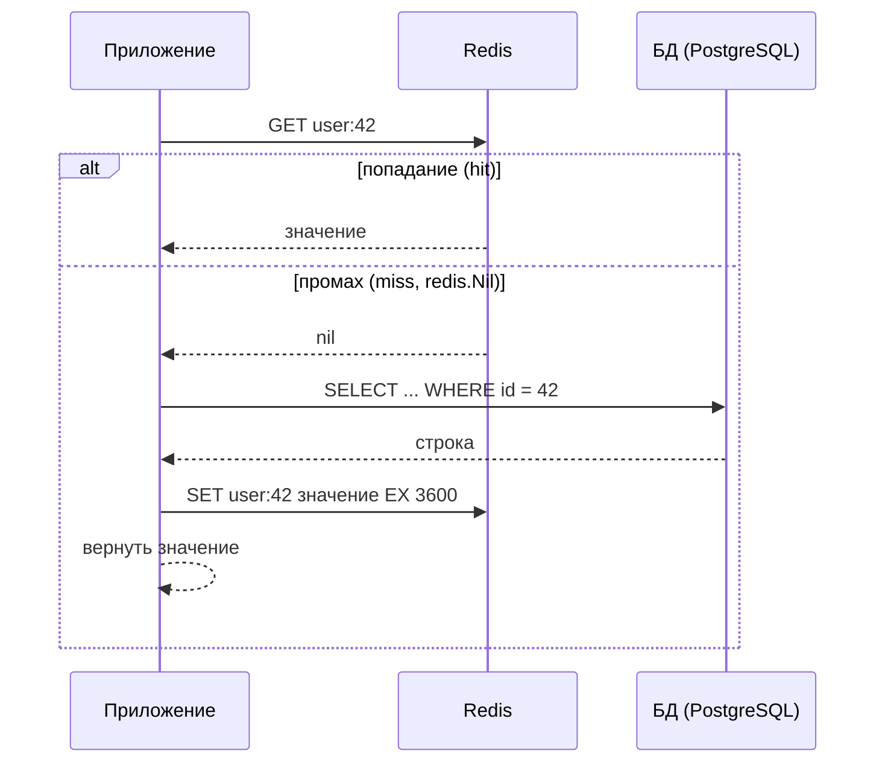

# Redis и Cache-Aside

Реляционная БД — не единственный источник данных. Очень часто перед ней ставят кэш, и в мире Go это почти всегда **Redis**. В этой главе разберём клиент `go-redis` и канонический паттерн кэширования — **Cache-Aside**, который вы наверняка применяли в .NET через `IDistributedCache` или `StackExchange.Redis`.

Клиент для Go — **`github.com/redis/go-redis/v9`** (обратите внимание на путь: исторически это был `go-redis/redis`, теперь библиотека живёт под официальной организацией `redis`, актуальный мажор — `v9`). Девятая версия принесла поддержку протокола **RESP3**, обновлённый hooks API и улучшения пайплайнов.

```go
import "github.com/redis/go-redis/v9"

rdb := redis.NewClient(&redis.Options{
    Addr:     "localhost:6379",
    Password: "",  // без пароля
    DB:       0,    // номер логической БД Redis
    PoolSize: 10,   // размер пула соединений (по умолчанию 10 * GOMAXPROCS)
})
defer rdb.Close()

ctx, cancel := context.WithTimeout(context.Background(), 5*time.Second)
defer cancel()
if err := rdb.Ping(ctx).Err(); err != nil {
    log.Fatal("Redis недоступен:", err)
}
```

Как и `*sql.DB`, **`*redis.Client` — это пул соединений** и он потокобезопасен: создавайте один раз на приложение и переиспользуйте из всех горутин. Для кластера и Sentinel есть `redis.NewClusterClient` / `redis.NewFailoverClient` с тем же API.

> **Параллель с .NET:** `redis.NewClient` ≈ `ConnectionMultiplexer.Connect(...)` из `StackExchange.Redis` — оба создают долгоживущий потокобезопасный объект, который вы шарите по приложению (в .NET `ConnectionMultiplexer` принято делать синглтоном — здесь та же рекомендация). `rdb.Ping(ctx)` ≈ проверка `multiplexer.IsConnected` / `GetDatabase().Ping()`.

## Стиль API go-redis: команда → результат → `.Err()`/`.Val()`

API go-redis устроен единообразно и поначалу непривычно. Каждый метод-команда (`Get`, `Set`, ...) принимает **`ctx` первым аргументом** и возвращает не `(значение, error)`, а **объект-результат команды** (`*StringCmd`, `*StatusCmd`, `*IntCmd` и т. п.). Из этого объекта значение и ошибку достают методами:

- `.Err()` — ошибка выполнения;
- `.Val()` — значение (без ошибки; вернёт нулевое при ошибке);
- `.Result()` — пара `(значение, error)` сразу.

```go
// Set: записать с TTL
err := rdb.Set(ctx, "user:42:name", "Alice", time.Hour).Err()

// Get: прочитать
name, err := rdb.Get(ctx, "user:42:name").Result()
```

### `redis.Nil` — «ключа нет»

Критически важная деталь: когда ключа **не существует**, `Get` возвращает специальную ошибку **`redis.Nil`**, а не пустую строку. Это прямой аналог `sql.ErrNoRows` из предыдущих глав — штатная ситуация «промах», которую нужно отличать от настоящей ошибки (обрыв сети и т. п.):

```go
val, err := rdb.Get(ctx, key).Result()
switch {
case errors.Is(err, redis.Nil):
    // промах кэша — ключа нет, это НЕ ошибка
case err != nil:
    // реальная ошибка Redis (сеть, таймаут, ...)
    return err
default:
    // попадание — val содержит значение
}
```

> **Параллель с .NET:** стиль «команда возвращает объект-результат» отличается от `StackExchange.Redis`, где методы прямо возвращают значение (`db.StringGet(key)` → `RedisValue`), а признак отсутствия — это `RedisValue.IsNull` / `RedisValue.HasValue == false`. То есть `redis.Nil` ≈ `RedisValue.IsNull`, только в Go это значение **ошибки**, а не свойство результата, — поэтому проверяют `errors.Is(err, redis.Nil)`. Передача `ctx` первым аргументом — общая идиома Go (в `StackExchange.Redis` отмену прокидывают иначе, через `CancellationToken` в async-перегрузках).

### TTL

TTL (время жизни ключа) задаётся **прямо в `Set`** последним аргументом типа `time.Duration`. Значение `0` означает «без истечения» (ключ живёт вечно). Есть и отдельные команды управления сроком жизни:

```go
rdb.Set(ctx, key, value, 10*time.Minute) // живёт 10 минут
rdb.Set(ctx, key, value, 0)              // без TTL
rdb.Expire(ctx, key, time.Hour)          // выставить/обновить TTL существующему ключу
rdb.TTL(ctx, key)                        // узнать остаток TTL
```

> **Параллель с .NET:** TTL-аргумент в `Set` ≈ `expiry` в `db.StringSet(key, value, TimeSpan.FromMinutes(10))`, а на уровне `IDistributedCache` — `DistributedCacheEntryOptions { AbsoluteExpirationRelativeToNow = ... }`. `Expire` ≈ `KeyExpire`, `TTL` ≈ `KeyTimeToLive`.

## Сериализация значений: JSON или gob

Redis хранит **байты/строки**, а не Go-объекты. Любую структуру перед записью нужно **сериализовать**, а при чтении — десериализовать. go-redis сам этого не делает (в отличие от некоторых .NET-обёрток): сериализация — ваша забота. Два основных варианта:

- **JSON** (`encoding/json`) — человекочитаемо, кросс-языково (значение можно прочитать из сервиса на другом языке), отлаживается простым `GET` в `redis-cli`. Дефолтный выбор.
- **`encoding/gob`** — бинарный формат Go, компактнее и быстрее JSON, но **только для Go-to-Go** (несовместим с другими языками и нечитаем глазами). Берут, когда важны размер/скорость и кэш потребляется только Go-сервисами.

```go
type User struct {
    ID    int64  `json:"id"`
    Name  string `json:"name"`
    Email string `json:"email"`
}

// запись: структура → JSON → строка в Redis
func cacheUser(ctx context.Context, rdb *redis.Client, u User) error {
    data, err := json.Marshal(u)
    if err != nil {
        return err
    }
    return rdb.Set(ctx, fmt.Sprintf("user:%d", u.ID), data, time.Hour).Err()
}

// чтение: строка из Redis → JSON → структура
func cachedUser(ctx context.Context, rdb *redis.Client, id int64) (User, bool, error) {
    data, err := rdb.Get(ctx, fmt.Sprintf("user:%d", id)).Bytes()
    if errors.Is(err, redis.Nil) {
        return User{}, false, nil // промах — не ошибка
    }
    if err != nil {
        return User{}, false, err
    }
    var u User
    if err := json.Unmarshal(data, &u); err != nil {
        return User{}, false, err
    }
    return u, true, nil
}
```

(`.Bytes()` — удобный вариант результата `Get`, сразу отдающий `[]byte` для `json.Unmarshal`.)

> **Параллель с .NET:** ровно та же история, что с `IDistributedCache`, который оперирует `byte[]`: вы сами делаете `JsonSerializer.Serialize`/`Deserialize` (или используете расширения `GetStringAsync`/`SetStringAsync`). `StackExchange.Redis` тоже хранит `RedisValue` (по сути строки/байты) и не знает о ваших типах. JSON vs gob ≈ `System.Text.Json` vs бинарные форматы (про сериализацию подробно — [Раздел 6](../06-serialization/README.md)). Никакой «прозрачной» сериализации объектов, как в типизированных кэш-обёртках, тут нет — это согласуется с явностью Go.

## Пайплайны: батч команд за один round-trip

Если нужно выполнить **много команд подряд**, отправлять их по одной — это много сетевых round-trip'ов. **Пайплайн** буферизует команды и шлёт их одним пакетом, разом забирая все ответы — резко меньше задержек:

```go
pipe := rdb.Pipeline()
for _, id := range ids {
    pipe.Get(ctx, fmt.Sprintf("user:%d", id)) // команды копятся в буфере, пока не выполняются
}
cmds, err := pipe.Exec(ctx) // один round-trip на все команды
if err != nil && !errors.Is(err, redis.Nil) {
    return err
}
for _, cmd := range cmds {
    val, err := cmd.(*redis.StringCmd).Result()
    // обработать каждый результат (err может быть redis.Nil для отсутствующих ключей)
    _ = val
    _ = err
}
```

Есть удобная обёртка `rdb.Pipelined(ctx, func(pipe redis.Pipeliner) error { ... })`. Отдельно существует `TxPipeline` — пайплайн, обёрнутый в `MULTI`/`EXEC` (атомарное выполнение группы команд).

> **Параллель с .NET:** пайплайн ≈ **batching** в `StackExchange.Redis` (`db.CreateBatch()` + `batch.Execute()`), а `TxPipeline` ≈ `db.CreateTransaction()` (`MULTI`/`EXEC`). Идея «накопить команды и отправить пачкой ради одного round-trip» идентична.

## Паттерн Cache-Aside (lazy loading)

Cache-Aside (он же lazy loading) — самый распространённый способ использовать кэш перед БД. Логика проста: **приложение само управляет кэшем**, а кэш ничего не знает об источнике данных. Алгоритм на чтение:

1. Посмотреть в кэш.
2. **Попадание (hit)** — вернуть значение из кэша.
3. **Промах (miss)** — сходить в БД, положить результат в кэш с TTL, вернуть его.



В коде это объединяет всё из этой главы (Redis, сериализация, `redis.Nil`) и предыдущих (`sqlx`, `sql.ErrNoRows`):

```go
func GetUser(ctx context.Context, rdb *redis.Client, db *sqlx.DB, id int64) (User, error) {
    key := fmt.Sprintf("user:%d", id)

    // 1. Пробуем кэш
    data, err := rdb.Get(ctx, key).Bytes()
    if err == nil {
        var u User
        if err := json.Unmarshal(data, &u); err == nil {
            return u, nil // 2. Попадание
        }
        // битые данные в кэше — игнорируем и идём в БД
    } else if !errors.Is(err, redis.Nil) {
        // реальная ошибка Redis: можно вернуть её, а можно (graceful degradation)
        // залогировать и всё равно сходить в БД — кэш не должен ронять запрос
        log.Printf("redis get %s: %v", key, err)
    }

    // 3. Промах — идём в источник истины
    var u User
    if err := db.GetContext(ctx, &u,
        "SELECT id, name, email FROM users WHERE id = $1", id); err != nil {
        return User{}, err // включая sql.ErrNoRows
    }

    // 4. Кладём в кэш с TTL (ошибку записи в кэш обычно не фатальны — логируем)
    if encoded, err := json.Marshal(u); err == nil {
        if err := rdb.Set(ctx, key, encoded, time.Hour).Err(); err != nil {
            log.Printf("redis set %s: %v", key, err)
        }
    }

    return u, nil
}
```

Обратите внимание на принцип **graceful degradation**: ошибка Redis (недоступность кэша) не должна валить запрос — лучше сходить в БД напрямую. Кэш — это оптимизация, а не источник истины.

> **Параллель с .NET:** это в точности паттерн, который вы писали с `IDistributedCache`: `GetStringAsync` → если `null`, загрузить из БД → `SetStringAsync` с `DistributedCacheEntryOptions`. В .NET 9 это даже завернули в стандартный `HybridCache` с методом `GetOrCreateAsync(key, factory)`, скрывающим эти шаги. В Go готового `GetOrCreate` в стандартной библиотеке нет — паттерн пишут руками (как выше) или берут готовую обёртку. Логика же абсолютно та же.

## Подводные камни

Cache-Aside прост на чтение, но у него есть две классические проблемы, о которых нужно знать (детальное их решение — большая тема; здесь — суть).

### Инвалидация

«В информатике две сложные вещи: инвалидация кэша и именование». Когда данные в БД **меняются**, закэшированное значение становится устаревшим. Подходы:

- **TTL как страховка** — даже без явной инвалидации устаревшие данные «протухнут» сами через TTL. Простейший и часто достаточный вариант (ценой временной рассинхронизации в пределах TTL).
- **Явное удаление при записи** — при `UPDATE`/`DELETE` в БД удаляйте ключ из кэша (`rdb.Del(ctx, key)`). **Удалять (инвалидировать), а не перезаписывать** — надёжнее: следующее чтение само перезагрузит свежее значение, и нет гонок «кто записал последним».

```go
func UpdateEmail(ctx context.Context, rdb *redis.Client, db *sqlx.DB, id int64, email string) error {
    if _, err := db.ExecContext(ctx,
        "UPDATE users SET email = $1 WHERE id = $2", email, id); err != nil {
        return err
    }
    // инвалидируем кэш — пусть следующее чтение перезагрузит
    return rdb.Del(ctx, fmt.Sprintf("user:%d", id)).Err()
}
```

### Cache stampede (thundering herd)

Если «горячий» ключ истекает (или его ещё нет), и в этот момент приходит **много** одновременных запросов, **все** они промахнутся и **разом ломанутся в БД** за одним и тем же значением — всплеск нагрузки, способный положить БД. Кратко о средствах борьбы:

- **Single-flight** — схлопнуть конкурентные одинаковые загрузки в **одну**: первый запрос идёт в БД, остальные ждут его результат. В Go для этого есть отличный официальный пакет **`golang.org/x/sync/singleflight`** (метод `Group.Do(key, fn)` — ровно эта семантика).
- **Джиттер у TTL** — добавлять к TTL случайный разброс, чтобы пачка ключей не истекала одновременно.
- **Заблаговременное обновление** — обновлять значение в фоне до истечения TTL.

> **Параллель с .NET:** stampede и его лечение универсальны и от языка не зависят. Тот самый `HybridCache` из .NET 9 как раз встроенно защищает от stampede (схлопывает конкурентные `GetOrCreateAsync` по одному ключу) — в Go эту же роль играет `singleflight`. Инвалидация через `Del` ≈ `IDistributedCache.RemoveAsync(key)`.

## Итог

- Клиент Redis для Go — **`github.com/redis/go-redis/v9`**; `*redis.Client` — это **пул соединений**, потокобезопасный, создаётся один раз (как `ConnectionMultiplexer` в `StackExchange.Redis`).
- Стиль API: команда принимает `ctx` первым и возвращает **объект-результат**, из которого берут `.Err()`/`.Val()`/`.Result()`. Отсутствие ключа — это ошибка **`redis.Nil`** (аналог `sql.ErrNoRows`/`RedisValue.IsNull`), её проверяют `errors.Is`.
- **TTL** задаётся прямо в `Set` (`time.Duration`, `0` = вечно). Значения нужно **сериализовать самим** — JSON (кросс-язычно, читаемо) или gob (бинарно, Go-to-Go). Прозрачной сериализации объектов нет.
- **Пайплайны** (`Pipeline`/`Pipelined`, `TxPipeline`) шлют пачку команд за один round-trip — аналог batching/transaction в `StackExchange.Redis`.
- **Cache-Aside**: читать из кэша → при промахе (`redis.Nil`) взять из БД → положить в кэш с TTL. Кэш — оптимизация, поэтому его ошибки не должны валить запрос (**graceful degradation**). Аналог ручного `IDistributedCache`-паттерна (или `HybridCache.GetOrCreateAsync` в .NET 9).
- Подводные камни: **инвалидация** (TTL как страховка + `Del` при записи, инвалидировать, а не перезаписывать) и **cache stampede** (лечится `golang.org/x/sync/singleflight`, джиттером TTL).

Дальше — итоговая глава раздела: консолидированное сравнение всего подхода Go к данным с EF Core и Dapper, философия «близости к SQL» против «магии ORM» и таблица «как сделать привычное X».

---

[⌂ Главная](../../README.md) · [↑ Раздел](./README.md) · [← Предыдущий: sqlx](./02-sqlx.md) · [→ Следующий: Сравнение с .NET](./04-comparison-with-dotnet.md)
