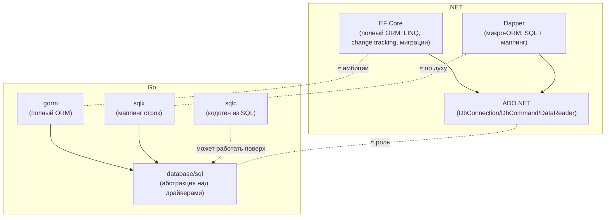

# Сравнение с .NET

Это итоговая глава раздела — консолидированный «мостик» между доступом к данным в .NET и в Go. Здесь мы собираем воедино разобранное в предыдущих главах и явно проговариваем главное различие двух экосистем: **в .NET путь по умолчанию — тяжёлый ORM (EF Core), а в Go — близость к SQL (`database/sql` + `sqlx`/`sqlc`)**. Это не разница в зрелости инструментов, а разница в инженерной философии, и понять её важнее, чем выучить любой конкретный API.

## Карта инструментов: два мира

В .NET доступ к данным выстроен в чёткую вертикаль от «магии» к «голому металлу»:



Уровни почти зеркальны, но **центр тяжести смещён**:

- В **.NET** дефолт для нового проекта — **EF Core**. Спуститься к Dapper или ADO.NET — это осознанная оптимизация для горячих путей.
- В **Go** дефолт — **`database/sql` + `sqlx`** (или `sqlc`). Подняться к полному ORM (`gorm`) — это осознанный выбор меньшинства, чаще для быстрого CRUD-прототипа.

## EF Core vs `gorm` (полные ORM)

`gorm` — ближайший к EF Core по амбициям инструмент Go. Сопоставление их возможностей:

| Возможность EF Core | В `gorm` | Комментарий |
| --- | --- | --- |
| LINQ-провайдер (`Where(x => ...)`) | цепочки методов (`Where("age > ?", 18)`) | gorm не транслирует Go-выражения в SQL; условия — строки/структуры |
| Change tracking | частично (хуки, `Save`/`Updates`) | Нет полноценного отслеживания графа объектов, как в `DbContext` |
| `DbContext` / `DbSet<T>` | `*gorm.DB` + модели | Нет «единицы работы» уровня `DbContext` |
| Миграции (`Add-Migration`) | `AutoMigrate(&Model{})` | Авто-миграция проще, но для продакшена берут отдельные инструменты |
| Lazy/eager loading (`Include`) | `Preload("Orders")` | Есть, но провоцирует те же N+1, если неосторожно |
| Навигационные свойства | теги ассоциаций (`has many` и т. п.) | Есть, декларируются тегами структур |

Но ключевое — **не таблица фич, а отношение сообщества**. В .NET использовать EF Core по умолчанию — норма и хороший тон. В Go использование `gorm` вызывает вопросы на ревью: «зачем ORM, если можно явным SQL?». Это прямое следствие философии Go (Раздел 1): явность важнее удобства, предсказуемость важнее лаконичности, а «магия» рефлексии в рантайме — это то, от чего Go сознательно уходит ([Раздел 7](../07-code-generation/README.md) про кодогенерацию вместо рантайм-магии).

## Философия: близость к SQL против «магии» EF

Это сердце главы. Разберём по пунктам, в чём именно расходятся подходы.

### LINQ-провайдер против явного SQL

В EF Core вы пишете C#-выражения, а провайдер **транслирует их в SQL** в рантайме:

```csharp
// EF Core: LINQ → SQL генерирует провайдер
var users = await db.Users
    .Where(u => u.Age > 18 && u.IsActive)
    .OrderBy(u => u.Name)
    .Take(10)
    .ToListAsync();
```

Это мощно, но имеет цену: сгенерированный SQL **не виден** в коде, иногда неоптимален, а часть LINQ-выражений не транслируется и падает в рантайме (или, хуже, незаметно выполняется client-side). В Go вы пишете SQL **явно** и видите ровно то, что уйдёт в БД:

```go
// Go (sqlx): SQL — ровно тот, что выполнится; никакой трансляции
var users []User
err := db.SelectContext(ctx, &users,
    `SELECT id, name, age FROM users
     WHERE age > $1 AND is_active
     ORDER BY name LIMIT 10`, 18)
```

Компромисс симметричен: EF даёт продуктивность и компонуемость запросов ценой непрозрачности и «протекающей абстракции»; Go даёт полную прозрачность и контроль ценой того, что SQL вы пишете и поддерживаете руками. `sqlc` смягчает минус Go-подхода, добавляя **compile-time типобезопасность** к явному SQL (опечатка в колонке ловится при генерации), не пряча сам SQL.

### Цена абстракции

В Go-сообществе «цена абстракции» — не метафора, а измеримая величина, которую принято учитывать:

- **Производительность.** ORM строит запросы и маппит результаты через рефлексию в рантайме; это стоит CPU и аллокаций. `database/sql`+`sqlx` легче, `sqlc` (сгенерированный код) — ещё легче. В .NET эту цену часто считают приемлемой за продуктивность; в Go — чаще нет.
- **Предсказуемость.** Явный SQL делает поведение (и план запроса, и число round-trip'ов) очевидным. ORM может незаметно сгенерировать N+1 или загрузить лишнее.
- **Отладка.** Сгенерированный руками SQL отлаживается копированием в `psql`. Отладка того, почему EF/`gorm` сгенерировал именно такой запрос, — отдельный навык.

Это ровно та же логика, что и в остальных разделах учебника: Go меняет «магию и удобство» на «явность и контроль». Кто пришёл из мира EF, поначалу воспринимает ручной SQL как регресс — но в Go это сознательный выбор в пользу прозрачности.

## Dapper vs `sqlx` (микро-ORM)

Здесь философского конфликта нет — это почти один и тот же инструмент в двух экосистемах: «дай SQL и тип, маппинг беру на себя, запросы пишешь сам».

| | Dapper (.NET) | `sqlx` (Go) |
| --- | --- | --- |
| Выбрать список | `conn.Query<User>(sql, param)` | `db.Select(&users, sql, args...)` |
| Выбрать одну | `conn.QueryFirstOrDefault<User>(sql, p)` | `db.Get(&u, sql, args...)` (промах → `sql.ErrNoRows`) |
| Выполнить | `conn.Execute(sql, param)` | `db.Exec(sql, args...)` / `NamedExec` |
| Параметры | `new { id, name }` (анонимный объект) | `$1`/`?` позиционно или `:name` из структуры |
| Маппинг колонок | по имени свойства | тег `db:"column"` |
| Природа | расширения над `IDbConnection` | обёртка над `*sql.DB` |

Главное отличие — стилевое: Dapper возвращает результат значением (`Query<T>` → `IEnumerable<T>`), `sqlx` заполняет приёмник по указателю (`Select(&users, ...)`), что идиоматично для Go.

## Управление пулом: ADO.NET vs `sql.DB`

Различие, на котором новички в Go спотыкаются особенно часто (подробно — в [главе 1](./01-database-sql.md)).

| | ADO.NET (.NET) | Go (`database/sql`) |
| --- | --- | --- |
| Что вы держите в руках | объект **соединения** (`DbConnection`) | объект **пула** (`*sql.DB`) |
| Пул | неявный, внутри провайдера | и есть сам `*sql.DB` |
| Как настроить | параметры строки подключения (`Maximum Pool Size=...`) | методы кода (`SetMaxOpenConns(...)`) |
| Жизненный цикл | `using` на каждый запрос (открыл/закрыл «соединение») | создать `*sql.DB` **один раз** на приложение |
| «Открыть» | `conn.Open()` берёт соединение из пула | `sql.Open()` **не** открывает соединение (ленивое) |

Главная ловушка переноса: в ADO.NET идиома — `using var conn = new NpgsqlConnection(...); conn.Open();` **на каждый запрос** (пул всё равно переиспользует физическое соединение). Механический перенос этого в Go — `sql.Open(...)`/`db.Close()` на каждый запрос — **катастрофа**: вы создаёте и уничтожаете целый пул каждый раз. В Go `*sql.DB` создаётся однажды и живёт всё приложение, а «соединение на запрос» происходит **внутри** пула автоматически.

## Как сделать привычное X

Шпаргалка перевода типовых .NET-задач на Go.

| Привычное в .NET | Как в Go |
| --- | --- |
| `DbContext` (единица работы, набор `DbSet`) | **Прямого аналога нет.** Держат `*sql.DB`/`*sqlx.DB` (пул) и пишут запросы; «единицу работы» при нужде ограничивают транзакцией `*sql.Tx` |
| `DbSet<T>` (типизированная таблица) | репозиторий-структура с методами поверх `*sqlx.DB`, или сгенерированные `sqlc`-функции |
| LINQ-запрос (`Where`/`Select`/`OrderBy`) | **явный SQL** + `Scan`/`sqlx.Select` (или `sqlc`-функция) |
| `await db.SaveChangesAsync()` (change tracking) | явные `ExecContext`/`NamedExec` на изменённые сущности (трекинга нет — пишете, что меняли) |
| `FirstOrDefaultAsync()` вернул `null` | `Get`/`QueryRowContext` вернул **`sql.ErrNoRows`** (проверять `errors.Is`) |
| Транзакция (`BeginTransactionAsync` / `TransactionScope`) | `db.BeginTx(ctx, opts)` + **`defer tx.Rollback()`** + `tx.Commit()` |
| Уровень изоляции (`IsolationLevel`) | `&sql.TxOptions{Isolation: sql.LevelSerializable}` |
| Параметры (`@id`) | `$1`/`?` (драйверо-зависимо) или `:name` (`sqlx` named) |
| `[Column("...")]` / маппинг имён | тег **`db:"column"`** (для `sqlx`) |
| `IDistributedCache` / `HybridCache.GetOrCreateAsync` | `go-redis` + **Cache-Aside руками** (или обёртка); `singleflight` против stampede |
| Connection string `Maximum Pool Size` | `db.SetMaxOpenConns(n)` (и `SetMaxIdleConns`, `SetConnMaxLifetime`) |
| Миграции EF (`Add-Migration`/`Update-Database`) | **`goose`** или **`golang-migrate`** (`migrate`) — отдельные инструменты |
| `Microsoft.Data.SqlClient` / `Npgsql` (провайдер) | драйвер (`pgx`/`go-sql-driver/mysql`), импорт `_ "..."` |

### Отдельно про миграции

В .NET миграции — **встроенная часть EF Core** (`Add-Migration`, `Update-Database`, генерация из изменений модели). В Go миграции схемы вынесены в **отдельные инструменты**, не связанные с библиотекой доступа к данным:

- **`goose`** (`github.com/pressly/goose`) — миграции как `.sql`-файлы (или Go-функции) с `Up`/`Down`, применяемые CLI или из кода.
- **`golang-migrate/migrate`** — похожий популярный инструмент, пары `.up.sql`/`.down.sql`, множество драйверов БД.

Принцип Go тот же, что и везде: миграции — это **явные SQL-файлы**, которые вы пишете и читаете глазами, а не код, выводимый из diff'а модели ORM. Это согласуется с «близостью к SQL» всего раздела.

## Сводная таблица соответствий

| Концепция / задача | .NET | Go |
| --- | --- | --- |
| Низкоуровневый доступ | ADO.NET (`System.Data.Common`) | `database/sql` (стандартная библиотека) |
| Драйвер/провайдер | `Npgsql`, `Microsoft.Data.SqlClient` | `pgx`, `lib/pq`, `go-sql-driver/mysql` (импорт `_`) |
| Пул соединений | неявный в провайдере (connection string) | **сам `*sql.DB`** (настройка методами) |
| Микро-ORM (SQL + маппинг) | Dapper | `sqlx` |
| Кодоген из SQL | (нет прямого мейнстрим-аналога) | **`sqlc`** (типобезопасно, compile-time) |
| Полный ORM | **EF Core** (дефолт) | `gorm` (выбор меньшинства) |
| Язык запросов | LINQ → SQL (трансляция) | **явный SQL** |
| «Нет строки» | `null` / `FirstOrDefault` | **`sql.ErrNoRows`** |
| Транзакция | `BeginTransaction` / `using` | `BeginTx` / `defer tx.Rollback()` |
| `NULL`-значения | `Nullable<T>` / `string?` | `sql.NullString` / `*string` |
| Кэш | `IDistributedCache` / `HybridCache` / `StackExchange.Redis` | `redis/go-redis/v9` |
| Защита от stampede | `HybridCache` (встроенно) | `golang.org/x/sync/singleflight` |
| Миграции | EF Core (встроенно) | `goose` / `golang-migrate` (отдельно) |
| Центр тяжести экосистемы | ORM по умолчанию | близость к SQL по умолчанию |

## Итог раздела

- **Главное различие — центр тяжести.** В .NET дефолт — тяжёлый ORM (**EF Core**) с LINQ, change tracking и встроенными миграциями. В Go дефолт — **близость к SQL**: `database/sql` + `sqlx`/`sqlc`, а полный ORM (`gorm`) — осознанный выбор меньшинства. Это разница философий, а не зрелости.
- **`database/sql` ≈ ADO.NET** (абстракция над драйверами в стандартной библиотеке), **`sqlx` ≈ Dapper** (микро-ORM «SQL + маппинг»), **`gorm` ≈ EF Core по амбициям**, а **`sqlc`** — особый Go-путь: кодогенерация типобезопасного доступа из явного SQL.
- **Цена абстракции** в Go считается явно: производительность, предсказуемость, отладка. Go меняет «магию EF» на «явность SQL» — тот же выбор, что и во всём учебнике.
- **Пул: главная ловушка переноса.** В ADO.NET вы держите соединение (пул невидим, настраивается строкой подключения), в Go вы держите **сам пул** `*sql.DB` (настраивается кодом, создаётся один раз). Перенос идиомы «соединение на запрос» в виде «`Open`/`Close` на запрос» ломает пулинг.
- **Шпаргалка X→Y:** `DbContext` → пул + транзакции; LINQ → явный SQL + `Scan`/`sqlx`; `SaveChanges` → явные `Exec` (трекинга нет); `FirstOrDefault==null` → `sql.ErrNoRows`; миграции EF → `goose`/`golang-migrate`.

На этом раздел о работе с данными завершён. Вы понимаете, что `database/sql` — это пул и абстракция над драйверами, как `sqlx` убирает рутину маппинга, как реализуется Cache-Aside на Redis, и — главное — чем культура доступа к данным в Go принципиально отличается от привычного мира EF Core и Dapper.

---

[⌂ Главная](../../README.md) · [↑ Раздел](./README.md) · [← Предыдущий: Redis и Cache-Aside](./03-redis-cache-aside.md)
