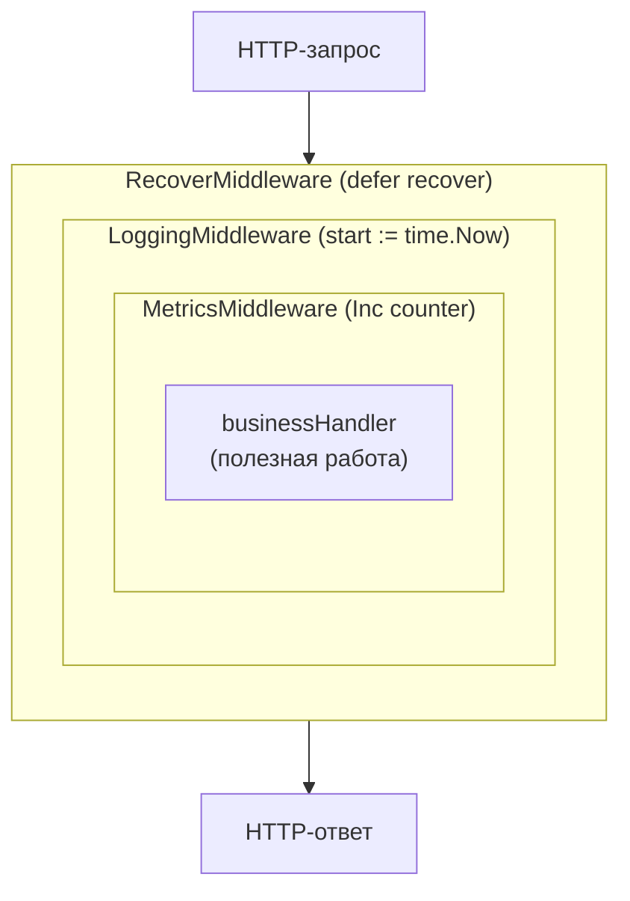
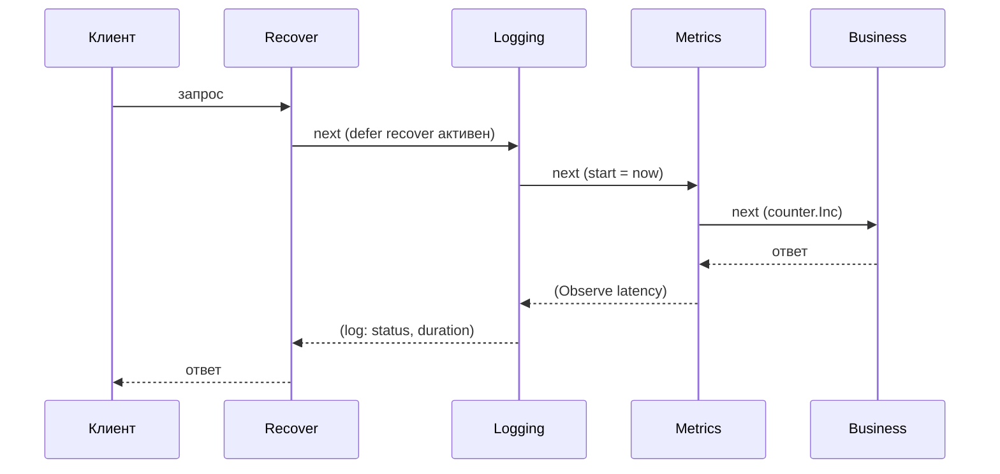

# Middleware и декораторы

Наблюдаемость держится на одном вопросе: **как добавить поведение (лог, метрику, трейс, recover) вокруг каждого запроса, не трогая бизнес-логику?** В .NET ответ встроен — это конвейер middleware ASP.NET Core. В Go встроенного конвейера нет; вместо него используется чистый паттерн **Декоратор** — обернуть существующее поведение в новое, сохранив тот же интерфейс. Эта глава закладывает механику перехвата, на которой стоят все следующие три (slog, Prometheus, OpenTelemetry): логирование, метрики и трейсинг в Go подключаются именно как декораторы.

## Декоратор: обернуть, не меняя

Идея паттерна — взять объект (или функцию), реализующий некий интерфейс, и вернуть **другой** объект с тем же интерфейсом, который добавляет поведение «до» и «после», делегируя суть оригиналу. Снаружи декорированный объект неотличим от исходного — его можно подставить везде, где ждали исходный.

В Go это выражается компактнее, чем в C#, потому что центральный «интерфейс» веб-сервера — `http.Handler` — состоит ровно из одного метода:

```go
type Handler interface {
    ServeHTTP(w http.ResponseWriter, r *http.Request)
}
```

А декоратор HTTP-обработчика — это функция, которая **принимает `http.Handler` и возвращает `http.Handler`**:

```go
type Middleware func(next http.Handler) http.Handler
```

Внутри возвращённого обработчика вы делаете свою работу и в нужный момент вызываете `next.ServeHTTP(w, r)` — это и есть «передать управление следующему».

> **Параллель с .NET:** в ASP.NET Core у вас есть `RequestDelegate next` и вызов `await next(context)`. Сигнатура `func(http.Handler) http.Handler` — это ровно тот же контракт «оберни следующего и реши, звать ли его», только выраженный обычной функцией высшего порядка, а не компонентом, который регистрирует хост. `next.ServeHTTP(w, r)` ≈ `await next(context)`; не вызвать `next` ≈ «закоротить» (short-circuit) конвейер, как это делает, например, middleware аутентификации, возвращая `401` и не пуская запрос дальше.

## Простейший декоратор: логирование

Начнём с middleware, который замеряет длительность запроса и пишет строку лога. Обратите внимание на структуру: код «до» вызова `next`, сам вызов, код «после».

```go
func LoggingMiddleware(next http.Handler) http.Handler {
    return http.HandlerFunc(func(w http.ResponseWriter, r *http.Request) {
        start := time.Now() // ── код «до»

        next.ServeHTTP(w, r) // ── передаём управление дальше по цепочке

        // ── код «после»: выполнится, когда вся вложенная цепочка вернётся
        slog.Info("request handled",
            "method", r.Method,
            "path", r.URL.Path,
            "duration", time.Since(start),
        )
    })
}
```

Здесь работают две идиомы Go:

- **`http.HandlerFunc`** — адаптер, превращающий обычную функцию `func(w, r)` в `http.Handler` (у `HandlerFunc` есть метод `ServeHTTP`, который просто вызывает саму функцию). Это позволяет не объявлять структуру с методом ради одного обработчика — прямой аналог того, как в C# лямбда подходит туда, где ждут делегат.
- **Замыкание**: возвращаемая функция захватывает `next`, поэтому в момент запроса знает, кому делегировать.

## Перехват ответа: оборачиваем `ResponseWriter`

Логировать длительность мало — обычно нужен ещё HTTP-статус ответа. Проблема: `http.ResponseWriter` не хранит записанный статус и не даёт его прочитать. Решение тоже декоратор, но уже не обработчика, а самого `ResponseWriter` — мы оборачиваем его, чтобы перехватить код, который бизнес-обработчик передаёт в `WriteHeader`:

```go
type statusRecorder struct {
    http.ResponseWriter     // встраивание: наследуем все методы исходного writer
    status int
}

func (r *statusRecorder) WriteHeader(code int) {
    r.status = code              // запоминаем статус
    r.ResponseWriter.WriteHeader(code) // и делегируем настоящему writer'у
}

func LoggingMiddleware(next http.Handler) http.Handler {
    return http.HandlerFunc(func(w http.ResponseWriter, r *http.Request) {
        start := time.Now()
        rec := &statusRecorder{ResponseWriter: w, status: http.StatusOK}

        next.ServeHTTP(rec, r) // передаём дальше ОБёрнутый writer

        slog.Info("request handled",
            "method", r.Method,
            "path", r.URL.Path,
            "status", rec.status,
            "duration", time.Since(start),
        )
    })
}
```

Ключевой приём — **встраивание (embedding)** `http.ResponseWriter` в структуру: `statusRecorder` автоматически получает все методы исходного writer'а, а мы переопределяем только `WriteHeader`, чтобы подсмотреть статус. Это идиоматичная Go-замена наследования для декораторов: переопределяем нужное, остальное делегируется встроенному значению.

> **Параллель с .NET:** в ASP.NET статус доступен прямо через `context.Response.StatusCode` — оборачивать ничего не нужно, потому что `HttpContext` богат данными. В Go контракт `ResponseWriter` намеренно узкий, поэтому, чтобы вытащить статус (а также размер ответа), его декорируют. Встраивание здесь играет роль, близкую к `: base(inner)` с делегированием неинтересных вызовов.

## Recover: превращаем панику в 500

Второй обязательный middleware — перехват паник. В Go непойманная паника в горутине обработчика по умолчанию обрушит весь сервер (хотя `net/http` для каждого запроса ставит собственный `recover`, чтобы паника одного запроса не убила процесс, он отдаёт пустой ответ и не логирует осмысленно). Свой recover-middleware даёт контроль: вернуть `500`, залогировать стек, не уронить процесс.

```go
func RecoverMiddleware(next http.Handler) http.Handler {
    return http.HandlerFunc(func(w http.ResponseWriter, r *http.Request) {
        defer func() {
            if err := recover(); err != nil {
                slog.Error("panic recovered",
                    "error", err,
                    "stack", string(debug.Stack()),
                )
                http.Error(w, "internal server error", http.StatusInternalServerError)
            }
        }()

        next.ServeHTTP(w, r) // паника отсюда будет поймана defer'ом выше
    })
}
```

`defer` с `recover()` внутри — стандартный для Go способ поймать панику (механика подробно разбиралась в Разделе 1 при обсуждении `panic`/`recover`). Поскольку `defer` отрабатывает при разворачивании стека, паника из любого места внутри `next` (или вложенных middleware) будет перехвачена здесь.

> **Параллель с .NET:** это аналог `UseExceptionHandler` / `UseDeveloperExceptionPage` — middleware, который ловит исключения из нижележащего конвейера и превращает их в ответ. Разница в природе ошибки: в .NET вы ловите `Exception` через `try/catch` (исключения — штатный механизм), в Go `recover` ловит `panic`, а штатные ошибки путешествуют как возвращаемые значения `error` и до паники обычно не доходят. Recover-middleware — это «сетка безопасности» именно от непредвиденного, а не от ожидаемых ошибок.

## Цепочки: «луковица» middleware

Один декоратор полезен, но сила в композиции: несколько middleware оборачивают друг друга, образуя «луковицу» (onion). Запрос проходит сквозь слои внутрь — к бизнес-обработчику, а ответ возвращается наружу в обратном порядке.

Собрать цепочку можно вручную, вкладывая вызовы:

```go
// Внешний слой — RecoverMiddleware, внутренний — бизнес-обработчик.
handler := RecoverMiddleware(
    LoggingMiddleware(
        MetricsMiddleware(
            http.HandlerFunc(businessHandler),
        ),
    ),
)
http.ListenAndServe(":8080", handler)
```

Читается это «изнутри наружу», что неудобно. Идиома — хелпер `Chain`, применяющий middleware слева направо в порядке записи:

```go
func Chain(h http.Handler, mws ...Middleware) http.Handler {
    // Оборачиваем с конца, чтобы первый в списке оказался самым внешним слоем.
    for i := len(mws) - 1; i >= 0; i-- {
        h = mws[i](h)
    }
    return h
}

// Теперь порядок очевиден: Recover — снаружи, бизнес — внутри.
handler := Chain(
    http.HandlerFunc(businessHandler),
    RecoverMiddleware, // первым получает запрос, последним — отдаёт ответ
    LoggingMiddleware,
    MetricsMiddleware,
    TracingMiddleware,
)
```

Порядок критичен и подчиняется логике. Типовой канон для наблюдаемости:

1. **Recover** — снаружи всех, чтобы поймать панику в любом нижележащем слое (включая сами middleware логирования/метрик).
2. **Логирование / метрики / трейсинг** — следом, чтобы измерить полную длительность запроса вместе с бизнес-работой.
3. **Бизнес-обработчик** — в центре луковицы.

Вот эта «луковичная» модель прохождения запроса:



Каждый слой видит запрос на пути «внутрь» (до `next.ServeHTTP`) и ответ на пути «наружу» (после `next.ServeHTTP`). Поэтому код «до» в Logging выполняется раньше бизнес-логики, а код «после» (запись лога с длительностью) — позже неё.

Та же последовательность во времени, по слоям:



> **Параллель с .NET:** это в точности порядок `app.UseExceptionHandler()` → `app.UseSerilogRequestLogging()` → `app.UseRouting()` → … в `Program.cs`. ASP.NET тоже строит «луковицу» — каждый `UseMiddleware` оборачивает следующий, а `await next()` ныряет внутрь. Разница чисто механическая: в .NET порядок задаёт последовательность вызовов `Use...` на `IApplicationBuilder`, и хост сам сшивает делегаты; в Go вы сшиваете функции сами через `Chain`. Зато в Go цепочка — обычное значение `http.Handler`, которое можно собирать по-разному для разных групп маршрутов без особого API.

## Перехват на трёх уровнях

Декоратор универсален. HTTP-middleware — самый частый случай, но тот же приём применяется везде, где есть «интерфейс с операцией, которую надо обернуть».

### 1. HTTP middleware

Разобрано выше: `func(http.Handler) http.Handler`. Это слой на границе входящих HTTP-запросов.

### 2. gRPC interceptors

Для gRPC вместо `http.Handler` оборачивают вызов RPC. gRPC-Go предоставляет готовые сигнатуры — `grpc.UnaryServerInterceptor` для унарных вызовов:

```go
func LoggingInterceptor(
    ctx context.Context,
    req any,
    info *grpc.UnaryServerInfo, // info.FullMethod — имя метода, напр. "/pkg.Svc/Method"
    handler grpc.UnaryHandler,  // «следующий» — аналог next
) (resp any, err error) {
    start := time.Now()

    resp, err = handler(ctx, req) // вызываем сам RPC-метод

    slog.InfoContext(ctx, "grpc call",
        "method", info.FullMethod,
        "duration", time.Since(start),
        "err", err,
    )
    return resp, err
}

// Регистрация при создании сервера:
server := grpc.NewServer(
    grpc.ChainUnaryInterceptor( // несколько интерсепторов одной цепочкой
        RecoverInterceptor,
        LoggingInterceptor,
        MetricsInterceptor,
    ),
)
```

Принцип идентичен: `handler(ctx, req)` играет роль `next.ServeHTTP`. Для стримов есть параллельный `grpc.StreamServerInterceptor`. На клиентской стороне — `grpc.UnaryClientInterceptor` (обернуть исходящие вызовы).

> **Параллель с .NET:** в gRPC для .NET интерсепторы — это классы-наследники `Interceptor` с переопределением `UnaryServerHandler` и т.п. Go обходится функцией нужной сигнатуры вместо наследования базового класса — ровно как с HTTP-обработчиками. Конфигурируется через `grpc.ChainUnaryInterceptor`, что соответствует регистрации интерсепторов в `AddGrpc(o => o.Interceptors.Add<T>())`.

### 3. Обёртки вокруг БД и клиентов

Тот же декоратор применяют к любому интерфейсу зависимости, чтобы добавить логи/метрики/трейсы вокруг вызовов БД, кэша или HTTP-клиента. Если репозиторий описан интерфейсом, обёртка реализует тот же интерфейс и делегирует вложенному, измеряя по пути:

```go
type UserRepo interface {
    GetUser(ctx context.Context, id int64) (*User, error)
}

// Декоратор: реализует UserRepo, оборачивая другой UserRepo.
type instrumentedRepo struct {
    next UserRepo
}

func (r *instrumentedRepo) GetUser(ctx context.Context, id int64) (*User, error) {
    start := time.Now()

    u, err := r.next.GetUser(ctx, id) // делегируем настоящей реализации

    slog.InfoContext(ctx, "db query",
        "op", "GetUser",
        "duration", time.Since(start),
        "err", err,
    )
    return u, err
}

// Сборка: оборачиваем реальный репозиторий инструментированным.
var repo UserRepo = &instrumentedRepo{next: pgRepo}
```

Для исходящих HTTP-вызовов есть специализированная точка декорирования — `http.RoundTripper` (интерфейс с одним методом `RoundTrip`). Обернув `Transport` у `http.Client`, вы перехватываете каждый исходящий запрос — именно так инструментируют клиентский трейсинг (об этом в главе про OpenTelemetry).

> **Параллель с .NET:** обёртка репозитория — это классический decorator-over-interface, который в .NET часто навешивают через DI (например, `Scrutor` и его `Decorate<IUserRepo, InstrumentedUserRepo>()`). Перехват исходящих HTTP — это `DelegatingHandler` в `HttpClientFactory`: `http.RoundTripper` ≈ `DelegatingHandler`, оба оборачивают «следующий» транспорт. В .NET это часто делается декларативно (атрибуты, конвенции DI); в Go обёртку вы создаёте и подставляете явно в composition root.

## Замыкания для конфигурируемых middleware

Когда middleware нужны параметры (например, логгер или таймаут), добавляют ещё один уровень функции — фабрику middleware. Снаружи это middleware с настройкой:

```go
// Фабрика: принимает зависимость, возвращает готовый Middleware.
func LoggingMiddlewareWith(logger *slog.Logger) Middleware {
    return func(next http.Handler) http.Handler {
        return http.HandlerFunc(func(w http.ResponseWriter, r *http.Request) {
            start := time.Now()
            next.ServeHTTP(w, r)
            logger.InfoContext(r.Context(), "request",
                "path", r.URL.Path,
                "duration", time.Since(start),
            )
        })
    }
}

// Применение:
handler := Chain(mux, LoggingMiddlewareWith(myLogger))
```

Три уровня замыканий (`фабрика(deps) → middleware(next) → handler(w, r)`) — типичная Go-идиома для параметризуемого перехвата. Это функциональная замена тому, что в .NET даёт конструктор middleware-класса с внедрёнными через DI зависимостями.

## Итог

- В Go перехват строится на паттерне **Декоратор**: обернуть значение в другое значение с тем же интерфейсом, добавив поведение «до» и «после» и делегируя суть оригиналу. Встроенного конвейера, как в ASP.NET, нет — композицию вы делаете сами.
- HTTP-middleware — это `func(http.Handler) http.Handler`; внутри вы вызываете `next.ServeHTTP(w, r)` (аналог `await next(context)`), а чтобы «закоротить» обработку — не вызываете его.
- Чтобы перехватить статус/размер ответа, оборачивают `http.ResponseWriter` через **встраивание**, переопределяя только нужные методы. Recover-middleware ловит панику через `defer`/`recover` и превращает её в `500`.
- Цепочки образуют «луковицу»: запрос идёт внутрь до бизнес-логики, ответ — наружу. Канон порядка: recover снаружи, затем логи/метрики/трейсы, бизнес — в центре. Сшивает слои хелпер `Chain`.
- Тот же декоратор работает на трёх уровнях: HTTP-middleware, **gRPC-интерсепторы** (`grpc.UnaryServerInterceptor`, `handler` как `next`) и **обёртки вокруг БД/клиентов** (decorator-over-interface; `http.RoundTripper` ≈ `DelegatingHandler`).

Дальше — первый из трёх столпов наблюдаемости, который мы будем встраивать именно через эти декораторы: структурное логирование на встроенном `log/slog`.

---

[⌂ Главная](../../README.md) · [↑ Раздел](./README.md) · [← Предыдущий: Раздел 11](./README.md) · [→ Следующий: Логирование: slog](./02-logging-slog.md)
