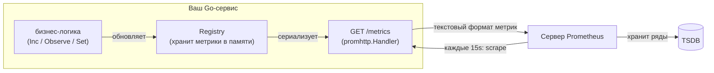

# Метрики: Prometheus

Логи отвечают на вопрос «что произошло с этим конкретным запросом». Метрики отвечают на «что происходит с системой в целом прямо сейчас» — сколько запросов в секунду, какова доля ошибок, как распределена задержка. Это числовые временные ряды, и в облачно-нативном мире Go их де-факто стандарт — **Prometheus**. В .NET эту нишу занимает `System.Diagnostics.Metrics` (или раньше — prometheus-net). Эта глава — про официальный клиент `prometheus/client_golang`, его pull-модель и четыре типа метрик.

## Pull-модель: Prometheus сам приходит за метриками

Первое, что нужно перенастроить в голове, — направление потока данных. Интуиция «сервис отправляет метрики в систему мониторинга» (push) здесь **неверна**. Prometheus работает по **pull-модели**: ваш сервис лишь выставляет HTTP-эндпоинт `/metrics`, а сервер Prometheus сам периодически ходит на него и **забирает** (scrape) текущие значения.



Что это меняет на практике:

- Сервис не знает адрес Prometheus и ничего никуда не шлёт — он только держит актуальные значения в памяти и отдаёт их по запросу. Меньше связности, проще тестировать.
- Метрики в коде — это **состояние**, а не события: вы увеличиваете счётчик или выставляете gauge, а наружу уходит снимок этого состояния в момент скрейпа. Между скрейпами Prometheus вашего сервиса «не видит».
- Обнаружение целей — забота Prometheus (через service discovery), а не сервиса.

> **Параллель с .NET:** pull-модель здесь **полностью совпадает** с тем, как обычно подключают Prometheus в .NET. Что prometheus-net (`UseHttpMetrics()` + эндпоинт `/metrics`), что экспортёр OpenTelemetry-Prometheus выставляют ровно такой же scrape-эндпоинт, и Prometheus так же приходит за данными. Контраст здесь не «.NET против Go», а pull (Prometheus) против push (например, StatsD/Datadog-agent или OTLP-push в коллектор) — но это ортогонально языку.

## `client_golang`: регистр и эндпоинт

Официальная библиотека — `github.com/prometheus/client_golang` (актуальная версия линейки `v1.23.x`). Минимальный рабочий сервис метрик:

```go
import (
    "net/http"

    "github.com/prometheus/client_golang/prometheus/promhttp"
)

func main() {
    // promhttp.Handler() отдаёт все метрики из глобального регистра по умолчанию.
    http.Handle("/metrics", promhttp.Handler())
    http.ListenAndServe(":2112", nil)
}
```

Под капотом работают две сущности:

- **Registry** (`prometheus.Registry`) — реестр, где зарегистрированы все метрики. Есть глобальный по умолчанию, но в продакшне обычно создают **свой** (`prometheus.NewRegistry()`), чтобы контролировать набор метрик и не тянуть глобальное состояние — это важно для тестируемости (та же мотивация, что вела нас к явному DI в Разделе 5).
- **`promhttp.Handler()`** — готовый `http.Handler`, который при скрейпе обходит регистр, собирает текущие значения и сериализует их в текстовый формат Prometheus. Для своего регистра берут `promhttp.HandlerFor(reg, promhttp.HandlerOpts{})`.

Регистрировать метрику можно двумя путями. Явно — создать и зарегистрировать:

```go
counter := prometheus.NewCounter(prometheus.CounterOpts{
    Name: "myapp_requests_total",
    Help: "Total number of requests.",
})
prometheus.MustRegister(counter) // паникует при дубликате имени
```

Или через пакет `promauto`, который создаёт **и сразу регистрирует** в один вызов (удобно для пакетных переменных):

```go
import "github.com/prometheus/client_golang/prometheus/promauto"

var requests = promauto.NewCounter(prometheus.CounterOpts{
    Name: "myapp_requests_total",
    Help: "Total number of requests.",
})
```

`Name` и `Help` обязательны: `Help` — человекочитаемое описание, которое уходит в скрейп и видно в Prometheus. По конвенции имя метрики — в `snake_case` с префиксом-namespace (`myapp_`) и суффиксом единицы измерения (`_total`, `_seconds`, `_bytes`).

> **Параллель с .NET:** `prometheus.Registry` ≈ то, что в `System.Diagnostics.Metrics` собирает `MeterListener` / экспортёр поверх `Meter`, а в prometheus-net — `CollectorRegistry`. `promhttp.Handler()` ≈ маппинг эндпоинта `/metrics` (`endpoints.MapMetrics()` в prometheus-net или Prometheus-экспортёр OTel). `promauto.NewCounter` (создать+зарегистрировать) близок к `Meter.CreateCounter<T>(...)`, который тоже создаёт инструмент, привязанный к своему `Meter`.

## Четыре типа метрик: когда что

Prometheus (и `client_golang`) различает четыре типа. Выбрать правильный — половина дела.

### Counter — монотонно растущий счётчик

Только **увеличивается** (или сбрасывается в 0 при рестарте процесса). Для подсчёта **событий**: число запросов, ошибок, отправленных байт. Никогда не используйте Counter для величин, которые могут уменьшаться.

```go
requests := promauto.NewCounter(prometheus.CounterOpts{
    Name: "myapp_requests_total",
    Help: "Total requests processed.",
})
requests.Inc()      // +1
requests.Add(3)     // +3 (только положительное)
```

Само по себе монотонно растущее число малоинформативно — ценность раскрывается в запросе PromQL `rate(myapp_requests_total[5m])`, дающем «запросов в секунду». Именно поэтому Counter, а не Gauge: `rate()` корректно учитывает сбросы при рестарте.

> **Параллель с .NET:** `Counter<T>` из `System.Diagnostics.Metrics` (`meter.CreateCounter<long>("...")`, метод `.Add(1)`). Семантика монотонного роста совпадает.

### Gauge — мгновенное значение, может расти и падать

Произвольная величина, которая **колеблется** в обе стороны: текущее число активных соединений, занятая память, длина очереди, температура.

```go
inFlight := promauto.NewGauge(prometheus.GaugeOpts{
    Name: "myapp_in_flight_requests",
    Help: "Requests currently being served.",
})
inFlight.Inc()        // запрос пришёл
defer inFlight.Dec()  // запрос завершился
inFlight.Set(42)      // или выставить абсолютное значение
```

> **Параллель с .NET:** ближе всего `ObservableGauge<T>` (`meter.CreateObservableGauge(...)` с колбэком, отдающим текущее значение при сборе) — в pull-модели это естественно. Есть и `UpDownCounter<T>` для величин, меняющихся в обе стороны через `.Add(±n)`. `client_golang`-овский Gauge совмещает оба стиля: и `Inc/Dec/Add/Sub`, и `Set`.

### Histogram — распределение по бакетам

Самый важный тип для измерения **задержек** и размеров. Histogram раскладывает наблюдения по заранее заданным «корзинам» (buckets) и считает, сколько значений попало в каждую. Это позволяет на стороне Prometheus вычислять **квантили** (p50, p95, p99) через `histogram_quantile`.

```go
latency := promauto.NewHistogram(prometheus.HistogramOpts{
    Name:    "myapp_request_duration_seconds",
    Help:    "Request latency in seconds.",
    Buckets: prometheus.DefBuckets, // {.005,.01,.025,.05,.1,.25,.5,1,2.5,5,10}
})
latency.Observe(0.042) // зафиксировать одно наблюдение (42 мс)
```

`DefBuckets` подобраны под типичные сетевые задержки в секундах. Для своих диапазонов есть генераторы: `prometheus.LinearBuckets(start, width, count)` и `prometheus.ExponentialBuckets(start, factor, count)`. **Бакеты важно подбирать под свои данные**: если все значения попадают в один бакет, квантили будут бесполезны.

Технически Histogram при скрейпе разворачивается в несколько рядов: серию `_bucket` (накопительные счётчики по границам), `_sum` (сумма всех наблюдений) и `_count` (их число). Квантили считаются **в Prometheus**, а не в сервисе — сервис лишь раскладывает по бакетам, что дёшево и (в отличие от Summary) корректно агрегируется между инстансами.

> **Параллель с .NET:** прямой аналог — `Histogram<T>` (`meter.CreateHistogram<double>("...")`, метод `.Record(value)`). В OpenTelemetry границы бакетов настраиваются через explicit bucket boundaries (advice/`View`). Идея одинакова: записываем наблюдения, агрегатор раскладывает их по корзинам.

### Summary — квантили, посчитанные на месте

Похож на Histogram, но квантили вычисляются **на стороне сервиса** по скользящему окну, а наружу отдаются готовыми. Объявляется с целевыми квантилями:

```go
summary := promauto.NewSummary(prometheus.SummaryOpts{
    Name:       "myapp_request_duration_seconds",
    Help:       "Request latency in seconds.",
    Objectives: map[float64]float64{0.5: 0.05, 0.9: 0.01, 0.99: 0.001},
})
summary.Observe(0.042)
```

Ключевой недостаток Summary, из-за которого **по умолчанию предпочитают Histogram**: посчитанные на инстансе квантили **нельзя агрегировать** между инстансами (среднее от p99 десяти подов — не p99 системы). Histogram-бакеты складываются, поэтому Histogram лучше масштабируется на много реплик. Summary берут, когда нужна высокая точность конкретного квантиля без подбора бакетов и без агрегации между инстансами.

| Тип       | Что измеряет           | Направление        | Пример                       | .NET (`System.Diagnostics.Metrics`) |
| --------- | ---------------------- | ------------------ | ---------------------------- | ----------------------------------- |
| Counter   | счёт событий           | только вверх       | `requests_total`             | `Counter<T>`                        |
| Gauge     | мгновенное значение    | вверх и вниз       | `in_flight_requests`         | `ObservableGauge<T>` / `UpDownCounter<T>` |
| Histogram | распределение          | наблюдения         | `request_duration_seconds`   | `Histogram<T>`                      |
| Summary   | квантили на месте      | наблюдения         | `request_duration_seconds`   | (нет прямого аналога; считается экспортёром) |

## Лейблы и кардинальность

Метрики становятся по-настоящему полезными с **лейблами** (labels) — измерениями, по которым ряд разбивается на под-ряды. Например, считать запросы отдельно по методу и статусу. Для этого берут «векторный» вариант (`...Vec`):

```go
requests := promauto.NewCounterVec(
    prometheus.CounterOpts{
        Name: "myapp_requests_total",
        Help: "Total requests by method and status.",
    },
    []string{"method", "status"}, // имена лейблов
)

// При использовании указываем значения лейблов:
requests.WithLabelValues("GET", "200").Inc()
requests.WithLabelValues("POST", "500").Inc()
```

Аналогично есть `GaugeVec`, `HistogramVec`, `SummaryVec`.

И здесь — **главная опасность метрик: кардинальность** ❌. Каждое уникальное сочетание значений лейблов создаёт **отдельный временной ряд**, который Prometheus хранит в памяти. Если поставить лейблом высококардинальную величину, число рядов взрывается и кладёт Prometheus.

```go
// ❌ КАТАСТРОФА: user_id и path с параметрами — миллионы уникальных значений
requests.WithLabelValues(userID, r.URL.Path).Inc()
// /users/42, /users/43, ... → отдельный ряд на каждого пользователя

// ✅ Правильно: только ограниченные множества значений
requests.WithLabelValues(r.Method, routePattern).Inc()
// method ∈ {GET,POST,...}, routePattern = "/users/{id}" (шаблон, не конкретный путь)
```

Правило: **лейблы — только для величин с малым ограниченным множеством значений** (метод, код статуса, имя маршрута-шаблона, регион). Никогда — user id, email, полный URL, trace id, временная метка. Высококардинальные данные — это работа для **логов и трейсов** (предыдущая и следующая главы), а не для метрик.

> **Параллель с .NET:** лейблы Prometheus — это **теги (tags)** в `System.Diagnostics.Metrics`: `counter.Add(1, new KeyValuePair<string,object?>("method", "GET"), ...)`. Проблема кардинальности **идентична** и не зависит от языка: каждый уникальный набор тегов — отдельный ряд. В OpenTelemetry для этого даже есть механизм отсева/агрегации измерений через `View`. В Go отсева «из коробки» нет — дисциплину по лейблам держите сами.

## Метрики-middleware: всё вместе

Соберём с паттерном Декоратор из главы 1: middleware, инкрементирующий счётчик и наблюдающий задержку с лейблами `method`/`status`.

```go
var (
    httpRequests = promauto.NewCounterVec(
        prometheus.CounterOpts{
            Name: "myapp_http_requests_total",
            Help: "Total HTTP requests.",
        },
        []string{"method", "status"},
    )
    httpDuration = promauto.NewHistogramVec(
        prometheus.HistogramOpts{
            Name:    "myapp_http_request_duration_seconds",
            Help:    "HTTP request latency.",
            Buckets: prometheus.DefBuckets,
        },
        []string{"method"},
    )
)

func MetricsMiddleware(next http.Handler) http.Handler {
    return http.HandlerFunc(func(w http.ResponseWriter, r *http.Request) {
        start := time.Now()
        rec := &statusRecorder{ResponseWriter: w, status: http.StatusOK}

        next.ServeHTTP(rec, r)

        status := strconv.Itoa(rec.status)
        httpRequests.WithLabelValues(r.Method, status).Inc()
        httpDuration.WithLabelValues(r.Method).Observe(time.Since(start).Seconds())
    })
}
```

Это та же «луковица»: декоратор обработчика, переиспользующий `statusRecorder` из главы 1, только теперь он пишет не в лог, а в метрики. На практике в продакшне такой middleware обычно не пишут руками, а берут готовый из `promhttp.InstrumentHandler*` или из библиотек инструментирования (включая OpenTelemetry-метрики) — но механизм под капотом ровно этот.

## Итог

- Prometheus работает по **pull-модели**: сервис выставляет `/metrics`, а сервер Prometheus сам периодически забирает значения. Метрики в коде — это **состояние** в памяти, а не отправляемые события. Pull-подход совпадает с тем, как Prometheus подключают и в .NET.
- Официальный клиент — `prometheus/client_golang` (`v1.23.x`): метрики живут в `Registry`, отдаются через `promhttp.Handler()`; создаются вручную (`NewCounter` + `MustRegister`) или сразу с регистрацией через `promauto`.
- Четыре типа: **Counter** (монотонный счёт событий, в паре с `rate()`), **Gauge** (мгновенная величина вверх/вниз), **Histogram** (распределение по бакетам, квантили считает Prometheus — масштабируется на реплики), **Summary** (квантили на месте, не агрегируется между инстансами — по умолчанию предпочитают Histogram).
- Лейблы (`...Vec` + `WithLabelValues`) разбивают метрику на под-ряды. **Кардинальность** ❌ — главная ловушка: каждый уникальный набор значений лейблов = отдельный ряд; лейблы только для малых ограниченных множеств (метод, статус, маршрут-шаблон), никогда — user id/URL/trace id. Та же проблема существует и в .NET-тегах.
- Метрики-middleware — снова паттерн Декоратор: обернуть обработчик, инкрементировать счётчик и наблюдать задержку (`Observe(time.Since(start).Seconds())`).

Дальше — третий столп: распределённый трейсинг на OpenTelemetry, который свяжет путь запроса сквозь несколько сервисов.

---

[⌂ Главная](../../README.md) · [↑ Раздел](./README.md) · [← Предыдущий: Логирование: slog](./02-logging-slog.md) · [→ Следующий: Трейсинг: OpenTelemetry](./04-tracing-opentelemetry.md)
