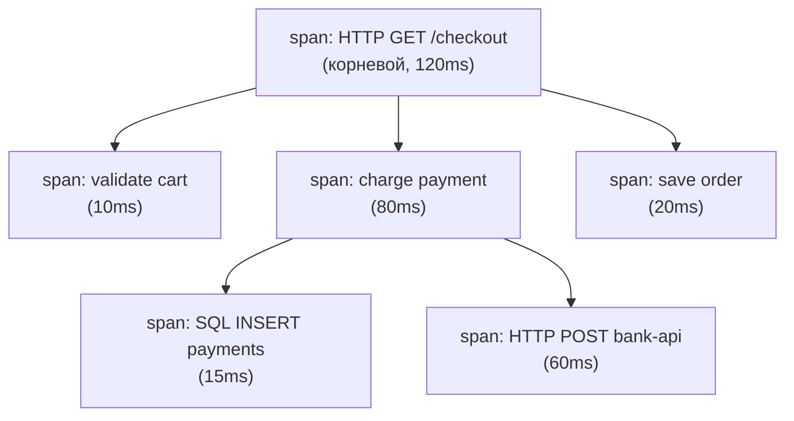
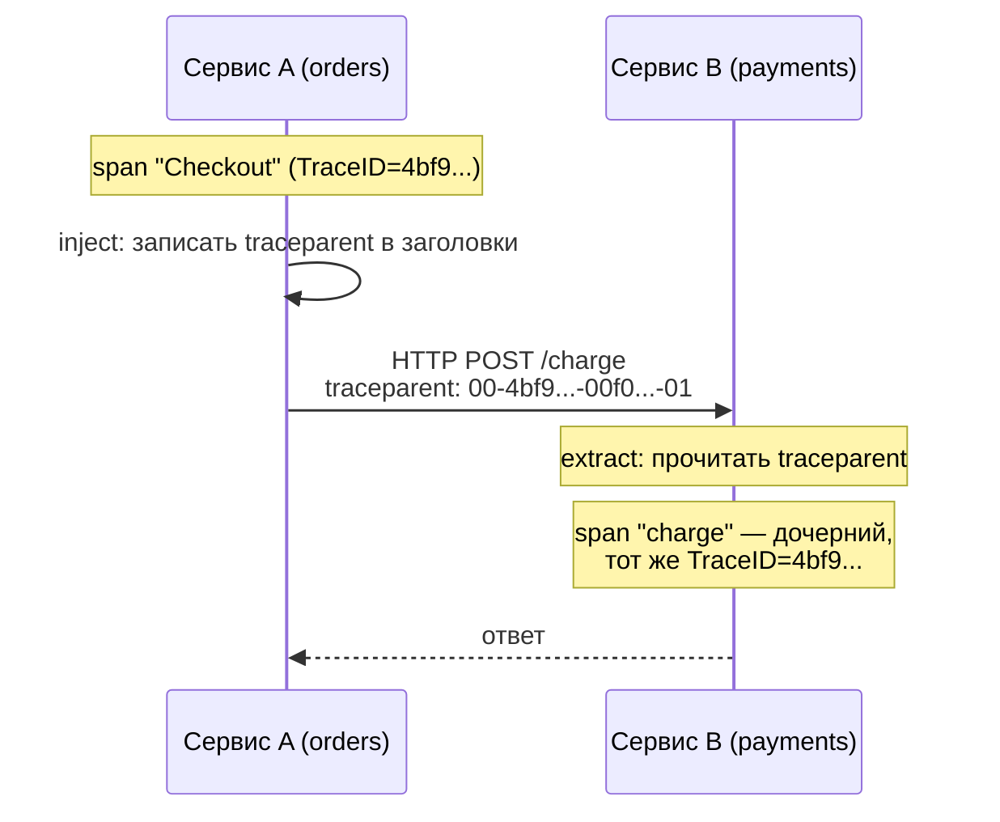

# Трейсинг: OpenTelemetry

Логи и метрики хороши, пока запрос живёт внутри одного сервиса. Но в микросервисной системе один пользовательский запрос проходит через API-gateway → сервис заказов → сервис платежей → БД, и вопрос «почему этот запрос тормозил» требует увидеть **весь путь** запроса сквозь сервисы как единое целое. Это и есть **распределённый трейсинг**. В Go (и в индустрии в целом) стандарт — **OpenTelemetry**. В .NET его роль играет `System.Diagnostics.Activity`. Эта глава — про OpenTelemetry-Go, спаны, и про то, как трейс «сшивается» между сервисами.

## Зачем трейсинг: трейс из спанов

Базовые понятия:

- **Span** (спан) — единица работы с именем, временем начала/конца, атрибутами и статусом. Например, «обработка HTTP-запроса», «SQL-запрос», «вызов внешнего API». Спан — это «что и сколько делалось».
- **Trace** (трейс) — дерево спанов, связанных общим **TraceID**. Корневой спан порождает дочерние (родитель-потомок), и всё дерево — это путь одного запроса через систему.

Дерево спанов внутри одного трейса:



Глядя на такое дерево в Jaeger/Tempo/Grafana, инженер сразу видит: запрос занял 120 мс, из них 80 мс — оплата, а внутри неё 60 мс ушло на внешний вызов банка. Это невозможно увидеть по логам отдельных сервисов — нужна именно связанная картина.

> **Параллель с .NET:** концепция один в один. `Activity` в .NET — это и есть span (у него `OperationName`, `Duration`, теги, статус), а `Activity.TraceId` связывает дерево. Если вы работали с Application Insights или OpenTelemetry в .NET, ментальная модель «trace = дерево спанов с общим TraceId» переносится без изменений.

## OpenTelemetry-Go: Tracer и Span

OpenTelemetry для Go живёт в `go.opentelemetry.io/otel` (трейсинг стабилен). Центральные сущности:

- **`Tracer`** — фабрика спанов, обычно по одному на компонент/библиотеку. Получают через `otel.Tracer("имя")`.
- **`Span`** — сам спан, создаётся методом `tracer.Start`.

Создание спана и базовая работа с ним:

```go
import (
    "go.opentelemetry.io/otel"
    "go.opentelemetry.io/otel/attribute"
    "go.opentelemetry.io/otel/codes"
)

var tracer = otel.Tracer("myapp/checkout") // фабрика спанов компонента

func Checkout(ctx context.Context, orderID int64) error {
    // Start возвращает НОВЫЙ ctx (со спаном внутри) и сам span.
    ctx, span := tracer.Start(ctx, "Checkout")
    defer span.End() // ОБЯЗАТЕЛЬНО: фиксирует время окончания

    // Атрибуты — структурированные поля спана (как у лога).
    span.SetAttributes(
        attribute.Int64("order.id", orderID),
        attribute.String("order.currency", "USD"),
    )

    if err := charge(ctx, orderID); err != nil {
        span.RecordError(err)                    // прикрепить ошибку к спану
        span.SetStatus(codes.Error, err.Error()) // пометить спан как неуспешный
        return err
    }

    span.SetStatus(codes.Ok, "")
    return nil
}
```

Три обязательных момента:

1. **`defer span.End()`** сразу после `Start` — иначе спан не закроется, его длительность не зафиксируется, и он утечёт. Это рефлекс уровня `defer cancel()` для контекста из Раздела 3.
2. **`tracer.Start` возвращает новый `ctx`** — со спаном «внутри». Этот `ctx` нужно передавать дальше во вложенные вызовы, иначе их спаны не станут дочерними (см. ниже).
3. **Статус** (`codes.Ok` / `codes.Error`) и `RecordError` делают спан полезным при разборе инцидентов.

> **Параллель с .NET:** `otel.Tracer(name)` ≈ `ActivitySource` (`new ActivitySource("myapp/checkout")`); `tracer.Start(ctx, "...")` ≈ `activitySource.StartActivity("...")`. `span.End()` ≈ `activity.Dispose()` (в .NET идиома — `using var activity = ...`, где `Dispose` в конце блока играет роль `defer span.End()`). `span.SetAttributes(...)` ≈ `activity.SetTag(...)`; `span.SetStatus(codes.Error, ...)` ≈ `activity.SetStatus(ActivityStatusCode.Error)`; `span.RecordError(err)` ≈ `activity.AddException(ex)`.

## Контекст: как спаны связываются в дерево

Здесь — главный механизм, и он напрямую опирается на `context.Context` из Раздела 3. Спан «живёт» **в контексте**. Когда вы вызываете `tracer.Start(ctx, ...)`, библиотека смотрит, есть ли в переданном `ctx` уже активный спан:

- если есть — новый спан становится **дочерним** к нему (тот же TraceID, родитель = найденный спан);
- если нет — новый спан становится **корневым** (новый TraceID).

Поэтому связывание в дерево происходит автоматически — **при условии, что вы пробрасываете `ctx`** по цепочке вызовов:

```go
func Checkout(ctx context.Context, orderID int64) error {
    ctx, span := tracer.Start(ctx, "Checkout") // корневой (или дочерний внешнего)
    defer span.End()

    return charge(ctx, orderID) // передаём ctx со спаном дальше
}

func charge(ctx context.Context, orderID int64) error {
    ctx, span := tracer.Start(ctx, "charge") // дочерний к "Checkout" — ctx принёс родителя
    defer span.End()
    // ...
    return nil
}
```

Это та самая дисциплина «`ctx` — первый параметр, прокидывать сквозь весь стек» из главы про `context`. В трейсинге она перестаёт быть просто хорошим тоном и становится несущей: **без проброса `ctx` дерево спанов рассыпается** на несвязанные корни. Достать текущий спан из контекста можно через `trace.SpanFromContext(ctx)`.

> **Параллель с .NET:** в .NET связывание родитель-потомок обычно **неявное** — через `Activity.Current` (ambient-состояние на `AsyncLocal`). `StartActivity` автоматически берёт `Activity.Current` как родителя, и `ctx` руками передавать не нужно. Это удобнее, но это скрытое состояние. Go верен своей философии явности: родитель передаётся **через явный `ctx`-аргумент**, а не через ambient-переменную. Тот же контраст, что мы видели с логами (`InfoContext(ctx,...)` против enricher'а, читающего `Activity.Current`).

## Пропагация: трейс через границу сервиса

Внутри процесса спаны связывает `ctx`. Но как трейс продолжается, **переходя в другой сервис** по сети? `ctx` по проводу не передаётся. Решение — **пропагация контекста**: на исходящем запросе клиент сериализует идентификаторы трейса (TraceID + SpanID + флаги) в **HTTP-заголовки**, а принимающий сервис извлекает их и восстанавливает связь, делая свой корневой спан дочерним к удалённому родителю.

Стандарт формата — **W3C Trace Context**: заголовок `traceparent` (и опциональный `tracestate`). Выглядит он так:

```
traceparent: 00-4bf92f3577b34da6a3ce929d0e0e4736-00f067aa0ba902b7-01
             ^version ^trace-id (16 байт)            ^span-id (8 байт)  ^flags
```

Трейс через два сервиса с пропагацией заголовка:



В коде этим заведуют **пропагаторы**. Их настраивают глобально один раз на старте:

```go
import "go.opentelemetry.io/otel/propagation"

otel.SetTextMapPropagator(propagation.NewCompositeTextMapPropagator(
    propagation.TraceContext{}, // W3C traceparent/tracestate
    propagation.Baggage{},      // произвольные key-value, едущие с трейсом
))
```

На практике inject/extract заголовков вы почти никогда не пишете руками — это делают **инструментирующие обёртки** (снова паттерн Декоратор из главы 1):

- **Входящие HTTP**: `otelhttp.NewHandler(next, "имя")` оборачивает `http.Handler`, извлекает `traceparent` из заголовков и создаёт корневой спан запроса.
- **Исходящие HTTP**: `otelhttp.NewTransport(http.DefaultTransport)` оборачивает `http.RoundTripper` у клиента и инжектит `traceparent` в исходящие запросы.
- **gRPC**: `otelgrpc` даёт интерсепторы (см. главу 1), делающие то же для gRPC-метаданных.

```go
// Входящий HTTP-трафик: автоматический серверный спан + extract.
handler := otelhttp.NewHandler(mux, "http.server")

// Исходящий HTTP-клиент: автоматический клиентский спан + inject.
client := &http.Client{Transport: otelhttp.NewTransport(http.DefaultTransport)}
```

> **Параллель с .NET:** W3C Trace Context — это **тот же стандарт** и в .NET; `Activity` нативно умеет его инжектить/извлекать (`DistributedContextPropagator`), а ASP.NET Core делает extract входящих `traceparent` автоматически. То есть Go-сервис и .NET-сервис **сквозно трассируются вместе** — заголовок `traceparent` понимают оба. `otelhttp.NewHandler`/`NewTransport` ≈ автоматическая инструментация ASP.NET Core и `HttpClient` (через `AddOpenTelemetry().WithTracing(t => t.AddAspNetCoreInstrumentation().AddHttpClientInstrumentation())`). `propagation.Baggage` ≈ `Activity.Baggage` / `Baggage` API.

## Экспортёры и провайдер: куда уходят спаны

Создать спаны мало — их нужно куда-то отправить (в Jaeger, Tempo, Grafana, облачный backend). За это отвечает **TracerProvider** из SDK (`go.opentelemetry.io/otel/sdk/trace`), сконфигурированный с **экспортёром**. Стандарт транспорта — **OTLP** (OpenTelemetry Protocol), обычно в коллектор OpenTelemetry, который дальше разводит данные по бэкендам.

Инициализация на старте `main` (обычно выносится в функцию `setupTracing`):

```go
import (
    "go.opentelemetry.io/otel"
    "go.opentelemetry.io/otel/exporters/otlp/otlptrace/otlptracegrpc"
    "go.opentelemetry.io/otel/propagation"
    sdktrace "go.opentelemetry.io/otel/sdk/trace"
    "go.opentelemetry.io/otel/sdk/resource"
    semconv "go.opentelemetry.io/otel/semconv/v1.26.0"
)

func setupTracing(ctx context.Context) (func(context.Context) error, error) {
    // Экспортёр по OTLP/gRPC (по умолчанию шлёт на localhost:4317).
    exporter, err := otlptracegrpc.New(ctx)
    if err != nil {
        return nil, err
    }

    // Resource описывает ЭТОТ сервис (имя видно в трейсах как service.name).
    res := resource.NewWithAttributes(
        semconv.SchemaURL,
        semconv.ServiceName("orders"),
    )

    tp := sdktrace.NewTracerProvider(
        sdktrace.WithBatcher(exporter), // батчинг спанов перед отправкой
        sdktrace.WithResource(res),
    )

    otel.SetTracerProvider(tp) // глобальный провайдер для otel.Tracer(...)
    otel.SetTextMapPropagator(propagation.NewCompositeTextMapPropagator(
        propagation.TraceContext{},
        propagation.Baggage{},
    ))

    return tp.Shutdown, nil // вызвать при остановке: до-отправит буфер спанов
}

func main() {
    ctx := context.Background()
    shutdown, err := setupTracing(ctx)
    if err != nil {
        log.Fatal(err)
    }
    defer shutdown(ctx) // flush оставшихся спанов при выходе
    // ... запуск сервера ...
}
```

Ключевые детали:

- **`WithBatcher`** — спаны копятся и отправляются пачками (эффективнее, чем по одному). Поэтому при остановке обязателен **`tp.Shutdown(ctx)`** (через `defer`) — он до-отправит то, что ещё в буфере; иначе последние спаны потеряются. Это «`defer` для флаша», родственник `defer cancel()`.
- **OTLP-экспортёр**: `otlptracegrpc` (gRPC, порт 4317) или `otlptracehttp` (HTTP, порт 4318). Конечную точку настраивают опциями или переменной окружения `OTEL_EXPORTER_OTLP_ENDPOINT`.
- **Resource** с `service.name` — обязателен для осмысленных трейсов: именно по нему backend различает, какой сервис породил спан.

> **Параллель с .NET:** `TracerProvider` SDK ≈ настройка `AddOpenTelemetry().WithTracing(...)` в .NET, а экспортёр (`otlptracegrpc`) ≈ `.AddOtlpExporter()`. `WithBatcher` ≈ `BatchActivityExportProcessor` (в .NET он по умолчанию для OTLP). `tp.Shutdown` ≈ корректная остановка провайдера при завершении хоста (в .NET вызывается фреймворком). `Resource` с `ServiceName` ≈ `.ConfigureResource(r => r.AddService("orders"))`. Принципиальная разница: в Go API OpenTelemetry — **первичный** способ трейсинга, тогда как в .NET OTel надстроен над нативным `System.Diagnostics.Activity` (об этом — следующий абзац и глава сравнения).

## Почему в .NET всё иначе: `Activity` как фундамент

Стоит выделить отдельно, потому что это самое большое отличие модели. В .NET распределённый трейсинг встроен в рантайм через `System.Diagnostics.Activity` **до и независимо от** OpenTelemetry. `Activity`/`ActivitySource` — это нативные типы BCL; ASP.NET Core, `HttpClient`, gRPC создают `Activity` сами, безотносительно того, подключён ли OTel. OpenTelemetry .NET — это, по сути, **мост**: он подписывается на уже существующие `Activity` (через `ActivityListener`) и экспортирует их. Поэтому в .NET можно «инструментировать» код, вообще не зная про OTel, — просто работая с `ActivitySource`.

В Go такого нативного слоя нет: в стандартной библиотеке нет ни `Activity`, ни встроенного трейсинга. **Span целиком приходит из OpenTelemetry** — это и API, и SDK. Нет «родного» типа спана под ним. Практический вывод для переходящего с .NET: где в .NET вы писали `ActivitySource`/`Activity` и могли не думать про OTel, в Go вы с самого начала работаете напрямую с `go.opentelemetry.io/otel` (`Tracer`/`Span`), а инструментацию подключаете явными обёртками (`otelhttp`, `otelgrpc`).

| Аспект                 | .NET                                              | Go (OpenTelemetry)                        |
| ---------------------- | ------------------------------------------------ | ----------------------------------------- |
| Span                   | `Activity` (нативный тип BCL)                     | `trace.Span` (из OTel)                     |
| Фабрика спанов         | `ActivitySource`                                 | `trace.Tracer` (`otel.Tracer(name)`)      |
| Родитель спана         | `Activity.Current` (неявно, `AsyncLocal`)        | спан в `context.Context` (явно)           |
| Связь с OTel           | OTel слушает `Activity` (мост поверх рантайма)    | OTel — первичный и единственный API        |
| Авто-инструментация    | встроена в ASP.NET/`HttpClient`                  | явные обёртки `otelhttp`/`otelgrpc`       |
| Пропагация (W3C)       | `traceparent` (нативно в `Activity`)             | `traceparent` (`propagation.TraceContext`) |

## Связываем три столпа: trace_id в логах

Финальный штрих, замыкающий весь раздел. В главе про `slog` мы написали хендлер, обогащающий записи данными из `ctx`. Теперь видно, чем именно его обогащать — **trace_id текущего спана**, который лежит в том же `ctx`:

```go
func (h ctxHandler) Handle(ctx context.Context, r slog.Record) error {
    if sc := trace.SpanContextFromContext(ctx); sc.HasTraceID() {
        r.AddAttrs(slog.String("trace_id", sc.TraceID().String()))
    }
    return h.Handler.Handle(ctx, r)
}
```

Теперь каждая строка лога несёт `trace_id`, по которому из лога можно перейти в трейс (и обратно). Это и есть смысл трёх столпов вместе: **метрика** показывает, что выросла задержка; **трейс** — на каком сервисе/спане; **лог** с тем же `trace_id` — что именно там пошло не так. Связывает их `context.Context`, проброшенный сквозь весь стек — ровно как завещано в Разделе 3.

## Итог

- Распределённый трейсинг показывает путь одного запроса сквозь сервисы как дерево **спанов** с общим **TraceID**. Span — единица работы (имя, время, атрибуты, статус); trace — дерево спанов. В .NET span — это нативный `Activity`.
- OpenTelemetry-Go (`go.opentelemetry.io/otel`): `otel.Tracer(name)` — фабрика (≈ `ActivitySource`), `tracer.Start(ctx, ...)` создаёт спан и возвращает новый `ctx`. Обязательны `defer span.End()`, проброс возвращённого `ctx`, `SetStatus`/`RecordError`.
- Спаны связываются в дерево **через `context.Context`**: `Start` берёт родителя из `ctx`. Без проброса `ctx` дерево рассыпается. В .NET родитель берётся неявно из `Activity.Current` — в Go явно из `ctx`.
- Между сервисами трейс продолжается через **пропагацию**: TraceID/SpanID сериализуются в заголовок **W3C `traceparent`** (inject на клиенте, extract на сервере). Руками это делают обёртки `otelhttp`/`otelgrpc` (паттерн Декоратор). Стандарт `traceparent` общий с .NET — сервисы трассируются сквозь языки.
- Спаны уходят через **TracerProvider** + OTLP-экспортёр (`otlptracegrpc` :4317 / `otlptracehttp` :4318), обычно в коллектор. Нужны `WithBatcher`, `Resource` с `service.name` и `defer tp.Shutdown(ctx)` для флаша.
- Ключевое отличие модели: в .NET трейсинг нативен (`Activity` в рантайме, OTel — мост поверх него); в Go span целиком из OpenTelemetry — это и API, и SDK. Один `ctx` связывает все три столпа: положив `trace_id` спана в лог, вы соединяете метрики, трейсы и логи.

Дальше — заключительная глава раздела: сводное сравнение всех примитивов наблюдаемости .NET и Go.

---

[⌂ Главная](../../README.md) · [↑ Раздел](./README.md) · [← Предыдущий: Метрики: Prometheus](./03-metrics-prometheus.md) · [→ Следующий: Сравнение с .NET](./05-comparison-with-dotnet.md)
