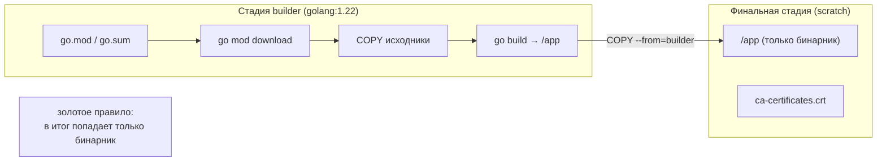
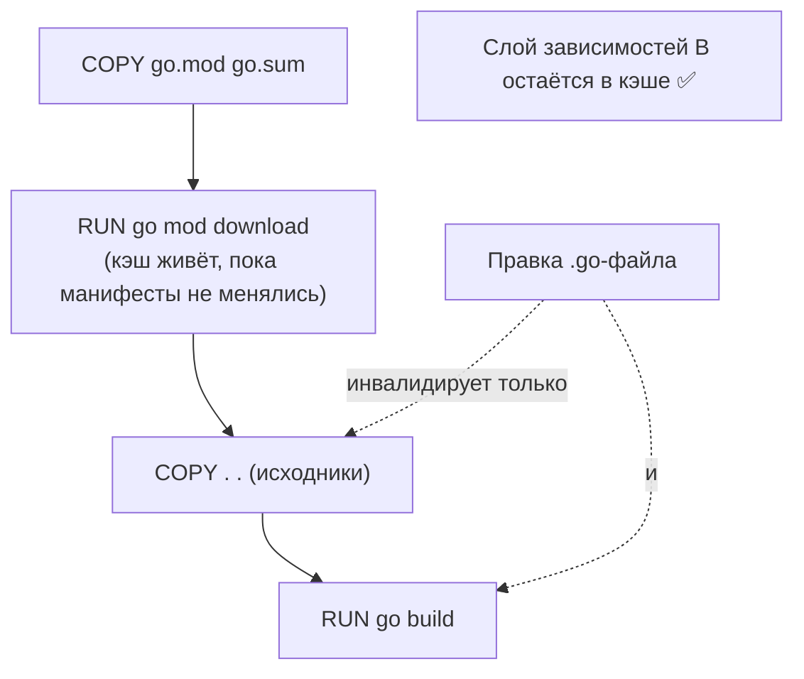

# Эффективный Docker-образ

Главное, что нужно усвоить о контейнеризации Go: компилятор выдаёт **один статически слинкованный бинарник**, которому в идеале не нужно вообще ничего вокруг — ни рантайма, ни системных библиотек, ни интерпретатора. Это позволяет собрать образ, в котором лежит буквально один файл, а его размер измеряется единицами-десятками мегабайт (против сотен у типичного managed-стека). Но чтобы это получить, образ собирают определённым образом: в две стадии и с правильным кэшированием.

В этой главе — анатомия такого образа: multi-stage build, статическая линковка, выбор базового образа, кэширование слоёв. Параллели с .NET тут даны кратко; подробный разбор «почему Go-образ настолько меньше» — в [главе сравнения](./03-comparison-with-dotnet.md).

## Multi-stage build: компилятор отдельно, бинарник отдельно

Наивный Dockerfile кладёт в образ всё подряд: компилятор Go, исходники, кэш модулей, плюс саму программу. Так образ раздувается до сотен мегабайт — компилятор и тулчейн там не нужны после сборки, они лишь занимают место и расширяют поверхность атаки.

Решение — **multi-stage build**: первая стадия (`builder`) на полном образе `golang:1.x` компилирует бинарник, вторая (финальная) стадия начинается с пустого/минимального образа и **копирует из первой только готовый бинарник**. Всё, что было в стадии сборки, в итоговый образ не попадает.

```dockerfile
# ── Стадия 1: сборка ───────────────────────────────────────────────
# Полный образ с компилятором Go и тулчейном. Версию фиксируем явно.
FROM golang:1.22 AS builder

WORKDIR /src

# Сначала только манифесты зависимостей — ради кэша слоёв (см. ниже).
COPY go.mod go.sum ./
RUN go mod download

# Теперь исходники.
COPY . .

# Статическая сборка: без C-зависимостей, со срезанной debug-информацией.
# Указываем целевую платформу явно (по умолчанию = платформа стадии).
RUN CGO_ENABLED=0 GOOS=linux GOARCH=amd64 \
    go build -ldflags="-s -w" -o /app ./cmd/server

# ── Стадия 2: финальный образ ──────────────────────────────────────
# Пустой образ: в нём не будет НИЧЕГО, кроме нашего бинарника.
FROM scratch

# Корневые сертификаты — иначе HTTPS-вызовы из бинарника упадут (см. ниже).
COPY --from=builder /etc/ssl/certs/ca-certificates.crt /etc/ssl/certs/

# Копируем единственный артефакт из стадии сборки.
COPY --from=builder /app /app

# Запуск не от root (UID:GID; в scratch нет /etc/passwd для имени).
USER 65534:65534

ENTRYPOINT ["/app"]
```

Идея ровно та же, что в каноничном Dockerfile для .NET (`SDK`-образ собирает, `aspnet`-образ запускает) — но финальная стадия в Go получается несопоставимо тоньше: там не нужен runtime-образ, достаточно `scratch` или `distroless`.



> **Параллель с .NET:** это прямой аналог двухстадийной сборки `mcr.microsoft.com/dotnet/sdk` → `mcr.microsoft.com/dotnet/aspnet`. Разница не в подходе, а в результате: в .NET вторая стадия всё равно содержит managed-рантайм, в Go — может содержать вообще ничего, кроме вашего файла.

## Статическая линковка: бинарник без зависимостей

Чтобы бинарник можно было положить в пустой `scratch`, он должен быть **полностью самодостаточным** — не дёргать при старте системные `.so`-библиотеки. За это отвечают флаги сборки.

### `CGO_ENABLED=0` — отвязаться от libc

По умолчанию Go может задействовать **cgo** — мост к C-коду. Как только в сборку попадает cgo (например, через стандартные пакеты `net` или `os/user`, которые в некоторых режимах резолвят имена через системный C-резолвер), бинарник начинает **динамически линковаться с libc** хост-системы (обычно glibc). Такой бинарник на `scratch` упадёт сразу: там нет `libc.so`, нет динамического загрузчика — ничего.

`CGO_ENABLED=0` отключает cgo. Тогда Go использует **чистые Go-реализации** (в том числе встроенный DNS-резолвер) и собирает **полностью статический** бинарник без зависимости от libc:

```dockerfile
RUN CGO_ENABLED=0 go build -o /app ./cmd/server
```

Это и есть условие, при котором образ на `scratch` работает. Платой за это иногда называют то, что встроенный резолвер ведёт себя не на 100% идентично системному (нюансы `nsswitch.conf`), но для подавляющего большинства сервисов это незаметно и предпочтительно.

> **Параллель с .NET:** концептуально это близко к разнице «динамически слинкованный нативный код, зависящий от системного glibc» против «самодостаточный артефакт». В .NET аналогичную самодостаточность даёт `--self-contained` (рантайм едет с приложением) и особенно **Native AOT**, где на выходе тоже нативный бинарник; подробнее — в [главе сравнения](./03-comparison-with-dotnet.md).

### `-ldflags="-s -w"` — срезать debug-информацию

Флаги линковщика `-s -w` удаляют из бинарника отладочную информацию:

- `-s` — убирает таблицу символов;
- `-w` — убирает DWARF-отладочную информацию.

Бинарник от этого **уменьшается заметно** — нередко на четверть-треть, в зависимости от приложения. Программа работает идентично; теряется лишь возможность пошаговой отладки (`delve`) и читаемых символов в некоторых трассировках. Для production-образа это стандартная практика; для отладочных сборок флаги опускают.

```dockerfile
RUN CGO_ENABLED=0 go build -ldflags="-s -w" -o /app ./cmd/server
```

> Стектрейсы при панике (с именами функций и номерами строк) `-s -w` **не ломает** — они формируются из отдельной таблицы, а не из DWARF. Так что наблюдаемость через `panic`/`recover` сохраняется.

### Кросс-компиляция: `GOOS` / `GOARCH`

Go умеет собирать под любую целевую ОС/архитектуру с любой машины — это встроено в тулчейн, отдельный кросс-компилятор не нужен. Управляют этим переменные `GOOS` (операционная система) и `GOARCH` (архитектура):

```dockerfile
# Linux x86-64
RUN CGO_ENABLED=0 GOOS=linux GOARCH=amd64 go build -o /app ./cmd/server

# Linux ARM64 (например, AWS Graviton, Apple Silicon под Linux-контейнером)
RUN CGO_ENABLED=0 GOOS=linux GOARCH=arm64 go build -o /app ./cmd/server
```

В Dockerfile целевую платформу часто задают явно — это делает сборку детерминированной независимо от того, на какой машине она запущена. Для мультиархитектурных образов это сочетают с `docker buildx` и встроенными аргументами `TARGETOS`/`TARGETARCH`:

```dockerfile
FROM --platform=$BUILDPLATFORM golang:1.22 AS builder
ARG TARGETOS TARGETARCH
RUN CGO_ENABLED=0 GOOS=$TARGETOS GOARCH=$TARGETARCH \
    go build -ldflags="-s -w" -o /app ./cmd/server
```

> **Параллель с .NET:** `GOOS`/`GOARCH` — это аналог RID (Runtime Identifier, `-r linux-arm64`) в `dotnet publish`. Но кросс-компиляция Go проще и быстрее: не нужны целевые рантаймы, всё делает один тулчейн «из коробки».

## Базовый образ: `scratch`, `alpine` или `distroless`

Раз бинарник самодостаточен, встаёт вопрос — во что его класть. Три типичных варианта, от самого минимального к самому «обжитому».

### `scratch` — абсолютно пустой образ

`scratch` — это специальный «нулевой» образ: в нём **нет ничего** (ни файлов, ни shell, ни libc). Вы кладёте туда только свой бинарник.

```dockerfile
FROM scratch
COPY --from=builder /app /app
ENTRYPOINT ["/app"]
```

- ✅ Минимальный размер: итоговый образ ≈ размеру самого бинарника (единицы МБ для простого сервиса, больше — для крупного).
- ✅ Минимальная поверхность атаки: нет shell — нечего эксплуатировать, нет пакетов — нечему иметь CVE.
- ❌ Нет `ca-certificates`, `tzdata`, `/etc/passwd`, нет shell для `docker exec` и отладки. Всё, что нужно, придётся **доложить вручную** (см. ниже).

### `alpine` — крошечный Linux с shell

`alpine` — это полноценный минималистичный дистрибутив (на базе **musl libc**), размером порядка ~5 МБ. В нём есть пакетный менеджер `apk`, shell и базовые утилиты.

```dockerfile
FROM alpine:3.20
RUN apk add --no-cache ca-certificates tzdata
COPY --from=builder /app /app
ENTRYPOINT ["/app"]
```

- ✅ Есть shell (`/bin/sh`) — удобно для `docker exec`, healthcheck-скриптов, отладки.
- ✅ Легко доставить `ca-certificates`/`tzdata` одной командой `apk add`.
- ❌ Чуть больше `scratch` и чуть шире поверхность атаки (есть пакеты → бывают CVE).
- ❌ Важный нюанс: alpine — это **musl**, а не glibc. Чистый статический Go-бинарник (`CGO_ENABLED=0`) на musl работает прекрасно. Но если вам **нужен** cgo, то под alpine надо собирать с musl-совместимым toolchain — иначе динамически слинкованный с glibc бинарник там не запустится.

### `distroless` — без shell, но «обжитой»

`gcr.io/distroless/static` от Google — золотая середина: образ содержит `ca-certificates`, актуальные часовые пояса (`tzdata`), `/etc/passwd` с пользователем `nonroot`, но **не содержит shell и пакетного менеджера**.

```dockerfile
FROM gcr.io/distroless/static-debian12:nonroot
COPY --from=builder /app /app
USER nonroot:nonroot
ENTRYPOINT ["/app"]
```

- ✅ Сертификаты и `tzdata` уже внутри — ничего докладывать не надо.
- ✅ Нет shell → существенно безопаснее, чем alpine (нельзя получить интерактивную оболочку при компрометации).
- ✅ Есть готовый непривилегированный пользователь `nonroot`.
- ❌ Нет shell → отладка через `docker exec` невозможна напрямую (для этого есть отдельные `:debug`-теги).
- Размер: немного больше `scratch`, но всё ещё на порядок меньше runtime-образов managed-языков.

### Что выбрать

- **`distroless` (static)** — разумный дефолт для большинства production-сервисов: безопасно (нет shell), сертификаты и таймзоны на месте, есть `nonroot`-пользователь.
- **`scratch`** — когда нужен абсолютный минимум и вы готовы вручную доложить сертификаты/таймзоны и обойтись без отладки изнутри контейнера.
- **`alpine`** — когда нужен shell внутри образа (healthcheck-скрипты, отладка, миграционные утилиты рядом) или когда без cgo не обойтись.

| Базовый образ | Размер (порядок) | Shell | CA-сертификаты | tzdata | Лучше всего для |
| --- | --- | --- | --- | --- | --- |
| `scratch` | ≈ размер бинарника | ❌ | ❌ (копировать) | ❌ (копировать) | абсолютный минимум |
| `distroless/static` | немного больше scratch | ❌ | ✅ встроены | ✅ встроены | безопасный дефолт |
| `alpine` | ~5 МБ + бинарник | ✅ | через `apk add` | через `apk add` | нужен shell / cgo |

### Не забыть: сертификаты, часовые пояса, пользователь

Для `scratch` (и местами `alpine`) типичны три «забытые мелочи», на которых сервис падает в проде:

1. **CA-сертификаты.** Без файла корневых сертификатов любой исходящий HTTPS-вызов (к внешнему API, БД по TLS) упадёт с ошибкой проверки сертификата. Для `scratch` его копируют из стадии сборки:

   ```dockerfile
   COPY --from=builder /etc/ssl/certs/ca-certificates.crt /etc/ssl/certs/
   ```

2. **Часовые пояса (`tzdata`).** Если код использует `time.LoadLocation("Europe/Moscow")`, на `scratch` без базы зон это вернёт ошибку. Варианты: скопировать `tzdata` в образ **или** встроить базу зон прямо в бинарник импортом `import _ "time/tzdata"` (тогда внешний файл не нужен — удобно именно для `scratch`).

3. **Непривилегированный пользователь.** Запускать процесс от root в контейнере — плохая практика. В `scratch` нет `/etc/passwd`, поэтому пользователя задают числовым `UID:GID` (например, `USER 65534:65534` — это `nobody`); в `distroless` есть готовый `USER nonroot:nonroot`.

## Кэширование слоёв: порядок `COPY` решает всё

Docker кэширует слои по содержимому. Любое изменение инвалидирует **этот слой и все последующие**. Самая частая ошибка — копировать весь исходный код **до** установки зависимостей: тогда правка одной строки кода заставляет Docker заново скачивать **все** зависимости, потому что слой с `go mod download` идёт после `COPY . .` и тоже инвалидируется.

Правильный порядок — **от редко меняющегося к часто меняющемуся**. Файлы `go.mod`/`go.sum` меняются редко (только при смене зависимостей), а исходный код — постоянно. Значит, манифесты копируем и скачиваем зависимости **первыми**, отдельным слоем, а исходники — **потом**:

```dockerfile
# ✅ Правильно: зависимости кэшируются отдельным слоём
COPY go.mod go.sum ./
RUN go mod download          # этот слой переиспользуется, пока go.mod/go.sum не изменились
COPY . .                     # правки кода инвалидируют только отсюда и ниже
RUN go build -o /app ./cmd/server
```

```dockerfile
# ❌ Неправильно: любая правка кода = повторное скачивание ВСЕХ зависимостей
COPY . .
RUN go mod download
RUN go build -o /app ./cmd/server
```



> **Параллель с .NET:** это тот же приём, что и в Dockerfile для .NET, где сначала копируют `*.csproj` и делают `dotnet restore`, и лишь затем копируют остальной код перед `dotnet build`/`publish`. Мотив идентичен: вынести медленный шаг восстановления зависимостей в стабильно кэшируемый слой.

### `--mount=type=cache` для кэша компилятора

Кэш слоёв переиспользует **готовый слой целиком**, но если слой всё же пересобирается (например, поменялся `go.sum`), `go mod download` и компиляция стартуют с нуля. Чтобы между сборками сохранялись **кэш модулей** (`$GOPATH/pkg/mod`) и **кэш сборки** (`$GOCACHE`, скомпилированные пакеты), используют BuildKit-фичу `--mount=type=cache` — персистентный кэш, не попадающий в слои образа:

```dockerfile
# syntax=docker/dockerfile:1
FROM golang:1.22 AS builder
WORKDIR /src

COPY go.mod go.sum ./
RUN --mount=type=cache,target=/go/pkg/mod \
    go mod download

COPY . .
RUN --mount=type=cache,target=/go/pkg/mod \
    --mount=type=cache,target=/root/.cache/go-build \
    CGO_ENABLED=0 go build -ldflags="-s -w" -o /app ./cmd/server
```

Здесь два кэша:

- `/go/pkg/mod` — скачанные модули (не качать повторно одни и те же версии);
- `/root/.cache/go-build` — кэш компиляции Go (не перекомпилировать неизменившиеся пакеты).

Этот кэш **не увеличивает** финальный образ — он существует только во время сборки на стороне BuildKit. На повторных сборках после изменения кода это резко ускоряет шаг компиляции, так как Go перекомпилирует только затронутые пакеты.

> Строка `# syntax=docker/dockerfile:1` в начале включает современный синтаксис Dockerfile (BuildKit), необходимый для `--mount`. В свежих версиях Docker BuildKit активен по умолчанию.

> **Параллель с .NET:** аналогично можно монтировать кэш NuGet (`--mount=type=cache,target=/root/.nuget/packages`), чтобы `dotnet restore` не качал пакеты заново на каждой пересборке слоя. Тот же принцип «персистентный кэш сборки отдельно от слоёв образа».

## Реалистичные размеры образов

Точные цифры **зависят от приложения** (объём кода, число и «вес» зависимостей, встроенные ассеты), поэтому ниже — порядки величин, а не обещания:

| Что | Порядок размера | Комментарий |
| --- | --- | --- |
| Сам Go-бинарник (простой сервис, `-s -w`) | единицы–десятки МБ | растёт с числом зависимостей; крупные сервисы — десятки МБ |
| Образ на `scratch` | ≈ размер бинарника (единицы–десятки МБ) | сверху лишь сертификаты/таймзоны, если добавили |
| Образ на `distroless/static` | бинарник + единицы МБ | сертификаты и tzdata уже внутри |
| Образ на `alpine` | бинарник + ~5 МБ | плюс то, что доставили через `apk` |
| Образ-стадия `golang:1.x` (builder) | сотни МБ–~1 ГБ | в финальный образ **не попадает** благодаря multi-stage |

Главный вывод: благодаря multi-stage гигабайтная стадия сборки остаётся «за бортом», а в реестр и на узлы едет компактный финальный образ. Для сравнения с типичными размерами ASP.NET-образов — см. таблицу в [главе сравнения](./03-comparison-with-dotnet.md).

## Итог

- **Multi-stage build** — основа: стадия `golang:1.x` компилирует бинарник, финальная стадия (`scratch`/`distroless`/`alpine`) копирует из неё **только готовый файл**. Компилятор, исходники и кэш в итоговый образ не попадают.
- **Статическая линковка** делает бинарник самодостаточным: `CGO_ENABLED=0` отвязывает от libc (условие для `scratch`), `-ldflags="-s -w"` срезает debug-информацию и заметно уменьшает размер; кросс-компиляция — через `GOOS`/`GOARCH` без отдельного тулчейна.
- **Базовый образ**: `distroless/static` — безопасный дефолт (нет shell, сертификаты и tzdata внутри); `scratch` — абсолютный минимум (доложить `ca-certificates`/`tzdata`/пользователя вручную); `alpine` — когда нужен shell или cgo (помнить про musl).
- **Кэширование слоёв**: копировать `go.mod`/`go.sum` и делать `go mod download` **до** `COPY . .`, иначе любая правка кода заново тянет все зависимости; `--mount=type=cache` сохраняет кэш модулей и компиляции между сборками, не раздувая образ.
- **Размеры зависят от приложения**, но порядок — единицы-десятки МБ для финального образа против гигабайтной стадии сборки, которая благодаря multi-stage в реестр не едет.

Дальше — что и почему исключать из build-контекста и из репозитория через `.dockerignore` и `.gitignore`.

---

[⌂ Главная](../../README.md) · [↑ Раздел](./README.md) · [← Предыдущий: Раздел 12. Развертывание, Docker и Инфраструктура](./README.md) · [→ Следующий: Игнор-файлы: .gitignore и .dockerignore](./02-ignore-files.md)
