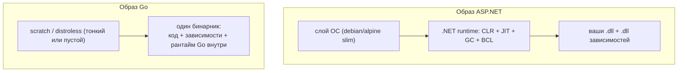

# Сравнение с .NET

Это итоговая глава раздела — консолидированный «мостик» между моделями развёртывания .NET и Go. В предыдущих главах мы собирали компактный образ; здесь явно проговариваем, **почему** Go-образ выходит на порядок меньше ASP.NET-образа и **почему** Go-бинарник стартует мгновенно там, где .NET тратит время на JIT-warmup. И, что важно для честности, где .NET со своими Native AOT и self-contained сближается с моделью Go.

Две большие оси сравнения: **устройство и размер образа** и **модель исполнения (JIT vs AOT)**. Они связаны: обе вытекают из одного фундаментального различия — Go компилирует в нативный самодостаточный бинарник заранее, а .NET по умолчанию везёт с собой managed-рантайм и JIT-компилирует код при старте.

## Устройство и размер образов

### Как устроен образ ASP.NET

Образ типичного ASP.NET-сервиса несёт **.NET runtime**: managed-рантайм CLR, JIT-компилятор, сборщик мусора и базовые библиотеки (BCL). Поверх рантайма лежат ваши `.dll` (результат `dotnet publish`) и `.dll` зависимостей. Базовый образ — что-то вроде `mcr.microsoft.com/dotnet/aspnet`, который сам по себе содержит рантайм и часть ОС-окружения.

То есть в образе физически присутствуют:

- слой ОС (обычно Debian/Ubuntu slim или Alpine);
- .NET runtime (CLR + JIT + GC + BCL);
- ваши сборки и сборки зависимостей.

### Как устроен образ Go

В образе Go — **один статически слинкованный бинарник** и больше ничего обязательного. Нет отдельного рантайма как слоя: GC и планировщик Go вкомпилированы **внутрь** самого бинарника. Базовый образ может быть пустым (`scratch`) или минимальным (`distroless`/`alpine`) — подробно в [главе про образ](./01-docker-image.md).

То есть в образе физически присутствует:

- (опционально) тонкий базовый слой `distroless`/`alpine` — или вовсе `scratch`;
- единственный бинарник, в котором уже всё: код, зависимости, рантайм Go.

### Размеры: порядки величин

Точные цифры **сильно зависят** от приложения, набора зависимостей, базового образа и версии — поэтому ниже именно **порядки**, а не точные значения:

| Что | Порядок размера образа | Из чего складывается |
| --- | --- | --- |
| ASP.NET на `aspnet`-образе | ~100–250+ МБ | слой ОС + .NET runtime + ваши сборки |
| ASP.NET, **Native AOT** на distroless | заметно меньше (десятки МБ) | нативный бинарник без полноценного рантаймного слоя |
| Go на `alpine` | бинарник + ~5 МБ | минимальный Linux + один бинарник |
| Go на `distroless/static` | бинарник + единицы МБ | минимальный слой + бинарник |
| Go на `scratch` | ≈ размер бинарника (единицы–десятки МБ) | только бинарник (+ сертификаты, если добавили) |

Грубый ориентир: «ванильный» ASP.NET-образ — это **сотни мегабайт**, тогда как Go-образ — **единицы-десятки мегабайт**. Разница — это в первую очередь вес managed-рантайма и BCL, которых в Go-образе попросту нет (они «растворены» в бинарнике, и линковщик включает только реально используемый код).

> **Параллель с .NET:** именно поэтому в Go-сообществе размер образа — частый предмет гордости и оптимизации. В .NET-мире к компактности идут через `--self-contained` + trimming или Native AOT; «из коробки» же образ крупнее, потому что несёт рантайм отдельной сущностью.

## JIT vs AOT: старт и cold start

### .NET: JIT по умолчанию, warmup при старте

.NET по умолчанию исполняет код через **JIT-компиляцию**: при запуске CLR загружает IL (промежуточный язык) из сборок и компилирует «горячие» методы в нативный код **на лету, во время работы**. Из этого следует:

- **Warmup.** Первые вызовы методов медленнее: их ещё нужно скомпилировать. Пиковая производительность достигается не мгновенно, а после прогрева.
- **Cold start.** Холодный старт процесса включает инициализацию рантайма и начальную JIT-компиляцию — это ощутимо, например, для serverless-функций и сценариев агрессивного авто-масштабирования, где новый инстанс должен начать обслуживать трафик как можно быстрее.

Исторически для смягчения есть промежуточные технологии (ReadyToRun / AOT-предкомпиляция части кода, профильная оптимизация), но базовая модель — managed IL + JIT.

### Go: всегда AOT, мгновенный старт

Go **всегда** компилируется **заранее (Ahead-of-Time)** в нативный машинный код. Никакого IL и JIT во время выполнения нет: бинарник уже содержит готовый машинный код.

- **Нет warmup-фазы JIT.** Код уже скомпилирован; «прогрев» в смысле .NET отсутствует (остаются обычные эффекты прогрева кэшей CPU и т.п., но это другого порядка).
- **Мгновенный cold start.** Процесс — это просто запуск нативного бинарника; инициализация рантайма Go минимальна. Это делает Go особенно привлекательным для **serverless**, **CLI-утилит** и **быстрого горизонтального масштабирования**, где время от «запустить инстанс» до «обслуживать запрос» критично.

| Аспект | .NET (по умолчанию) | Go |
| --- | --- | --- |
| Модель компиляции | IL + JIT во время работы | AOT в нативный код заранее |
| Warmup | да (первые вызовы компилируются) | нет JIT-warmup |
| Cold start | ощутимый (рантайм + JIT) | минимальный (запуск бинарника) |
| Пиковая оптимизация | JIT может оптимизировать под рантайм-профиль | оптимизация на этапе компиляции |
| Артефакт | IL-сборки + рантайм | один нативный бинарник |

> Нюанс в пользу JIT: компиляция «на лету» **в принципе** способна оптимизировать код под фактическое поведение и конкретный CPU во время работы (профиль-ориентированная оптимизация). AOT оптимизирует на этапе сборки и под заданную целевую архитектуру. На практике для типичных сервисов решает не это, а предсказуемость старта и размер образа — и тут Go выигрывает по умолчанию.

## Native AOT и self-contained: .NET сближается с Go

Важно не рисовать карикатуру «.NET тяжёлый, Go лёгкий». Современный .NET умеет приближаться к модели Go — просто это **опции**, а не поведение по умолчанию:

- **Self-contained publish** (`dotnet publish --self-contained`): рантайм едет **вместе** с приложением, целевой машине не нужен предустановленный .NET. Это устраняет зависимость от рантайма в системе (как у Go), но сам артефакт всё ещё включает managed-рантайм и крупнее голого бинарника; помогает **trimming** (обрезка неиспользуемого кода).
- **Native AOT** (`dotnet publish` с `PublishAot=true`): компиляция **заранее в нативный самодостаточный бинарник** — концептуально это и есть модель Go. Результат: нет JIT, быстрый cold start, существенно меньший образ (можно класть на distroless). Цена — ограничения: урезанная динамическая рефлексия и `Reflection.Emit`, проблемы с кодом, который генерирует/загружает типы во время выполнения; не все библиотеки AOT-совместимы.

То есть направление, в котором .NET «догоняет» преимущества Go по развёртыванию, — это Native AOT. И обратите внимание на симметрию ограничений: Native AOT теряет часть рантайм-рефлексии — ровно то, чего у Go и так «нет в той же мере» (см. ниже).

> **Параллель с .NET:** если сформулировать одной фразой — **то, что в .NET является осознанной опцией (Native AOT / self-contained + trimming), в Go является поведением по умолчанию**. Go изначально спроектирован под «один нативный бинарник без рантайма», поэтому к компактному образу и быстрому старту вы приходите, ничего специально не включая.

## Чего это стоит: вывод

«Маленький образ и мгновенный старт» в Go — не бесплатный универсальный выигрыш, а следствие дизайн-выбора со своей ценой:

- ✅ **Один самодостаточный бинарник** — простое развёртывание: нет «привезти нужную версию рантайма», нет рассинхрона рантайма и приложения.
- ✅ **Компактный образ** (`scratch`/`distroless`) — быстрее push/pull, меньше поверхность атаки, дешевле хранение и трафик в реестре.
- ✅ **AOT и мгновенный cold start** — выигрыш для serverless, CLI и агрессивного масштабирования.
- ❌ **Нет богатого managed-рантайма с динамикой.** В Go нет полноценной рантайм-рефлексии/динамической генерации кода уровня .NET (`Reflection.Emit`, динамическая загрузка сборок, JIT-специализация). Многие задачи, которые в .NET решает рантайм-рефлексия (например, ORM-маппинг, DI-контейнеры на рефлексии, сериализация «по типу на лету»), в Go чаще решаются **кодогенерацией** на этапе сборки — что, к слову, и роднит Go с миром Native AOT, где рефлексия тоже ограничена.
- ❌ **Меньше рантайм-оптимизаций под профиль.** AOT оптимизирует на этапе сборки и не подстраивается под фактический рантайм-профиль так, как это **может** делать JIT.

Иначе говоря, Go обменивает гибкость и динамические возможности тяжёлого managed-рантайма на простоту, предсказуемость и компактность развёртывания. Для сетевых сервисов, контейнеров и инфраструктурных утилит — целевой ниши Go — это обычно выгодный обмен, и именно поэтому компактный быстростартующий образ заслуженно считается одним из сильных мест Go. А .NET, добавив Native AOT, показывает, что к этой же точке можно прийти и с другой стороны — ценой части динамических возможностей, от которых Go отказался изначально.

## Итог

- **Устройство образа.** ASP.NET-образ несёт .NET runtime отдельным слоем (CLR + JIT + GC + BCL) поверх ОС; Go-образ содержит один бинарник, в который рантайм Go вкомпилирован, — базовый образ может быть `scratch`.
- **Размер.** Порядки: ASP.NET — сотни МБ, Go — единицы-десятки МБ (зависит от приложения). Разница — это в основном вес managed-рантайма и BCL, которых в Go-образе нет как отдельной сущности.
- **JIT vs AOT.** .NET по умолчанию JIT-компилирует при старте (warmup, ощутимый cold start); Go всегда AOT — нативный бинарник, мгновенный старт, что ценно для serverless и масштабирования.
- **Сближение.** Native AOT и self-contained + trimming приближают .NET к модели Go: то, что в .NET опция, в Go — поведение по умолчанию. Симметрично и ограничение: Native AOT режет рантайм-рефлексию — то, чего у Go и так «нет в той же мере».
- **Цена.** Go меняет богатый динамический managed-рантайм на простоту и компактность развёртывания; задачи рефлексии чаще решаются кодогенерацией на этапе сборки.

На этом раздел о развёртывании, Docker и инфраструктуре завершён. Вы умеете собирать компактный multi-stage-образ со статически слинкованным бинарником, правильно его кэшировать и игнорировать лишнее, и понимаете, чем модель развёртывания Go принципиально отличается от .NET — и где они сходятся.

---

[⌂ Главная](../../README.md) · [↑ Раздел](./README.md) · [← Предыдущий: Игнор-файлы: .gitignore и .dockerignore](./02-ignore-files.md)
