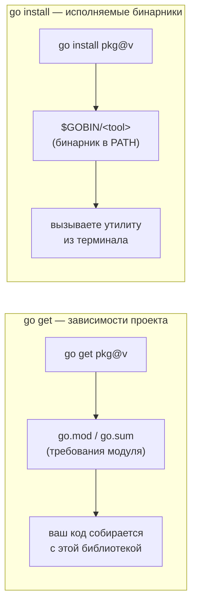

# Управление пакетами и инструментами

В .NET граница между «добавить библиотеку в проект» и «поставить себе утилиту командной строки» проведена чётко и давно: первое — это `dotnet add package` (NuGet-зависимость, попадает в `.csproj`), второе — `dotnet tool install` (CLI-инструмент вроде `dotnet-ef`). Команды разные, и спутать их сложно.

В Go эта же граница есть, но исторически она была источником путаницы, потому что **обе** операции долго делались одной командой — `go get`. Современный Go (модули, Go 1.16+) навёл здесь порядок, и сегодня правило простое и его важно усвоить сразу: **`go get` управляет зависимостями модуля, `go install` ставит исполняемые бинарники.** Эта глава раскладывает по полочкам тулчейн, который вы будете трогать каждый день.

## `go get` против `go install`: разделение ролей

Это самая частая точка спотыкания у новичков в Go. Две команды решают **разные** задачи:

- **`go get`** — управляет **зависимостями текущего модуля**. Он добавляет/обновляет/удаляет записи в `go.mod` и пересчитывает `go.sum`. Его цель — «моему коду нужна вот эта библиотека вот такой версии». Это операция **над проектом**, выполняется внутри модуля.
- **`go install`** — компилирует пакет-команду (`package main`) и кладёт получившийся **исполняемый бинарник** в `$GOBIN`. Его цель — «хочу, чтобы у меня в `PATH` появилась вот эта утилита». Это операция **над окружением**, а не над проектом: `go.mod` она не трогает.

```bash
# Зависимость кода: правит go.mod и go.sum
go get github.com/google/uuid@latest
go get github.com/google/uuid@v1.6.0   # конкретная версия
go get github.com/google/uuid@none     # удалить зависимость

# Установка инструмента: бинарник в $GOBIN, go.mod не меняется
go install github.com/golangci/golangci-lint/cmd/golangci-lint@latest
go install golang.org/x/tools/cmd/stringer@latest
```

Обязательный суффикс `@version` у `go install` — не косметика. Он говорит «собери инструмент в *изоляции*, по его собственному `go.mod`, не подмешивая зависимости и версии моего текущего проекта». Поэтому `go install tool@version` можно запускать откуда угодно, хоть из пустой папки, — он самодостаточен.

> Историческая справка, чтобы понимать старые гайды: до Go 1.16 `go get` умел и то, и другое — мог поставить бинарник в `GOPATH/bin` как побочный эффект. В Go 1.16 установку бинарников из `go get` убрали, а с Go 1.18 `go get` **вне модуля** вообще запрещён. Если в туториале видите `go get` для установки CLI-утилиты — это устаревший текст; современный способ — `go install`.

> **Параллель с .NET:** `go get` — это прямой аналог `dotnet add package` (или ручного `<PackageReference>` в `.csproj`): «добавь библиотеку в мой проект». А `go install pkg@version` — аналог `dotnet tool install --global toolName`: «поставь мне CLI-утилиту в систему». В .NET эти роли никогда не путались, потому что под них с самого начала были отдельные команды; в Go путаница возникала из-за общего исторического `go get`, и именно её разделение 1.16+ окончательно устранило.



## Инструменты как зависимости проекта

Отдельная задача: некоторые инструменты должны быть привязаны **к проекту и его версии**, а не «глобально к разработчику». Классика — генераторы кода (`stringer`, `mockery`, `protoc-gen-go`), линтеры, мигратор БД. Если разработчик A собирал проект с `mockery v2.40`, а разработчик B — с `v2.20`, сгенерированный код может разойтись. Хочется зафиксировать версию инструмента вместе с кодом, как это делает `dotnet-tools.json`.

### Исторический паттерн: `tools.go`

До Go 1.24 канонический трюк выглядел так. Создавали файл (обычно `tools/tools.go`) с тегом сборки, который исключает его из обычной компиляции, но заставляет `go mod` учитывать импорты как зависимости:

```go
//go:build tools

package tools

import (
    _ "github.com/vektra/mockery/v2"
    _ "golang.org/x/tools/cmd/stringer"
)
```

Тег `//go:build tools` означает «этот файл компилируется, только когда явно запрошен тег `tools`» — то есть никогда при обычной сборке. Но импорты с пустым идентификатором `_` всё равно попадают в `go.mod` после `go mod tidy`, и версии инструментов оказываются зафиксированы в `go.sum`. Дальше инструмент запускали через `go run`:

```bash
go run github.com/vektra/mockery/v2 --all
```

Это работало, но было обходным манёвром: фиктивный пакет, неочевидный тег, импорты «ради побочного эффекта».

### Современный способ: директива `tool` в `go.mod` (Go 1.24)

**Начиная с Go 1.24** язык получил для этого первоклассную поддержку — директиву `tool` прямо в `go.mod`. Добавление инструмента:

```bash
go get -tool github.com/vektra/mockery/v2@v2.43.2
```

Это добавит в `go.mod` секцию:

```go
// go.mod
module example.com/myapp

go 1.24

tool github.com/vektra/mockery/v2

require (
    github.com/vektra/mockery/v2 v2.43.2
    // ...
)
```

Запуск — через новую подкоманду `go tool <name>`:

```bash
go tool mockery --all
go tool                      # список всех инструментов проекта
```

`go tool` сам соберёт инструмент нужной версии (с кэшированием в build-кэше) и запустит его. Версия инструмента теперь версионируется вместе с проектом в `go.mod`/`go.sum`, а файл `tools.go` больше не нужен. Это ровно тот сценарий, который в Разделе 7 (кодогенерация) мы используем для `//go:generate`: директивы генерации вызывают инструменты, а директива `tool` гарантирует, что у всех в команде эти инструменты одной версии.

> **Параллель с .NET:** директива `tool` в `go.mod` + `go tool` — это концептуальный аналог **local tools** в .NET: `dotnet tool install` (без `-g`) + манифест `.config/dotnet-tools.json`, запуск через `dotnet toolName`. В обоих случаях версия инструмента живёт в репозитории и одинакова у всей команды. Старый `tools.go` тогда соответствует эпохе, когда local tools ещё не было и приходилось городить обёртки. Разница: в Go инструмент — это обычный Go-пакет, собираемый из исходников тем же тулчейном, тогда как dotnet tool — это упакованный NuGet-пакет.

| Подход | Где фиксируется версия | Как запускать | Статус |
| --- | --- | --- | --- |
| `go install tool@v` (глобально) | нигде в проекте | `tool` (из `$GOBIN`) | для личных утилит, не для команды |
| `tools.go` + `//go:build tools` | `go.mod`/`go.sum` (через `_`-импорт) | `go run <import-path>` | легаси (до 1.24) |
| директива `tool` в `go.mod` | `go.mod`/`go.sum` (директива `tool`) | `go tool <name>` | ✅ современный (Go 1.24+) |

## `GOPATH`, `GOBIN` и модульный кэш

Несколько переменных и каталогов, про которые полезно знать, даже если в эпоху модулей трогать их приходится редко:

- **`GOPATH`** (по умолчанию `~/go`) — корневой рабочий каталог Go. В до-модульную эру здесь жил *весь* исходный код в `GOPATH/src`, и расположение в файловой системе определяло import-путь. С модулями (Go 1.11+) это в прошлом: код проекта теперь лежит где угодно, а `GOPATH` сжался до служебной роли — внутри него хранятся кэш и установленные бинарники.
- **`GOBIN`** — куда `go install` кладёт бинарники. Если не задан, по умолчанию `GOPATH/bin` (обычно `~/go/bin`). Этот каталог нужно добавить в `PATH`, чтобы установленные инструменты вызывались по имени.
- **Модульный кэш** (`GOPATH/pkg/mod`) — сюда скачиваются и распаковываются все версии всех зависимостей, общие для всех проектов на машине. Кэш доступен только на чтение; чистить его принудительно — `go clean -modcache`. Целостность скачанного проверяется по `go.sum` и (опционально) через checksum database `sum.golang.org`.

```bash
go env GOPATH GOBIN GOMODCACHE   # посмотреть текущие значения
go env -w GOBIN=$HOME/bin        # переопределить (пишет в env-файл Go)
```

> **Параллель с .NET:** глобальный пакетный кэш NuGet (`~/.nuget/packages`) — прямой аналог модульного кэша Go (`GOPATH/pkg/mod`): одна общая копия каждой версии пакета на машину. `GOBIN` соответствует каталогу глобальных dotnet-tools (`~/.dotnet/tools`), который вы тоже добавляете в `PATH`. А вот `GOPATH/src` времён до-модульного Go аналога в .NET не имеет — в .NET расположение проекта в ФС никогда не было привязано к идентификатору сборки, тогда как в старом Go import-путь *выводился* из пути на диске. Это была одна из самых неожиданных особенностей старого Go для пришедших из .NET, и модули её устранили.

## Остальной тулчейн: `tidy`, `vet`, `fmt`

Эти команды — часть единого бинарника `go`, и в зрелом проекте они прогоняются постоянно (в pre-commit хуках и в CI):

- **`go mod tidy`** — приводит `go.mod`/`go.sum` в согласованное состояние: добавляет всё, что реально импортируется в коде, и убирает то, что больше не используется. Запускайте после любых изменений в импортах. Аналог здравого смысла «убери неиспользуемые `<PackageReference>`», только автоматический и обязательный к чистоте.
- **`go vet`** — встроенный статический анализатор подозрительных конструкций: неправильные строки формата `Printf`, заведомо недостижимый код, копирование структур с мьютексом, забытый `cancel` у `context` (см. Раздел 3) и десятки других проверок. Это не линтер стиля, а детектор вероятных багов. Часть `go test` запускает подмножество `vet` автоматически.
- **`go fmt`** (обёртка над `gofmt`) — форматирует код по **единственно правильному** канону Go. Здесь ключевое отличие от .NET: стиль форматирования в Go **не настраивается** — нет аналога `.editorconfig`-войн про скобки и отступы. Любой Go-код в мире выглядит одинаково, и это сознательное решение языка.

```bash
go mod tidy        # синхронизировать зависимости с реальными импортами
go vet ./...       # статический анализ всего модуля
go fmt ./...       # отформатировать (gofmt) весь модуль
```

Помимо встроенного `go vet`, стандарт сообщества для более глубокого анализа — **`staticcheck`** (часть набора `honnef.co/go/tools`), который ловит куда больше: мёртвый код, неэффективные конструкции, тонкие баги конкурентности. Его обычно ставят как инструмент проекта (через директиву `tool`) и запускают в CI. Детальное сравнение `gofmt`/`go vet`/`staticcheck` с `dotnet format` и Roslyn-анализаторами — в [главе сравнения](./04-comparison-with-dotnet.md).

> **Параллель с .NET:** `go vet` ≈ встроенные Roslyn-анализаторы (CA-правила), `staticcheck` ≈ более строгие сторонние анализаторы (StyleCop, SonarAnalyzer), а `go fmt`/`gofmt` ≈ `dotnet format` — но с принципиальной разницей: `dotnet format` подчиняется вашему `.editorconfig`, то есть стиль конфигурируем, а `gofmt` навязывает один глобальный стиль без опций. В Go договариваться о стиле не нужно — он уже решён за вас.

## Итог

- **`go get` ≠ `go install`.** `go get` управляет **зависимостями модуля** (правит `go.mod`/`go.sum`), `go install pkg@version` ставит **исполняемый бинарник** в `$GOBIN` и проекта не трогает. Это разделение появилось в Go 1.16+; старые гайды с `go get` для установки утилит устарели.
- **Инструменты как зависимости проекта**: исторически — паттерн `tools.go` с `//go:build tools` и запуск через `go run`; **с Go 1.24** — первоклассная директива `tool` в `go.mod` (`go get -tool ...`) и запуск через `go tool <name>`. Версия инструмента фиксируется вместе с кодом.
- **`GOPATH`** в эпоху модулей сжался до служебной роли (кэш + бинарники); **`GOBIN`** — куда ставятся утилиты (добавьте в `PATH`); **модульный кэш** (`GOPATH/pkg/mod`) — общий read-only кэш зависимостей с проверкой по `go.sum`.
- **`go mod tidy`/`go vet`/`go fmt`** — части единого тулчейна `go`; `gofmt` навязывает **неконфигурируемый** канон форматирования, а стандарт более глубокого анализа сообщества — `staticcheck`.

Дальше — про отладку: почему стандарт Go это Delve, а не gdb, и как инспектировать горутины.

---

[⌂ Главная](../../README.md) · [↑ Раздел](./README.md) · [← Предыдущий: Обзор раздела](./README.md) · [→ Следующий: Отладка: Delve](./02-debugging-delve.md)
