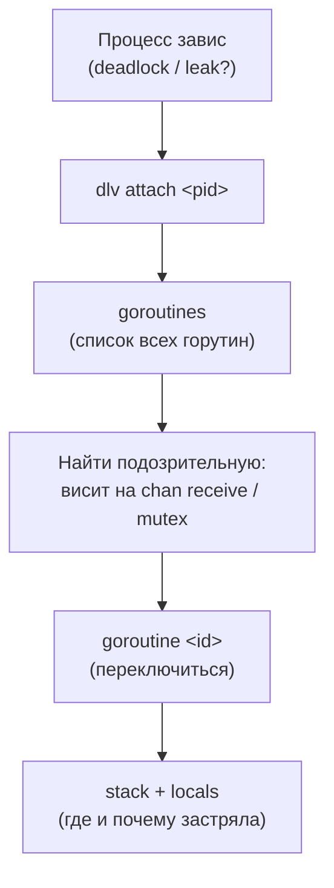

# Отладка: Delve

В .NET отладка — это нечто само собой разумеющееся и неотделимое от IDE: вы ставите точку останова в Visual Studio или Rider, жмёте F5, и интегрированный отладчик (`vsdbg` под капотом) разворачивает перед вами стек, локальные переменные, окно потоков и Watch. Отладчик ощущается частью платформы.

В Go всё иначе по форме, но похоже по сути. Отладчик здесь — это **отдельный CLI-инструмент под названием Delve** (бинарник `dlv`), который не входит в дистрибутив Go и ставится отдельно. При этом именно Delve — безоговорочный стандарт: его используют под капотом и VS Code, и GoLand. Эта глава объясняет, почему отладчик в Go отдельный, почему это не gdb, и как им пользоваться — от командной строки до удалённой отладки контейнеров.

## Почему Delve, а не gdb

Технически Go-бинарник можно открыть в gdb — но делать этого не стоит, и официальная документация прямо предупреждает: gdb **плохо понимает рантайм Go**. Причина в том, что Go — это не «C с GC». У него собственная рантайм-модель, которую gdb, заточенный под нативные потоки C/C++, интерпретирует неверно:

- **Горутины — не потоки ОС.** gdb знает про потоки операционной системы, а в Go тысячи горутин мультиплексируются на горстку потоков планировщиком GMP (см. [Раздел 3](../03-concurrency/01-goroutines-and-scheduler.md)). Для gdb горутина невидима как сущность — он видит лишь потоки, на которых они в данный момент исполняются. Список «потоков» в gdb не равен списку горутин.
- **Динамический стек горутины.** Стек горутины растёт и перемещается в памяти (resizable stacks); gdb с его моделью фиксированного стека на это не рассчитан и может разворачивать стек неверно.
- **Каналы, дефер, паника, планировщик** — внутренние структуры рантайма, про которые gdb ничего не знает и потому не может показать осмысленно.

**Delve написан специально для Go и знает про всё перечисленное.** Он понимает горутины как первоклассные объекты, корректно разворачивает динамические стеки, умеет показывать состояние каналов и дефер-стек. Поэтому в Go-мире вопрос «gdb или Delve» решён однозначно в пользу Delve.

> **Параллель с .NET:** представьте, что вы пытаетесь отлаживать .NET-приложение нативным отладчиком, который видит только потоки ОS и адреса, но ничего не знает про управляемые объекты, GC-кучу, `async`-стейт-машины и логические стеки `Task`. Толку было бы мало — именно поэтому в .NET есть специализированный `vsdbg`/SOS, понимающий CLR. Delve для Go — это ровно такой же «знающий рантайм» отладчик, только поставляемый отдельным CLI-инструментом, а не встроенный в платформу.

## Установка

Delve ставится как обычный Go-инструмент (см. [предыдущую главу](./01-package-management.md)):

```bash
go install github.com/go-delve/delve/cmd/dlv@latest
dlv version   # проверить
```

После этого бинарник `dlv` появится в `$GOBIN` (обычно `~/go/bin`, который должен быть в `PATH`).

## Базовое использование

Delve умеет запускать программу под отладкой несколькими способами — это его главные подкоманды:

```bash
dlv debug                  # собрать и запустить ТЕКУЩИЙ пакет под отладкой
dlv debug ./cmd/server     # то же для конкретного пакета
dlv debug -- -port 8080    # аргументы после -- уходят вашей программе

dlv test                   # запустить ТЕСТЫ пакета под отладкой
dlv test ./internal/auth -- -test.run TestLogin

dlv attach 12345           # подключиться к УЖЕ запущенному процессу по PID

dlv exec ./myapp           # запустить уже собранный бинарник под отладкой
```

Важная деталь: `dlv debug` и `dlv test` **сами компилируют** код, причём с отключёнными оптимизациями и инлайнингом (`-gcflags="all=-N -l"`), чтобы переменные и строки не «схлопывались» и отладка была точной. Это аналог отладочной (Debug) конфигурации в .NET — оптимизированный Release-бинарник отлаживать так же неудобно в обоих мирах.

### Точки останова и шаги

Войдя в интерактивный режим (`(dlv)`), вы управляете сессией командами. Базовый набор:

```text
(dlv) break main.go:42        # точка останова на строке (сокр. b)
(dlv) break main.processOrder # точка останова на функции
(dlv) breakpoints             # список точек останова
(dlv) continue                # продолжить до следующей точки (сокр. c)
(dlv) next                    # шаг через строку, не входя в вызовы (сокр. n)
(dlv) step                    # шаг с заходом внутрь вызова (сокр. s)
(dlv) stepout                 # выйти из текущей функции
(dlv) print order.Total       # вычислить выражение (сокр. p)
(dlv) locals                  # все локальные переменные
(dlv) args                    # аргументы текущей функции
(dlv) stack                   # стек вызовов текущей горутины (сокр. bt)
```

Можно ставить **условные** точки останова и логировать без остановки — привычные по .NET возможности:

```text
(dlv) break main.go:42
(dlv) condition 1 order.Total > 1000   # точка №1 срабатывает только при условии
(dlv) trace main.processOrder          # печатать каждый вход в функцию, не останавливаясь
```

> **Параллель с .NET:** соответствие почти один-в-один с отладчиком VS. `continue` ≈ F5, `next` ≈ F10 (Step Over), `step` ≈ F11 (Step Into), `stepout` ≈ Shift+F11. `print`/`locals`/`args` ≈ окна Watch / Locals / Autos. `condition` ≈ conditional breakpoint в VS, `trace` ≈ tracepoint («Actions» у breakpoint, печатающий в Output без остановки). Концептуально вы дома — отличается лишь то, что это команды CLI, а не клики в IDE.

## Инспекция горутин — то, ради чего всё затевалось

Вот где Delve раскрывается и оправдывает своё существование. Поскольку отлаживаемый код почти всегда конкурентный, ключевые команды — про горутины:

```text
(dlv) goroutines              # список ВСЕХ горутин с их текущими позициями
(dlv) goroutines -t           # то же, но с полными стеками каждой
(dlv) goroutine               # показать текущую горутину
(dlv) goroutine 17            # переключиться на горутину с ID 17
(dlv) goroutine 17 stack      # стек конкретной горутины
```

Типичный сценарий отладки конкурентного бага: программа «висит» (возможный deadlock или goroutine leak — см. [Раздел 3](../03-concurrency/04-sync-and-leaks.md)). Вы делаете `dlv attach <pid>` к зависшему процессу, затем `goroutines`, и сразу видите **все** горутины и где каждая застряла — какая ждёт на приёме из канала, какая на мьютексе, какая на сетевом вызове. Это прямой путь к причине: горутина, годами висящая на `chan receive`, которого никто не пошлёт, — типичная утечка, и Delve показывает её мгновенно.



> **Параллель с .NET:** `goroutines` — это аналог окна **Parallel Stacks / Threads** в Visual Studio (или команды `~` в WinDbg/`!threads` в SOS), а `goroutine <id> stack` ≈ переключению на конкретный поток/задачу и просмотру его стека. Разница в масштабе и в том, что́ именно вы видите: в .NET вы смотрите на потоки и (с трудом) на логические `async`-стеки `Task`; в Go вы видите именно горутины как сущности — а их могут быть десятки тысяч, и Delve покажет каждую вместе с точкой, где она заблокирована. Для диагностики зависаний это исключительно удобно.

## Удалённая (headless) отладка — для контейнеров

Отдельная суперспособность Delve, особенно ценная в облачно-контейнерном мире Go: режим **headless**. `dlv` запускается на удалённой машине или внутри контейнера как сервер без интерфейса, открывает порт, а ваш клиент (CLI или IDE) подключается по сети.

```bash
# Внутри контейнера / на удалённом хосте — поднять сервер отладки:
dlv debug --headless --listen=:40000 --api-version=2 --accept-multiclient ./cmd/server

# Или подключиться к уже работающему процессу в контейнере:
dlv attach <pid> --headless --listen=:40000 --api-version=2
```

```bash
# С вашей машины — подключиться клиентом:
dlv connect <host>:40000
```

Это решает классическую боль: баг воспроизводится только в окружении, похожем на прод (нужная ОС, переменные, сеть, данные), а отлаживать хочется со своей машины. Вы пробрасываете порт 40000 из пода/контейнера и подключаетесь к нему так, будто процесс локальный. В Dockerfile под отладку добавляют установку `dlv` и запускают сервис уже под ним.

> Соображение безопасности: headless-`dlv` даёт **полный контроль** над процессом и памятью — это, по сути, удалённое выполнение кода. Никогда не выставляйте порт Delve в публичную сеть. Используйте его за приватной сетью, через `kubectl port-forward`/SSH-туннель, и только на время отладки.

> **Параллель с .NET:** headless-Delve — это аналог **remote debugging** в .NET: вы ставите Remote Debugger на удалённую машину/в контейнер и подключаетесь к нему из Visual Studio через хост:порт (или через `vsdbg` в контейнере, как делает дев-контейнерная отладка VS Code). Идея идентична — отладчик-агент рядом с процессом, IDE-клиент по сети. И ровно те же предостережения по безопасности: отладочный порт = ключи от процесса.

## Интеграция с IDE

Главное, что стоит знать: при отладке Go в **VS Code** (расширение Go) или в **GoLand**/Rider вы и так используете Delve — IDE просто запускает `dlv` в headless-режиме под капотом и общается с ним по его API, рисуя поверх привычный графический интерфейс (точки останова мышью, окна переменных, дерево горутин). То есть знание `dlv` напрямую полезно, даже если обычно вы кликаете в IDE: когда графический отладчик ведёт себя странно или нужно подключиться к контейнеру, вы спускаетесь на уровень CLI и работаете с тем же движком.

Например, конфигурация `launch.json` в VS Code с `"type": "go"` под капотом — это параметры запуска Delve; режим `"remote"` в ней — это `dlv connect` к headless-серверу из примера выше.

> **Параллель с .NET:** в .NET графический отладчик VS *и есть* реализация (`vsdbg`), отдельного «движка для всех IDE» нет. В Go же есть один общий движок (Delve), а VS Code и GoLand — лишь разные GUI-фронтенды над ним. Поэтому навык «уметь в `dlv` из терминала» в Go переносится между любыми редакторами, тогда как навыки отладчика VS привязаны к самой VS.

## Итог

- Отладчик Go — это **отдельный CLI-инструмент Delve (`dlv`)**, не входящий в дистрибутив, но являющийся безоговорочным стандартом; ставится через `go install`.
- **Не gdb:** gdb не понимает рантайм Go — горутины (≠ потоки ОС), динамические стеки, каналы. Delve написан под Go и знает обо всём этом.
- Базовый рабочий процесс: `dlv debug` (запуск пакета), `dlv test` (тесты), `dlv attach <pid>` (к живому процессу), `dlv exec` (готовый бинарник); точки останова, условия, шаги и инспекция переменных — концептуально как в отладчике VS.
- **Инспекция горутин** (`goroutines`, `goroutine <id>`) — ключевая возможность: позволяет мгновенно найти, где застряли горутины при deadlock'е или утечке.
- **Headless-режим** (`dlv --headless --listen`) даёт удалённую отладку процессов в контейнерах — аналог remote debugging в .NET, с теми же предостережениями по безопасности порта.
- **VS Code и GoLand используют Delve под капотом** — это единый движок с разными GUI-фронтендами, поэтому навык работы с `dlv` переносится между всеми редакторами.

Дальше — главная суперсила тулинга Go: встроенное профилирование через pprof, в том числе прямо в проде.

---

[⌂ Главная](../../README.md) · [↑ Раздел](./README.md) · [← Предыдущий: Управление пакетами и тулзами](./01-package-management.md) · [→ Следующий: Профилирование: pprof](./03-profiling-pprof.md)
