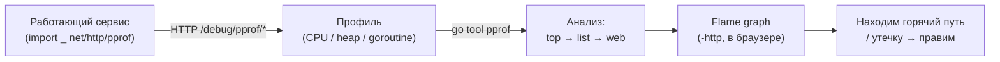

# Профилирование: pprof

Если в Go-тулинге и есть одна возможность, способная вызвать у .NET-разработчика искреннюю зависть, — это **профилирование**. В .NET для серьёзного анализа производительности вы тянетесь к внешним инструментам: dotTrace и dotMemory от JetBrains (коммерческие), профайлер Visual Studio, PerfView от Microsoft. Это отдельные продукты со своими агентами, и профилирование прода через них — отдельная инженерная задача.

В Go профайлер называется **pprof**, и он **встроен в рантайм и стандартную библиотеку**. Рантайм постоянно собирает статистику, а получить профиль можно либо программно, либо — что особенно ценно — **по HTTP с работающего сервера, в том числе в проде, без пересборки и без сторонних агентов**. Эта глава — центральная в разделе: разберём оба способа сбора, виды профилей, рабочий процесс анализа и flame graphs.

## Два пути сбора профиля

pprof собирает данные двумя путями, и важно понимать разницу.

### 1. Программно: `runtime/pprof`

Пакет `runtime/pprof` позволяет включить сбор профиля из кода и записать его в файл. Это подходит для CLI-утилит, разовых замеров, batch-задач — всего, что не является долгоживущим сервером:

```go
package main

import (
    "os"
    "runtime/pprof"
)

func main() {
    // CPU-профиль: пишем в файл на всё время работы
    f, _ := os.Create("cpu.prof")
    defer f.Close()
    pprof.StartCPUProfile(f)
    defer pprof.StopCPUProfile()

    doExpensiveWork()

    // Heap-профиль: снимок кучи в конкретный момент
    hf, _ := os.Create("heap.prof")
    defer hf.Close()
    pprof.WriteHeapProfile(hf)
}
```

### 2. По HTTP: `net/http/pprof`

Для серверов (а это типичный Go-сервис) есть `net/http/pprof`. Его магия — в **side-effect импорте**: достаточно импортировать пакет с пустым идентификатором `_`, и он сам зарегистрирует набор отладочных эндпоинтов на стандартном `http.DefaultServeMux`:

```go
package main

import (
    "net/http"
    _ "net/http/pprof" // регистрирует /debug/pprof/* на DefaultServeMux
)

func main() {
    // ... ваши обычные хендлеры ...
    http.ListenAndServe(":8080", nil)
}
```

После этого на работающем сервере появляются эндпоинты `/debug/pprof/`:

| Эндпоинт | Что отдаёт |
| --- | --- |
| `/debug/pprof/` | HTML-индекс со всеми доступными профилями |
| `/debug/pprof/profile?seconds=30` | CPU-профиль за указанный интервал (по умолчанию 30 с) |
| `/debug/pprof/heap` | снимок кучи (живые объекты и аллокации) |
| `/debug/pprof/goroutine` | стеки всех текущих горутин |
| `/debug/pprof/block` | профиль блокировок (ожидание на синхронизации) |
| `/debug/pprof/mutex` | профиль конкуренции за мьютексы |
| `/debug/pprof/allocs` | профиль всех аллокаций за время жизни процесса |
| `/debug/pprof/trace?seconds=5` | трасса выполнения для `go tool trace` |

> **Важно про прод и безопасность.** Эндпоинты `/debug/pprof/` дают доступ к внутренностям процесса (стеки, имена функций, при `goroutine?debug=2` — фрагменты состояния) и позволяют запустить ресурсоёмкий сбор профиля. **Никогда не выставляйте их в публичную сеть.** Идиоматичные решения: поднимать pprof на *отдельном* приватном порту (не на том, где обслуживается публичный трафик), закрывать его аутентификацией/файрволом или открывать только через `kubectl port-forward`/SSH-туннель. Запускать `_ "net/http/pprof"` на публичном `DefaultServeMux` без защиты — известный класс мисконфигов.

```go
// Идиома: pprof на отдельном приватном порту, не публичном
import _ "net/http/pprof"

func main() {
    go func() {
        // только для внутреннего доступа / port-forward
        http.ListenAndServe("localhost:6060", nil)
    }()
    // публичный сервер — на своём mux, без pprof
    http.ListenAndServe(":8080", publicMux)
}
```

> **Параллель с .NET:** ближайшее по духу в .NET — это диагностические инструменты, подключаемые к живому процессу: `dotnet-trace`, `dotnet-counters`, `dotnet-dump` (которые цепляются по PID через diagnostic IPC), либо EventCounters/метрики, выставленные через эндпоинт. Но это всё же *отдельные* агенты/каналы, а не «импортируй один пакет — и у работающего сервиса появился HTTP-эндпоинт с CPU/heap/goroutine-профилями». Эта встроенность и доступность профилировать прод «голым curl'ом» — то, чего в .NET из коробки нет.

## Виды профилей: что каждый ловит

pprof — это не один профиль, а семейство. Понимать, какой брать под какую проблему, — половина дела:

- **CPU** — где процессор проводит время. Семплирующий профиль (по умолчанию ~100 раз в секунду рантайм фиксирует, какая функция исполняется). Берётся за интервал (`seconds=N`). Главный инструмент против «сервис жжёт CPU / запрос медленный».
- **Heap** — память: какие функции аллоцировали **живущие** сейчас объекты (`inuse_space`/`inuse_objects`) или сколько аллоцировано суммарно (`alloc_space`/`alloc_objects`). Снимок в момент. Главный инструмент против «сервис ест слишком много памяти / течёт».
- **allocs** — то же семейство, что heap, но акцент на **суммарных аллокациях за всё время** (включая уже собранные GC). Полезен, чтобы найти код, который создаёт давление на GC частыми короткоживущими аллокациями.
- **goroutine** — стеки всех текущих горутин, сгруппированные. **Главный инструмент против goroutine leaks** (см. [Раздел 3](../03-concurrency/04-sync-and-leaks.md)): если число горутин неуклонно растёт, этот профиль покажет, *где* они застряли (тысячи горутин с одинаковым стеком, висящие на `chan receive`, — это утечка).
- **block** — где горутины **блокируются и ждут** на примитивах синхронизации (канал, мьютекс, `WaitGroup`). Показывает не CPU, а *ожидание*. Требует включения (`runtime.SetBlockProfileRate`).
- **mutex** — конкуренция именно за мьютексы: какие `Lock()` создают очередь из ожидающих. Требует включения (`runtime.SetMutexProfileFraction`).

> **Параллель с .NET:** CPU-профиль ≈ sampling-режим dotTrace / VS Profiler (CPU Usage). Heap/allocs ≈ dotMemory (снимки кучи, дерево аллокаций) и Allocation profiling в VS. goroutine-профиль ≈ анализ потоков/задач, но в Go он несравнимо точнее бьёт по «утечкам единиц конкурентности», потому что горутин много и leak проявляется в их числе. block/mutex-профили ≈ Concurrency/Contention-анализ (например, в PerfView/VS). Ключевое — все они здесь *одного* семейства и снимаются одним механизмом.

## Рабочий процесс: `go tool pprof`

Собранный профиль (из файла или прямо с URL) анализируется командой `go tool pprof`. Она открывает интерактивную консоль:

```bash
# CPU-профиль прямо с живого сервера (соберёт за 30 с и откроет анализ):
go tool pprof http://localhost:6060/debug/pprof/profile?seconds=30

# Heap-профиль с сервера:
go tool pprof http://localhost:6060/debug/pprof/heap

# Или из ранее сохранённого файла:
go tool pprof cpu.prof
```

Основные команды внутри `(pprof)`:

```text
(pprof) top              # топ функций по «весу» (CPU-время или память)
(pprof) top -cum         # топ по КУМУЛЯТИВНОМУ весу (с учётом вызываемых)
(pprof) list processOrder# построчная разбивка веса ВНУТРИ функции
(pprof) web              # граф вызовов в браузере (нужен graphviz)
(pprof) peek regexp      # кто вызывает / кого вызывает функцию
(pprof) traces           # сэмплированные стеки целиком
```

Связка `top` → `list` — основной приём. `top` показывает, какие функции «тяжёлые». `list <func>` затем раскрывает *внутри* функции, **на какой строке** сидит вес:

```text
(pprof) top
      flat  flat%   sum%        cum   cum%
     1.83s 45.30% 45.30%      1.83s 45.30%  encoding/json.Marshal
     0.92s 22.77% 68.07%      0.92s 22.77%  example.com/app.(*Repo).query
     ...

(pprof) list Marshal
      .          .     // внутри Marshal видно, какие строки жгут CPU:
   1.83s      1.83s    122:   b, err := json.Marshal(payload)
```

Здесь `flat` — время в самой функции, `cum` (cumulative) — вместе со всем, что она вызвала. Эта пара критична: функция с маленьким `flat`, но огромным `cum` — это не «горячая» сама по себе, а та, что вызывает дорогих потомков; искать оптимизацию надо ниже по дереву.

### Flame graphs

Самый наглядный вид — **flame graph** (пламенный граф). Запустите веб-интерфейс pprof:

```bash
go tool pprof -http=:9090 cpu.prof
# откроется браузер; в меню View → Flame Graph
```

На flame graph каждый прямоугольник — функция, его **ширина пропорциональна весу** (CPU-времени или памяти), а по вертикали отложена глубина стека вызовов. Широкие «языки пламени» — это горячие пути: где много времени, там широко. Это самый быстрый способ глазами найти, на что уходит ресурс, не вчитываясь в таблицы.

> **Параллель с .NET:** `go tool pprof -http` с flame graph — это аналог визуализаций в dotTrace (timeline/call tree, flame graph), VS Profiler и PerfView (где flame graph тоже есть). Концепция flame graph межъязыковая и универсальная — если вы читали их в PerfView, в pprof вы читаете их так же. `top`/`list` ≈ табличному Hot Path / Functions view и просмотру построчных затрат в исходнике.

## Сценарий 1: горячий CPU

Сервис тратит подозрительно много CPU. Снимаем CPU-профиль за 30 секунд под нагрузкой, открываем, смотрим `top`:

```bash
go tool pprof http://localhost:6060/debug/pprof/profile?seconds=30
(pprof) top10
```

Допустим, в топе с большим отрывом — `encoding/json.Marshal`. Делаем `list` на свой хендлер и видим, что мы сериализуем один и тот же конфиг в JSON на **каждый** запрос. Вывод: закэшировать результат. Это типичная находка — самый частый «горячий CPU» в Go-сервисах живёт в сериализации, регулярках, аллокациях в цикле и рефлексии.

## Сценарий 2: утечка памяти

Память сервиса монотонно растёт. Снимаем heap-профиль и смотрим, кто держит живые объекты:

```bash
go tool pprof http://localhost:6060/debug/pprof/heap
(pprof) top          # по умолчанию inuse_space — что СЕЙЧАС в куче
(pprof) list <подозрительная функция>
```

Мощнейший приём для утечек — **сравнение двух снимков во времени** (diff). Снимаем heap сейчас и через 10 минут, затем вычитаем:

```bash
curl -s http://localhost:6060/debug/pprof/heap > heap1.prof
sleep 600
curl -s http://localhost:6060/debug/pprof/heap > heap2.prof
go tool pprof -base heap1.prof heap2.prof   # покажет ТОЛЬКО прирост между снимками
```

Флаг `-base` показывает **дельту** — что именно выросло за интервал. Это сразу отсекает легитимно занятую память и подсвечивает виновника роста. Если же память не растёт, но растёт число **горутин** — это уже goroutine leak, и тогда смотреть надо goroutine-профиль:

```bash
go tool pprof http://localhost:6060/debug/pprof/goroutine
(pprof) top   # тысячи горутин с одинаковым стеком на chan receive = утечка
```



## Бенчмарки с профилированием

Профилировать можно не только живой сервис, но и **бенчмарки**. Бенчмарки в Go — часть `go test` (функции `func BenchmarkXxx(b *testing.B)`), отдельная библиотека не нужна. И `go test` умеет на ходу собирать профили с бенчмарка:

```bash
# Гонять бенчмарки пакета и сразу собрать CPU- и memory-профили:
go test -bench=. -benchmem -cpuprofile=cpu.prof -memprofile=mem.prof ./...

# Затем анализировать как обычно:
go tool pprof cpu.prof
```

Флаг `-benchmem` добавляет в вывод бенчмарка две золотые колонки — **`B/op` (байт на операцию)** и **`allocs/op` (аллокаций на операцию)**:

```text
BenchmarkMarshal-8   1000000   1053 ns/op   512 B/op   6 allocs/op
```

Эти две метрики — главный ориентир оптимизации аллокаций в Go: цель часто формулируется как «убрать аллокации с горячего пути», и `allocs/op` показывает прогресс напрямую. Связка `-memprofile` + `pprof` затем покажет, *какие именно строки* эти аллокации делают.

> **Параллель с .NET:** `go test -bench` + `-benchmem` — это встроенный аналог **BenchmarkDotNet**, причём `B/op`/`allocs/op` ≈ колонкам `Allocated`/`Gen0` у BenchmarkDotNet с `[MemoryDiagnoser]`. Разница в том, что в .NET бенчмаркинг — это внешняя (пусть и стандарт де-факто) библиотека с богатой статистикой и прогревом, а в Go это просто подкоманда `go test`. Для глубокой статистики и сравнения прогонов в Go берут утилиту `benchstat`.

## `go tool trace`: когда pprof мало

Когда нужно увидеть не «куда ушло CPU-время», а **как во времени вело себя выполнение** — переключения горутин, работу GC, паузы, события планировщика, блокировки на синхронизации, — есть отдельный инструмент: `go tool trace`. Он работает с трассой, собранной либо через эндпоинт `/debug/pprof/trace?seconds=5`, либо через `go test -trace`:

```bash
go test -trace=trace.out -bench=. ./...
go tool trace trace.out   # откроет интерактивный веб-вьюер
```

В отличие от семплирующего pprof, trace — это **полная временна́я лента событий рантайма**. Им пользуются реже и под специфические вопросы: «почему запрос иногда залипает на 200 мс?», «не упёрлись ли мы в GC-паузы?», «равномерно ли работа размазана по ядрам?». Для большинства задач хватает pprof; trace — тяжёлая артиллерия для проблем с латентностью и планировщиком.

> **Параллель с .NET:** `go tool trace` ближе всего к **PerfView**/`dotnet-trace` с их временно́й лентой событий ETW (GC, потоки, contention) — то есть к событийной трассировке, а не к семплирующему профайлеру. Если pprof — это «статистика, куда ушло время», то trace — это «хронология, что когда происходило».

## Итог

- **pprof встроен** в рантайм и stdlib. Два пути сбора: программно через `runtime/pprof` (CLI/batch) и по HTTP через `net/http/pprof` (импорт `_ "net/http/pprof"` → эндпоинты `/debug/pprof/*` на живом сервере, **в т.ч. в проде**).
- **Защищайте pprof-эндпоинты**: не выставляйте `/debug/pprof/` в публичную сеть — отдельный приватный порт, аутентификация или port-forward.
- **Виды профилей** под разные проблемы: CPU (горячее время), heap/allocs (память и давление на GC), goroutine (поиск **goroutine leaks**), block/mutex (ожидание и конкуренция на синхронизации).
- **Рабочий процесс**: собрать профиль → `go tool pprof` → `top` → `list <func>` (построчно) → `web`/flame graph (`-http`). Для утечек памяти — diff двух снимков через `-base`.
- **Бенчмарки** — часть `go test`: `-bench` + `-benchmem` дают `B/op` и `allocs/op`, а `-cpuprofile`/`-memprofile` скармливают результат тому же `pprof`.
- **`go tool trace`** — отдельный инструмент для временно́й ленты событий рантайма (планировщик, GC, паузы), когда статистики pprof недостаточно.
- Главное отличие от .NET: профайлер здесь — **часть языка**, и профилировать прод можно прямо через HTTP, без коммерческих агентов.

Дальше — сводное сравнение всего тулинга Go с экосистемой .NET: единый CLI, профайлеры, отладчик, форматтеры и анализаторы в одной таблице.

---

[⌂ Главная](../../README.md) · [↑ Раздел](./README.md) · [← Предыдущий: Отладка: Delve](./02-debugging-delve.md) · [→ Следующий: Сравнение с .NET](./04-comparison-with-dotnet.md)
