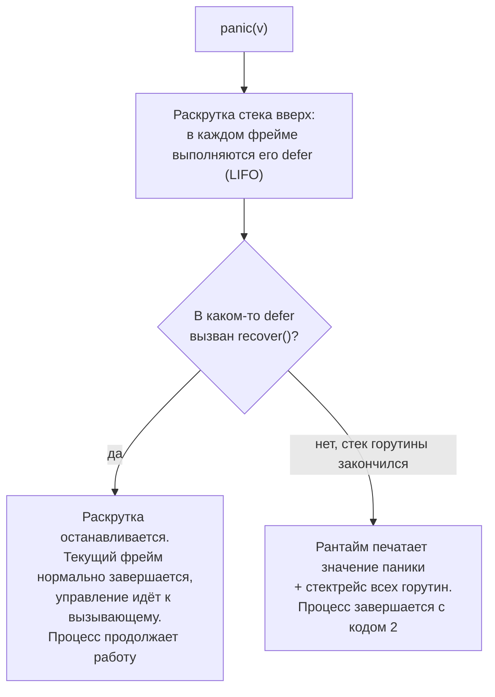

# defer, panic и recover

Глава [Обработка ошибок](./01-error-handling.md) поставила философию: в Go ошибки — это **значения**, которые возвращают и проверяют, а `panic` — не инструмент штатной обработки сбоев. Здесь мы не повторяем этот тезис, а спускаемся на уровень ниже — к точной **механике** трёх конструкций `defer`, `panic` и `recover`, к тому, как они взаимодействуют, и к ловушкам, на которых регулярно спотыкается разработчик из .NET. Большинство этих ловушек растут из одного корня: `defer` привязан к **функции**, а не к блоку `{}`, и его аргументы фиксируются **в момент объявления**, а не вызова. Если держать это в голове, остальное складывается.

## defer: механика

`defer` откладывает вызов функции до момента выхода из **окружающей функции** — неважно, через `return`, через ошибку или через `panic`. Это уже знакомо по главе 01 как «гибрид `finally` и `using`». Но дьявол в деталях, и деталей три: момент вычисления аргументов, порядок LIFO и взаимодействие с именованным возвратом.

### Аргументы вычисляются в момент объявления `defer`

Это первое, что ломает интуицию. Когда вы пишете `defer f(x)`, выражение `x` (и сам `f`, если это значение функции) вычисляется **немедленно, в строке с `defer`**, а не тогда, когда отложенный вызов реально произойдёт. Откладывается только сам вызов с уже зафиксированными аргументами.

```go
func main() {
    i := 0
    defer fmt.Println(i) // аргумент i вычислен ЗДЕСЬ: зафиксировано 0
    i = 10
    // на выходе напечатает 0, а не 10
}
```

Печатается `0`. Значение `i` было снято в момент выполнения оператора `defer`, и последующее `i = 10` на отложенный вызов уже не влияет.

Тот же принцип распространяется на **ресивер метода**: `defer obj.Close()` фиксирует значение `obj` (точнее, ресивер) в момент `defer`. Если `obj` — значение (не указатель), откладывается вызов на его **копии**, снятой сразу:

```go
type Conn struct{ id int }

func (c Conn) Report() { fmt.Println("закрываю соединение", c.id) }

func main() {
    c := Conn{id: 1}
    defer c.Report() // ресивер-копия c{id:1} зафиксирован здесь
    c.id = 2
    // напечатает "закрываю соединение 1"
}
```

Если же нужно «позднее» поведение — захватить переменную и прочитать её **на выходе**, — оборачивают вызов в замыкание, которое читает переменную из окружения, а не получает её аргументом:

```go
i := 0
defer func() { fmt.Println(i) }() // замыкание читает i на выходе → напечатает 10
i = 10
```

Разница принципиальна: в `defer fmt.Println(i)` аргумент `i` фиксируется сразу, а в `defer func(){ fmt.Println(i) }()` замыкание захватывает **переменную** `i` и прочитает её актуальное значение в момент отложенного выполнения.

> **Параллель с .NET:** у `finally` такого «снимка аргументов» нет — это просто блок кода, который исполняется на выходе и видит переменные в их финальном состоянии. Ближайшая аналогия фиксации аргументов `defer` — это **захват значения** при создании делегата/замыкания в C#: `Action a = () => Console.WriteLine(i);` против заранее вычисленного `int snapshot = i; Action a = () => Console.WriteLine(snapshot);`. Go в форме `defer f(x)` делает именно «снимок» `x`, а в форме `defer func(){...}()` — захват переменной, как C#-лямбда.

### Несколько `defer` выполняются в порядке LIFO

Отложенные вызовы складываются в стек: последний объявленный `defer` выполняется **первым**. Это естественно для освобождения ресурсов — разворачиваем в обратном порядке захвата (открыли A, потом B → закрываем B, потом A).

```go
func main() {
    defer fmt.Println("1 (объявлен первым, выполнен последним)")
    defer fmt.Println("2")
    defer fmt.Println("3 (объявлен последним, выполнен первым)")
    fmt.Println("тело функции")
}
// тело функции
// 3 (объявлен последним, выполнен первым)
// 2
// 1 (объявлен первым, выполнен последним)
```

### `defer` и именованный возврат: чтение и изменение результата

Если у функции **именованные** возвращаемые значения, отложенная функция может их **прочитать и изменить** — потому что к моменту её выполнения `return` уже записал значения в эти именованные переменные, но функция ещё не отдала управление вызывающему. Это и есть механизм, упомянутый в главе 01: `defer` способен подменить возвращаемую ошибку «после `return`».

Канонический паттерн — **обёртка ошибки** в одном месте, без дублирования `fmt.Errorf` на каждом `return err`:

```go
func read(path string) (err error) { // именованный результат err
    defer func() {
        if err != nil {
            err = fmt.Errorf("read %q: %w", path, err) // правим именованный результат
        }
    }()

    f, err := os.Open(path)
    if err != nil {
        return err // err присвоится результату, затем defer обернёт его
    }
    defer f.Close()
    // ... любой return err внутри будет обёрнут единообразно ...
    return nil // err == nil → defer ничего не оборачивает
}
```

Любой выход с ненулевой ошибкой получит единый префикс `read "...":`, а успешный путь (`err == nil`) пройдёт нетронутым. Тот же приём — основа конвертации `recover` в ошибку (ниже).

> **Параллель с .NET:** прямого аналога нет. Из `finally` в C# нельзя так же явно «дописать» возвращаемое значение метода — `return` уже зафиксировал результат, а присваивание возвращаемому значению из `finally` языком не предусмотрено (а `return` внутри `finally` запрещён компилятором). Это уникальная для Go возможность, прямо вытекающая из того, что именованный результат — это обычная переменная функции, которую `defer` видит и может переписать.

### ❌ Ловушка: `defer` в цикле

Вот ключевая ловушка, которой **нет** в C#. `defer` срабатывает в конце **функции**, а не в конце итерации цикла. Поэтому отложенные вызовы внутри цикла **накапливаются** и выполняются все разом только при выходе из функции. Классический сценарий — обход тысяч файлов:

```go
func processAll(paths []string) error {
    for _, p := range paths {
        f, err := os.Open(p)
        if err != nil {
            return err
        }
        defer f.Close() // ❌ НЕ закроется в конце итерации!
        // ... работа с f ...
    }
    return nil
    // только ЗДЕСЬ закроются все файлы — но к этому моменту
    // открыто разом len(paths) дескрипторов: на 10000 файлов это
    // 10000 одновременно открытых fd → упрёмся в лимит ОС
}
```

Все `f.Close()` копятся до `return` всей функции — при 10000 итераций мы держим 10000 открытых дескрипторов одновременно и почти наверняка получим `too many open files`. То же самое с локами (`mu.Lock(); defer mu.Unlock()` в цикле удержит лок до конца функции), соединениями, транзакциями.

✅ Лечение — дать `defer` его собственную функцию на каждой итерации. Тело итерации выносят в функцию или вызываемое на месте замыкание, где `defer` отработает на **каждом** проходе:

```go
func processAll(paths []string) error {
    for _, p := range paths {
        // тело итерации — отдельная функция; defer сработает на КАЖДОЙ итерации
        if err := func() error {
            f, err := os.Open(p)
            if err != nil {
                return err
            }
            defer f.Close() // ✅ закроется в конце ЭТОЙ итерации
            // ... работа с f ...
            return nil
        }(); err != nil {
            return err
        }
    }
    return nil
}
```

Альтернатива — закрывать ресурс **явно** в конце итерации без `defer`, но тогда нужно аккуратно закрыть его и на путях с ошибкой (что как раз и упрощает вынесенная функция с `defer`).

> **Параллель с .NET:** в C# этой ловушки нет, потому что `using`/`finally` — **блочные**, а не функциональные. `using (var f = File.OpenRead(p)) { ... }` внутри `foreach` вызывает `Dispose()` в конце **каждой итерации** — ровно там, где закрывается блок `{}`. Go-шный `defer` привязан к функции, поэтому `using` в цикле «просто работает», а `defer` в цикле — нет. Это, пожалуй, главное практическое различие между `defer` и `using`/`finally`, и именно здесь .NET-интуиция подводит чаще всего. Перенося код с `using` в цикле на Go, оборачивайте тело итерации в функцию.

### Стоимость `defer`

Исторически `defer` был заметно дороже прямого вызова, и в горячих путях его иногда избегали. С **Go 1.14** компилятор применяет «open-coded defers»: в типичных случаях (фиксированное число `defer` в функции, без `defer` в цикле) отложенный вызов инлайнится и стоит практически столько же, сколько обычный вызов. Поэтому **не отказывайтесь от `defer` ради микрооптимизации без замеров** — читаемость и гарантия очистки почти всегда важнее, а накладные расходы в современном Go в обычном коде пренебрежимо малы.

## panic: что происходит

`panic(v)` прекращает нормальное выполнение текущей функции и запускает **раскрутку стека** (stack unwinding): по пути вверх в **каждом** фрейме выполняются все его отложенные `defer` — в том же порядке LIFO. Это то, что гарантирует очистку ресурсов даже при панике: `defer f.Close()` отработает.

Раскрутка идёт вверх до тех пор, пока:

- какой-нибудь `defer` не **перехватит** панику через `recover` (см. следующий раздел) — тогда раскрутка останавливается, и программа продолжает жить;
- либо стек не закончится **без** перехвата — тогда рантайм печатает значение паники и **стектрейс** (по всем горутинам) и завершает процесс с **кодом выхода 2**.

```text
panic: значение паники

goroutine 1 [running]:
main.inner(...)
	/path/main.go:12 +0x...
main.outer(...)
	/path/main.go:8 +0x...
...
exit status 2
```

Значение паники имеет тип `any` — паниковать можно чем угодно. Идиоматично — `error` или строка; рантайм печатает значение через его `Error()`/`String()`/`%v`.

### Рантайм паникует сам

Паника возникает не только от явного `panic(...)`. Рантайм Go сам генерирует панику при программных ошибках — и это те же ситуации, что в .NET дают `NullReferenceException`, `IndexOutOfRangeException` и т.п.:

- разыменование **nil-указателя** (`*p`, где `p == nil`) — `invalid memory address or nil pointer dereference`;
- выход за границы **слайса/массива/строки** (`s[i]`, `i >= len(s)`) — `index out of range`;
- слайсинг за границами (`s[a:b]` с недопустимыми `a`,`b`) — `slice bounds out of range`;
- **деление на ноль** для целых (`x / 0`, `x % 0`) — `integer divide by zero` (а вот деление `float64` на ноль даёт `+Inf`/`NaN`, не панику);
- запись в **nil-мапу** (`m[k] = v`, где `m == nil`) — `assignment to entry in nil map` (чтение из nil-мапы при этом безопасно и даёт нулевое значение — см. Раздел 1);
- неуспешное **type assertion** в одно-значной форме (`v := x.(T)`, когда тип не совпал) — паникует; двух-значная форма `v, ok := x.(T)` не паникует;
- операции с **каналами**: `close` уже закрытого канала, `close` nil-канала, отправка в закрытый канал — паникуют (детали — Раздел 3).

> **Параллель с .NET:** «рантайм паникует сам» ≈ исключения CLR: `NullReferenceException` ≈ nil pointer dereference, `IndexOutOfRangeException`/`ArgumentOutOfRangeException` ≈ index out of range, `DivideByZeroException` ≈ integer divide by zero. Разница в том, что в Go это **паники**, а не штатные ошибки, и ловить их `recover`-ом следует так же осторожно, как в C# не стоит «глушить» `NullReferenceException` в `catch` — это сигнал бага, а не управляющая конструкция.

### Паника не пересекает границу горутины

Критически важное свойство, особенно для тех, кто привык к модели «исключение всплывёт хоть откуда». `panic` раскручивает стек **только своей** горутины. `recover` в одной горутине **не поймает** панику, возникшую в другой. Если запущенная через `go` горутина паникует и **в ней самой** нет `defer`-а с `recover`, она уронит **весь процесс** — даже если родительская горутина обёрнута в `recover`.

```go
func main() {
    defer func() {
        if r := recover(); r != nil {
            fmt.Println("это НЕ сработает для паники из горутины:", r)
        }
    }()

    go func() {
        panic("бум в горутине") // ❌ recover в main сюда не дотянется
    }()

    time.Sleep(time.Second) // процесс упадёт с кодом 2 раньше
}
```

Поэтому каждая долгоживущая фоновая горутина, способная паниковать, должна иметь **свой** `defer recover()` у самого корня (см. ниже паттерн `SafeRun` и [Обработка ошибок](./01-error-handling.md), а также модель горутин в Разделе 3).



## recover: точные правила

`recover()` — встроенная функция, которая перехватывает панику. Но её поведение обвешано тонкими условиями, и именно на них чаще всего ошибаются.

### `recover` работает только при прямом вызове внутри отложенной функции

`recover()` перехватывает панику **только** если он вызван **напрямую** внутри функции, которая была **отложена через `defer`** в паникующем фрейме. Во всех остальных случаях `recover()` возвращает `nil` и ничего не делает:

- вызов `recover()` в обычном (не отложенном) коде — `nil`, ничего не перехватывает;
- вызов `recover()` в функции, которая **вызвана из** отложенной функции (то есть не напрямую, а на уровень глубже) — `nil`;
- вызов `recover()` без активной паники — `nil`.

❌ Так `recover` **не** работает:

```go
// ❌ recover в обычной функции — он не в defer, вернёт nil
func wrong1() {
    recover() // бесполезно: нет ни паники, ни defer-контекста
    panic("boom")
}

// ❌ recover в функции, ВЫЗВАННОЙ из defer (не напрямую) — вернёт nil
func helper() {
    if r := recover(); r != nil { // recover здесь не «видит» панику:
        fmt.Println("не поймает:", r) // он вызван не напрямую из defer
    }
}
func wrong2() {
    defer helper() // defer вызывает helper, а recover внутри helper — на уровень глубже
    panic("boom") // не будет перехвачена → процесс упадёт
}
```

✅ А так — работает: `recover` вызван **прямо** в теле отложенного замыкания:

```go
func right() {
    defer func() {
        if r := recover(); r != nil { // recover напрямую в deferred-функции ✅
            fmt.Println("перехвачено:", r)
        }
    }()
    panic("boom") // будет перехвачена
}
```

### `recover` возвращает значение паники или `nil`

`recover()` возвращает то значение, что было передано в `panic(v)`, либо `nil`, если в данный момент паники нет (или нарушены условия выше). Отсюда обязательная идиома — проверять результат, а не вызывать «голый» `recover()`:

```go
if r := recover(); r != nil {
    // обрабатываем именно факт паники; r — значение any
}
```

Без проверки `if r != nil` вы не отличите «паники не было» от «паника со значением `nil`», а молчаливый `recover()` без анализа результата — почти всегда ошибка (см. чеклист).

### После `recover` выполнение не возобновляется с точки паники

Важно понимать, что `recover` **не** возобновляет выполнение с того места, где случилась `panic`. Он лишь останавливает раскрутку. Текущий фрейм (тот, в котором сработал `recover`) **нормально завершается**: дорабатывают остальные его `defer`, и управление переходит к **вызывающему**, как при обычном `return`. Код после `panic(...)` в исходной функции уже не выполнится никогда.

Чтобы вернуть из такой функции осмысленный результат, используют **именованный возврат** — отложенная функция с `recover` присваивает значение/ошибку именованной переменной (см. паттерн ниже).

### Паттерн panic→error на границе

Самое частое легитимное применение `recover` — **конвертация паники в ошибку на границе**, чтобы паника из изолируемого кода не уронила процесс, а превратилась в обычное возвращаемое значение `error`. Полный шаблон:

```go
// SafeRun выполняет f и превращает возможную панику в error.
func SafeRun(f func()) (err error) { // именованный результат
    defer func() {
        if r := recover(); r != nil {
            err = fmt.Errorf("recovered panic: %v", r) // подменяем результат
        }
    }()
    f()
    return nil // если f не паниковала
}
```

Если внутри `f()` случится `panic`, отложенная функция перехватит её, запишет в именованный `err` обёрнутую ошибку, и `SafeRun` вернёт её штатно — вызывающий обработает как обычный `error`.

Где это уместно — именно **границы**, а не повседневный код:

- **HTTP-middleware** — чтобы паника в одном обработчике дала `500`, а не уронила сервер (кратко показано в [Обработка ошибок](./01-error-handling.md)).
- **Корень фоновой горутины** — так как паника не пересекает границу горутины, у долгоживущей горутины должен быть свой `recover` у самого верха, иначе её паника убьёт процесс (Раздел 3).
- **Исполнение чужого/непредсказуемого кода** — парсер плагинов, пользовательских скриптов, шаблонов: их сбой изолируют, а не дают ему повалить хост.

При этом **библиотека не должна «выпускать» панику наружу по штатным причинам**: публичный API возвращает `error`. `recover` внутри библиотеки — это её внутренняя страховка на границе, а не способ общаться с вызывающим (это прямо вытекает из философии главы 01).

### Разбор значения паники и ре-паника

`recover` ловит **всё** — типизированного `catch (SomeException e)` в Go нет. Поэтому, если вам нужно реагировать только на «свой» вид паники, тип значения разбирают **вручную** через type switch, а «чужую» панику **пробрасывают дальше** повторным `panic(r)`:

```go
defer func() {
    r := recover()
    if r == nil {
        return // паники не было
    }
    switch v := r.(type) {
    case myDomainPanic:
        err = handleDomain(v) // «свой» случай — обрабатываем
    case runtime.Error:
        // паника рантайма (nil deref, index out of range...) — это баг,
        // глушить его опасно: пробрасываем дальше
        panic(r)
    default:
        panic(r) // всё прочее тоже не наше — ре-паника
    }
}()
```

Ре-паника `panic(r)` продолжает раскрутку с тем же значением, как если бы текущий `recover` её не трогал, — это аналог `throw;` (без аргумента) в C#, пробрасывающего пойманное исключение дальше.

> **Параллель с .NET:** `panic`/`recover` ≈ `throw`/`catch`, но с принципиальными отличиями. (1) `recover` работает **только** внутри `defer` — нет произвольного `try { } catch { }` в любом месте; роль `try`-блока играет сама функция, роль `finally` — `defer`. (2) **Нет типизированного `catch`** — `recover` ловит всё подряд, и тип вы разбираете сами через `switch r.(type)`, а «не свой» случай пробрасываете через `panic(r)` (≈ `throw;`). (3) **Восстановление не возобновляет** выполнение с точки сбоя: в C# после `catch` управление идёт за `try/catch` в той же области, а в Go паникующая функция уже сворачивается — продолжает только её вызывающий. (4) Осмысленный результат «после перехвата» отдают через **именованный возврат** — аналога «дописать результат из `catch`» в C# нет, там вы просто делаете `return` из `catch`.

## Ловушки и правила (сводка)

Короткий чеклист, который стоит держать в голове:

- ❌ `defer` в цикле, удерживающий ресурс до конца **функции** (файлы, локи копятся). ✅ Выносите тело итерации в функцию/замыкание — тогда `defer` отрабатывает на каждой итерации (или закрывайте явно).
- ❌ Расчёт на «позднее» значение аргумента `defer`: `defer f(x)` фиксирует `x` **сразу**. ✅ Нужно прочитать переменную на выходе — оборачивайте в замыкание `defer func(){ ... }()`.
- ❌ `recover()` в обычной функции или в функции, **вызванной** из `defer`. ✅ `recover()` — только **напрямую** в теле отложенной функции паникующего фрейма.
- ❌ Молча «глотать» панику: `defer func(){ recover() }()` без анализа значения. ✅ Проверяйте `if r := recover(); r != nil`, логируйте/оборачивайте, а «не свою» панику (особенно `runtime.Error`) пробрасывайте через `panic(r)`.
- ❌ Полагаться, что `recover` родителя поймает панику дочерней горутины. ✅ Паника **не пересекает границу горутины** — ставьте `recover` у корня каждой фоновой горутины.
- ✅ Возвращайте осмысленный результат после `recover` через **именованный возврат**; помните, что выполнение **не** продолжится с точки `panic`.

## Итог

- Аргументы `defer f(x)` вычисляются **в момент оператора `defer`**, а не отложенного вызова; ресивер метода тоже фиксируется сразу. Нужно «позднее» значение — оборачивайте в замыкание `defer func(){...}()`.
- Несколько `defer` выполняются в порядке **LIFO**; отложенная функция может **читать и изменять именованный результат** — основа единообразной обёртки ошибки и конвертации `recover` в `error`.
- Главная ловушка для .NET-разработчика: `defer` привязан к **функции**, а не к блоку, поэтому `defer` в цикле копит ресурсы до выхода из функции (в отличие от `using`/`finally`, которые блочные). Лечение — функция/замыкание на итерацию.
- `panic` раскручивает стек, выполняя все `defer` по пути; без `recover` рантайм печатает значение и стектрейс и завершает процесс с кодом 2. Рантайм паникует и сам (nil-разыменование, выход за границы, деление на ноль целых, запись в nil-мапу, операции с каналами). Паника **не пересекает границу горутины**.
- `recover()` срабатывает **только при прямом вызове в отложенной функции** паникующего фрейма; возвращает значение `panic` или `nil`. После него выполнение **не** возобновляется с точки сбоя — фрейм сворачивается, осмысленный результат отдают через именованный возврат.
- Типизированного `catch` нет: `recover` ловит всё, тип разбирают через `switch r.(type)`, «не свою» панику пробрасывают `panic(r)`. Уместное применение — **границы** (middleware, корень горутины, исполнение чужого кода); библиотека не выпускает панику наружу по штатным причинам (почему — см. [Обработка ошибок](./01-error-handling.md)).

---

[⌂ Главная](../../README.md) · [↑ Раздел](./README.md) · [← Предыдущий: Обработка ошибок](./01-error-handling.md) · [→ Следующий: Тестирование](./03-testing.md)
