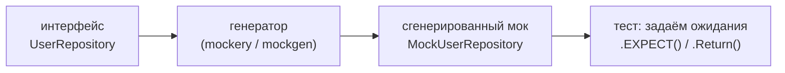

# Моки и Testcontainers

Реальный код зависит от баз данных, кэшей, очередей и внешних API. В юнит-тестах эти зависимости обычно **подменяют моками**, а в интеграционных — поднимают **по-настоящему**. В .NET для первого берут Moq или NSubstitute (динамические прокси в рантайме), для второго — Testcontainers. В Go подход к мокам устроен иначе: они стоят на **интерфейсах** и чаще **генерируются** на этапе сборки, а не создаются магией рефлексии. Testcontainers же в Go — это тот же самый проект, что и в .NET.

Эта глава показывает, как мокать через интерфейсы (вручную и кодогенерацией) и когда вместо моков лучше поднять реальную зависимость через `testcontainers-go`.

## Моки строятся на интерфейсах

Фундамент мокабельности в Go — **интерфейсы** (см. [Раздел 2: Интерфейсы и Duck Typing](../02-memory-gc-and-types/04-interfaces-and-duck-typing.md)). Если ваш код зависит не от конкретного типа, а от **интерфейса**, в тесте вы подставите любую его реализацию — хоть рукописную заглушку, хоть сгенерированный мок.

Важная особенность Go: интерфейсы реализуются **неявно** (duck typing). Поэтому интерфейс принято объявлять **на стороне потребителя** и держать **узким** — ровно те методы, что нужны коду. Это и делает подмену тривиальной.

```go
// Потребитель объявляет узкий интерфейс — только то, что ему реально нужно.
type UserRepository interface {
    GetByID(ctx context.Context, id int) (*User, error)
}

type UserService struct {
    repo UserRepository // зависим от интерфейса, не от конкретной БД
}

func (s *UserService) DisplayName(ctx context.Context, id int) (string, error) {
    u, err := s.repo.GetByID(ctx, id)
    if err != nil {
        return "", fmt.Errorf("DisplayName: %w", err)
    }
    return u.FirstName + " " + u.LastName, nil
}
```

`UserService` ничего не знает о Postgres — он знает только `UserRepository`. В проде туда передадут реальную реализацию поверх `database/sql`, в тесте — мок.

> **Параллель с .NET:** идея та же, что инъекция интерфейса вместо конкретного класса (то, ради чего вы и регистрируете `IUserRepository` в DI). Отличие — в том, **где живёт интерфейс**: в C# его обычно объявляют рядом с реализацией («провайдер определяет контракт»), в Go — рядом с потребителем и максимально узким. Это прямое следствие неявной реализации интерфейсов.

## Ручные моки

Поскольку интерфейс реализуется неявно, простейший мок — это маленькая структура с полями-функциями, которую вы пишете руками:

```go
type mockUserRepo struct {
    getByIDFunc func(ctx context.Context, id int) (*User, error)
}

func (m *mockUserRepo) GetByID(ctx context.Context, id int) (*User, error) {
    return m.getByIDFunc(ctx, id) // делегируем в подставленную функцию
}

func TestDisplayName(t *testing.T) {
    repo := &mockUserRepo{
        getByIDFunc: func(ctx context.Context, id int) (*User, error) {
            return &User{FirstName: "Ada", LastName: "Lovelace"}, nil
        },
    }
    svc := &UserService{repo: repo}

    got, err := svc.DisplayName(context.Background(), 1)
    if err != nil {
        t.Fatalf("неожиданная ошибка: %v", err)
    }
    if got != "Ada Lovelace" {
        t.Errorf("DisplayName() = %q; ожидалось %q", got, "Ada Lovelace")
    }
}
```

Для одного-двух методов это лучший вариант: ноль зависимостей, всё прозрачно. Но когда интерфейс большой или моков много (надо проверять количество вызовов, аргументы, задавать последовательности ответов), ручная писанина утомляет — и тут на сцену выходит **кодогенерация**.

## Кодогенерация моков

В Go моки чаще **генерируют из интерфейса** инструментом, а не собирают в рантайме. Это согласуется с общей философией Go «генерация на этапе сборки вместо рантайм-рефлексии» (см. [Раздел 7: Кодогенерация](../07-code-generation/README.md)). Два самых распространённых генератора — `mockery` и `gomock`.

### `mockery`

`mockery` (`github.com/vektra/mockery`) генерирует моки на основе `testify/mock`. Конфигурация задаётся в файле `.mockery.yaml`, где перечислены пакеты и интерфейсы:

```yaml
# .mockery.yaml
packages:
  github.com/acme/app/users:
    interfaces:
      UserRepository:
```

Запуск генерации создаёт мок-тип (`MockUserRepository`) с типобезопасным «expecter»-API:

```bash
mockery
```

```go
func TestDisplayName_Mockery(t *testing.T) {
    repo := users.NewMockUserRepository(t) // конструктор привязывает мок к t
    repo.EXPECT().
        GetByID(mock.Anything, 1).
        Return(&users.User{FirstName: "Ada", LastName: "Lovelace"}, nil).
        Once()

    svc := &users.UserService{Repo: repo}
    got, _ := svc.DisplayName(context.Background(), 1)

    if got != "Ada Lovelace" {
        t.Errorf("got %q", got)
    }
    // Ожидания проверяются автоматически: NewMockUserRepository(t)
    // регистрирует t.Cleanup, который убедится, что GetByID был вызван ровно один раз.
}
```

`.EXPECT()` даёт типобезопасную настройку: имена методов и типы аргументов проверяются компилятором, в отличие от строковых имён в рантайм-моках. Привязка к `t` через `NewMockUserRepository(t)` автоматически верифицирует ожидания в конце теста.

Генерацию можно повесить на директиву, чтобы воспроизводить её через `go generate`:

```go
//go:generate mockery
```

### `gomock` (`go.uber.org/mock`)

`gomock` — второй популярный вариант (изначально от Google, ныне поддерживается как `go.uber.org/mock`). Моки генерируются утилитой `mockgen`, обычно через `go:generate`:

```go
//go:generate mockgen -source=repository.go -destination=mocks/repository.go -package=mocks
```

Использование строится на контроллере `gomock.Controller` и цепочках `EXPECT()`:

```go
func TestDisplayName_Gomock(t *testing.T) {
    ctrl := gomock.NewController(t)
    repo := mocks.NewMockUserRepository(ctrl)

    repo.EXPECT().
        GetByID(gomock.Any(), 1).
        Return(&User{FirstName: "Ada", LastName: "Lovelace"}, nil).
        Times(1)

    svc := &UserService{repo: repo}
    // ... вызвать и проверить ...
}
```

`gomock` чуть строже и многословнее, `mockery` многим кажется удобнее за счёт `.EXPECT()`-эргономики и yaml-конфига — но оба решают одну задачу: дать мок из интерфейса без ручного кода.



> **Параллель с .NET:** Moq и NSubstitute создают мок **в рантайме** через динамические прокси (`Castle.DynamicProxy`) — `var repo = new Mock<IUserRepository>(); repo.Setup(r => r.GetByID(...)).ReturnsAsync(...);`. В Go мок **генерируется в файл на этапе сборки** из интерфейса. Идея настройки похожа (`EXPECT().Return()` ≈ `Setup().Returns()`, проверка вызовов ≈ `Verify()`), но механизм иной: компилируемый код вместо рефлексивного прокси. Плюс Go-подхода — мок виден, отлаживаем и не зависит от рефлексии; минус — генерацию надо запускать и держать в репозитории.

## Интеграционные тесты: `testcontainers-go`

Моки проверяют **вашу** логику в изоляции, но не проверяют, что код действительно правильно работает с реальным Postgres, Redis или Kafka: SQL-диалект, миграции, сериализация, поведение драйвера. Для этого нужны **интеграционные тесты** на настоящих зависимостях — и здесь помогает `testcontainers-go`.

`testcontainers-go` (`github.com/testcontainers/testcontainers-go`) поднимает реальные сервисы в Docker-контейнерах **на время теста** и гасит их после. Никаких заранее настроенных тестовых БД — контейнер создаётся в начале и уничтожается в конце.

Пример с Postgres (модуль `modules/postgres`):

```go
import (
    "context"
    "database/sql"
    "testing"

    _ "github.com/jackc/pgx/v5/stdlib"
    "github.com/testcontainers/testcontainers-go"
    "github.com/testcontainers/testcontainers-go/modules/postgres"
)

func TestUserRepo_Integration(t *testing.T) {
    if testing.Short() {
        t.Skip("пропускаем интеграционный тест в режиме -short")
    }
    ctx := context.Background()

    // 1. Поднимаем реальный Postgres в контейнере.
    pg, err := postgres.Run(ctx,
        "postgres:16-alpine",
        postgres.WithDatabase("testdb"),
        postgres.WithUsername("test"),
        postgres.WithPassword("test"),
        postgres.BasicWaitStrategies(), // ждём, пока БД будет готова принимать соединения
    )
    if err != nil {
        t.Fatalf("не удалось запустить контейнер: %v", err)
    }
    // 2. Гарантированно гасим контейнер после теста.
    t.Cleanup(func() { _ = testcontainers.TerminateContainer(pg) })

    // 3. Получаем строку подключения к поднятому контейнеру.
    dsn, err := pg.ConnectionString(ctx, "sslmode=disable")
    if err != nil {
        t.Fatalf("ConnectionString: %v", err)
    }

    db, err := sql.Open("pgx", dsn)
    if err != nil {
        t.Fatalf("sql.Open: %v", err)
    }
    t.Cleanup(func() { _ = db.Close() })

    // 4. Дальше — миграции и реальные запросы к настоящей БД.
    repo := NewUserRepository(db)
    // ... applyMigrations(db); вставка и чтение; реальные проверки ...
    _ = repo
}
```

Что здесь происходит: `postgres.Run` запускает контейнер `postgres:16-alpine`, `BasicWaitStrategies()` дожидается готовности БД, `ConnectionString` отдаёт DSN с реальным (случайным) портом, а `t.Cleanup` с `TerminateContainer` гарантированно убирает контейнер после теста. Дальше вы работаете с настоящим Postgres через обычный `database/sql` (см. [Раздел 10: Работа с данными](../10-data-access/README.md)). У `testcontainers-go` есть готовые модули для Postgres, MySQL, Redis, Kafka, MongoDB и многих других.

### Когда моки, а когда интеграционные тесты

| | Моки (на интерфейсах) | Интеграционные (Testcontainers) |
| --- | --- | --- |
| Что проверяют | логику вашего кода в изоляции | реальное взаимодействие с зависимостью |
| Скорость | очень быстро (микросекунды) | медленнее (запуск контейнера — секунды) |
| Требуют Docker | нет | да |
| Ловят баги в SQL/драйвере/миграциях | нет | да |
| Где уместны | бизнес-логика, ветвления, обработка ошибок | репозитории, миграции, сериализация, интеграции |

Практика — пирамида: **много** быстрых юнит-тестов с моками на логику и **меньше** интеграционных на реальный контакт с инфраструктурой. Интеграционные часто помечают `testing.Short()`-гейтом или build-тегом, чтобы не гонять их в каждом локальном прогоне.

> **Параллель с .NET:** `testcontainers-go` — это **тот же проект Testcontainers**, что и `Testcontainers` для .NET (`new PostgreSqlBuilder().Build()`, `StartAsync()`, `GetConnectionString()`). Подход идентичен: реальные зависимости в Docker на время теста. Так что эту практику переносить из .NET в Go не придётся — она у вас уже есть, меняется лишь API на идиоматичный для Go (`Run` + `ConnectionString` + `t.Cleanup` вместо `Builder` + `await StartAsync()` + `IAsyncLifetime`).

## Итог

- Мокабельность в Go стоит на **интерфейсах**; благодаря неявной реализации интерфейс объявляют **узким и на стороне потребителя**, и подменить его реализацию в тесте тривиально.
- **Ручной мок** (структура с полями-функциями) идеален для одного-двух методов; для крупных интерфейсов берут **кодогенерацию**.
- `mockery` (на базе `testify/mock`, конфиг `.mockery.yaml`, типобезопасный `.EXPECT()`) и `gomock`/`mockgen` (`go.uber.org/mock`, контроллер + `EXPECT()`) генерируют моки из интерфейса на этапе сборки — в духе «кодогенерация вместо рантайм-рефлексии».
- Для проверки реального контакта с инфраструктурой — **интеграционные тесты** на `testcontainers-go`: реальный Postgres/Redis/Kafka в Docker на время теста (`postgres.Run` → `ConnectionString` → `t.Cleanup`/`TerminateContainer`).
- Баланс: много быстрых моков на логику, меньше интеграционных на инфраструктуру; последние гейтят через `testing.Short()` или build-теги.
- Для .NET-разработчика главный сдвиг — от рантайм-прокси (Moq/NSubstitute) к кодогенерации моков; Testcontainers же — буквально тот же инструмент, что и в .NET.

Дальше — консолидированное сравнение всего раздела с .NET: исключения против значений-ошибок и тест-стек .NET против встроенного тулчейна Go.

---

[⌂ Главная](../../README.md) · [↑ Раздел](./README.md) · [← Предыдущий: Тестирование](./03-testing.md) · [→ Следующий: Сравнение с .NET](./05-comparison-with-dotnet.md)
