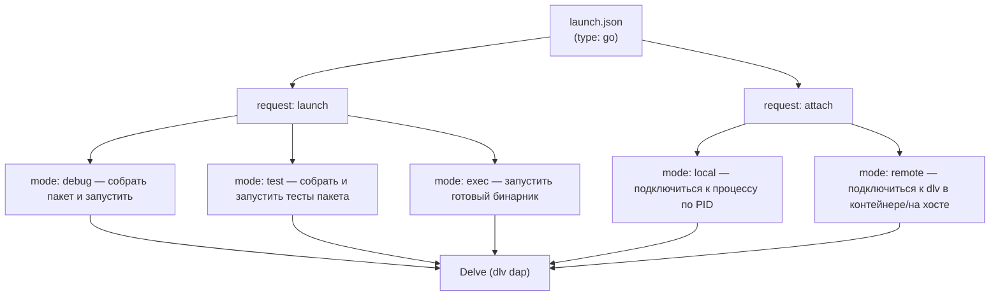

# VS Code для Go

VS Code — самый массовый редактор для Go и хорошая отправная точка для пришедшего из .NET: интерфейс знаком, а связка «расширение + язык-сервер + отладчик» концептуально повторяет то, что вы привыкли видеть в Visual Studio, только собрана из отдельных частей. В этой главе — установка официального расширения, рекомендация изолировать Go в отдельном профиле, подробный разбор полезных настроек `settings.json` и — главное для серверной разработки — все режимы отладки через `launch.json`, вплоть до удалённой отладки контейнера.

Базовые инструменты (`gopls`, `dlv`, `golangci-lint`, `gofumpt`) и `PATH` считаем уже настроенными по [обзору раздела](./README.md).

## Расширение `golang.go`

Ставится одно расширение — официальное **`golang.go`**, которое с июня 2020 года разрабатывает **команда Go в Google** (раньше его вело Microsoft). Это важно для доверия: расширение не сторонней инициативы, а часть проекта Go. Оно не реализует языковой интеллект само, а опирается на язык-сервер `gopls` (для автодополнения, переходов, диагностики) и на Delve (для отладки) — то есть выступает GUI-оболочкой над теми же общими инструментами.

После установки расширения выполните команду (палитра `Cmd/Ctrl+Shift+P`):

```text
Go: Install/Update Tools
```

Она показывает список вспомогательных инструментов и ставит/обновляет выбранные через `go install` в ваш `$GOBIN`. Серверному разработчику стоит поставить как минимум:

- **`gopls`** — язык-сервер (без него нет интеллекта). Обязателен.
- **`dlv`** — отладчик Delve (режим DAP, `dlv dap`). Обязателен для отладки.
- **`golangci-lint`** — агрегирующий линтер (если предпочитаете ставить его не скриптом, а здесь).
- **`staticcheck`** — мощный статический анализатор (можно подключить и через `gopls`, см. ниже).
- **`gotests`** — генерация заготовок табличных тестов из сигнатур функций.
- **`gomodifytags`** — массовое добавление/правка struct-тегов (`json:"..."`, `db:"..."`) — очень удобно при работе с сериализацией и БД.

> **Параллель с .NET:** расширение `golang.go` ≈ роли **C# Dev Kit** в VS Code (интеграция языка, тестов, отладки), а «Go: Install/Update Tools» — это явная, видимая установка тех самых внешних бинарников, которые в мире .NET спрятаны внутри Dev Kit/Roslyn. В Go эта «кухня» вынесена наружу: вы видите и контролируете каждый инструмент.

## Отдельный профиль VS Code под Go

Рекомендация: держите Go в **отдельном профиле VS Code**. Профили VS Code — это изолированные наборы расширений, настроек, сниппетов и UI-состояния, между которыми можно переключаться. Зачем это серверному разработчику, который наверняка держит на машине ещё и C#, и фронтенд:

- **Чистота и отсутствие конфликтов.** Go-расширение и, скажем, C# Dev Kit или ESLint не толкаются: каждый живёт в своём профиле. Настройки `editor.defaultFormatter`, `editor.codeActionsOnSave`, форматтеры — у каждого стека свои, и в общем профиле они мешают друг другу.
- **Производительность.** В Go-профиле активны только Go-расширения; не грузятся тяжёлые расширения других стеков — окно стартует быстрее и ест меньше памяти.
- **Воспроизводимость и перенос.** Профиль можно экспортировать и поделиться с командой — единое окружение для всех, кто пишет на Go.

Как создать: меню **File → Preferences → Profiles** (или иконка-шестерёнка внизу слева → **Profiles**) → **Create Profile**. Дайте имя (например, `Go`), при желании создайте «с нуля» (пустой набор расширений), затем установите в нём только `golang.go` и нужные мелочи. Переключение профилей — там же, активный профиль виден по индикатору в нижнем левом углу.

> **Параллель с .NET:** отдельный профиль VS Code под Go — это про ту же изоляцию окружений, что в мире .NET дают разные решения (`.sln`) и наборы рабочих нагрузок Visual Studio Installer: вы не смешиваете инструментарий разных стеков в одном пространстве. Только профиль VS Code — это изоляция на уровне редактора (расширения + настройки), а не проекта.

## `settings.json`: полезные настройки

Ниже — готовый блок настроек уровня профиля/воркспейса с пояснением каждой строки. Положите его в `settings.json` Go-профиля (или в `.vscode/settings.json` конкретного проекта). Все ключи проверены по официальной документации расширения.

```jsonc
{
  // ── Форматирование ────────────────────────────────────────────────
  // Форматировать файл при каждом сохранении (как в .NET — "format on save").
  "editor.formatOnSave": true,

  // Для Go-файлов форматтером назначаем именно расширение Go (а не,
  // например, Prettier, если он включён глобально). Блок "[go]" задаёт
  // настройки, действующие ТОЛЬКО для языка Go.
  "[go]": {
    "editor.defaultFormatter": "golang.go",
    // Организация импортов при сохранении: удалить неиспользуемые,
    // добавить недостающие, отсортировать. Аналог "Remove and Sort Usings".
    "editor.codeActionsOnSave": {
      "source.organizeImports": "explicit"
    }
  },

  // ── gopls: настройки самого язык-сервера ──────────────────────────
  "gopls": {
    // Применять gofumpt (строгий форматтер) прямо через gopls —
    // отдельная интеграция не нужна, бинарник gofumpt не требуется тут.
    "formatting.gofumpt": true,

    // Включить диагностику staticcheck внутри gopls — он будет
    // подсвечивать проблемы staticcheck по мере набора, без отдельного прогона.
    "ui.diagnostic.staticcheck": true,

    // Семантическая подсветка от gopls — точнее, чем чисто синтаксическая
    // (различает типы, функции, переменные по их роли).
    "ui.semanticTokens": true,

    // Inlay hints — встроенные подсказки прямо в коде (имена параметров
    // в вызовах, выведенные типы переменных и т.п.). Аналог inline hints в Rider/VS.
    "ui.inlayhint.hints": {
      "assignVariableTypes": true,     // типы в := присваиваниях
      "compositeLiteralFields": true,  // имена полей в литералах структур
      "compositeLiteralTypes": true,   // типы составных литералов
      "constantValues": true,          // значения констант (iota и пр.)
      "functionTypeParameters": true,  // выведенные типовые параметры дженериков
      "parameterNames": true,          // имена параметров в вызовах функций
      "rangeVariableTypes": true       // типы переменных в for range
    }
  },

  // ── Линтер ────────────────────────────────────────────────────────
  // Внешний линтер — golangci-lint (агрегатор; настраивается .golangci.yml).
  "go.lintTool": "golangci-lint",
  // Когда прогонять линтер на сохранение: для всего пакета изменённого файла.
  // Значения: "file" | "package" | "workspace" | "off". По умолчанию "package".
  "go.lintOnSave": "package",

  // ── Тесты ─────────────────────────────────────────────────────────
  // Флаги для `go test`, запускаемого из CodeLens/Test Explorer:
  //   -race  — детектор гонок (см. Раздел 3), обязателен для серверного кода;
  //   -v     — подробный вывод; -count=1 — отключить кэш тестов.
  "go.testFlags": ["-race", "-v", "-count=1"],
  // Показывать покрытие в редакторе после прогона тестов на сохранение.
  "go.coverOnSave": false,
  "go.coverOnSingleTest": true,

  // ── Сборка, теги и переменные окружения (серверная специфика) ─────
  // Build-теги, применяемые ко всем командам (build/test/vet/lint).
  // Например, чтобы код за //go:build integration участвовал в анализе.
  "go.buildTags": "integration",

  // Переменные окружения для ИНСТРУМЕНТОВ (gopls, go build/vet) и debuggee.
  // Удобно для кросс-компиляции или включения экспериментов рантайма.
  "go.toolsEnvVars": {
    "GOFLAGS": "-mod=mod"
  },

  // Переменные окружения именно для запуска ТЕСТОВ — типично для серверов,
  // где тесты читают конфиг из env (строки подключения, режимы и т.п.).
  "go.testEnvVars": {
    "APP_ENV": "test",
    "DATABASE_URL": "postgres://localhost:5432/app_test?sslmode=disable"
  }
}
```

Несколько пояснений к выбору значений:

- **`source.organizeImports: "explicit"`** — современный синтаксис (раньше использовали `true`). `"explicit"` означает «выполнять при явном сохранении файла», что обычно и нужно. Импорты в Go нельзя оставлять неиспользуемыми (это ошибка компиляции), поэтому автоорганизация экономит массу ручной работы.
- **`gofumpt` vs `go.formatTool`.** Включать `gofumpt` лучше через `gopls` (`formatting.gofumpt: true`), а не выставлять `go.formatTool: "gofumpt"` — так форматирование остаётся внутри одного процесса (`gopls`) и согласовано с остальной его работой.
- **`staticcheck` через gopls vs golangci-lint.** Тут есть пересечение: `golangci-lint` обычно и так включает `staticcheck` в своём наборе. Опция `gopls.ui.diagnostic.staticcheck` даёт быстрый фидбэк «на лету» от язык-сервера, а полный прогон `golangci-lint` на сохранение — более широкую проверку перед коммитом. Держать оба нормально; если дублирование замечаний раздражает — оставьте что-то одно.
- **`-race` в тестах** включает детектор гонок (см. [Раздел 3](../03-concurrency/04-sync-and-leaks.md)). Для конкурентного серверного кода это must-have; цена — замедление тестов, поэтому в больших наборах его иногда оставляют только для CI.

> **Параллель с .NET:** `settings.json` для Go ≈ совокупности `.editorconfig` (стиль/формат) и настроек анализаторов в `.csproj`/Rider. Разница в том, что в Go стиль не обсуждается: вместо тонкой настройки правил форматирования вы просто включаете `gofumpt`, и спор окончен.

## Отладка через `launch.json`

Это ядро главы. `launch.json` (в папке `.vscode/`) описывает конфигурации запуска отладчика — что собрать, с какими аргументами и переменными окружения, как именно подключиться. Под капотом расширение запускает Delve в режиме DAP (`dlv dap`) и общается с ним; вы же видите привычный графический отладчик: точки останова мышью, окна Variables/Watch/Call Stack и — что особенно ценно в Go — дерево горутин.

Все конфигурации имеют `"type": "go"`. Ключевой различающий параметр — `mode`: для запуска это `auto`/`debug`/`test`/`exec`, для подключения — `request: "attach"` с `mode` `local`/`remote`. Полный список значений `mode`: `auto`, `debug`, `test`, `exec`, `replay`, `core`.



> **Параллель с .NET:** `launch.json` — это прямой аналог профилей запуска и `launchSettings.json` в .NET: и там, и там вы декларативно описываете, что запустить, с какими аргументами и переменными окружения, и как (debug/attach). Конфигурация с `mode: remote` ≈ remote debugging в Visual Studio, а сам Delve в роли движка ≈ `vsdbg`. Если в .NET вы переключались между профилями «IIS Express / Kestrel / Docker» в выпадашке — здесь вы переключаетесь между конфигурациями `launch.json` в выпадашке Run and Debug.

### Запуск точки входа (`debug`)

Базовый сценарий — собрать и запустить конкретную точку входа под отладкой. В Go-сервисах точек входа обычно несколько (`cmd/api`, `cmd/worker`, `cmd/migrate`), и конфиг указывает на нужный пакет в `program`. Для серверов критично передать конфиг через переменные окружения (`env`) и аргументы (`args`):

```jsonc
{
  "version": "0.2.0",
  "configurations": [
    {
      "name": "Debug API server",
      "type": "go",
      "request": "launch",
      // "auto" сам выберет debug/test по открытому файлу;
      // для явной точки входа лучше "debug".
      "mode": "debug",
      // Путь к ПАКЕТУ с func main (или к любому .go-файлу в нём).
      "program": "${workspaceFolder}/cmd/api",
      // Аргументы командной строки самой программе.
      "args": ["--addr", ":8080"],
      // Переменные окружения — типичный способ конфигурации сервера.
      "env": {
        "APP_ENV": "local",
        "LOG_LEVEL": "debug",
        "DATABASE_URL": "postgres://localhost:5432/app?sslmode=disable"
      }
    }
  ]
}
```

Полезные варианты вместо инлайнового `env`:

- **`envFile`** — подгрузить переменные из файла: `"envFile": "${workspaceFolder}/.env"`. Удобно, чтобы не хранить секреты в `launch.json`.
- **`cwd`** — рабочая директория процесса (если программа читает относительные пути/конфиги): `"cwd": "${workspaceFolder}"`.

### Отладка теста (`test`)

`mode: test` собирает и запускает тесты пакета под отладкой — можно ставить точки останова прямо в тесте и в коде, который он вызывает. Обычно отладку конкретного теста запускают через CodeLens («debug test» над функцией), но явная конфигурация полезна для повторяемых сценариев:

```jsonc
{
  "name": "Debug one test (TestCreateOrder)",
  "type": "go",
  "request": "launch",
  "mode": "test",
  // Пакет с тестом.
  "program": "${workspaceFolder}/internal/order",
  // Запустить ТОЛЬКО конкретный тест: -test.run принимает регэксп.
  // Флаги тесту передаются через args (это флаги go test / бинарника теста).
  "args": ["-test.run", "^TestCreateOrder$", "-test.v"]
}
```

Здесь же можно включить детектор гонок для отлаживаемого теста, добавив build-флаг (см. ниже про `buildFlags`): `"buildFlags": "-race"`. Это позволяет ловить гонку и одновременно стоять на точках останова.

### Attach к запущенному процессу (`local`)

Иногда нужно подключиться к **уже работающему** локальному процессу — например, сервис запущен скриптом или через `go run`, а вы хотите «войти» в него отладчиком, не перезапуская:

```jsonc
{
  "name": "Attach to local process",
  "type": "go",
  "request": "attach",
  "mode": "local",
  // 0 + интерактивный выбор; либо конкретный PID, либо хелперы ниже.
  "processId": "${command:pickGoProcess}"
}
```

Значение `processId` может быть: числовым PID, `"${command:pickProcess}"` (выбор из всех процессов) или `"${command:pickGoProcess}"` (выбор только из Go-процессов — удобнее). Delve присоединяется к процессу, и дальше всё как при обычной отладке.

> На Linux для attach к чужому процессу может потребоваться разрешение ptrace (например, `sudo sysctl -w kernel.yama.ptrace_scope=0` на время отладки, либо запуск в контейнере с `--cap-add=SYS_PTRACE`). Это ограничение ОС, не Go.

### Удалённая отладка в Docker (`remote`)

Самый ценный для серверной разработки режим: баг воспроизводится только в прод-подобном окружении (та же ОС, сеть, переменные, данные), а отлаживать хочется со своей машины. Решение — запустить внутри контейнера **headless-сервер Delve**, пробросить его порт наружу и подключиться к нему конфигурацией `mode: remote`.

Шаг 1 — внутри контейнера/на удалённом хосте поднять Delve в headless-режиме на пакете или уже собранном бинарнике:

```bash
# Запустить сервис под Delve как headless DAP/RPC-сервер на порту 40000.
# --accept-multiclient позволяет переподключаться, не убивая сервер;
# --continue (опц.) сразу запускает программу, не дожидаясь клиента.
dlv debug ./cmd/api \
  --headless \
  --listen=:40000 \
  --api-version=2 \
  --accept-multiclient \
  -- --addr :8080

# Или подключиться к УЖЕ запущенному в контейнере процессу по его PID:
dlv attach <pid> --headless --listen=:40000 --api-version=2 --accept-multiclient
```

Шаг 2 — со своей машины подключиться к нему. Конфигурация `attach` + `mode: remote`:

```jsonc
{
  "name": "Attach to dlv in Docker",
  "type": "go",
  "request": "attach",
  "mode": "remote",
  // Куда подключаться: порт проброшен из контейнера на localhost.
  "host": "127.0.0.1",
  "port": 40000,
  // ВАЖНО для remote: сопоставление путей. Корень исходников НА ВАШЕЙ
  // машине...
  "cwd": "${workspaceFolder}",
  // ...и где те же исходники лежат ВНУТРИ контейнера (если пути отличаются).
  "substitutePath": [
    { "from": "${workspaceFolder}", "to": "/src" }
  ]
}
```

`substitutePath` решает классическую проблему удалённой отладки: на хосте код в `${workspaceFolder}`, а в контейнере он собран по пути `/src` — без сопоставления отладчик не свяжет точки останова с исходниками. Порт пробрасывается обычным образом (`docker run -p 40000:40000 ...` или `kubectl port-forward`).

> **Альтернатива — `dlv dap`.** Вместо классического headless-сервера можно запустить `dlv dap --listen=:40000` и подключиться конфигурацией с `"debugAdapter": "dlv-dap"`, `"request": "launch"`, `"mode": "exec"`, `"program": "/absolute/path/in/container"` и `"port": 40000`. Учтите: `dlv dap` **не поддерживает** флаги `--accept-multiclient` и `--continue` (в отличие от `dlv debug --headless`). Для большинства задач классический `mode: remote` с `dlv ... --headless` проще и предсказуемее.

> Безопасность (повтор из [Раздела 13](../13-tooling-debug-profiling/02-debugging-delve.md), но это важно): открытый порт Delve = полный контроль над процессом и памятью, фактически удалённое выполнение кода. Никогда не выставляйте его в публичную сеть — только за приватной сетью, через `kubectl port-forward`/SSH-туннель, и только на время отладки.

Связь с контейнеризацией (сборка отладочного образа, установка `dlv` в Dockerfile) подробно разобрана в [Разделе 12](../12-deployment-docker/README.md).

### Build-флаги и теги при отладке (`buildFlags`)

Если код использует условную компиляцию (`//go:build integration`) или вам нужны особые флаги компилятора при отладке, задайте `buildFlags`. Он отображается на флаг `--build-flags` у Delve:

```jsonc
{
  "name": "Debug with integration tag + race",
  "type": "go",
  "request": "launch",
  "mode": "debug",
  "program": "${workspaceFolder}/cmd/api",
  // Передать build-теги и включить детектор гонок при сборке под отладку.
  "buildFlags": "-tags=integration -race"
}
```

Учтите: `dlv debug`/`dlv test` и так собирают с `-gcflags="all=-N -l"` (отключённые оптимизации и инлайнинг — чтобы переменные не «схлопывались»), это делается автоматически и поверх ваших `buildFlags`.

## Серверная специфика: краткая сводка

Собирая вышесказанное под углом серверной разработки на Go:

- **Конфиг через переменные окружения.** Сервисы обычно читают конфиг из env (12-factor). В отладке это `env`/`envFile` в `launch.json` и `go.testEnvVars` для тестов — точно так же, как вы задавали бы переменные в профиле запуска .NET.
- **Несколько точек входа.** Под каждый `cmd/<app>` (api, worker, migrate, cron) удобно завести свою конфигурацию в `launch.json` — переключаетесь между ними в выпадашке Run and Debug, как между профилями запуска в .NET.
- **`-race` при отладке и тестах.** Конкурентный код стоит и отлаживать, и тестировать с детектором гонок (`buildFlags: "-race"`, `go.testFlags: ["-race"]`).
- **Несколько модулей / `go.work`.** В монорепо с несколькими модулями откройте корневую папку с `go.work` — `gopls` понимает workspace-режим и видит все модули сразу; отладочные конфиги при этом указывают на пакеты внутри нужного модуля.
- **Удалённая отладка в Docker** (`mode: remote` + headless-`dlv`) — основной инструмент для багов, живущих только в прод-подобном окружении; увязывается с [Разделом 12](../12-deployment-docker/README.md).

## Итог

- Для Go ставится одно официальное расширение — **`golang.go`** (команда Go в Google); оно опирается на внешние `gopls` (язык-сервер) и `dlv` (отладчик). Инструменты ставит/обновляет команда «Go: Install/Update Tools».
- **Отдельный профиль VS Code под Go** изолирует расширения и настройки от C#/JS-стеков: чище, быстрее, без конфликтов форматтеров; профиль создаётся через меню Profiles и переносится в команду.
- В `settings.json` ключевое: формат при сохранении с `defaultFormatter: golang.go`, организация импортов (`source.organizeImports`), `gofumpt` и `staticcheck` через `gopls`, линтер `golangci-lint`, inlay hints, а для серверов — `go.testFlags` с `-race`, `go.buildTags`, `go.toolsEnvVars`/`go.testEnvVars`.
- **`launch.json`** покрывает все режимы: `mode: debug` (точка входа `cmd/<app>` с `args`/`env`), `mode: test` (в т.ч. один тест через `-test.run`), `attach`+`mode: local` (по PID), `attach`+`mode: remote` (подключение к `dlv --headless --listen` в контейнере с `substitutePath`).
- Для серверной разработки критичны: конфиг через `env`/`envFile`, отдельные конфиги под каждую точку входа, `-race`, поддержка `go.work` и **удалённая отладка в Docker** через headless-Delve (помня про безопасность открытого порта).
- Концептуально всё знакомо: `launch.json` ≈ профили запуска/`launchSettings.json`, Delve ≈ `vsdbg`, `mode: remote` ≈ remote debugging, профили VS Code ≈ изоляция окружений разных стеков.

Дальше — Zed: другой редактор с тем же `gopls` под капотом, но молодой DAP-отладкой; разберём его настройку и честно сравним с VS Code.

---

[⌂ Главная](../../README.md) · [↑ Раздел](./README.md) · [← Предыдущий: Обзор раздела](./README.md) · [→ Следующий: Zed для Go](./02-zed.md)
