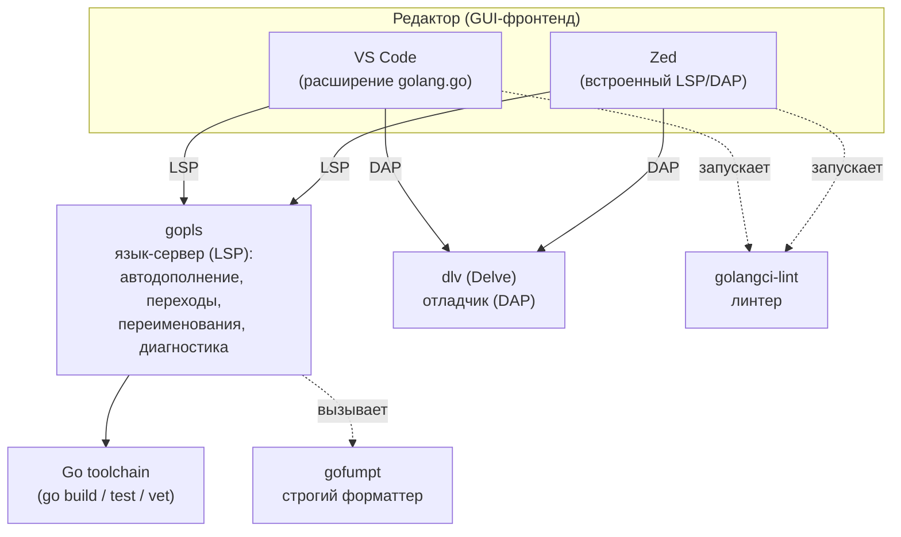

# Бонус: Настройка окружения для разработки

В .NET выбор редактора почти не стоит: Visual Studio или Rider дают язык, отладчик, рефакторинги и анализаторы единым пакетом, «из коробки». В Go устроено иначе, и для пришедшего из .NET это поначалу непривычно: редактор — это лишь GUI-оболочка, а вся «умность» (автодополнение, переходы, переименования, диагностика, форматирование) приходит из **внешних инструментов командной строки**, общих для всех редакторов. Центральный из них — язык-сервер `gopls` (официальный, от команды Go), говорящий по протоколу LSP. Отладку везде обеспечивает один и тот же движок — Delve (`dlv`), по протоколу DAP.

Практическое следствие: ваш Go-тулчейн не привязан к редактору. Настроив `gopls`, линтер и форматтер один раз, вы получаете одинаковое поведение и в VS Code, и в Zed, и в GoLand, и в Neovim — отличается только то, как редактор это рисует и как описывает запуск отладки. Поэтому этот бонусный раздел построен так: сначала — общая основа (инструменты, которые нужны **любому** редактору), затем — два конкретных редактора, VS Code (подробно, как массовый выбор) и Zed (быстрый редактор на Rust, чья DAP-отладка появилась недавно).

Базовый тулчейн (`go install`, `gopls`, `dlv`, линтеры) и сам отладчик Delve как CLI уже разбирались в [Разделе 13](../13-tooling-debug-profiling/README.md); здесь мы не повторяем их устройство, а показываем, как подключить их к редактору и настроить под серверную разработку.

## Цели обучения

- Понять, почему в Go редактор отделён от языкового интеллекта, и что такое связка «редактор → `gopls`/`dlv` → инструменты».
- Поставить общий тулчейн, нужный любому редактору: Go, `gopls`, `dlv`, `golangci-lint`, `gofumpt` — и разобраться с `GOBIN`/`PATH`.
- Настроить VS Code с официальным расширением `golang.go`: формат при сохранении, организация импортов, `gofumpt`/`staticcheck` через `gopls`, линтер, inlay hints, флаги тестов и переменные окружения.
- Освоить `launch.json` для всех режимов отладки: запуск точки входа, отладка теста, attach к процессу и удалённая отладка контейнера через headless-`dlv` — критично для серверной разработки.
- Настроить Go в Zed (его `settings.json`, конфиг `gopls` через `initialization_options`) и понять текущее состояние его DAP-отладки через Delve.
- Осознанно выбрать редактор под свои задачи, понимая компромисс «скорость Zed против зрелости экосистемы и отладки VS Code».

## Содержание раздела

1. **[VS Code для Go](./01-vscode.md)** — официальное расширение `golang.go`, рекомендация держать Go в отдельном профиле VS Code, подробный разбор `settings.json` (формат, импорты, `gofumpt`, линтер, inlay hints, тесты, env) и `launch.json` для всех режимов отладки, включая удалённую отладку в Docker.
2. **[Zed для Go](./02-zed.md)** — поддержка Go в Zed через `gopls`, настройка через `lsp.gopls.initialization_options`, текущее состояние DAP-отладки через Delve и честное сравнение с VS Code для серверной разработки.

## Общая основа: тулчейн и инструменты

Это то, что нужно поставить **до** и **независимо от** редактора. Любой редактор лишь запускает эти бинарники и общается с ними по стандартным протоколам (LSP — для языкового интеллекта, DAP — для отладки). Поставите их один раз — будут работать везде.



### Сам Go (toolchain)

Базис — компилятор и стандартные команды (`go build`, `go test`, `go vet`, `go mod`). Ставится с [go.dev/dl](https://go.dev/dl/) либо через менеджер версий. Проверка:

```bash
go version   # например: go version go1.24 darwin/arm64
```

Современный Go умеет сам подтягивать нужную версию тулчейна по директиве `go` в `go.mod` (механизм toolchain, Go 1.21+), так что точную минорную версию обычно фиксируют именно там.

> **Параллель с .NET:** установка Go ≈ установке .NET SDK. Директива `go`/`toolchain` в `go.mod` играет роль `global.json` с `sdk.version` — фиксирует версию тулчейна на проект.

### `gopls` — язык-сервер

`gopls` (произносится «go please») — официальный язык-сервер от команды Go. Это «мозг» автодополнения, переходов к определению, поиска использований, переименований, подсветки ошибок и форматирования. Все редакторы с поддержкой LSP используют именно его.

```bash
go install golang.org/x/tools/gopls@latest
```

VS Code умеет поставить и обновить `gopls` сам (команда «Go: Install/Update Tools» — см. [главу про VS Code](./01-vscode.md)); Zed же `gopls` **не ставит автоматически** — его нужно установить вручную и убедиться, что он в `PATH` (детали — в [главе про Zed](./02-zed.md)).

> **Параллель с .NET:** `gopls` — это аналог Roslyn-сервера/OmniSharp (или языкового сервиса C# Dev Kit), только вынесенный в отдельный переиспользуемый бинарник и общий для всех редакторов, а не встроенный в конкретную IDE.

### `dlv` (Delve) — отладчик

Delve — стандартный отладчик Go, общий для всех редакторов; и VS Code, и Zed, и GoLand под капотом управляют именно им (по протоколу DAP). Устройство и CLI Delve подробно разобраны в [Разделе 13](../13-tooling-debug-profiling/02-debugging-delve.md); здесь он нужен как бинарник, к которому подключается редактор.

```bash
go install github.com/go-delve/delve/cmd/dlv@latest
dlv version
```

### `golangci-lint` — линтер

Стандарт-де-факто для статического анализа в Go: это не один линтер, а агрегатор десятков (включая `staticcheck`, `govet`, `errcheck` и др.), запускаемый одной командой и настраиваемый через `.golangci.yml` в корне репозитория. Редакторы вызывают его на сохранение/по требованию и показывают замечания инлайн.

```bash
# Рекомендуемый способ из официальной документации — установочный скрипт
# с фиксированной версией (надёжнее, чем go install для этого инструмента):
curl -sSfL https://raw.githubusercontent.com/golangci/golangci-lint/HEAD/install.sh \
  | sh -s -- -b "$(go env GOPATH)/bin" vX.Y.Z

golangci-lint version
```

> Авторы `golangci-lint` рекомендуют ставить его не через `go install`, а скриптом с **закреплённой** версией — чтобы у всей команды и в CI совпадали наборы включённых линтеров и их поведение. Конкретную версию (`vX.Y.Z`) возьмите актуальную из [репозитория проекта](https://github.com/golangci/golangci-lint).

> **Параллель с .NET:** `golangci-lint` + `.golangci.yml` ≈ роли Roslyn-анализаторов и `.editorconfig`/набора правил, только в виде отдельной CLI-утилиты, единой для редактора и CI.

### `gofumpt` — строгий форматтер

`gofumpt` — это «более строгий `gofmt`»: он применяет все правила стандартного `gofmt` плюс дополнительный набор, убирающий разнобой, который `gofmt` оставляет на усмотрение автора. Форматирование в Go не обсуждается (единый стиль — часть культуры языка), и многие команды берут именно `gofumpt` как ещё более жёсткий общий знаменатель.

```bash
go install mvdan.cc/gofumpt@latest
```

Удобство в том, что `gopls` умеет применять `gofumpt` сам — отдельную интеграцию настраивать не нужно, достаточно одной опции в настройках редактора (показано в главах про VS Code и Zed). Бинарник всё равно полезно иметь — для запусков из CLI и в CI.

> **Параллель с .NET:** `gofumpt` ≈ `dotnet format` с максимально строгим стилевым набором, но безальтернативный по духу: в Go не принято спорить о стиле — есть один канонический формат, и `gofumpt` лишь делает его ещё строже.

### `GOBIN` и `PATH` — куда попадают инструменты

Все перечисленные `go install ...@latest` кладут бинарники в `$GOBIN`, а если он не задан — в `$(go env GOPATH)/bin` (по умолчанию `~/go/bin`). Эта папка **обязана быть в `PATH`**, иначе редактор (и вы из терминала) не найдёт `gopls`, `dlv`, `golangci-lint`, `gofumpt`.

```bash
# Проверить, куда устанавливаются бинарники:
go env GOBIN GOPATH

# Добавить в PATH (в ~/.zshrc или ~/.bashrc), если ещё не добавлено:
export PATH="$PATH:$(go env GOPATH)/bin"
```

> **Параллель с .NET:** `~/go/bin` в `PATH` для Go-инструментов — это прямой аналог `~/.dotnet/tools` в `PATH` для глобальных `dotnet tool`. Та же идея: установленные CLI-утилиты должны быть видны в `PATH`, чтобы их подхватывали и терминал, и редактор.

---

[⌂ Главная](../../README.md) · [→ Следующий: VS Code для Go](./01-vscode.md)
